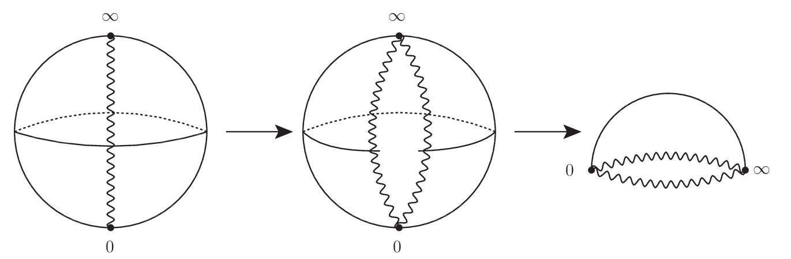
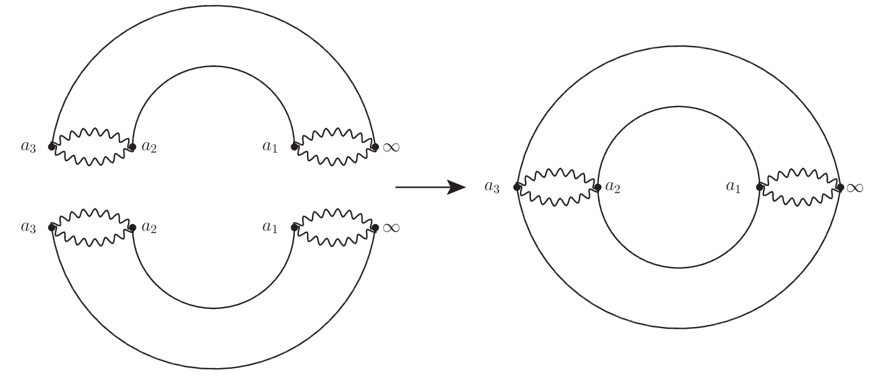

# 複素解析での分岐点とは - リーマン面との関連について

オイラーの公式は指数関数と三角関数を結びつけた．三角関数の周期性が指数関数の虚数冪へと結びついたのである．これによって複素対数関数なるものが多価関数として表れる．そして $i^i$ という数秘術のような何やら不思議な数の扱い方も整理されていく．

複素解析での多価関数は分岐点という特異点を基礎に，分枝・葉・分岐截線 (ぶんきせっせん) が次々に定義されて，その扱い方を特徴づけていく．そしてその土台となるリーマン面は実関数を複素関数へと拡張するという，おそらく人知れずガウスもおぼろげにも到達していたであろう，より豊かな幾何学の基本方針を与えることになる．今日言うところの複素多様体の雛形であり，リーマン多様体へと通づる思索の鉱脈だ．非ユークリッド幾何学すら一例の下に置く統一的な枠組の前段階である．

## 背景と着想

多価関数は扱いにくい．そもそも多価になるものは「関数」とは呼ばないと，口酸っぱく注意された経験を持っている方も多いことだろう．教育にはそういう一面がある．このような経験から (既に決まってしまった？) 用語に対して吟味した批判を行うと「揚げ足取り」と責められることもある．せっかくの普遍の真理であるから，イザコザに巻き込まれずに落ち着いて，用語を刻んでいきたいものである．

さて，この多価関数．複素解析では複素平面という海原の渦のような存在で，避けようと思えば避けて生きていけるのであるが，どうしても扱わねばならないときがいつしかやってくる． するとどうだろうか，多価性を解いていく過程で複素平面が単なる平面ではなく，球面・トーラスなどなどの曲面が表れ出てくるではないか．

解析的な議論を進めていると，(連結な) 一次元の複素多様体 (リーマン面) へと導かれて幾何的な考察へと誘われていく過程が実に面白いのである．

## 定義

### 分岐点とリーマン面

特異点の位相的な違いによる分類の他に，関数の多価性に着目した特異点があり，これを次のように分岐点とよんで定義している．

複素関数 $f(z)$ が多価関数で，特に点 $z=p$ の周りを周回するとき $n$ 周して元の値になるとき，点 $z=p$ を $n-1$ 位の分岐点という．

$n-1$ 位の分岐点は定義から多価性が $n$ 価となっているが，$1< n< \infty$ ならば代数分岐点といい，可算無限個あるならば対数分岐点という．

分岐点は多葉リーマン面を構成する際の，複素平面の切断の端点となるため，どこであるか求めることは重要である．

複素関数 $f(z)$ が分岐点をもつとき，$n$ 周して元の値になるので，各周回時に別々の複素平面を充てがうとする．すると各複素平面で一価関数となるが，この一価関数を分枝といい，また分枝の定義域となっている各複素平面を葉 (よう) という．特に分枝のうち，一周目の分枝を主枝という．

そしてそれら葉とよぶ各複素平面は周回の初めと終わりをみな線状に共有しており，この共有する曲線 $L$ を元の複素平面上に描くとき，$L$ を切断とか分岐截線 (せっせん) という．このとき切断からどの葉へ移動したら良いのかは移動前後で滑らかになっていないといけない．

このようにして多価関数を一価関数とするとき，定義域となっているすべての葉とその繋がりを表す切断とでできる曲面をリーマン面という．

切断はよく波線で描かれるので，これに従うが，必要に応じて異なる描画を以下では合わせて行う．

### プロット

分岐点をもつ複素関数のプロットはいろいろあるが，ここでは次のプロットを導入する．

複素関数 $f(z)$ の実部と虚部は複素数 $z=x+iy$ の実部と虚部の関数となっている．

\begin{equation} \Re[f(z)] = u(x,y),~ \Im[f(z)] = v(x,y) \end{equation}

複素関数値の実部と虚部の関数 $u(x,y),v(x,y)$ は実関数であるため，三次元空間上にプロットできる．これを複素関数値の実部と虚部のプロットとよぶことにする．

こうして得られるプロットはリーマン面を描いたものではないことに注意したい．

## コメント

### 極形式に依拠したプロットと分岐点の関係

[複素解析での特異点とは](https://mathrelish.com/mathematics/singularity-in-complex-analysis)

上記で「極形式に依拠したプロット」を述べたが，このプロットから分岐点がどこであるかを読み取れることができる．というのも分岐点の周りでは一周しても色相環が一巡しないからである．つまり色の変化が不連続に途切れたプロットになり，分岐点と切断を視覚的に捉えることができる．

例えば上記は $\sqrt{(z-1)(z-i)(z+i)}$ のプロットであるが，そのことを知らなくても点 $1,i,-i$ の三点が分岐点になっていることがわかる．色相環が一巡していないからである．

このような良さは依然としてあるが，欠点としては一枚の複素平面しか考えないので，主枝の情報しかわからないということである．分枝の数だけ複数回プロットしないといけないのである．

かといって「複素関数値の実部と虚部のプロット」をするとわかりよいかというとそうでもない．下図は実際に描いたもので，左が実部で右が虚部である．

### 切断に込められた滑らかさ

「切断からどの葉へ移動したら良いのかは移動前後で滑らかになっていないといけない．」という条件は，次のようなよく見られるリーマン面の図ではわかりにくいものになっている．

上の図は赤と青がそれぞれ二つの葉を表しており，波線が切断を表している．この場合は二葉しかなく一目でわかるほどだが，これがもっと多い多葉になるととても大変になってくる．元々，特異点でない部分であるから滑らかに繋がっていて欲しいのだが，図がそれに追いついていないのである．

定義で導入したプロットについても同様のことがいえる．それでは文言だけで我慢するしかないのだろうか？決してそうではなく，球面やトーラスなどの二次元閉曲面が導入する契機となる．

### 「截」について

複素解析の歴史の中で日本が関わってくるのは二十世紀に入ってからである． 例えば日本語で書かれた最初の複素関数論のテキストは吉川實夫による『函数論』で， 1913年(大正二年)のことである．テキストでは複素関数は複函数と訳されていた．

このように訳語の問題が表れる．訳語は単純な思い違いが末代まで残ったり，細かな違いを反映させた語が選ばれても，時代の流れでより簡便な言い回しに喰われることもある．度が過ぎるとカタカナ表記という万能な手段が講じられてしまう．

複素解析で一二を争う特殊な訳語は「截線」という訳語ではないだろうか．

分岐や葉は branch や leaf なので，すんなり翻訳された感があるが，branch cut は分岐截線となった．今では単に切断とよぶことも多い．もしくはブランチカットと表記することもある．どちらにしても「截線」と訳すのはちょっと凝っているわけである．

「截 (セツ)」という漢字は難しい漢字である．「載」「裁」と似ているし，「截線」を「せっせん」として漢字変換してくれなくても仕方がないほどである．この漢字の訓読みは「截る (きる)」「截つ (たつ)」で刃物で重なりのあるものや長いものをずばりと切る様をいうものである．斬釘截鉄 (ざんていせってつ) という四字熟語もあるが，これからとにかく切ればいいというわけではなく，重要な箇所を切るという意味もあり，遮るといった意味も持っている．

多価関数はまるで複素平面が何枚も折り重なったようなところを定義域とするようなものになっている．これら複素平面 (葉) が共有する部分で切るという様が截ち切るようになっているので，截線というわけである． また複素平面のどこを切ってもよいわけでもなく，分岐点を端点に持つように切らねばならず，その意味でも截線という訳語の意図が込められているのではとも感じられる．

ところで「截線」は今の分岐截線の他に，曲線の二点以上と交点を持つ直線である割線 (secant) の訳語としても用いられることがある．何れにしても今ではもう多くの人々が忘れた用語なのかもしれない．

[Secant line](https://en.wikipedia.org/wiki/Secant_line)

## 例

### 複素対数関数

次が複素対数関数とよばれる複素関数である．

\begin{equation} f(z) = \ln z = \ln r + i(\theta + 2\pi n) ~~ (n\in\mathbb{Z}) \end{equation}

つまり実部と虚部は次の実関数である．

$$ \begin{eqnarray} u(x,y) &=& \ln r(x,y) \\ v(x,y) &=& \theta(x,y) + 2\pi n ~~ (n\in\mathbb{Z}) \end{eqnarray} $$

#### プロット

複素対数関数を描くと下図のようになる．

それぞれ次のように描かれている．

$u(x,y)$ については $r(x,y)=\sqrt{x^2+y^2}$ で回転対称であるから，特に$y=0$ で制限した次の図の回転体とわかる．

$v(x,y)$ については $\theta(x,y) + 2\pi n$ で多価関数となっている．ここで偏角 $\theta(x,y)$ はいわゆる $\texttt{atan2}$ である．何故なら複素平面上の点 $z=x+iy=(x,y)$ について，それが実軸となす偏角 $\arg z$ としての意味を与えたいからである．そこで我々はこれを $\arctan(x,y)$ と書くことにしよう．

$$ \begin{equation} \arctan(x,y) := \texttt{atan2}(y,x) := \begin{cases} \arctan \left(\frac{y}{x}\right) & (x > 0) \\ \arctan \left(\frac{y}{x}\right)+\pi & (x < 0 \land y \geq 0) \\ \arctan \left(\frac{y}{x}\right)-\pi & (x < 0 \land y < 0) \\ +\frac{\pi}{2} & (x=0 \land y > 0) \\ -\frac{\pi}{2} & (x=0 \land y < 0) \\ \mathrm{undefined} & (x=0 \land y=0) \end{cases} \end{equation} $$

[atan2](https://en.wikipedia.org/wiki/Atan2)

このように定義することで，例えば $\arctan(-1,1)=3\pi/4$ という意図した値になっている． これが $\arctan(y/x)$ であると引数が一つであるため，値域が $(-\pi/2,\pi/2)$ となって $\arctan(1/(-1))=-\pi/4$ というように意図した値にならない．

下図の左が $\arctan(x,y)$ によるもので，右が $\arctan(y/x)$ によるものである．左が正しく $\arg z$ としての役割を果たしていて，右がそうでないことがわかる．

更に $v(x,y)$ は偏角にのみ依存するのでスケール変換 $(x,y)\mapsto (ax,ay)$ に対して不変な関数である．よって図示は円周さえ書けば，後はそれが放射状になっていて事足りていることになる．それが最初の図となっている．

#### 分岐点

複素対数関数の分岐点は原点と無限遠点である．何れの点もその周りをどれだけ周回しても元の値には戻らない．つまり対数分岐点となっている．対数分岐点の名称の由来がここから理解できる．

そしてどれだけ周回しても戻らないことは，無限の螺旋階段となっている虚部のプロットからも読み取れる．

### 複素代数関数

#### 球面

手始めに次の代数関数を考える．

\begin{equation} f(z) = \sqrt{z} \end{equation}

分岐点は原点と無限遠点であり，二つある分枝は次のようになる．

$$ \begin{eqnarray} f_1(z) &=& |r|^{\frac{1}{2}}e^{i\frac{\theta}{2}} \\ f_2(z) &=& |r|^{\frac{1}{2}}e^{i\frac{\theta + 2\pi}{2}} \end{eqnarray} $$

プロットは次のようになる．

複素対数関数の場合と違って，実部と虚部の両方が一価関数ではなくなる($n\in\{0,1\}$)．

$$ \begin{eqnarray} u(x,y) &=& |r|^{\frac{1}{2}} \cos\frac{\theta + 2\pi n}{2} \\ v(x,y) &=& |r|^{\frac{1}{2}} \sin\frac{\theta + 2\pi n}{2} \end{eqnarray} $$

分岐点である原点は特異点であるが，それと同時に零点であることにも注意する．

分岐点を調べる理由の一つは適当な多葉リーマン面を見出すことである．事実，多葉リーマン面の導入の意図は，多価関数を一価関数に定義し直すことである．つまり考える複素関数の定義域を複素平面 $\mathbb{C}$ 上から適当な多葉リーマン面 $R$ 上に定義し直すことであった．

$f(z) = \sqrt{z}$ であれば，(分岐点である) 原点のまわりを $2$ 回転すれば元の点に戻るので，一価関数を与える定義域は $2$ 葉リーマン面となる．ここで葉の数は必要とした複素平面の数を意味した．

ところで複素平面の数について，助数詞を「枚」と言わず「葉」としているのはそれらが独立な平面であることを意識したくないからである．「葉」とよぶことで「何か大きなもの」の部分としてよびたいのである． さて我々はそのような「何か大きなもの」が今の場合には球面であることをこれから直観的に見ることにする．

まず無限遠点を陽に扱いたいので，複素平面ではなくハッキリとリーマン球面を考えることにしよう． すると $2$ 葉リーマン面は二つの球面を切断で張り合わせた図形だとわかる． つまり今この張り合わせを行おうというわけである．それは次のとおり．

下図の左はリーマン球面上の切断を波線として図示している．今この切断に沿って切開したのが中央の図である．これから更に半球面まで割いていったのが右の図である．

上記の手続きを二つある葉について行ったのが下図の左である．元々，切断では同じ複素関数値を共有するので，切断について張り合わせればリーマン面を構成したことになる．それが右の図である．

ところで切断を表す曲線は分岐点さえ同じであれば，その二点間を交叉がないように結べば，周回を勘定できるので一意に決まるものではない．よって例えば下図の左の赤色で示した切断を考えても良い．重要なことは二つの葉を表す領域へとリーマン球面を分割し，その境界が切断となることである．

もし $f(z)=z^{\frac{1}{3}}$ を考えれば，三つ葉があることになって下図の中央の図となり，より一般に $f(z)=z^{\frac{1}{n}}$ を考えれば，$n$ 葉となってリーマン球面を $n$ 分割することになる．

以上見たように，リーマン面が ($f(z)=z^{\frac{1}{n}}$ の場合には) 球面 $S^2$ と同相になることがわかった．

#### 切断方法の依存性

もう少し，今述べた視点が大切であることをみるために，これと同じ結果を与える次のもう一つの例に着目する．

\begin{equation} g(z) = \sqrt{z(z-1)} \end{equation}

プロットは次のようになっており，複雑になっている．

この複素関数は，次のように変形してわかるように，点 $z=0,1$ のまわりの回転について多価性がある．

\begin{equation} g(z) = \exp\left[ \frac{1}{2}\ln z + \frac{1}{2}\ln (z-1) \right] \end{equation}

そのため，複素平面の切断方法には次の二つがあるとわかる．

このようにリーマン面を得るためには切断という step が必要だが，切断の端点は固定でも，その他の切断部分には不定性がある．今のようにどちらの場合も直線的な切断を行ったが，曲線であっても良い．このような不定性があるにも関わらず，得られるリーマン面は等しい一価関数を与えることになる．

この事実を理解する上で，応用範囲のある理解の仕方は，再びリーマン球面上で位相的に考えることである．今述べた二つの切断方法に対して，縫合を行うと，同一の結果 $S^2$ を得るからである．

つまり定義域は適当な変数変換の範囲で連続的に移り合うことが可能であり，従ってどちらの切断方法でも等しい一価関数を与えることになる．

#### トーラス

以上の考察は容易に一般化することができ，より抽象的な理論を扱う際の良い例を与えることになる．

例えば次の複素関数を考えたとする．

\begin{equation} h(z) = \sqrt{(z-a_1)(z-a_2)(z-a_3)} \end{equation}

この複素関数は次のように変形できる．

\begin{equation} h(z) = \exp\left[ \frac{1}{2}\ln (z-a_1) + \frac{1}{2}\ln (z-a_2) + \frac{1}{2}\ln (z-a_3) \right] \end{equation}

この変形から点 $z=a_1,a_2,a_3$ のまわりの回転について多価性があるとわかる． つまり点 $z=a_1,a_2,a_3$ そして無限遠点が分岐点である．これら分岐点と切断の一例を示せば次の図のようになる．

再びリーマン面の葉の数は二つあるため，次のリーマン面の変形ができる．

こうして $h(z) = \sqrt{(z-a_1)(z-a_2)(z-a_3)}$ のリーマン面は $T^2$ と同相になる．ここまでくるとより一般の複素代数関数を考えれば，種数 $g$ が $2$ 以上の二次元閉曲面がリーマン面となることが容易に想像できるだろう．

しばしば楕円曲線 $y^2 = x^3 + ax +b$ の複素化がトーラスであるといったようなことが述べられることがあるが，上記で考察したような意味なわけである．

以上のように単にリーマン面の葉の数を数えるだけでは，一価関数にするために必要な複素平面の数しかわからないが，位相的に考えることで，切断方法の不定性に依らない視点に立てることが重要である．

微分可能な複素 $1$ 変数の複素関数を一価関数として扱う際は，幾何学的に考察すると座標変換に依存しない特徴を抽出できるというわけである．ここでの考察はそのまま複素多様体の基礎となり，$1$ 次元複素多様体の例となっている．

## 参考

[複素解析 (複素関数論) – オススメの参考書](https://mathrelish.com/mathematics/recommended-books-in-complex-analysis)

- [楕円積分と楕円関数 おとぎの国の歩き方](https://amzn.to/3eRfLUE)
- [ヴィジュアル複素解析](https://amzn.to/2Qpkphs)
- [わかりやすい楕円関数論への入門 ( やさしい数学の発見シリーズ 2 )](https://amzn.to/2unbnYz)
- [数学の散歩道](http://www.suugakuno-sanpomichi.com/)
- [Domain coloring for visualizing complex functions](https://gandhiviswanathan.wordpress.com/2014/10/07/domain-coloring-for-visualizing-complex-functions/)
- [リーマン面 (数学セミナー1993年1月号26-27ページ)](http://kanielabo.org/essay/rieman.htm)
- [近代日本における, 函数の概念とそれに関連したことがらの受容と普及 (数学史の研究)](https://repository.kulib.kyoto-u.ac.jp/dspace/handle/2433/172764)

