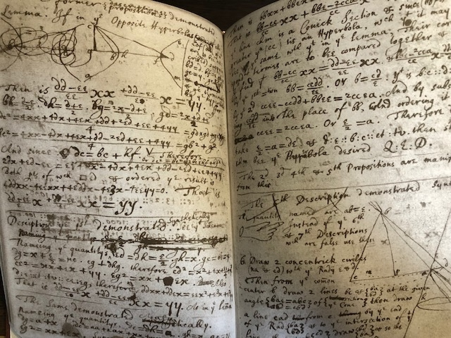
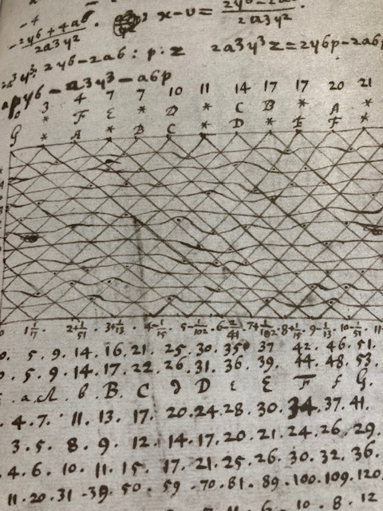
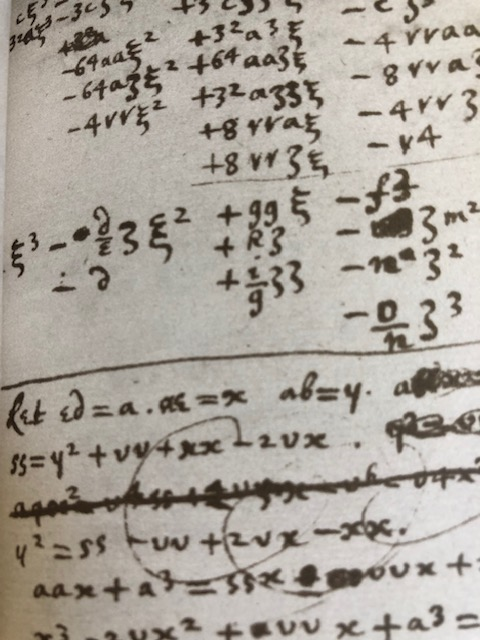
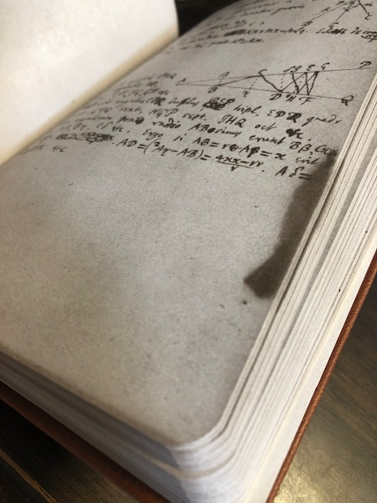

# 計算用紙や文房具とかのはなし

普段どのように計算をためているだろうか． 人生が永遠に続くかのように思う日々がいつしか過ぎ去って， その儚さを知る日がいつかはやってくるだろう．

あなたが計算できる量は有限量であり， その量だけあなたは血肉が得られることだろう．

以下はそのような「日常」の一端を書き記すものである． 計算技法ではなく「日常」であり， この分野の習性が少なからず知れることだろう． 所詮は $n=1$ の話ではあるが，$10^2$ くらいはあろう．きっと． もし何かの役に立てば幸いだ．

## 計算用紙

計算用紙に数式や図など様々なことを書いていくことだろう． その時間や瞬間は（少なくとも地球上では）我々人類にだけ許された崇高なひとときである． その行為を（なるべく気持ちよく）実現するには， どんな選択肢がありそうか Amazon をさまよってみたい．

### レポート用紙とコピー用紙

特にこだわりがなければダイソーやセリアのようなところで入手すればよいだろう． ダイソーの A4 レポートパッド方眼紙にはかなりお世話になっている．

- [レポートパッド（Ａ４、５ｍｍ方眼罫、５０枚）](https://jp.daisonet.com/products/4550480315874)

近くになければ Amazon でコピー用紙をドカッと購入するのが時間と交通費の無駄にならない．

私は以前，大きく使える A3 コピー用紙を 6000 枚ほど手配して， それを机の引き出しにしまって，いつでも計算ができるよう配備していた． 使い切ってしまう頃には $\TeX$ でノートをとることが多くなった．

余談だが研究室にあった計算用紙が一番使いやすかった． この「研究室にあった計算用紙」というのがうまく伝えにくい． 青と緑のまだら模様のヘッダーで束ねられているというか．． どこかに売っているのをまだ見たことがなく， これで伝わる自信がないが，情報求む．というところ． 調べた限りは[これ](https://www.atta-v.com/products/detail.php?product_id=13950)がそれっぽい雰囲気なのだが，まだ実際に購入には至っていない．

- [APP 高白色 ホワイトコピー用紙 A4 白色度93% 紙厚0.09mm 2500枚(500枚×5冊) PEFC認証](https://amzn.to/3r12AGZ)
- [APP 高白色 ホワイトコピー用紙 A3 白色度93% 紙厚0.09mm 1500枚(500枚×3冊)](https://amzn.to/3aj3s38)

### ブギーボード

ある時期，先に述べた A3 コピー用紙のストックを見て， 大量の紙を消費するのがもったいないと思ったことがあった． いわばどうでもいいような計算で紙を何枚も使ってしまうことがある．

そんな時に出会ったのが[ブギーボード](https://www.kingjim.co.jp/sp/boogieboard/)である． (今は[半透明版という亜種](https://amzn.to/3cqOpHj)もあるという) それなりには使えたが，いかんせん見返せない． 結局，私はほんとにちょっとした筆算や， いきなり描くと何度も手直ししそうなデッサンの下書きに用いたくらいだった．

それって，つまり役立ったということかな．

- [メーカー製品ページ](https://www.kingjim.co.jp/sp/boogieboard/)
- [キングジム ブギーボード 電子メモパッド BB-1GXクロ クロ](https://amzn.to/2YnEJF9)
- [キングジム ブギーボード 黒 BB-11クロ](https://amzn.to/3cqOpHj)

### わら半紙 (という選択肢)

|  |  |
| --- | --- |

学校での紙の配布物といえば，わら半紙だった． よってわら半紙が身近な計算用紙であった．

印刷ミスなどで廃棄予定のわら半紙を確保して，某かをよく計算した． このわら半紙の難点は「汚らしい」ということと， 放っておくと「匂いがしだす」ということである． つまり清書もしくはそれに準ずるような長期保存には向かないのだ．

ところで，このわら半紙，最近では消えつつあるという話があったりするとか． 真偽の程は詳しくないが，もう今では上質紙の方が安くなって， わら半紙が逆に高く付くようになっているらしい． 過去の遺物なのかもしれない．

そしてそれ故にノスタルジーに浸って計算が進むかもしれない．

ところで[わら半紙は俗称であり，更紙が正しい](https://www.ootsuka-kami.co.jp/news/160311-1733.html)． なかなかどうして，歴史を紐解いてみると面白いかもしれない．

[わら半紙](https://ja.wikipedia.org/wiki/%E3%82%8F%E3%82%89%E5%8D%8A%E7%B4%99)

- [日本製紙 古紙100％ わらばんし A4 国更(くにざら) 3.0kg 【1000枚入】](https://amzn.to/2LInYSu)
- [王子製紙 更紙 わらばんし A4 苫更(とまざら) 3.0kg 1000枚入](https://amzn.to/3bVQYkd)

ここで国更と苫更の違いは古紙配合率や白色度に違いが表れるが， 調べた限りその違いがカタログから断言できるようなものでもなさそうで， まぁ商品名程度と思っておけばよいだろう．

### Ramanujan's Lost Notebook

Ramanujan も今やかなり有名になった． そんな彼が残したノートブックの一つである「失われたノートブック」の手書きの写しを製本したものがある． それが，

- [Lost Notebook and Other Unpublished Papers: Mathematical Works of Srinivasa Ramanujan](https://amzn.to/3D26fLu)

である．

たぶん．

というのも数学科の図書館で偶然これを見つけたくらいで， 記憶がどこまで正しいか自信が持てないのだ．

ただ Wolfram blog でも言及していてくれているように， [ここ](http://www.math.tifr.res.in/~publ/nsrBook1.pdf)や[ここ](http://www.math.tifr.res.in/~publ/nsrBook2.pdf)で彼の手書きノートを拝見できる．

[Who Was Ramanujan?](https://writings.stephenwolfram.com/2016/04/who-was-ramanujan/)

よく彼の逸話でパッとひらめいたとか，なんか一瞬でわかった，みたいな描写があるが， ノートブックをみると所狭しに滅茶苦茶書いている． 計算とともに生きていたことが伺える． 少しでも見習えたらと思うところである．

### Newton’s College Notebook

Newton の大学時代のノートブックは割と有名所だろう． なるべく当時そのままの形で復刻したものを以下で購入できる．

[Newton’s College Notebook](https://www.kroneckerwallis.com/product/isaac-newton-college-notebook/)

早速，購入してみて読んでみるといろいろな発見がある． あの Newton と直に接することができるので，いつ見てもこれは興奮する．

現代の我々が用いる記法とそれほど離れておらず，パッとみて判別できるところが幸いにも少なくない．細かい発見もできる．例えばアルファベットの $d$ が $\partial$ で，$e$ が $\varepsilon$ で一貫している．帯分数も多用されているが，紙面の節約も兼ねているのかもしれない(想像)．

当たり前かもしれないが，代数式が所狭しと書かれている．同時期の和算で同じ情報量を書こうとすれば，相当な手間だ．この開きは大きい．

$\xi$ が汚いなりに (少なくとも私より) ポイントをおさえていて上手い． 具体的には，自分はクセで $\xi$ の最後の『はらい』が「ろ」のように上に上がってしまうが，$\xi$ はそうなっておらずそのまま蛇行するように下へ Newton は書いている．

何だそんなこと，と考えたいところだが，ツとシのような違いなのだろう(？)．

(Newton の文脈とは違うが) $M$ も中央部の V 字部分を深くするが，これも無意識の常識なのだろう．かつてはここを浅くとったようなサンがあったという．現代の書き分けに過ぎないかもしれないが．

[San (letter)](https://en.wikipedia.org/wiki/San_\(letter\))

ノートブックにはどうやら無限級数・二項定理・微分計算・求積（今で言うところの積分計算）がなぐり書きのようにダーッと書いている．セクションわけもなされているようである． $333333333333333$ とか，そういう執拗に小さい桁の計算をしている．

Hyperbola と書いて，ぐちゃぐちゃとその単語を消して，Parabola と書き直している．既に二次曲線を具体例として試していたようだ．

いちいち，式の終わりにピリオドを書いている．「いちいち」というのは自分がサボっているだけなんだけど，論文を書く経験がなかったら，「え～ピリオド必要？！」となるところだが，彼らは普段からやってるんだなと．つけないと気持ち悪いみたいな．というのを再認識．

おお，November 20.1665. とか書いてある．時に 22 歳だろうか．これは臨場感がある． あと，全体的に指数関数よりも底が $e$ 以外の (今日言うところでの) 関数の計算が多い印象（というか $e$ がない？）． Jakob Bernoulli が 1683 年にようやく $e$ に至ることを考えると，迷いもなく現代の大学で指数関数に親しめるなんて幸運ですね．

ページをめくる手の部分がちょうど黒ずんでおり，Newton との一体感を感じてしまう．ゾクッとするわけである．

ああ，ここに親指を置いたのか．と． 自然と親指の位置が Newton と同じ位置に来るので，妙な一体感を味わうことができるのだ．

円錐曲線の断面の考察を方程式を用いて議論している． つまり $(x/a)^2+(y/b)^2=1$ のように代数式を捉えて書いている！

なるほど，楕円軌道や逆に過ぎ去っていく放物線や双曲線軌道など，その数学的基礎の下地はちゃんとあったわけだ．これは Kepler との大きな違いだ．

Newton というと，全部，幾何学的に作図で徹底して考えていたのかと思っていたが，全然そんなことなくて，デカルトどうのこうのもあるだろうが，代数式も一緒に操っていたんだなと．． 実にいろいろな発見ができる一品である．

## 筆記具

### 鉛筆と悪魔の道具とレポートと

小学生では筆記具が鉛筆に制限されていた方も多いのではないだろうか． 鉛筆を使う以上は消しゴムも使うことになる． これが日本特有の話だと主張されることがあり，そして忌み嫌われることがある． まぁこう言ってはなんだが，その類いの話は「自転車置場の議論」だろう．

[パーキンソンの凡俗法則](https://ja.wikipedia.org/wiki/%E3%83%91%E3%83%BC%E3%82%AD%E3%83%B3%E3%82%BD%E3%83%B3%E3%81%AE%E5%87%A1%E4%BF%97%E6%B3%95%E5%89%87)

そのような例としては以下がある．

- フランスの子どもたちは勉学に鉛筆を使わない．なぜならばインクで書けば失敗が許されず，美しく書くことに集中できるから．
- 英国の認知科学者 [Guy Claxton](https://www.guyclaxton.net/) はこういう．

> Erasers are an ‘instrument of the devil’ and should be banned from classrooms because they encourage children to feel ashamed about mistakes. 消しゴムは「悪魔の道具」だ．子どもたちが失敗を恥ずかしがるようになるから，教室での使用を禁止すべきだ．

まぁ納得するところはあるかなというところ．そういう意見もあるよね．みたいな． 日本は鉛筆 (やシャーペン) そして消しゴムが日常の選択肢としてあるのが珍しいようで， それは商品の品質にも表れていると主張する者もいる． おそらく何でもそうだと思うが「層の厚さは質の高さ」でもあり，考えさせられる．

あと，実験のレポートをボールペンで書かなかった故に書き直しを命じられた者もいるだろう． あれは苦痛だった．しかも修正液の使用は認められない(そりゃそうだ[1](#fn-2959-syuuseieki))．

「正気か？」と思った．

おそらく今の感覚では手書きの時点で何を言っているのかわからないと思うが， 戦前の方の昔のノートや論文を見ると頭が下がるような整いで書かれていて驚く． (中には字や配置が汚いのも勿論ある) その名残りもあろうが，この百年で様変わりしてしまった．

まぁ何が言いたいかといえば，何使ってもいいので計算に集中せよ，ということかな．（え？）

### オススメの鉛筆削り

鉛筆を使うと鉛筆を削らないといけない． 建築パースのようなデッサンをする場合には， 削り方に鉛筆だけでなく神経も尖らせることがあるが， 計算となるとあんまり頓着しない．ササッと削れたらいい． 加えて鉛筆削り器は場所を取るので，なるべく小さい方が良い． ということでオススメなのが，

- [クツワ STAD 鉛筆削り 電動 スピモ 電池式 ブラック RS032BK](https://amzn.to/3sEkj8K)

である．ササッと削るためには電動である必要があるが，これは電池式で場所も選ばない． そして小さい．持ち運ぶこともできる． 最適解の一つだと思っている．

### シャーペンについて

シャーペンを気にされる方は様々だ．

現在は製図用シャーペンも当たり前のように一般に普及しており， 愛用されている方も多いだろう． 私自身は製図をやるまで製図用シャーペンは， 「強く押して芯が引っ込んだら寿命が来た」ということを知らなかった．

特にオススメしたいのはぺんてるの[グラフペンシル](https://amzn.to/43yWq4h)である． 製図用途でなくとも，無駄を排した質実剛健さに惚れるのではないかと思う．

2003 年にアルファゲルが登場したときは画期的だった． ちょうどバイオテクノロジーがなんかカッコいいイメージと共に量産された時代 (2002 年くらい) で，ただのシャーペンなのだが，テクノロジーを感じさせるところが良かった(個人の感想)． そしてやたら病院においてあるイメージがある(個人の感想)．

だいたいが上記の二系統に分かれるかなというところ． シャーペンといっても非常に多くの種類があり，しかも日本では未発売のものあって，奥が深い． 凝りだすとついつい計算を忘れさせてくれるので，程々に，というところである．

### ボールペン信仰？

鉛筆のくだりでボールペンが間違いを残せるという点で優れているような話をした． ボールペンは鉛筆やシャーペンと違ってインクがある限り， 使い続けられるのでそういう面でも優れている．

ということでボールペン至上主義者なる者が定期的に現れる． 個人的には，言うほどかなぁ，というところで落ち着いている． 好きなようにしてください，というわけである．

私自身は何かオススメというものがこれというのがなく， 実のところどれも良いものばかりで突出して何かを薦められないが， ボールペンでは[ジェットストリーム](https://amzn.to/3iX73sZ)が定番だとされている． 試してみるのも一興だろう．

- [三菱鉛筆 多機能ペン ジェットストリーム 4&1 0.5 ブラック MSXE510005.24](https://amzn.to/3iX73sZ)

### ファイルバインダーについて

長期戦になってくると保存しておきたい計算用紙というものがどうしても出てくる． 後で清書したいとか，なんかの忘れたくないメモ書きとか，理由は様々である． 自分はかつて中高の時はあまり頓着せず，計算用紙を部屋に置いていたら足の踏み場がなくなり， いわゆる汚部屋になっていて，今思い出してもアホだったなと思う． 「どこに置いてあるかわかるから大丈夫」とか，ふざけたことを言っていたように覚えている． 人間は忘れる生き物であり有機物．思い上がっておりました．

大量の紙をまとめるにはなるべくしっかりしたファイル・バインダーが必要なのだが， これがなかなか百均では見つからない． そこで私がオススメするのは，

- [ハピラ ファイル レバー式アーチファイル8cm ブラック SGLAF8BK](https://amzn.to/3AZb5aj)

である．

とても頑丈で大量にバインドすることができ，そしてそこまでお値段が高くない．

## プリンタ

[](https://www.amazon.co.jp/Canon-%E3%83%97%E3%83%AA%E3%83%B3%E3%82%BF%E3%83%BC-A4%E3%82%A4%E3%83%B3%E3%82%AF%E3%82%B8%E3%82%A7%E3%83%83%E3%83%88%E8%A4%87%E5%90%88%E6%A9%9F-%E7%89%B9%E5%A4%A7%E5%AE%B9%E9%87%8F%E3%82%AE%E3%82%AC%E3%82%BF%E3%83%B3%E3%82%AF%E6%90%AD%E8%BC%89-G6030/dp/B07S8THWLC?__mk_ja_JP=%E3%82%AB%E3%82%BF%E3%82%AB%E3%83%8A&crid=2X10X9DB84LV6&keywords=G6030&qid=1685500114&sprefix=g6030%2Caps%2C193&sr=8-5&linkCode=li3&tag=alexandritefi-22&linkId=65472a6b46056ac0edfa2fe174586823&language=ja_JP&ref_=as_li_ss_il)

ペーパーレス化が叫ばれて久しいが，プリンタに頼ることもまだまだある． プリンタをお使いの方であれば，インクがすぐに切れて， プリンタ本体よりも高くつくという， ランニングコストを強く意識されている方が多いと思う．

かく言う自分もその一人で，百均ショップでの代替えインクを試みては， プリンタを再起不能にした苦い経験をもっている．

そんな私が強く勧めたいのは，[G6030](https://amzn.to/3MEWhVP) である． とにかくインクが減らない．無茶苦茶，助かっている． 論文や自作ノートといったドキュメントを大量印刷する方には救世主と思う．

### G6030 プリンタートラブル 5200 に遭遇

以下は 5200 のエラーリポート，何かの役に立てれば幸い．

印刷がかすれてきて，ノズルチェックパターンでカラーの以上を確認，このときの印刷枚数は次だった．

- `Total 3598 Pages`
- `Print 3554 Pages`
- `Blank 44 Pages`

そこで強力クリーニングを実行したが，[5200 番のエラー](https://ij.manual.canon/ij/webmanual/ErrorCode/G6000%20series/JP/ERR/5200.html)に遭遇した．

手順に従って復旧を試み，最後に「５．［インクシステムリフレッシュ］を実行する」を実行した． この実行には約 8 分を要した．大量のインクを消費するとのことであったので，どれくらいか見ていたらおよそ１メモリを消費した．タンク容量は４メモリが最大なので，結構な消費量である．

インクシステムリフレッシュ後に，ノズルチェックパターンを実行し，かすれがなくなっているのを確認し，目的の印刷物を印刷した．色味が元に戻っており，問題が解決されたことを確認した．

- [【純正品】CANON インクボトル GI-30 4色セット (GI-30PGBK GI-30C GI-30M GI-30Y)](https://amzn.to/3CWHX6P)
- [キヤノンオンラインショップ GI-30シリーズ](https://store.canon.jp/online/c/c41027010/)

## コーヒー

休憩を挟みたい時があろう．私は水やお茶以外にもコーヒーを作って飲んでいた． 特にコーヒーは集中力をかなり解くような休憩で飲むことが多いような気がする． 正にコーヒーブレイクである．

猛者であれば炒るところから入るかもしれないが， 自分はコーヒー豆を挽くところから始めることが多い．

手動のコーヒーミルに豆を入れ粉にして， フィルターに熱湯を注いで作る（＋待つ）のである． それは大切な時間だ．．．

- [カリタ Kalita コーヒーミル 手挽き ミニミル #42005](https://amzn.to/3kq748z)

いざ，コーヒーやお茶を作って一息ついて，机にカップを置いて，また思索に耽るようになると， せっかくの温かい飲み物が冷えてしまうことはよくあることだろう． そんなとき[カップウォーマー](https://amzn.to/3ZTS46z)というアイテムが非常に役に立つ．

- [カップウォーマー](https://amzn.to/3ZTS46z)

(ダイソーで 200 円で売ってるような) 耐熱ガラスマグカップと一緒に使えば，なおよい．

* * *

2. よく考えるとボールペンだって修正液で消せるので，鉛筆は何も悪くない．Guy Claxton が言うように消す道具が悪魔の道具なのだろう．「考えすぎでは？」とワタシは思うのだけれども．． [↩](#fnref-2959-syuuseieki)
