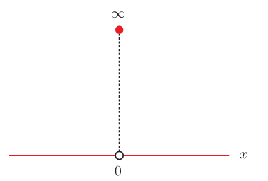
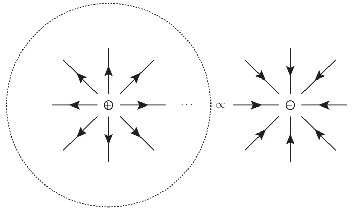

# コーシーの主値と超関数 (クーロンポテンシャルへの短い言及を通して)

ディラックのデルタ関数は数学者に超関数というより一般化した枠組みを様々に定式化する場を提供した． 一足飛びに超関数論を論じることができるかもしれないが，ここでは複素関数論との関連を意識してコーシーの主値と超関数との間の関係 (リップマン・シュウィンガーの関係式) について述べたい．

## 着想と背景

### よく似た二つの式

複素関数論を背景としてコーシーの主値の定義を拡張すると，様々な主値積分を考えることができた．

[複素積分でのコーシーの主値](https://mathrelish.com/physics/cauchy-principal-value-in-complex-space)

具体的には積分路や特異点をずらす極限によって定義される主値積分である． このとき[複素積分でのコーシーの主値](https://mathrelish.com/mathematics/cauchy-principal-value-in-complex-space)では次の関係式を見出すことができた．

$$ f(p) = \lim_{\varepsilon\rightarrow 0}\frac{1}{2\pi i} \oint_{\gamma^+_{\varepsilon} \cup -\gamma^-_{\varepsilon}} \frac{f(z)}{z-p} dz = \lim_{\varepsilon\rightarrow 0}\frac{1}{2\pi i} \left[ \int_{-\infty}^{\infty} \frac{f(x)}{x - (p + i\varepsilon)} dx \pm \int_{-\infty}^{\infty} \frac{f(x)}{x - (p - i\varepsilon)} dx \right] $$

一方でディラックのデルタ関数という超関数は次のように定義される．

$$ f(p) = \int_{-\infty}^{\infty}dx f(x)\delta(x-p) $$

両者はとても似ており，二つの間に関係を見い出せそうである．

### ゼロ割について

もう少し身近な例から上記の二つの間の関係を探ってみよう． それは次の方程式である．

$$ xy = 1 $$

これを $y$ について解くのであるが，次のように解くはずだ．

$$ y = \frac{1}{x} ~~ (x\neq 0) $$

何も間違っていない．$0$ で割ってはならないので，これが最良の解な訳だ． ハイ，オシマイ．That's all!

古代インドでの $0$ の発見から数えて，実に千数百年間の長きにわたって数というものは，積分をまとっていない裸同然のまま過ごしてきた．

[0 の歴史](https://ja.wikipedia.org/wiki/0#%E6%AD%B4%E5%8F%B2)

確かにゼロ割は禁忌である．やってはいけない．一度許せば，任意の帰結を得てしまう． だが，定積分の中ではゼロ割に限りなく近い極限に意味を与えることができる．

### 積分による庇護

#### 略式記述の注意

ディラックのデルタ関数は次を満たす．

$$ x\delta(x) = 0 $$

これは次の略式記述である．

$$ \int_{-\infty}^{\infty} dx \phi(x)\cdot x\delta(x) = 0 $$

ある二つの対象 $f,g$ がテスト関数 $\phi$ との積をとって，(必要ならばコーシーの主値をとって) 得られる値が一致するならば，これを $f=g$ と略式記述しようというものである．

つまり略式記述では次のことに注意しなければならない．

- 略式記述はあくまでも積分をとることを意味する．
- 略式記述での等号は完全な一致を表す普通の等号 (相当関係) ではない．

例えば $x\delta(x)=0$ というのは積分をとってはじめて無矛盾に解釈されるものであり，且つ $x\delta(x)$ と $0$ が同じだとは述べていない．

#### ゼロ割に限りなく近いもの

$xy=1$ は $x=0$ を除いて，完全に解ける．また $x=0$ に限りなく近い結果は正負の無限大となる．我々は超関数論によって後者の「正負の無限大」という特異性を積分で覆い隠して，実りある論理を展開する．この了解の下，「解く」と次を得る．

$$ y = \mathrm{P}\frac{1}{x} + C\delta(x) ~~ (\forall C \in \mathbb{C}) $$

超関数の意味でこのような $y$ が存在する．

但し我々は今後，コーシーの主値を表す記号を多用するので，$\mathrm{p.v.}$ ではなく，より簡便な $\mathrm{P}$ によって，略式記述でのコーシーの主値を表すことにする．

加えて上記のディラックのデルタ関数のように，被積分関数のみをもって記述する略式記述について，コーシーの主値をとることを明示するよう，同じく次の略式記述を採用する．

$$ \mathrm{P}f(x) := \mathrm{p.v.} \int_{-\infty}^{\infty} dx \phi(x)f(x) $$

ここでも等号は相当関係ではなく，上記の略式記述の意味で定義される記号である．

記号の説明でくどくなってしまった．

我々は上記に与えたものは次の解であることを主張したいだけである．

$$ \mathrm{p.v.} \int_{-\infty}^{\infty} dx \phi(x)\cdot xy = \mathrm{p.v.} \int_{-\infty}^{\infty} dx \phi(x)\cdot 1 $$

これを満たすことは明らかである．我々は「解く」と言いつつも，上記のように解くと元の $xy=1$ についても再定義する必要があることになるので，元の問題を改変していることに注意する．

また問題を再定義して得られた解には任意の複素定数 $C$ が存在することにも注意する． 同時に自明な解として $C=0$ も許されていることに注意する．

この解の不定性は境界条件によって決めることができる． ちょっと想像できない場合には $xy=1$ という題材が，実のところ，グリーン関数を意識したものであることを想起するとよい．

## 主題

### コーシーの主値と超関数 (リップマン・シュウィンガーの関係式)

[複素積分でのコーシーの主値](https://mathrelish.com/mathematics/cauchy-principal-value-in-complex-space)で得た関係式をディラックのデルタ関数の定義式のように整理すると次を得る．

$$ \delta(x - p) \overset{?}{=} \frac{1}{2\pi i} \left[ \frac{1}{x - (p + i0_\varepsilon)} \pm \frac{1}{x - (p - i0_\varepsilon)} \right] $$

ここで $0_\varepsilon$ というのはコーシーの主値や超関数の略式記述と同様の略式記述である． その定義は導出から明らかなように次のようなものである．

$$ \frac{1}{x - (p \pm i0_\varepsilon)} := \lim_{\varepsilon\rightarrow 0} \int_{-\infty}^{\infty}dx \frac{f(x)}{x - (p \pm i\varepsilon)} $$

上記が成り立つにはディラックのデルタ関数としての性質を満たしている必要がある． そこで次を満たすかを確認してみる．

$$ \int_{-\infty}^{\infty}dx\delta(x - p) = 1 $$

確認は偶関数と奇関数についての対称な定積分であるから直ちにできて，候補を代入することで次を得る．

$$ \lim_{\varepsilon\rightarrow 0} \int_{-\infty}^{\infty}dx \left[ \frac{1}{x - (p + i\varepsilon)} + \sigma \frac{1}{x - (p - i\varepsilon)} \right] = \delta_{\sigma,-} ~~ (\sigma = \pm) $$

つまり和の方は満たさず，差の方が満たす．これから次を得る(よく使う表式を三つすべて書いた)．

$$ \delta(x - p) = \frac{1}{2\pi i} \left[ \frac{1}{x - (p + i0_\varepsilon)} - \frac{1}{x - (p - i0_\varepsilon)} \right] = \frac{1}{\pi} \Im \left[ \frac{1}{x - (p + i0_\varepsilon)} \right] = \frac{1}{\pi}\frac{0_\varepsilon}{(x - p)^2 + 0_\varepsilon^2} $$

少し細かいことだが，これから[複素積分でのコーシーの主値](https://mathrelish.com/mathematics/cauchy-principal-value-in-complex-space)の「ヒルベルトの公式」についての証明で表れた $i\pi f(p)$ の一見不毛な振り分けの任意性がここで解決していることに留意されたい．

つまりヒルベルトの公式は次のように書かれるものであり，リップマン・シュウィンガーの関係式もしくはプレメリの公式 (Sokhotski–Plemelj の定理) とよばれる．

$$ \frac{1}{x - (p \pm i0_\varepsilon)} = \mathrm{P} \frac{1}{x - p} \pm i\pi \delta(x - p) $$

特異点そのものをずらしたものの和による相加平均がコーシーの主値を与え，差による相加平均がディラックのデルタ関数を与えるのである．

### リップマン・シュウィンガーの関係式とゼロ割に限りなく近いもの

リップマン・シュウィンガーの関係式は特に $p=0$ の場合には，超関数の文脈で解釈した $xy=1$ の解 $y$ の一つを与えていることがわかる．つまり任意の複素定数という不定性について，$C = \pm i\pi$ の場合を与える解である．

$$ y_{\pm} = \frac{1}{x - (p \pm i0_\varepsilon)} ~~ (C = \pm i\pi) $$

よって一般解はリップマン・シュウィンガーの関係式から次のように求められる．

$$ y = \left( \frac{1}{2} + \frac{C}{2\pi i} \right) y_+ + \left( \frac{1}{2} - \frac{C}{2\pi i} \right) y_- $$

ここで元々，特異点をずらすという任意性は物理的な問題を解く際には境界条件や収束因子といった要請から決まったから，今回のようにリップマン・シュウィンガーの関係式から定まった複素定数がこういった要請から決まるということが想像されよう．

また「ゼロ割に限りなく近いもの」というものを考えようとしたが，それは特異点を無限小だけずらしたものだという結果を得たことにも注意したい．

### 積分表示と収束因子 (アーベル極限)

ディラックのデルタ関数の積分表示は次のようなものだった．

$$ \delta(x - p) = \frac{1}{2\pi}\int_{-\infty}^{\infty}dk e^{ik(x-p)} $$

もちろんこれ単独では意味を成さない．ただの略式記述である．

ところがリップマン・シュウィンガーの関係式が指し示すように略式記述自体についても，積分表示を考えることに意義深いものを感じられそうである．それは次のとおりである．

$$ \begin{eqnarray} \frac{1}{x - (p + i0_\varepsilon)} &=& +i \int_{-\infty}^0 dk e^{-0_\varepsilon |k|} e^{ik(x-p)} \\ \frac{1}{x - (p - i0_\varepsilon)} &=& -i \int_0^{\infty}dk e^{-0_\varepsilon |k|} e^{ik(x-p)} \end{eqnarray} $$

よってこれらの差の $\frac{1}{2\pi i}$ 倍がディラックのデルタ関数に等しいので次を得る．

$$ \delta(x - p) = \frac{1}{2\pi} \int_{-\infty}^{\infty} dk e^{-0_\varepsilon |k|} e^{ik(x-p)} $$

これは特異点を $\varepsilon$ だけずらすという操作が超関数の積分表示では収束因子を挿入する操作であることを表している．そしてこのような収束因子による極限をアーベル極限という．またこの意味での超関数 (佐藤超関数) による (逆) フーリエ変換はアーベル極限によって定義されることになる．

つまり特異点をずらすという意味合いだったものが，積分表示では収束因子として機能していることが再び注目に値する．しばしば機械的な計算に拘泥してしまって，収束因子の物理的な意味を問うことを忘れて，計算の便宜にまで理解が後退してしまうことがあるが，これまでの導出から境界条件という物理的な要請と収束因子は紐付いていることを再確認できる．

## コメント

### シュワルツ超関数 (distribution) と佐藤超関数 (hyperfunction)

超関数の定式化には幾つかの方法が知られている．

ディラックのデルタ関数が契機となって，しばしの論争の後，超関数がまずはじめて数学的に無矛盾に定式化された．それがシュワルツ超関数でテスト関数との内積で記述された線型汎関数としての定式化である．

$$ f(x) \cong (f,\phi) := \int_{\mathbb{R}}dx f(x)\phi(x) $$

これは積分領域が実空間に限られたもので，一見しては複素空間との関連は見い出せない． これまでコーシーの主値をめぐって見てきたように，より一般に見ようとすると複素空間が自然だとわかるので，シュワルツ超関数を拡張した佐藤超関数が考案された．

$$ f(x) \cong [F(z)] := F(x + i0_{\varepsilon}) - F(x - i0_{\varepsilon}) = 2i\Im[F(x + i0_{\varepsilon})] $$

佐藤超関数 $f(x)$ は正則関数 $F(z)$ の実軸上の境界値の差として定義されるのである．ここに $F$ は定義関数とよばれる．

例えばディラックのデルタ関数は既に得られている表式を佐藤超関数の文脈で改めて書き直せば次のようになる．

$$ \delta(x - p) \cong \left[\frac{-1}{2\pi i}\frac{1}{z-p}\right] $$

### 略式記述への習熟

超関数とコーシーの主値を扱う中で略式記述が次だけあった．

- 超関数を定義付ける線型汎関数としての積分作用素とテスト関数を省略する記述
- コーシーの主値を定義付ける積分作用素を省略し被積分関数のみを記述
- 特異点を無限小だけずらす極限操作と積分作用素を省略し被積分関数のみを記述

これらをすべて省略せずに書くことはあまりない．煩雑になるからである． 一方でこれら省略記述に従った記述は背後の関係を理解しないまま， 計算だけができてしまうという運用上の危険性を孕んでいる．

似たような話として相対論でのアインシュタインの規約や， 量子論でのディラックのブラケット記法がある． これらはたいへん有用な記法だが，それ自体への慣れと， ちょっとした変種への対応を理解する必要がある．

慣れるまでは辛いが，記述方法は大変経済的にできているので，習熟する価値はある．

### ディラックのデルタ関数と超準解析やコロンボ超関数

ディラックのデルタ関数を超関数の文脈で定式化を図り，我々は次のような図的な理解を退けることができた．

ここで超関数による定式化ができたからといって，この図のような描像が可能な定式化が存在しないとまでは述べていないことに注意する．なるべく上記の図を尊重した定式化としては，実数 $\mathbb{R}$ に無限大や無限小を数として取り込んだ超実数 ${}^\*\mathbb{R}$ (や超超実数 ${}^{\*\*}\mathbb{R}$，超超超実数 ${}^{\*\*\*}\mathbb{R}$などなど) なるものを扱える超準解析によるディラックのデルタ関数 $D:{}^\*\mathbb{R}\rightarrow {}^\*\mathbb{R}$ の定式化がある．

$$ D(x) := \begin{cases} \frac{1}{\epsilon} & \left(x\in\left[-\frac{\epsilon}{2},\frac{\epsilon}{2}\right]\right) \\ 0 & (\mathrm{otherwise}) \end{cases} $$

この場合は単なる略式記述の枠を超えて，超実数関数としてディラックのデルタ関数自身を代数的に扱える．超準解析では無限大も一つの数であり，無限大どうしの積も許され，それはまた別の無限大となる．つまりディラックのデルタ関数について，冪を考える余地があることを示唆する．細かいことを言うと，原点を中心とする無限小領域 (原点のモナド) で無限大なのであって，$1/0$ という演算は超準解析でも実行はできない．

[Dirac Delta Functions Via Nonstandard Analysis](https://www.cambridge.org/core/journals/canadian-mathematical-bulletin/article/dirac-delta-functions-via-nonstandard-analysis/B339A05DC661A7CC22A94D9A834FD539)

超関数どうしの積についての整合性のある枠組みにコロンボ超関数がある．ここではこれ以上の詳細を述べないが，可能性は否定されていないことに注意したい．

[The sequence of ideas in a re-discovery of the Colombeau algebras](https://arxiv.org/abs/0807.0529)

## 例題

### ポテンシャルの遮蔽効果および佐藤超関数のフーリエ変換

#### 発散積分

次のポテンシャルがあったとする．

$$ V(r) := \frac{1}{r} ~~ (r = |\vec{x}|) $$

これをフーリエ変換した次の量にこれから着目する．

$$ \tilde{V}(k) := \frac{1}{(2\pi)^{\frac{3}{2}}} \int_{\mathbb{R}^3}d^3x e^{-i\vec{k}\cdot\vec{x}} V(r) $$

これを球座標に書き換えると次のようになる．

$$ \tilde{V}(k) = \frac{1}{(2\pi)^{\frac{3}{2}}} \int_0^{\infty}dr r^2 \int_0^{\pi}d\theta \sin\theta \int_0^{2\pi}d\phi e^{-i|k|r\cos\theta} V(r) $$

$\phi$ 積分を実行し，$u := r\cos\theta$ なる変数変換を行って $\theta$ 積分を実行して整理すれば次を得る．

$$ \tilde{V}(k) = \sqrt{\frac{2}{\pi}}\frac{1}{|k|} \int_0^{\infty}dr \sin(|k|r) $$

ここで次の定積分をどう受け止めるかということが主に議論したいことである．

$$ I := \int_0^{\infty}dr \sin(|k|r) $$

これは明らかに発散積分である．よってポテンシャルの波数表示が存在しないのだろうか？

#### 公式の引用

しばしばこの発散積分は次の値をとるといった公式引用でとどまる説明がなされることがあって， 釈然としない経験を覚えた人は少なくないだろう．

$$ \begin{eqnarray} \int_0^{\infty}dx \sin (kx) &=& \frac{1}{k} \\ \int_0^{\infty}dx \cos (kx) &=& 0 \end{eqnarray} $$

これにもう少しの説明があるとしたら，次のような公式引用であろう．

$$ \begin{eqnarray} \int_0^{\infty}dx \sin (kx) &=& \lim_{\varepsilon\rightarrow 0} \int_0^{\infty}dx e^{-\varepsilon x} \sin (kx) = \frac{1}{k} \\ \int_0^{\infty}dx \cos (kx) &=& \lim_{\varepsilon\rightarrow 0} \int_0^{\infty}dx e^{-\varepsilon x} \cos (kx) = 0 \end{eqnarray} $$

今の場合については積分操作と極限操作は可換ではないので，最左辺と中辺の等号は成立しない． 成立するとしたらこの等号は定義の意味であろう．少なくともかなりの記号の省略がなされている．つまりこれを文字どおり解釈してはいけないのである．言うなれば平気で $\delta(0)=\infty$ と書いてあって，それを文字どおり受け止めるようなものである． そしてくれぐれも極限が積分と交換可能であるようにこの式を見てはならない！

#### 様々な略式記述の復習

釈然としない式の意味を考えるためには次のことを思い出せば良い．

$$ 2\pi \delta(k) = \int_{-\infty}^{\infty} dx 1 \cdot e^{-ikx} $$

これはディラックのデルタ関数の積分表示であり，また定数関数のフーリエ変換である． フーリエ変換といっても $\int dk$ の中で意味のあるものであり， それを省略しているだけで，それ単独では意味を成さなかった．

そしてリップマン・シュウィンガーの関係式によるディラックのデルタ関数の表示は次のようなものだった．

$$ 2\pi \delta(k) = \int_{-\infty}^{\infty} dx e^{-0_\varepsilon |x|} e^{-ikx} $$

これは $0_{\varepsilon}$ が略式記述で，$\int dk$ の後に $\lim_{\varepsilon\rightarrow 0}$ をとるものだったが，この了解の下で積分が実行できて次の表式を与えた．

$$ 2\pi \delta(k) = \frac{1}{i}\left(\frac{1}{k - 0_{\varepsilon}} - \frac{1}{k + 0_{\varepsilon}}\right) = \left[\frac{-1}{i z}\right] $$

我々はこうしてディラックのデルタ関数について次の記述を得ることになる．

$$ 2\pi \delta(k) = \int_{-\infty}^{\infty} dx 1 \cdot e^{-ikx} = \int_{-\infty}^{\infty} dx e^{-0_\varepsilon |x|} e^{-ikx} = \frac{1}{i}\left(\frac{1}{k - i0_{\varepsilon}} - \frac{1}{k + i0_{\varepsilon}}\right) = \left[\frac{-1}{i z}\right] $$

何れもが略式記述の了解の下で表記されたものでありながら，あるものは積分表示，あるものは積分を実行しうる表示，あるものは積分を実行した表示というものになっている．

#### ヘヴィサイド関数のフーリエ変換とリップマン・シュウィンガーの関係式

以上の事柄を踏まえて問題とした公式の引用で不足部分を補うと次のようになる．

$$ \begin{eqnarray} ? &=& \int_0^{\infty}dx \sin (kx) = \int_0^{\infty}dx e^{-0_{\varepsilon} x} \sin (kx) = \frac{k}{k^2 + 0_{\varepsilon}^2} = ?? \\ ? &=& \int_0^{\infty}dx \cos (kx) = \int_0^{\infty}dx e^{-0_{\varepsilon} x} \cos (kx) = \frac{0_{\varepsilon}}{k^2 + 0_{\varepsilon}^2} = ?? \end{eqnarray} $$

$?$ の部分も明らかにして，且つフーリエ変換であることがわかるように，更に適宜補うと次のようにヘヴィサイド関数 $\theta$ のフーリエ変換となる．

$$ \pi\delta(k) - i\mathrm{P}\frac{1}{k} = \int_{-\infty}^{\infty}dx \theta(x) e^{-ikx} = \int_{-\infty}^{\infty}dx \theta(x) e^{-0_{\varepsilon} x} e^{-ikx} = \frac{1}{2i}\left(\frac{1}{k - i0_{\varepsilon}} - \frac{1}{k + i0_{\varepsilon}}\right) - i \frac{1}{2}\left(\frac{1}{k - i0_{\varepsilon}} + \frac{1}{k + i0_{\varepsilon}}\right) = ?? $$

ここで最左辺と第四辺の実部と虚部を比較すれば，リップマン・シュウィンガーの関係式が得られる． そして最早明らかなように最右辺の $??$ は佐藤超関数とコーシーの主値との和である．

$$ ?? = \left[\frac{-1}{2iz}\right] -i \mathrm{P}\frac{1}{k} $$

以上から引用した公式は次のように書かれるべきものであったとわかる．

$$ \begin{eqnarray} \int_0^{\infty}dx \sin (kx) &=& \mathrm{P}\frac{1}{k} \\ \int_0^{\infty}dx \cos (kx) &=& \pi\delta(k) \end{eqnarray} $$

なおヘヴィサイド関数の積分表示については更に以下で補足を述べた．

[コーシーの主値と超関数 (クーロンポテンシャルへの短い言及を通して)](https://mathrelish.com/physics/integral-representation-of-the-heaviside-function)

#### 遮蔽距離が無限大の湯川ポテンシャル

今回の発散積分 $I$ に意味をもたせようとすると，$I$ は超関数の積分表示だと考えればよいことがここまでの考察からわかった．その意味でポテンシャルの波数表示を書けば次のようになる．

$$ \tilde{V}(k) = \sqrt{\frac{2}{\pi}}\frac{1}{|k|}\mathrm{P}\frac{1}{|k|} $$

また超関数としての表示については収束因子を含んだ表示もあったが，これから逆算して，元の位置表示のポテンシャルに戻るとき，次の表式を予め計算していると考えても同値だとわかる．

$$ V(r) = \frac{e^{-0_{\varepsilon}r}}{r} $$

これは遮蔽距離が無限大の湯川ポテンシャルである．

我々は $\frac{1}{r}$ なるポテンシャルを考えたが，(例えばポテンシャルとしてクーロンポテンシャルを想定するならば) これはたった一つの電荷が作りうるポテンシャルである．一方で電気力線の議論から力線は正負の電荷がそれぞれ湧き出しと吸い込みになっていなければならない．仮に正電荷が一つだけあったら，それに連れ立って相棒となる負電荷がどこか遠いところにあることになる．よって現実には次のような遮蔽距離が $0$ でない有限な湯川ポテンシャルを考えることになる．

$$ \frac{e^{-\frac{r}{\lambda}}}{r} ~~ (0 < \lambda < \infty) $$

ところがそのように考えるということは，予め設定した問題設定を再定義したことを意味する． これによってポテンシャルの波数表示の存在が保証されることは従って自明なことである．

我々が得た超関数による意味付けは，問題の再定義をすることなく，電気力線の議論に表れた負電荷が存在する領域を正電荷とは無限大だけ離れた位置にあると解釈することを提案する．これは遮蔽距離が無限大であることについての解釈である (正負逆も然り)．そもそも理想的な場合を考えているので，有限な現実の物理系での解釈を放棄することは不自然ではないだろう．

#### シュウィンガートリックと主値

さてシュウィンガートリックと呼ばれる次の技法がある．

$$ \frac{1}{r} = \int_0^{\infty} du e^{-ru} $$

[Schwinger parametrization](https://en.wikipedia.org/wiki/Schwinger_parametrization)

これを用いて発散積分 $I$ を次のように書き換える．

$$ I = \int_0^{\infty} dr r \frac{\sin(|k|r)}{r} = \int_0^{\infty} du \int_0^{\infty} dr r e^{-ru} \sin(|k|r) $$

ここでの $r$ 積分を $f_k(u)$ と置けば，それは次のように求められる． (ちょうどラプラス変換にもなっていることにも注意しよう)

$$ f_k(u) := \int_0^{\infty} dr e^{-ru} r \sin(|k|r) = \frac{2|k|u}{(|k|^2 + u^2)^2} ~~ (u>0) $$

この結果に対して $u$ 積分を実行すると次が得られる．

$$ I = \left[-\frac{|k|}{|k|^2+u^2}\right]_{u=0}^{u=\infty} = \frac{1}{|k|} ~~ (??) $$

なんと一見，$I$ から発散積分がなくなったかのような計算になっている．

どこがおかしいだろう？

それは関数 $f_k(u)$ が $u>0$ でのみ定義されており， $u=0$ については未定義だという点が考慮されきれていないところである．

$u$ 積分を実行して，定積分の両端点の値を取得しなければならないのだが， $u=0$ は未定義なので，不定になっている． しかし原点への右極限と積分の定義を主値積分へと変更すれば，定まることになる． つまり再び次を得ることになる．

$$ I = \mathrm{P}\frac{1}{|k|} $$

シュウィンガートリックやその一般化であるファインマントリックは場の量子論で多用される技法である． それは手軽に指数減衰の収束因子を定積分計算に導入できるため， そういう意味ではとても見通しが良い計算方法である． しかし元々あった特異性が消えたかのような結果をしばしば得ることができるため， この点では注意が必要なトリックである．

## 参考

- [詳解物理応用数学演習](https://amzn.to/2QoZgE4)
- [微分方程式 物理的発想の解析学 (サイエンス・パレット)](https://amzn.to/2N8ipfD)
- [A Theory of Clothed Unstable Particles](https://academic.oup.com/ptp/article/19/6/607/1897182)
- [積分論と超関数論入門](https://amzn.to/2QrV1Yz)
- [物理現象のフーリエ解析 (ちくま学芸文庫)](https://amzn.to/2CMXee8)
- [物理数学入門〈2〉微分方程式と複素関数](https://amzn.to/2x9WmKn)
- [ヴィジュアル複素解析](https://amzn.to/2Qpkphs)
- [応用超関数論 1](https://amzn.to/2Qt33jU)
- [応用超関数論 2](https://amzn.to/2NaQ7kF)
- [ディジタル信号と超関数 (プラタンBOOKS)](https://amzn.to/2N927mx)
- [デルタ関数と微分方程式【応用数学叢書】 (岩波オンデマンドブックス)](https://amzn.to/2NaLYx6)
- [漸近解析入門](https://amzn.to/2R1Uj4t)
- [超関数の理論](https://www.jstage.jst.go.jp/article/sugaku1947/10/1/10_1_1/_article/-char/ja/)
- [佐藤幹夫の数学 増補版](https://amzn.to/2NNTj65)

