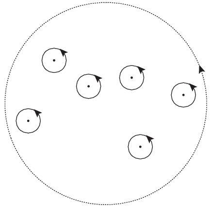
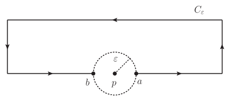
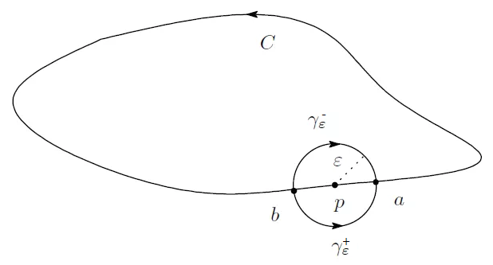
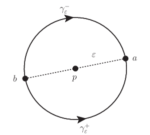
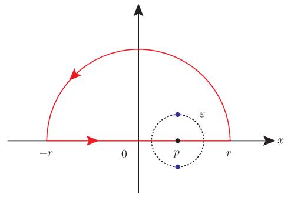
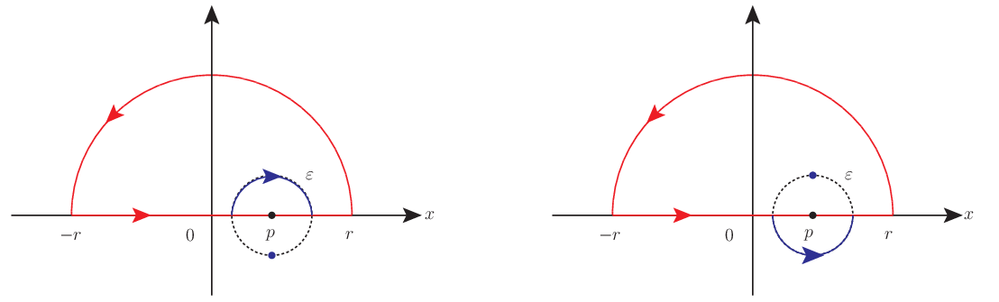
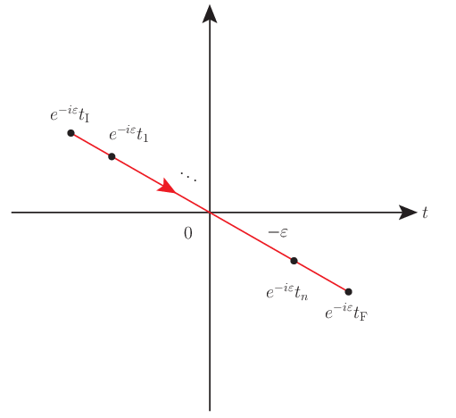
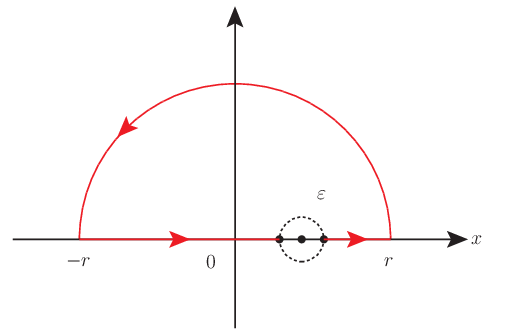

# 複素積分でのコーシーの主値

定積分は複素積分までいくと劇的に世界が変わる． 喩えが古臭くて恐縮だが，白黒テレビがカラーテレビになるような，そんな違いだ． ああ，だからそうだったのか．というような驚きも少なくない． 更に突き進んでいくと超関数までもが調和する世界が見えてくる．

以下ではそのようなとっかかりに至るまでに検討すべき事柄の一つである， 複素積分でのコーシーの主値について触れる．

## 背景と着想

コーシーの主値は実積分では広義積分に紐付いた極限の取り方の一つだった．

[実積分でのコーシーの主値](https://mathrelish.com/mathematics/cauchy-principal-value-in-real-space)

複素積分になると積分範囲もしくは積分領域というものは，積分路というどこか動的な感じがする概念へと昇華する．

ここで動的と形容したのはコーシーの積分定理をまず意識してのことである．

### コーシーの積分定理と留数定理

コーシーの積分定理とは積分路 $C$ が閉曲線であり，且つ閉曲線で囲まれた領域に特異点が一つもない場合には，積分値は $0$ となるという定理である．

$$ \oint_C dz f(z) = 0 $$

積分路 $C$ は内部に特異点を含まない限り，いろいろな連続変形を考えてよい． この変形というところが動的なところであり，実積分にはこれほど綺麗な形ではなかった性質である． 実積分の場合には行って戻るという実にツマラナイ場合であり，何を有難がるのか理解しろというのが難しいものへと退化してしまう．

そして特異点を含んでいる場合は留数定理とよばれる定理へとコーシーの積分定理は一般化される．

$$ \oint_C dz f(z) = 2\pi i\sum_{k}\underset{z=p_k}{\mathrm{Res}}f(z) $$

このとき右辺に総和記号が表れているが，これは元の積分路 (下図の破線) が一つ一つの特異点を囲む積分路へと分裂していることに対応している．

### コーシーの主値と特異点

特異点が積分路上にある場合，一般に積分は一意に定まらない．

これは実積分でも起こったことである． 実積分の場合には特異点があることで，その特異点を除いた開区間で積分をする必要があり，従ってそれは広義積分の例であり，どれくらいの速さで特異点に近づくかという任意性が生じることになる． そこでコーシーの主値という極限を考えた．

以上のことを複素積分でも考えようというわけである． 閉曲線ではなく特異点だけ抜き取った開曲線といったところである． よって定義をしていくためには複素積分での広義積分というものを考える必要がある．

## 定義

### コーシーの主値をとる極限

複素積分の積分路 $C$ 上の特異点 $z=p$ を中心として，図のように微小半径 $\varepsilon$ の真円 $S^1$ を描き，これと積分路 $C$ の二つ交点を $a,b$ とする．

このとき始点と終点をそれぞれ $a,b$ とする積分路 $C$ の一部である開曲線を $C_{\varepsilon}$ として，複素積分のコーシーの主値は次のように定義される．

\begin{equation} \mathrm{p.v.} \oint_C f(z) dz := \lim_{\varepsilon\rightarrow 0}\int_{C_{\varepsilon}} f(z)dz \end{equation}

コーシーの主値を上記のとおり定めたが，実積分の場合と違って，更に他の極限を考えることができる．

### 特異点を避ける積分路をとる極限

上図のように特異点を避ける次の二通りの極限を考えることができる．

- $\Gamma^- := \lim{\varepsilon\rightarrow 0}(C_{\varepsilon} \cup \gamma^-_{\varepsilon})$: 積分路の中に特異点を含まないように避ける積分路の極限
- $\Gamma^+ := \lim{\varepsilon\rightarrow 0}(C_{\varepsilon} \cup \gamma^+_{\varepsilon})$: 積分路の中に特異点を含むように避ける積分路の極限

何れもコーシーの主値を与える積分路 $C_{\varepsilon}$ を含んでおり，従ってこれらはコーシーの主値に従属する極限だといえる．

### 特異点そのものをずらす極限

特異点を積分路上からずらし，積分を実行した然る後に特異点を無限に近い位置に戻すという極限をとる．

$$ \lim_{\varepsilon\rightarrow 0}\oint_C f_{\varepsilon}(z) dz ~~ (f(z) = \lim_{\varepsilon\rightarrow 0} f_{\varepsilon}(z)) $$

この極限は積分路を一切変更していないことに注意するとともに，積分領域を実数全体にとった実積分の場合には考えられなかったことに注意する．というのも積分領域を実数直線上だけに限ると，逃げ場所がないからである．

## コメント

### 「コーシーの主値」と「特異点を避ける積分路をとる極限」の関係

積分路上の特異点 $z=p$ が $1$ 位の極である場合に次の公式が成立する．

$$ \begin{eqnarray} I_{\mathrm{Cauchy}} := \mathrm{p.v.} \oint_C \frac{f(z)}{z-p} dz &=& i\pi f(p) \\\\ \lim_{\varepsilon\rightarrow 0} \int_{\gamma^{\pm}_{\varepsilon}} \frac{f(z)}{z-p} dz &=& \pm I_{\mathrm{Cauchy}} \end{eqnarray} $$

但し積分路上の特異点を強調するために $f(z)$ は積分路上および内部で特異点をもたないとする．また各種の極限の定義に表れる二点 $a,b$ は直径対蹠点にとる．

まず三つある公式のうち，最後の二つの証明を行う．

特異点を避ける積分路をとるので，$\varepsilon e^{i\theta}=z-p$ と変数変換して陽に極限がわかるようにする．また積分路の始点 $b$ の偏角を $\theta_1$ とすると，終点 $a$ の偏角 $\theta_2$ は，二つの特異点を避ける積分路 $\gamma^{\pm}_{\varepsilon}:b \rightarrow a$ それぞれについて次のようになる．

$$ \gamma^{\pm}_{\varepsilon}:\theta_1 \rightarrow \theta_2 = \theta_1 \pm \pi $$

これから次のように値を求めることができる．

$$ \begin{aligned} \lim_{\varepsilon\rightarrow 0} \int_{\gamma^{\pm}_{\varepsilon}} \frac{f(z)}{z-p} dz &= \lim_{\varepsilon\rightarrow 0} \int_{\theta_1}^{\theta_2} \frac{f(p + \varepsilon e^{i\theta})}{\varepsilon e^{i\theta}} i \varepsilon e^{i\theta} d\theta \\ &= \lim_{\varepsilon\rightarrow 0} \int_{\theta_1}^{\theta_2} i f(p + \varepsilon e^{i\theta}) d\theta \\ &= i \int_{\theta_1}^{\theta_2}\lim_{\varepsilon\rightarrow 0} f(p + \varepsilon e^{i\theta}) d\theta \\ &= i \int_{\theta_1}^{\theta_2} f(p) d\theta \\ &= i f(p)(\theta_2 - \theta_1) \\ &= \pm i\pi f(p) \end{aligned} $$

最後にコーシーの主値との関連は次のとおり．

閉じた積分路を $C^-_{\varepsilon}:=C_{\varepsilon} \cup \gamma^-_{\varepsilon}$ とすると，閉曲線 $C^-_{\varepsilon}$ の内部には特異点をもたない．よってその閉曲線についての複素積分は $0$ であるから次を得る．

$$ \oint_{C^-_{\varepsilon}} \frac{f(z)}{z-p} dz = 0 ~\Leftrightarrow~ \int_{C_{\varepsilon}} \frac{f(z)}{z-p} = - \int_{\gamma^-_{\varepsilon}} \frac{f(z)}{z-p} $$

従って，半径を無限小に取る極限を取れば，所望の結果を得る．■

上記の結果から次の結果も得ることができる．

$$ \mathrm{p.v.} \oint_C \frac{f(z)}{z-p} dz = \lim_{\varepsilon\rightarrow 0} \frac{1}{2}\left[ \int_{\gamma^+_{\varepsilon}} \frac{f(z)}{z-p} dz - \int_{\gamma^-_{\varepsilon}} \frac{f(z)}{z-p} dz \right] = \lim_{\varepsilon\rightarrow 0} \frac{1}{2} \oint_{\gamma^+_{\varepsilon} \cup -\gamma^-_{\varepsilon}} \frac{f(z)}{z-p} dz $$

つまりコーシーの主値は特異点を避ける二つの積分路でできる閉曲線の半分に等しい．

また差ではなく和 (相加平均) をとると恒等的に $0$ である．

$$ \lim_{\varepsilon\rightarrow 0} \frac{1}{2}\left[ \int_{\gamma^+_{\varepsilon}} \frac{f(z)}{z-p} dz + \int_{\gamma^-_{\varepsilon}} \frac{f(z)}{z-p} dz \right] = 0 $$

### 特異点そのものをずらす極限とヒルベルトの公式

この方法は積分路でなく特異点それ自体をずらす方法だが，$\varepsilon$ だけの微小変形の仕方には任意性があるため，それに応じて結果も一般に異なる．従ってどのような微小変形を採用するか，問題に応じて対処しなければならない．

実軸上に特異点がある積分について，このような極限をとって計算することが多い． このとき特異点は実軸に無限に近い位置にあることになる． 特異点というものが実空間にはない，という要請の表れと考えられなくもない．

このような特異点そのものをずらす極限は，例えば次のように，他のコーシーの主値や積分路を変形する極限と独立ではない．

複素関数 $f(z)$ が複素上半平面 ($\Im z > 0$) で正則で且つジョルダンの補助定理に従うならば，次が成り立つ．

$$ \lim_{\varepsilon\rightarrow 0}\int_{-\infty}^{\infty}\frac{f(x)}{x - (p \pm i\varepsilon)} dx = \mathrm{p.v.} \int_{-\infty}^{\infty} \frac{f(x)}{x-p} dx \pm i\pi f(p) $$

積分路上の特異点 $z=p$ が $1$ 位の極であるような被積分関数について，次のように特異点そのものをずらす極限を考える．

$$ I_{\pm} := \lim_{\varepsilon\rightarrow 0}\oint_C \frac{f(z)}{z - (p \pm i\varepsilon)} dz $$

このとき特に積分路として下図に示す閉曲線をとる．

すると $r\rightarrow\infty$ の極限で半円弧部分の積分はジョルダンの補助定理から落ちるので次のようになる．

$$ I_{\pm} = \lim_{\varepsilon\rightarrow 0}\int_{-\infty}^{\infty} \frac{f(x)}{x - (p \pm i\varepsilon)} dx $$

一方で $I_{\pm}$ は特異点のずらし方に応じて，閉曲線である積分路 $C$ の内部にずらした後の特異点が含まれる場合とそうでない場合がある．含まれる場合には留数定理に従って留数を，含まない場合には $0$ を値にとる．

$$ I_{\sigma} = \delta_{\sigma,+} 2\pi i \lim_{\varepsilon\rightarrow 0} \underset{z=p + \sigma i\varepsilon}{\mathrm{Res}}f(z) = \delta_{\sigma,+} 2\pi i f(p) ~~ (\sigma=\pm) $$

これは次のように書ける．

$$ I_{\pm} = i\pi f(p) \pm i\pi f(p) = \mathrm{p.v.} \int_{-\infty}^{\infty} \frac{f(x)}{x-p} dx \pm i\pi f(p) $$

よって二つの評価を合わせて次を得る．

$$ \lim_{\varepsilon\rightarrow 0}\int_{-\infty}^{\infty} \frac{f(x)}{x - (p \pm i\varepsilon)} dx = \mathrm{p.v.} \int_{-\infty}^{\infty} \frac{f(x)}{x-p} dx \pm i\pi f(p) $$

これは所望の結果である．■

ヒルベルトの公式の証明の中で次式が表れた．

$$ I_{\sigma} = \delta_{\sigma,+} 2\pi i \lim_{\varepsilon\rightarrow 0} \underset{z=p + \sigma i\varepsilon}{\mathrm{Res}}f(z) = \delta_{\sigma,+} 2\pi i f(p) ~~ (\sigma=\pm) $$

この中で $i\pi f(p)$ がコーシーの主値に一致する訳だが，別に第二項を主値としても良いわけだから，式の整理の仕方がやや美しくなかった．そこで上記について二つの特異点のずらし方の相加平均を取った「公平な」式変形に着目する．

$$ \frac{1}{2}(I_+ + I_-) = i\pi f(p) = \mathrm{p.v.} \int_{-\infty}^{\infty} \frac{f(x)}{x-p} dx $$

これはコーシーの主値が特異点そのものをずらす二つの極限の相加平均であることを示している． しかし $I_-=0$ であるのだから，次もまた成り立つ．

$$ \frac{1}{2}(I_+ - I_-) = i\pi f(p) = \mathrm{p.v.} \int_{-\infty}^{\infty} \frac{f(x)}{x-p} dx $$

不毛な話をしているようであるが，これは超関数のことを考えると，ヒルベルトの公式のようにまとめると都合がよい．

### 各種の極限の相互関係

特異点を含む複素積分について次の三種類の極限を定め，それらの間に成り立つ関係式を求めた．

- コーシーの主値
- 特異点を避ける積分路をとる極限
- 特異点そのものをずらす極限

ここまでで得られた結果を特に実数直線上について，総合すると次が成り立つとわかる．

$$ \lim_{\varepsilon\rightarrow 0}\int_{-\infty}^{\infty} \frac{f(x)}{x - (p \pm i\varepsilon)} dx = \mathrm{p.v.} \int_{-\infty}^{\infty} \frac{f(x)}{x-p} dx + \lim_{\varepsilon\rightarrow 0} \int_{\gamma^{\pm}_{\varepsilon}} \frac{f(z)}{z-p} dz $$

ここから特異点と積分路の間の動的な相互作用のようなものを感じ取れる． つまり特異点を積分路に向けて衝突させると，積分路が衝突方向へ膨れるというような見方である．または逆に積分路を特異点にぶつけて，特異点を弾き飛ばすというような見方である．

上記の関係式から「特異点そのものをずらす極限」によって何某かを計算したものは， 実積分での「コーシーの主値」そのものではなく，「特異点を避ける積分路をとる極限」についての項も加味しているということである． つまり全体としてみれば複素平面を意識しない結果かもしれないが，これらの積分路もしくは特異点をずらす極限によって何某かを計算するということは，実直線だけでは議論が閉じないということである．

### 超関数論への昇華

実積分でのコーシーの主値の定義を頼りに，積分路や特異点をずらすという極限に基づいた各種の主値積分を定義できた．これらの考察で得られた関係式の中で次の式に着目する．

$$ f(p) = \lim_{\varepsilon\rightarrow 0}\frac{1}{2\pi i} \oint_{\gamma^+_{\varepsilon} \cup -\gamma^-_{\varepsilon}} \frac{f(z)}{z-p} dz = \lim_{\varepsilon\rightarrow 0}\frac{1}{2\pi i} \left[ \int_{-\infty}^{\infty} \frac{f(x)}{x - (p + i\varepsilon)} dx \pm \int_{-\infty}^{\infty} \frac{f(x)}{x - (p - i\varepsilon)} dx \right] $$

これは関数 $f$ の点 $p$ への射影のように見える． このような作用によって定義される数学的な構造にディラックのデルタ関数という超関数がある．

$$ f(p) = \int_{-\infty}^{\infty} dx f(x) \delta(x-p) $$

$x=p$ での特異性をテスト関数との積分 (内積) によって緩和して，その意味を持って特異性を消去しつつも，その約束事を背後に置く範囲で記述を簡略化して有用な計算を実現する超関数という構造である．

両者はとても似ており，実際，[コーシーの主値と超関数](https://mathrelish.com/physics/cauchy-principal-value-and-generalized-function)で述べるように，これらの間に関係を構築することができる．

このように主値積分の考察を進めることで，自然な形で超関数論へと進むことができるのである．

[コーシーの主値と超関数 (クーロンポテンシャルへの短い言及を通して)](https://mathrelish.com/physics/cauchy-principal-value-and-generalized-function)

### 物理的な意味

様々な主値積分が数学的に存在することがわかったが，これらの物理的な意味は何だろうか． 物理系それぞれに対応した意味がある訳だが，ここでは一例としてグリーン関数の計算に着目し，その概要を述べよう．

#### 複素質量

グリーン関数の計算ではしばしば「特異点そのものをずらす極限」が表れる． 自然単位系を採用するとき，そのような極限の物理的な意味は特異点を与えている質量を虚数方向にずらすことを意味する．

$$ m^2 \mapsto m^2 - i\varepsilon $$

物理では質量にかかわらず，時空の次元すらも複素化するので，理論物理を修めていくと複素何某が珍しくないことに気づく． しかし複素質量というものは少し抵抗があるのは正直なところだろう． 複素化されたといっても，計算の便宜だと押し切ることもできなくはないが，複素数の範囲ではじめて定義される何某かと結びつけることで理解を図るという方法がある．

例えば量子状態 $|\psi\rangle$ は複素数の範囲まで拡げてはじめて物理的な意味を咀嚼できるようになる．

#### 複素摂動

今回の複素質量というのはそれそのものを見ていてもよくわからない． 質量という古典的な概念は量子論では固有値であり，作用素と状態の副次的なものだからである． 相対論的に言えば，エネルギーと質量は等価であり，今回考えている質量というものは量子論と合わせることでハミルトニアンの固有値と見るべきである．

よって複素質量というのはハミルトニアンが非エルミートになるような質量項への摂動を考えている場合に相当する．

$$ H \mapsto H -i\varepsilon (\mathrm{mass~term}) $$

もしくはより一般に，次のような複素摂動とも捉えることができる．

$$ H \mapsto H -i\varepsilon H \simeq e^{-i\varepsilon} H $$

#### 径路積分の収束因子

上記のうちどちらの複素摂動を自然が採用しているか (何れでもないかもしれない) はわからないが，ハミルトニアンが時間並進の作用素という物理的な意味を持っていたことを思い出すと，何れにしても有限な $\varepsilon$ であったらユニタリー発展ではなく，確率を保存する時間発展は行われない．

よって $\varepsilon\rightarrow 0$ なる極限をとらねばならないが， 極限を取る前に得られる恩恵として径路積分の収束因子という意味がある．

ここに場 $\phi$ についての径路積分とは次のような量である．

$$ \int \mathcal{D}\phi (\cdots) \exp\left[i\int d^Dx \mathcal{L} \right] $$

$\mathcal{L}$ はラグランジアン密度とよばれる量で，今回の複素摂動を考えたことによって余分に次の因子だけ径路積分でいつも考えることになる．

$$ \exp\left[-\varepsilon \int d^Dx \frac{1}{2} \phi^2(x) \right] $$

これは径路積分で収束因子として機能することを意味しており，径路積分を well-defined に定めるのに貢献するという物理的な意味を見出すことができる．もし複素摂動が $+i\varepsilon$ であったら，発散因子として機能するため，$-i\varepsilon$ でなければならないということも理解されよう．

#### 真空真空遷移

上記の物理的な意味の他にもハミルトニアンが時間並進の作用素であるということに立脚した物理的な意味も見出すことができる．この方向で意味を見出そうとすれば，ハミルトニアンの形によって変わることになるので，先の二つある複素摂動それぞれについて異なる意味が見出される．

このためにグリーン関数に立ち返ることになるが，グリーン関数は物理的には，ある始状態があって系に外場を置いたときのある終状態への遷移を表す伝播関数を意味する．このときの始状態と終状態というのが時間的な境界条件となっており，グリーン関数の定義にこれらの情報が必要となる．そして物理的な都合で無限の過去と未来では相互作用が切れて欲しいので，これらは共に真空であってほしい．

さて二つある複素摂動のうち，前者の場合，推論を進めると，複素摂動さえ入れておけば，真空と直交していない限り，どのような始状態と終状態であったとしても，無限の過去と未来をとる極限で，$\varepsilon\rightarrow 0$ なる極限の下，それら状態は真空に限りなく近くなるという帰結を得ることができる．

このことを「$-i\varepsilon$ 処方は真空を自動的に選択する」と表現したりする． つまり複素質量は真空真空遷移という時間的な境界条件を保証するという物理的な意味を持っている．

#### 径路積分のユークリッド化

一方で後者の複素摂動の場合は，時間発展のユニタリー作用素を考えるとわかるが，時間変数を次のように一斉に変換する摂動という意味を持っている．

$$ (t_1,\cdots,t_n;t_{\mathrm{I}},t_{\mathrm{F}}) \mapsto e^{-i\varepsilon} (t_1,\cdots,t_n;t_{\mathrm{I}},t_{\mathrm{F}}) $$

ここでの各時刻は $n$ 点グリーン関数の各時刻であり，また初期時刻と最終時刻である． ということで複素時間を考えることになる．元の各時刻には次の広義単調増加な関係があった．

$$ t_{\mathrm{I}} \leq t_1\leq\cdots\leq t_n\leq t_{\mathrm{F}} $$

即ち，これを保ったまま複素平面上で $-\varepsilon(< 0)$ だけ回転する摂動である．

このような回転によって得られる恩恵は，径路積分の数学的な定式化についての正当性との関連である． というのも，$\varepsilon = \frac{\pi}{2}$ にとると，径路積分がユークリッド内積での表式となるため，収束因子が労せず表れて well-defined な径路積分の議論ができるからである．

#### まとめ

以上から，特異点そのものをずらすという極限には，およそ次のような物理的な意味をもっていることがわかった．

- 径路積分の収束因子
- 境界条件

## 例題

### クラマース・クローニッヒの関係式とヒルベルト変換

複素関数 $f(z)$ が複素上半平面 ($\Im z > 0$) で正則で且つジョルダンの補助定理に従うならば，次が成り立つ．

$$ \begin{eqnarray} \Re f(p) &=& +\frac{1}{\pi}\mathrm{p.v.} \int_{-\infty}^{\infty} \frac{\Im f(x)}{x-p} dx \\\\ \Im f(p) &=& -\frac{1}{\pi}\mathrm{p.v.} \int_{-\infty}^{\infty} \frac{\Re f(x)}{x-p} dx \end{eqnarray} $$

「コーシーの主値」と「特異点を避ける積分路をとる極限」の関係から次が成り立った．

$$ \mathrm{p.v.} \oint_C \frac{f(z)}{z-p} dz = i\pi f(p) $$

これから特に積分路 $C$ として下図のような閉曲線をとる．

すると $r\rightarrow\infty$ の極限で半円弧部分の積分はジョルダンの補助定理から落ちるので次のようになる．

$$ \mathrm{p.v.} \oint_C \frac{f(z)}{z-p} dz = \lim_{r\rightarrow\infty}\mathrm{p.v.} \int_{-r}^r \frac{f(x)}{x-p}dx = \mathrm{p.v.} \int_{-\infty}^{\infty} \frac{f(x)}{x-p}dx $$

よって次を得る．

$$ f(p) = \frac{1}{i\pi}\mathrm{p.v.} \int_{-\infty}^{\infty} \frac{f(x)}{x-p}dx = \frac{1}{\pi}\mathrm{p.v.} \int_{-\infty}^{\infty} \frac{-i\Re f(x) + \Im f(p)}{x-p}dx $$

故に得られた式について実部と虚部を比較して所望の結果を得る．■

クラマース・クローニッヒの関係式は次の異称がある．

- クラマース・クローニッヒ変換
- 分散公式

クラマース・クローニッヒの関係式は実部と虚部がヒルベルト変換で結びついていることを示している． 何故ならばヒルベルト変換とは次のように定義される変換だったからである．

$$ \mathcal{H}[f](p) := \frac{1}{\pi}\mathrm{p.v.} \int_{-\infty}^{\infty} \frac{f(x)}{p-x}dx $$

ヒルベルト変換を陽に用いてクラマース・クローニッヒの関係式を書き直せば次のようになる．

$$ \begin{eqnarray} \mathcal{H}[\Re f](p) &=& +\Im f(p) \\ \mathcal{H}[\Im f](p) &=& -\Re f(p) \end{eqnarray} $$

## 参考

- [詳解物理応用数学演習](https://amzn.to/2QoZgE4)
- [微分方程式 物理的発想の解析学 (サイエンス・パレット)](https://amzn.to/2N8ipfD)
- [積分論と超関数論入門](https://amzn.to/2QrV1Yz)
- [物理現象のフーリエ解析 (ちくま学芸文庫)](https://amzn.to/2CMXee8)
- [物理数学入門〈2〉微分方程式と複素関数](https://amzn.to/2x9WmKn)
- [ヴィジュアル複素解析](https://amzn.to/2Qpkphs)
- [応用超関数論 1](https://amzn.to/2Qt33jU)
- [応用超関数論 2](https://amzn.to/2NaQ7kF)
- [ディジタル信号と超関数 (プラタンBOOKS)](https://amzn.to/2N927mx)
- [デルタ関数と微分方程式【応用数学叢書】 (岩波オンデマンドブックス)](https://amzn.to/2NaLYx6)
- [ゲージ場の量子論〈1〉 (新物理学シリーズ)](https://amzn.to/2xwaBdQ)

