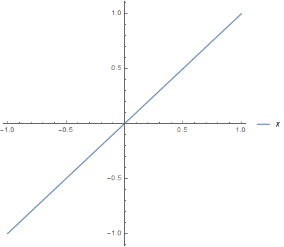
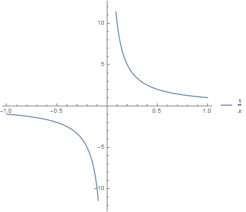
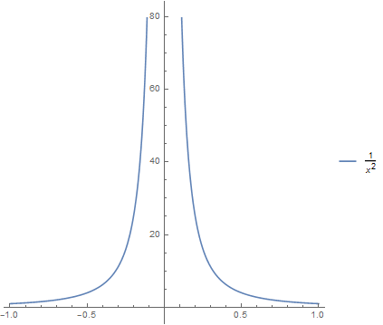
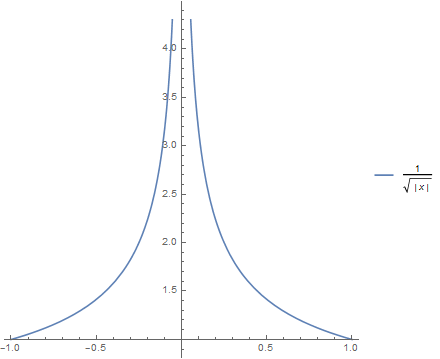
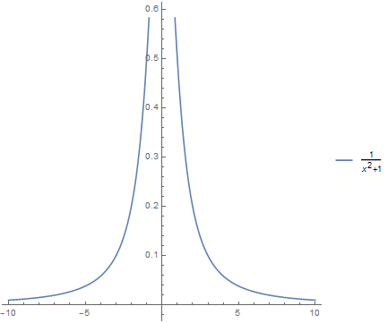

# 実積分でのコーシーの主値

積分路上に特異点があると，積分値は極限の取り方の違いに依存する． そのため積分値が一意的に定義できない． そこでコーシーの主値とよばれる極限の取り方を定め，一意的な積分値を定義する． 但し，コーシーの主値であっても極限値である積分値が存在しない場合がある．

## 背景と着想

無限個の足し上げというのは，可算無限個でも，非可算無限個でも有限個の場合とは全く別世界である． それら無限個の加算方法を考えるときに，場合によっては少しの定義の違いで値が存在したりしなかったりする．

一つずつ振り返ってみよう．

### リーマン積分

計算に慣れると定積分の積分領域が閉区間か開区間かについて， 次式のようなことを想像してあまり頓着しなくなるかもしれない．

$$ \int_a^a dx f(x) = 0 $$

閉区間か開区間かはっきりさせたい．そこでリーマン積分の定義に戻る． それは次の有限和の極限だった．

$$ I := \lim_{n\rightarrow\infty} \sum_{i=1}^n (a_i - a_{i-1})f(x_i) $$

ここに閉区間 $[a,b]$ に対して次の細分を考えた．

$$ a = a_0 < a_1 < \cdots < a_{m-1} < a_m = b $$

もし $S$ が細分 $[a_0,a_1],\cdots,[a_{m-1},a_m]$ の方法と各内部の点 $x_i\in[a_{i-1},a_i]$ の選択とは独立に $I$ が有限な一定値に収束するならば，それを定積分とかリーマン積分可能であるといって次のように書いた．

$$ I = \int_a^b dx f(x) $$

以上の議論の中で関数 $f(x)$ は閉区間 $[a,b]$ 全体にわたって定義されていると仮定している．有限和の段階では長方形の「面積」の和という幾何的な意味を持っていたが，このとき辺を共有するからといって面積を足し上げ過ぎたということはない．「底辺が一点集合の面積はゼロである」というわけである．

「底辺が一点集合の面積はゼロである」という一見無害な取り決めは『微分積分学の基本定理』と突き合わせると，リーマン積分というものは取り扱いに注意の要する定義と気付かされて困ったことになる．

### 微分積分学の基本定理

一点を共有する二つの閉区間を一つの大きな閉区間と見れて，元の二つの閉区間がある細分であり，またその各々について細分を細かくしていってリーマン積分の議論に帰着できることから，次が成り立つとわかる．

$$ \int_a^c dx f(x) + \int_c^b dx f(x) = \int_a^b dx f(x) $$

さてこれから直ちに次を得る．

$$ \int_a^{x+\Delta x} dx^{\prime} f(x^{\prime}) - \int_a^x dx^{\prime} f(x^{\prime}) = \int_x^{x+\Delta x} dx^{\prime} f(x^{\prime}) $$

この両辺を $\Delta x$ で割って，$\Delta x\rightarrow 0$ の極限をとれば微分の定義と合わせて次を得る．

$$ \frac{d}{dx}\int_a^x dx^{\prime} f(x^{\prime}) = f(x) $$

これは微分積分学の基本定理である．

### リーマン積分可能 vs 微分積分学の基本定理

今，次の関数を考えてみよう．

$$ f(x) := \delta_{x,0} $$

これは「底辺が一点集合の面積はゼロである」から，リーマン積分可能で次の定積分値を得る．

$$ \int_{-1}^1dx f(x) = 0 $$

また一方で微積分学の基本定理の両辺を評価すると次を得る．

$$ 0 = \delta_{x,0} $$

これは矛盾する！つまりリーマン積分可能であることと，微分積分学の基本定理とは両立しない！

### リーマン積分とルベーグ積分

リーマン積分可能であることと微分積分学の基本定理とは両立しないが，リーマン積分可能であることはどこまで死守できるだろうか．微分積分学の基本定理をチェックするにはそもそも定積分ができなくてはお話にならないので，リーマン積分可能性は興味あるところである．

リーマン積分が不可能な例としてディリクレ関数を挙げることができる．

$$ f(x) := \sum_{q\in\mathbb{Q}}\delta_{x,q} $$

有理数の場合には $1$ で無理数の場合には $0$ であるような関数である．

このような関数は何か適当な細分をとったとき，どんなに細分が小さくとも，必ず有理数と無理数を含んでおり，長方形の面積が $1$ と $0$ で確定しない．つまりリーマン積分が不可能である．

我々はこのような関数の例を病的だとして爪弾きにすることもできなくはないが，ルベーグ積分とよばれる積分法ではこの種の例でも極限が有限確定するようにできる．ルベーグ積分については少し話がそれてしまうので，ここまでにしよう．

### 広義積分

一応，ルベーグ積分を持ち出せば閉区間上で定めた演算がより広い関数の例について有限確定値を保証できる，といった旨の話をした．これにはもっと多くの註釈が必要であるが，省略するとして，「閉区間」というところに再び話を戻してみよう．

ディリクレ関数は確かに病的ともいえる側面を持っていたが，各点での値や定積分値は発散せず有界であった． 加えてルベーグ積分の良さは積分操作と極限操作が可換になることである．

この辺りが一般に崩れるのが「(半) 開区間」に定積分を拡張した広義積分を扱うときである．

次の極限が有限確定値であったとする．

$$ \begin{eqnarray} \lim_{\varepsilon\rightarrow +0}\int_{a+\varepsilon}^b dx f(x) \\\\ \lim_{b\rightarrow \infty}\int_a^b dx f(x) \end{eqnarray} $$

このときこれらをそれぞれ次のように書いて，この半開区間 $(a,b]$ や $[a,\infty)$ での定積分を広義積分という．

$$ \int_a^b dx f(x) \\\\ \int_a^{\infty} dx f(x) $$

上記と同様にしてもう片方も極限をとって開区間としたものも広義積分という．

広義積分は定積分自体の定義についての極限と開区間を表す極限の二つの極限を定義に含んでいる． この他の極限，例えば関数列についての極限も考えたとき，都合三つの極限が存在するが，これらがすべて可換であるようなことはたとえルベーグ積分でも一般には成り立たない．リーマン積分，広義積分としてのリーマン積分，ルベーグ積分，広義積分としてのルベーグ積分というように極限を取る順序で積分の定義が複数ある．皆似たような略記号を用いるので，違いがパッと見ではわからない．

何れにしても広義積分まで進んで開区間にまで「和」を掠め取ろうとするとき，開区間についての広義積分の定義には上端と下端の極限が二つあって，広義積分だけの定義ではどっちの極限を優先して取るのか，もしくは同時に取るのかまでは規定されていない．このために任意性が生じてしまう．そこでコーシーの主値という定義に至ることになる．

なお広義積分 (improper integral) には次の (どれもいかつい) 異称が存在する．

- 異常積分
- 特異積分
- 変格積分
- 仮性積分

## 定義

コーシーの主値は定積分の積分範囲が有限であるか無限であるかで，それぞれについて定義がある．

有限な積分範囲 $(a,b)$ に対する内部のある点 $c\in(a,b)$ について次の何れかが成り立つとする．

$$ \begin{eqnarray} \lim_{u\rightarrow c+0}\int_u^b dx f(x) = \mp\infty \\ \lim_{v\rightarrow c-0}\int_a^v dx f(x) = \pm\infty \end{eqnarray} $$

このとき次で定められる定積分値をコーシーの主値という．

$$ \mathrm{p.v.}\int_a^b dx f(x) := \lim_{\varepsilon\rightarrow +0} \left( \int_{a}^{c-\varepsilon} dx f(x) + \int_{c+\varepsilon}^{b} dx f(x) \right) $$

　

無限な積分範囲 $(0,\infty)$ あるいは $(-\infty,0)$ に対して，次の何れかが成り立つとする．

$$ \begin{eqnarray} \int_0^{\infty} dx f(x) = \mp\infty \\\\ \int_{-\infty}^0 dx f(x) = \pm\infty \end{eqnarray} $$

このとき次で定められる定積分値をコーシーの主値という．

$$ \mathrm{p.v.}\int_{-\infty}^{\infty} dx f(x) := \lim_{a\rightarrow \infty}\int_{-a}^a dx f(x) $$

## コメント

### コーシーの主値は必ずしも有限確定値に非ず，その先にあるもの

コーシーの主値という極限の取り方をしたからといって，必ずしも収束するとは限らない． また特異点が実数直線上にない場合でも，コーシーの主値が収束する一方で，そうでない極限については発散することもある．注意しよう．

コーシーの主値でも発散する場合でも有限部分を取り出したいと思ったら， 普通はアダマールの有限部分に頼ることになる． この考えを発展させることは， それこそディラックのデルタ関数の二乗のようなものであっても変わりない．

### 複素関数論への昇華

上記に与えた実積分でのコーシーの主値の定義では特異点の扱いについて，有限な積分範囲と無限な積分範囲とであまり上手く統一された印象を持てない面があり，そういった諸々は複素積分での解決が図られる． 今回に限らず，無限が入り込む論理から確かな有限値を取り出す論理はその場しのぎのものではなく，何かしら意味のある説明があるという態度をとるとよい．

しばしば複素数は現実的ではないとか，いやいや自然界を記述する量子論には複素数が必要ではないかとか，複素数についての素朴な問いや答えといったものが聞かれる． 確かに目に見える事物を記述するのに複素数は余分であるようにも見えるし，量子論といっても素朴な実在性がない中での複素数となると，「在る」という解答としては少し薄い印象がある．

[複素積分でのコーシーの主値](https://mathrelish.com/physics/cauchy-principal-value-in-complex-space) で述べるように，実軸以外の複素数に特異点がある場合についても，有限な値を体系的に汲み上げるには，複素平面を考えると実に上手く説明できる．これにはある種の畏怖を感じてしまう．不定であるが故に任意の値をとれるということではなく，ある決まった有限な値が降りてくるのである．

[複素積分でのコーシーの主値](https://mathrelish.com/physics/cauchy-principal-value-in-complex-space)

### 定積分による事物の表現

リーマン積分，ルベーグ積分，広義積分，そしてコーシーの主値と，定積分の定義が複数あることをみた． ところで自然現象の何かしらを記述する際に定積分を用いることがある． このようなときにあれこれと変えて，有限確定値を算出することがある． ここで定積分の取り方の違いによって値が異なるということが生じる． 従ってそれら違いに応じた意味合いを汲み取る何かがあることが了解されよう． これは定積分だけでなく，級数についても同様であろう．

疑問が湧くとすると，物理法則はその場その場で異なる定積分をしてよいのか，ということかもしれない． 例えば，微分方程式で表される記述が基本的だから，積分則は二次的なもので計算したい量によって定義は異なって当然だ．という素朴な解答もある．すると例えば保存則のようなものは副次的なものと考えるのだろうか．確かにそのようなものがあるだろう．しかしここではとてもうまく答えることができないので，ひとまずはその場その場で峻別すべき理由があるとしよう．

一例として次の広義積分についてコーシーの主値を考える．

$$ \mathrm{p.v.}\int_{-\infty}^{\infty}xdx = 0 $$

コーシーの主値という極限の取り方は正負何れについても同等に扱った極限であるから，これは $x$ の等方性の表れと捉えることができるだろう．

つまりもっと一般の場合を考えると，もし上端と下端で独立に極限を取れるとしたら，正負の向きに応じて次のような極限を考えなければならない．

$$ \lim_{a\rightarrow -\infty}\int_a^0 dx f(x) + \lim_{b\rightarrow \infty} \int_0^b dx f(x) $$

ここで，$a,b$ は定数であるから何らか比例関係にあるはずである．よってこの比例定数を $\gamma$ とすれば第二項は第一項に対して相対的に次の値をとっている．

$$ \lim_{a\rightarrow \infty} \int_0^{\gamma a} dx f(x) = \lim_{a\rightarrow \infty} \int_0^a dx \gamma f(\gamma x) $$

よって正の領域で $\gamma$ について，何であるかを考えなければならない． 媒質が異なるとか，何か特別な理由がない限り，そのような仮定を物理法則に加えるのは不自然であろう． このようなところである．

## 例題

実積分の積分路に特異点がある場合に，ある適当な極限の取り方とコーシーの主値で定めた極限の取り方の結果の違いについての比較例を下表に示す．

| 広義積分 $\displaystyle \int_a^b f(x) dx$ | 特異点 | 極限の取り方 | 積分値 | 備考 |
| :-: | :-: | :-: | :-: | :-: |
| $\displaystyle \int_{-\infty}^{\infty}x dx$ | $\pm\infty$ | $\displaystyle \lim_{(a,b)\rightarrow(-\infty,\infty)} \int_a^b$ | 不定   $\infty-\infty$ |  |
| $\displaystyle \int_{-\infty}^{\infty}x dx$ | $\pm\infty$ | $\displaystyle \lim_{a\rightarrow\infty} \int_{-a}^a$ | $0$ | $f(x)=x$ は奇関数であるから，   その性質から $0$ とすることと   コーシーの主値は整合する． |

| 広義積分 $\displaystyle \int_a^b f(x) dx$ | 特異点 | 極限の取り方 | 積分値 | 備考 |
| :-: | :-: | :-: | :-: | :-: |
| $\displaystyle \int_{-1}^{1}\frac{dx}{x}$ | $0$ | $\displaystyle \lim_{(a,b)\rightarrow(-0,+0)} \int_{-1}^a + \int_b^{1}$ | 不定   $-\infty+\infty$ |  |
| $\displaystyle \int_{-1}^{1}\frac{dx}{x}$ | $0$ | $\displaystyle \lim_{a\rightarrow+0} \int_{-1}^{-a} + \int_{a}^1$ | $0$ | $f(x)=\frac{1}{x}$ は奇関数であるから，   その性質から $0$ とすることと   コーシーの主値は整合する． |

| 広義積分 $\displaystyle \int_a^b f(x) dx$ | 特異点 | 極限の取り方 | 積分値 | 備考 |
| :-: | :-: | :-: | :-: | :-: |
| $\displaystyle \int_{-1}^{1}\frac{dx}{x^2}$ | $0$ | $\displaystyle \lim_{(a,b)\rightarrow(-0,+0)} \int_{-1}^a + \int_b^{1}$ | 発散   $\infty$ |  |
| $\displaystyle \int_{-1}^{1}\frac{dx}{x^2}$ | $0$ | $\displaystyle \lim_{a\rightarrow+0} \int_{-1}^{-a} + \int_{a}^1$ | 発散   $\infty$ | コーシーの主値が発散する場合． |
| $\displaystyle \int_{-1}^{1}\frac{dx}{x^2}$ | $0$ | $\displaystyle \lim_{a\rightarrow 0} \frac{d}{da} \mathrm{p.v.}\int_{-1}^1 \frac{dx}{x-a}$ | 正則化   $-2$ | アダマールの有限部分 |

| 広義積分 $\displaystyle \int_a^b f(x) dx$ | 特異点 | 極限の取り方 | 積分値 | 備考 |
| :-: | :-: | :-: | :-: | :-: |
| $\displaystyle \int_{-1}^{1}\frac{dx}{\sqrt{\|x\|}}$ | $0$ | $\displaystyle \lim_{(a,b)\rightarrow(-0,+0)} \int_{-1}^a + \int_b^{1}$ | $4$ |  |
| $\displaystyle \int_{-1}^{1}\frac{dx}{\sqrt{\|x\|}}$ | $0$ | $\displaystyle \lim_{a\rightarrow+0} \int_{-1}^{-a} + \int_{a}^1$ | $4$ | コーシーの主値が他のある広義積分と   一致する場合．   グラフの概形から   収束することを予想するのは非自明． |

| 広義積分 $\displaystyle \int_a^b f(x) dx$ | 特異点 | 極限の取り方 | 積分値 | 備考 |
| :-: | :-: | :-: | :-: | :-: |
| $\displaystyle \int_{-\infty}^{\infty}\frac{dx}{x^2+1}$ | $\pm i$ | $\displaystyle \lim_{(a,b)\rightarrow(-\infty,\infty)} \int_a^b$ | $\pi$ |  |
| $\displaystyle \int_{-\infty}^{\infty}\frac{dx}{x^2+1}$ | $\pm i$ | $\displaystyle \lim_{a\rightarrow\infty} \int_{-a}^a$ | $\pi$ | 特異点が積分路である実直線上にない場合．   またコーシーの主値と他のある広義積分が   一致する場合． |

| 広義積分 $\displaystyle \int_a^b f(x) dx$ | 特異点 | 極限の取り方 | 積分値 | 備考 |
| :-: | :-: | :-: | :-: | :-: |
| $\displaystyle \int_{-\infty}^{\infty}\frac{2x}{x^2+1}dx$ | $\pm i$ | $\displaystyle \lim_{(a,b)\rightarrow(-\infty,\infty)} \int_a^b$ | 不定   $\infty-\infty$ |  |
| $\displaystyle \int_{-\infty}^{\infty}\frac{2x}{x^2+1}dx$ | $\pm i$ | $\displaystyle \lim_{a\rightarrow\infty} \int_{-a}^a$ | $0$ | 特異点が積分路である実直線上にない場合．   またコーシーの主値と他のある広義積分が   一致しない場合．   そして奇関数であることと   コーシーの主値は整合している． |

## 参考

- [詳解物理応用数学演習](https://amzn.to/2QoZgE4)
- [微分方程式 物理的発想の解析学 (サイエンス・パレット)](https://amzn.to/2N8ipfD)
- [積分論と超関数論入門](https://amzn.to/2QrV1Yz)
- [物理現象のフーリエ解析 (ちくま学芸文庫)](https://amzn.to/2CMXee8)
- [物理数学入門〈2〉微分方程式と複素関数](https://amzn.to/2x9WmKn)
- [ヴィジュアル複素解析](https://amzn.to/2Qpkphs)

