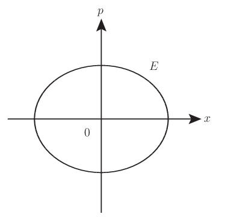

# 物理量の複素化 (相空間での回転)

物理量は古典論であれば実数，量子論ではエルミート演算子として表されるものであった． ところで一方で計算では物理量を恰も複素数であるかのように扱うことがある．

そしてそのような計算は真実味を帯びているような， 単純に計算の便宜と言い切ってよいのかわからないほどに reality を感じることがある． こういった話題を整理することで，実在か否かの境界をより正確なものとしたい．

## 着想と背景

位置 $x$ について次の変換を考えたとする．

\begin{equation} \mathcal{P}_{\theta}: x\mapsto e^{i\theta}x ~~ (\theta\in[0,2\pi)) \end{equation}

特に $\theta=\pi$ のときは次のように空間反転になっている．

\begin{equation} \mathcal{P}: x\mapsto -x \end{equation}

> この主張は実のところ正しくない． 「反転」は変換行列の行列式が $-1$ となるが， ここで述べているのは「回転」であって，その変換行列の行列式は $+1$ となる． その意味でも本稿はまだまだ書きかけに近い．

物理学で対称性を議論するときに，連続的変換に対する対称性なのか， 離散的変換に対する対称性なのかで，趣が変わってくる．

連続であればネーターの定理よろしく，保存量が存在するが， 離散であればそのようなことはなく，パリティが保存するといった事柄に置き換わる．

そして量子論と特殊相対論の要請から導かれる，偉大な破れることのない $\mathcal{CPT}$ 対称性が鎮座する．といったものになっている． 即ちこれらは連続と離散に横たわる別の話だ，といった捉え方である．

今もし $\mathcal{P}_{\theta}$ が任意の $\theta$ について許されるのならば， これは連続的な変換なので，何らかの保存量が存在することになる． しかし位置が複素量となることはおかしな話だ．

よって空間反転のみを考えて思考を切り分ける，といったことをするだろう． 物理量が実であれ，という表し方が変換を制限しようとする例である．

ただ闇雲にこのように制限する考えはよくない．それを以下に述べよう．

## 主題

ニュートンの運動方程式は次のようなものだった．簡単のために一次元の一粒子に限る．

\begin{equation} \dot{p} = F \end{equation}

### 複素座標の導入

我々は $F$ の詳細とは独立に次の複素座標で，ニュートンの運動方程式を考察してみる．

\begin{equation} a := \alpha x + i\beta p ~~ (\forall\alpha,\forall\beta\in\mathbb{C}) \end{equation}

位置 $x$，運動量 $p$ が質点の状態を一意に特定するのに必要な変数であるから， この基底変換は相空間 $\Gamma$ 上の次の変換を意味している．

\begin{equation} \begin{pmatrix} a \\ a^\* \end{pmatrix} := \begin{pmatrix} \alpha & i\beta \\ \alpha^\* & -i\beta^\* \end{pmatrix} \begin{pmatrix} x \\ p \end{pmatrix} \end{equation}

今，こうした新しい座標系で次の変換を考える．

\begin{equation} \mathcal{R}_{\theta}: a\mapsto e^{i\theta}a \end{equation}

これはちょうど元の座標で言えば次の変換を意味している．

\begin{equation} \mathcal{P}_{\theta}: (x,p)\mapsto (e^{i\theta}x, e^{i\theta}p) \end{equation}

この変換だけを見たら，位置や運動量が複素量になったことを意味しており， 違和感を覚えることだろう．

確かに $e^{i\theta}x=x_1+ix_2$ としたとき，虚部 $x_2$ というのが何のことやらわからない．

ところが相空間 $\Gamma$ 上の回転行列を対角化する基底が $(a,a^\*)$ であって， その限りに於いて解釈するのならば，虚部 $x_2$ というのは $(a,a^\*)$ の下で意味を成すとわかる．

今の場合には $x,p$ の両方を一つの複素数で考えて，自由度は共役複素数も考えてつりあい， よって虚部だけ考えるといった問題提起がそれほど自然なことではないとわかる．

敢えて言えば，(適当な $\alpha,\beta$ の下で) 複素数を考えた時点で位置の虚部とは運動量のことで，運動量の実部とは位置のことである．

運動方程式が時間について二階の微分方程式になっていることが，ちょうど上手く複素数という数の性質にあっているということである．

何もおかしなことはないのだ．

### $U(1)$ 不変量の議論

さてすると $\mathcal{P}_{\theta}$ という連続変換に奇妙な点を見出すことはなくなるだろう． $\mathcal{P}_{\theta}$ は同値な $\mathcal{R}_{\theta}$ という連続変換のことなのだから．

加えて $\mathcal{P}_{\theta}$ についての不変量も次のように容易に見つけられる．

\begin{equation} N := |a|^2 = |\alpha|^2x^2 + |\beta|^2p^2 + i(\alpha^\*\beta - \alpha\beta^{\*})xp \end{equation}

### 保存量の議論

$N$ が更に保存量，即ち ニュートンの運動方程式に従った時間発展に対して不変量であるための条件について吟味する．

つまり次を満たす $F,\alpha,\beta$ とは何かである．

\begin{equation} \frac{dN}{dt} = 0 \end{equation}

$p=m\dot{x}$ を用いて左辺を整理すると次を得る．

\begin{equation} \frac{dN}{dt} = 2|\alpha|^2\frac{xp}{m} + 2|\beta|^2pF + i(\alpha^\*\beta - \alpha\beta^{\*})\left(\frac{p^2}{m} + xF\right) \end{equation}

これを解くのに場合分けを以下のように行う．

**$\alpha=\beta=0$ の場合** この場合は $a$ が恒等的に $0$ であるから意味がない．

**$\alpha=0\lor\beta=0$ の場合** 例えば $\alpha=0$ の場合は $F=0$ であり，また $\beta=0$ の場合も $x$ または $p$ が $0$ でないといけないので $F=0$ となる． これらは $F=\dot{p}$ より運動量の保存とより特殊な場合である位置の保存(静止)を意味している．

ここまでの保存量 $N$ は非常に自明で特殊な場合でのエネルギーに他ならない． そして最後に $\alpha,\beta$ が共に $0$ でない場合が残る．

**$\alpha\neq0\land\beta\neq0$ の場合** この場合が最も興味ある場合であるが，評価は注意する必要がある． まず $F$ について解いて次を得る．

\begin{equation} F(\alpha,\beta) = -\frac{p}{m} \frac{|\alpha|^2x - \Im[\alpha^{\*}\beta]p}{|\beta|^2p - \Im[\alpha^{\*}\beta]x} \end{equation}

これから $\dot{p}=F$ を解くことは容易いことではなく，我々は次の二つの特殊な場合を考える．

\begin{eqnarray} F\left(\alpha,\pm|\beta|\alpha\right) &=& -\frac{1}{m}\frac{1}{|\beta|^2}x =: -kx ~~ \left(k := \frac{1}{m}\frac{1}{|\beta|^2}\right) \\ F\left(\alpha,-i\alpha|\beta|\right) &=& -\frac{1}{m}\frac{1}{|\beta|}p =: -\gamma v ~~ \left(\gamma := \frac{1}{|\beta|} \right) \end{eqnarray}

まず前者は $F$ が復元力の場合であるから，これより保存量 $N$ は調和振動子のエネルギー $E$ に比例する量とわかる．

\begin{equation} N \propto E = \frac{p^2}{2m} + \frac{k}{2}x^2 \end{equation}

次に後者は $F$ が抵抗力の場合であるから，散逸系となって，最早，エネルギーは保存しない． つまりこのような場合に保存量 $N$ はエネルギーではなくなり，この場合に $N$ は次のように求められる．

\begin{equation} N = |\alpha|^2(x + |\beta|p)^2 \propto \left(x + \frac{p}{\gamma}\right)^2 \end{equation}

今これに抵抗力 $F=-\gamma v$ を受ける質点の運動方程式を解いた結果を代入すると次のようになる．

\begin{equation} N \propto \left(x_0 + \frac{mv_0}{\gamma}\right)^2 = [x(\infty)]^2 \end{equation}

つまり終端位置の二乗を表す． これは確かに散逸しても残るという意味で質点がすべての時間に亘ってもっている特徴であるから保存量と言える．いくら削っても芯だけは残るような捉え方である．

以上の考察や関連をまとめると次のとおりである．

## コメント

### ニュートンの仮定と複素数の存在意義

位置を複素化して扱うための (少なくとも一つの) 正当化は，相空間 $\Gamma=\mathbb{R}^2$ を同型な $\mathbb{C}$ で議論することである．

この文脈に従うとき，虚数 $i=\sqrt{-1}$ それ自身は何かの物理量の値ではなく， 運動が時間について二階の微分方程式で表されるというニュートンの仮定， 即ち二つの自由度を指定して，はじめて一つの運動が決定するという事柄を表す構造的なものといえる．

こういった非常に重要な物理的な役割を虚数が担う限り，虚構のものとか，数学的なただの道具に過ぎないとかいった考えは捨てるべきであろう．

また従って虚数を観測できないからといって，悲観に暮れる必要はない．そもそも物理量ではなく，構造的なものとして「存在」しているのだから． (実在を問うとき，より深刻なのは空間が果たして連続体なのか，といった事柄で，そちらが根源的な問いかけのはずだ)

### 相空間上の回転対称性と調和振動子

空間反転だけでなく，位相回転の不変量が保存量であることまで対称性を要求すると，それは相空間上の回転対称性の要求に等しい．

そのような軌跡は適当な正準変換の下で円に他ならず，対応する物理系は調和振動子に他ならない． よってまた保存量は調和振動子のエネルギーである．

### 複素座標という見方

複素座標 $(a,a^\*)$ それ自身は複素である限り物理量ではない．位置と運動量の両方を一つで抱えているからである．

しかしだからこそ，位置と運動量の両方の情報を半分ずつ持っている量ともみれる． それが有益なことかは別にして，全く物理的でないものを考えているわけではない．

なおしばしば調和振動子に限って $(a,a^\*)$ が議論できるような論調があるが， これも正確ではないことに注意する． あくまでも複素座標であって，どんなときでも考えることができる代物である．

### 量子論との関連

複素座標 $(a,a^\*)$ や不変量 $N$ は量子論でいうところの消滅・生成演算子そして数演算子に他ならない．これらはしばしば古典的対応物についての言及が省略されることがあるが，決してないわけではない．

特に消滅演算子 $\hat{a}$ はエルミートではないので，物理量ではないといった注意がなされることがあるが，これは「それ自身が何か"一つ"の物理量ではない」という statement がより正確といえよう． 但し量子論では位置と運動量を同時に指定できないという事柄を合わせると，事態はより複雑な受け止め方が必要である．

## 参考

- [力学 (増訂第3版) ランダウ=リフシッツ理論物理学教程](https://amzn.to/2LkNFna)
- [Complex Variables in Classical Hamiltonian Mechanics](http://people.umass.edu/bvs/605_ham.pdf)

