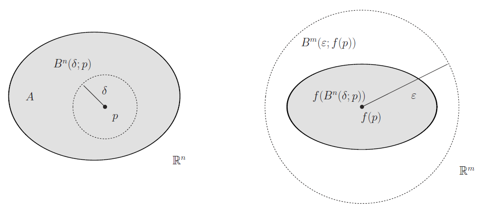
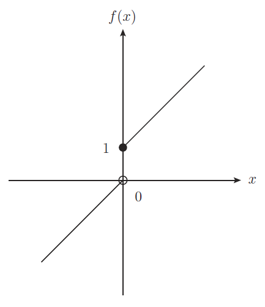
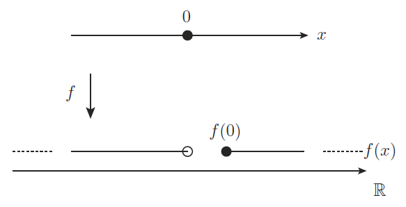
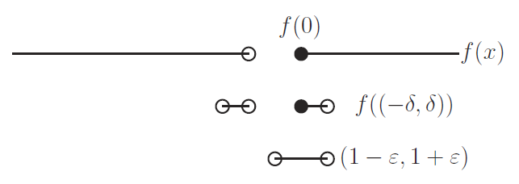

# 連続写像

連続写像の定義は集合だけで書かれた原始的なものなので， 分かりづらかったとしても仕方がない． 連続写像は連続と冠するように連続関数の抽象概念である． このため連続関数という具象的な対象を通して， 「連続」の定式化を振り返ることから始めると良い．

[The Math Relish Journal Volume 1S](https://mathrelish.booth.pm/items/1123647/)

## 着想と背景

連続というのは連結していることのように直感的には想像されるが， 「少しの変化であれば，少ししか変化しないこと」だと考えた方が良い． つまり $\varepsilon$-$\delta$ 論法である．

$\varepsilon$-$\delta$ 論法は距離の不等式関係であるが， ここから上手く開集合の包含関係へと整理していくことで， 連続写像の適切な定義へと到達することになる．

### 連続関数の定義と距離空間上の連続写像への一般化

実数上の連続関数の定義とは次のように $\varepsilon$-$\delta$ 論法で与えられるものだった．

定義域を $A\subset\mathbb{R}$ とする関数 $f:A\rightarrow\mathbb{R}$ を考える． 任意の $\varepsilon > 0$ に対して，ある $\delta > 0$ が存在して， 次が成り立つならば，関数 $f$ は点 $p$ で連続であるという． そして定義域 $A$ 全体で連続ならば，$f$ は連続関数であるという．

$$ \|x-p\|_2 < \delta \Rightarrow \|f(x) - f(p)\|_2 < \varepsilon $$

この定義を二つの距離空間 $(X,d_X),(Y,d_Y)$ の間へと一般化することにはあまり飛躍はない． それは次のように与えられる．

定義域を $A\subset X$ とする写像 $f:A\rightarrow Y$ を考える． 任意の $\varepsilon > 0$ に対して，ある $\delta > 0$ が存在して， 次が成り立つならば，写像 $f$ は点 $p$ で連続であるという． そして定義域 $A$ 全体で連続ならば，$f$ は連続写像であるという．

$$ d_X(x,p) < \delta \Rightarrow d_Y(f(x),f(p)) < \varepsilon $$

ここまでの抽象化であれば，距離関数が実数値を吐き出すので， 具象性がまだあって抵抗を感じることはあまりないだろう．

### 距離空間上の連続写像についての定義再考

連続関数の定義に用いた諸々の概念は， 位相空間を定義するのに用いた概念の特殊な場合であるから， 連続関数もまた位相空間論に関する一般の場合に拡張できる．

このために距離空間での連続写像の定義を次のように言い換えておく．

定義域を $A\subset X$ とする写像 $f:A\rightarrow Y$ を考える． 次が成り立つならば，写像 $f$ は点 $p$ で連続であるという． そして定義域 $A$ 全体で連続ならば，$f$ は連続写像であるという．

$$ f(U_{\delta}(p)) \subset U_{\varepsilon}(f(p)) $$

ここに $U_a$ は $a$-近傍とよぶ量で開球体の一般化であり， また位相空間での開近傍の距離空間 $(S,d)$ についての具象概念である．

$$ U_a(p) := \{ x\in S ~|~ d(x,p) < a \} $$

上記の定義をユークリッド空間の場合に図示すると下図のようになる．

上図の右の点線で囲まれた開球体 $B^m(\varepsilon;f(p))$ を定めると (どんなに小さくてもよい)， 像がそこに入るような開球体 $B^n(\delta;p)$ を左で見つけることができる． そうでないとき不連続だとなる． ここで「正にそうだ」というイメージが湧かない場合は後の例を参照するとよい．

距離空間での連続写像の定義として二通りの定義を述べたが， これらが同値であることは次のとおり．

$f(U_{\delta}(p)) \subset U_{\varepsilon}(f(p))$ は次に同値ある．

$$ (\forall x \in A)(x\in f(U_{\delta}(p)) \Rightarrow f(x)\in U_{\varepsilon}(f(p)) $$

単に $\subset$ を $\in$ で言い直しただけである． そして $\varepsilon$-近傍の定義に照らして，また言い直せば次の同値な命題を得る．

$$ (\forall x \in A)(d_X(x,p) < \delta \Rightarrow d_Y(f(x),f(p)) < \varepsilon) $$

これは所望の命題である．■

### 位相空間への拡張

$f(U_{\delta}(p)) \subset U_{\varepsilon}(f(p))$ は $f$ が連続写像であるための定義だと述べた． ここまでくると特定の距離関数に依存しない記述になっている． 何かに依存しないということは，それよりも基本的な概念・構造があることを示唆している． それは位相空間での連続写像の定義な訳で，もう殆どその適切な定義に近づいている．

位相空間での連続写像の定義は $f$ の逆像 $f^{-1}$ で定義されている． これは開近傍を便りに開集合へと開花していく最後のステップとなる． その拡張の下地となる定理が連続写像と開集合の関係を述べる次の定理である．

二つの距離空間 $(X,d_X),(Y,d_Y)$ の間の任意の写像 $f: X \rightarrow Y$ について， 次の二つは同値な命題である．

1\. 写像 $f$ は連続写像である． 2. $Y$ の任意の開集合 $U$に対し，逆像 $f^{-1}(U)$ は $X$ の開集合である．

**1$\Rightarrow$2について** $Y$ の任意の開集合 $U$ をとる． そして逆像の任意の点 $x\in f^{-1}(U)$ をとる． つまりはこのとき $f(x)\in U$ である．

$U$ は $Y$ の開集合であったから，次を満たす $\varepsilon$-近傍がとれる．

$$ U_{\varepsilon}(f(x)) \subset U $$

さて $f$ は連続写像だったから，上式を満たす $\varepsilon$ に対して， 次を満たすある $\delta$ が存在する．

$$ f(U_{\delta}(x)) \subset U_{\varepsilon}(f(x)) $$

よってこれまでに得た二つの包含関係を連立させて次を得る．

$$ f(U_{\delta}(x)) \subset U $$

これを逆像で書けば，$U_{\delta}(x) \subset f^{-1}(U)$ である． こうして得た包含関係は $f^{-1}(U)$ が $X$ の開集合であることを述べている．

**2$\Rightarrow$1について** $\forall x\in X,~ \forall\varepsilon > 0$ について次の $U$ をとる．

$$ U := U_{\varepsilon}(f(x)) $$

$\varepsilon$-近傍は開集合だから，こうして定義した $U$ は開集合である． このとき $f(x)\in U$ より $x\in f^{-1}(U)$ である．

ところで前提から逆像 $f^{-1}(U)$ もまた開集合であるから， 次を満たすある $\delta$ が存在する．

$$ U_{\delta}(x) \subset f^{-1}(U) $$

つまりは $f(U_{\delta}(x)) \subset U$ である． こうして得た包含関係は $f$ が点 $x$ で連続あることを述べている． 点 $x$ の選び方は任意だったから，$f$ は連続写像である．

以上によって必要十分であることが示された．■

以上を持ってして，位相空間での連続写像の定義として次がよいとわかる．

## 定義

二つの位相空間 $(S,\mathfrak{O}),(S^{\prime},\mathfrak{O}^{\prime})$ の間の写像 $f:S\rightarrow S^{\prime}$ が連続写像であるとは， $S^{\prime}$ の任意の開集合 $U^{\prime}$ の逆像 $f^{-1}(U^{\prime})$ が $S$ の開集合となることである． 即ち次が成り立つとき，$f:S\rightarrow S^{\prime}$ は連続であるとか，連続写像であるという．

$$ (\forall U)(U\in\mathfrak{O}^{\prime}\Rightarrow f^{-1}(U)\in\mathfrak{O}) $$

## コメント

### 連結性について

連続性と連結性は密接な関係を有している． 本項目では連結性については数学的な意味合いでは述べておらず，直感的な意味合いしかない． 「連結」という形容は幾何的な特徴をよく体現しており，単なる形容とするには惜しい． 実際，感覚的な程度を超えて，整然とした数学の世界で定義がなされる． それは連続写像とはまた違った位相空間の側面を描くことになる．

### 微分について

連続写像の定義に於いて，「$S^{\prime}$ の任意の開集合 $U^{\prime}$」の文言を「任意に小さな開集合」と読みかえることは，距離空間であれば半径が小さな開球体に含まれる開集合として意味を成す．

しかし一方で一般の抽象的な位相空間に於いては， 「任意に小さな開集合」という言葉が意味を成すとは限らない．

つまり $\varepsilon$-$\delta$ 論法に表れる局所的な議論や，その直接の類推から来る何らかの局所的な構造を持った対象 (例えば微分) の議論は，位相空間論ではそもそも抽象化されて削ぎ落とされていることに注意する．

連続性は上記の通り位相空間までで抽象化が完了したが， 微分のような概念は位相構造だけでは抽象化を果たせない． そのような抽象化を果たすことで微分可能多様体の定義へと到達することになる．

### 逆像の利便性

連続写像の定義では，順像ではなく逆像を用いている． このような定義は論証が機械的なものとなる利便性がある． 逆像は順像の場合と違って，「基本的な集合演算で等号が成立する」という， 良い性質を持っているからである．

これから「連続」という素朴な意味は，抽象的な論証の中では意味を失って， 時には邪魔にさえなる．

つまり「連続写像の定義を満たしているか」という論証の戦略を立てるとき， 素朴な意味はいつも期待できないし，途切れがないという素朴な想像からはかけ離れるのである．

そこで論証に役立つ機械的な演算に頼ることになる訳で，連続写像の定義に限らず， 多少の難読化を犠牲にしても予め良い定義を採用しておくべきであろう．

## 例

### 開球体を用いた連続の定義の確認

$\varepsilon$-$\delta$ 論法による解析的な連続の定義が， 開集合を用いた場合にはどのように連続であることを識別しているかを， 原点で不連続な次の簡単な不連続関数を例にとって見る．

$$ f(x) := \begin{cases} x+1 & (x\geq 0) \\ x & (x<0) \end{cases} $$

この関数を図にすると下図の通りであって，目で見て原点で不連続だとわかる．

開集合である開球体では，以下のようにして不連続性が捉えられる． ここに開球体は一次元であるから開区間となる．

まず見慣れた上図を下図のように見直す．

そしてこの図で点 $f(0) = 1$ を中心とする半径 $\varepsilon$ 未満の開球体， 即ち開区間 $(1-\varepsilon,1+\varepsilon)$ を考える． このとき関数 $f$ の定義から $x\geq 0$ に関する $f(x)$ は特に注意することはないが， $x < 0$ では $f(x) = x$ だから，$1$ 以下の $\varepsilon$ を選ぶとき，$x < 0$ なる $f(x)$ の元は落とされる．

つまり式で書けば次の通り．

$$ (1-\varepsilon,1+\varepsilon) \cap f(\mathbb{R}) = [1,1+\varepsilon) ~~ (\varepsilon \leq 1) $$

さて一方で原像の原点を中心とする半径 $\delta$ の開区間 $(-\delta,\delta)$ を考えるとき，これの $f$ による像は次のような集合である．

$$ f((-\delta,\delta)) = (-\delta,0) \cup [1,1+\delta) $$

この集合を特徴づける非負実数 $\delta$ をどのように選ぼうとも， 途切れた部分 $(-\delta,0)$ が尾を引いて， どうやっても $[1,1+\varepsilon)$ の中に含ませることができない． その様子は下図のとおり．

つまり原点に於いて，任意の $\varepsilon$ に対して次を満足する $\delta$ は存在しない．

$$ f(B^1(\delta;0)) \subset B^1(\varepsilon;f(0)) $$

よって開球体を用いた方法でも，原点では$f$ は連続ではないと判別できた．

### 連続写像は一般に逆写像をもたない

連続写像の定義には単射性や全射性が仮定されていない． つまり連続写像は一般には逆写像をもたない．

そのような手近な例は下図に示すような定値写像である．

一点に潰れてしまうので，$\varepsilon$-近傍ですべて包含できることが自明にわかる． つまり連続写像である．

しかし全射ではあるが単射ではない． よって逆写像をもたない連続写像だとわかる．

## 参考

- [位相への30講 (数学30講シリーズ)](https://amzn.to/2xXqPiD)
- [はじめての集合と位相](https://amzn.to/2sTBx3T)
- [はじめよう位相空間](https://amzn.to/2MeUwPt)
- [解いてみよう位相空間〔改訂版〕](https://amzn.to/2l1Mih7)
- [集合・位相入門](https://amzn.to/2sU95yL)
- [物理学者のためのトポロジーと幾何学 (ADVANCED PHYSICS LIBRARY)](https://amzn.to/2tAgrHY)

