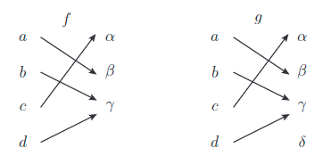
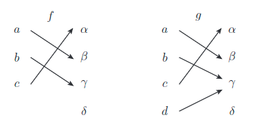
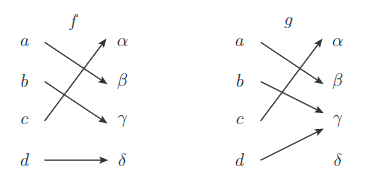
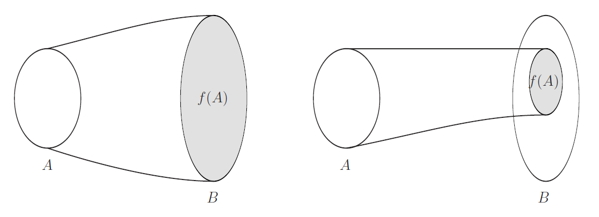

# 対応と写像

集合が何であるかが適切に定義されたのならば， 集合やその元の間にまつわる関係性を記述することで， 価値ある対象を表現できる． その基礎となるのが対応と写像である．

[The Math Relish Journal Volume 1S](https://mathrelish.booth.pm/items/1123647/)

## 着想と背景

対応と写像は基本的に定義を述べていくだけのところがあるが， その中で特に後々覚えておくとよいことは次のようなことである．

- 自然な定義域
- well-defined，ill-defined
- 中への写像
- 逆写像と逆像の違い

これらは基本的過ぎるにもかかわらず，独特な留意事項を持っており， 知っているといないとでは，テキストの読解や議論の中で差が出る．

## 定義

はじめに対応 $\Gamma$ と写像 $f$ の違いを端的に述べておくと次のようになる．

$$ \begin{eqnarray} \Gamma &:& \textrm{Element} \rightarrow \textrm{Set} \\ f &:& \textrm{Element} \rightarrow \textrm{Singleton} \end{eqnarray} $$

ここにシングルトン ($\textrm{Singleton}$) とは要素数が $1$ の集合のことである．つまり写像は対応の特別なものである．一方でシングルトンとそれがもつ要素とは必ず一意に定まって (まだ全単射を定義していないのでよろしくないのだが) 全単射に結びつく．そこでシングルトンという集合ではなく，次のように要素どうしの結びつきとして再定義したものを写像というのである．

$$ \begin{eqnarray} f : \textrm{Element} \mapsto \textrm{Element} \end{eqnarray} $$

以上が対応と写像の違いである．以下にそれらに関係する諸々の用語を定義していく．

### 対応

二つの集合 $A,B$ があるとき，或る規則 $\Gamma$ によって，集合 $A$ の任意の元 $a$ のそれぞれに対して，$B$ の部分集合 $\Gamma(a)$ (とかく) が定められるとき，規則 $\Gamma$ を対応とよんで $\Gamma:A\rightarrow B$ とかく．

そして $\Gamma(a)$ を $a$ による対応 $\Gamma$ の像 $\Gamma(a)$とよぶ．

また対応 $\Gamma:A\rightarrow B$ が定義される集合 $A,B$ のことをそれぞれ始集合，終集合とよぶ．

始集合の中で特に $\Gamma(a)\neq\emptyset$ なる $A$ の元でできる部分集合を定義域といい， $A$ のすべての元 $a$ の像 $\Gamma(a)$ の全体からなる $B$ の部分集合を値域という．

　

対応 $\Gamma:A\rightarrow B$ があったとき，$B$ の元 $b$ に対して $b\in \Gamma(a)$ となる $A$ の元全体からなる $A$ の部分集合を $g(b)$ とかけば，これによって対応 $g:B\rightarrow A$ が定まったことになる． この対応 $g$ を対応 $\Gamma$ の逆対応といい，$\Gamma^{-1}$ とかく．

$$ \Gamma^{-1}(b) := \{ a\in A ~|~ b \in \Gamma(a) \subset B \} $$

また $\Gamma^{-1}(b)$ で定まる $A$ の部分集合を $f$ による $b$ の逆像という．

対応の定義に表れる周辺の概念には別称が多い． それは次のとおりである．

| 名称 | 別称 |
| :-- | :-- |
| 像 | 順像 |
| 逆像 | 原像，引き戻し |
| 始集合 | 始域，域，領域 |
| 終集合 | 終域，余域 |

### 写像

対応 $\Gamma:A\rightarrow B$ の元 $a(\in A)$ による像 $\Gamma(a)$ が，唯一つの元からなる集合 $\{b\}$ のとき，対応$\Gamma$ を特に写像とよんで，$\Gamma(a)=\{b\}$ を $\Gamma(a)=b$ とかく．写像 $\Gamma$ はふつう $f$ の記号が用いられる．

写像 $f:A\rightarrow B$ が，特にすべての元 $a$ について $f(a)=a$ である写像を恒等写像といい $id_A$ または定義域が明らかな場合には単に $id.$ とかく．

二つの写像 $f_1:A_1\rightarrow B_1$ と $f_2:A_2\rightarrow B_2$ が等しいとは，$A_1=A_2$ 且つ $B_1=B_2$ であり，$A_1$ の任意の元 $a$ に対して$f_1(a)=f_2(a)$ が成り立つことをいい，$f_1=f_2$ とかく．

写像は対応の特別な場合なので，対応での像や逆像と同様に，写像でも改めて像と逆像を定義しておく．

写像 $f:A\rightarrow B$ があったとき元 $a(\in A)$ の像 $f(a)(\in B)$ が考えられるが，写像に関しては部分集合 $P(\subset A)$ によって定まる次の $B$ の部分集合を $f$ による $P$ の像とよぶ．

$$ f(P) := \{ f(a) ~|~ a\in P\subset A \} $$

同様に部分集合 $Q(\subset B)$ によって定まる次の $A$ の部分集合を $f$ による $Q$ の逆像とよぶ．

$$ f^{-1}(Q) := \{ a ~|~ f(a)\in Q\subset B \} $$

写像を考える上で全射 (surjection)，単射 (injection)，全単射 (bijection) の三種の写像を考えることは非常に有用である．写像がこれらのうちどの性質を持っているかで数学のいろいろな概念が構成されるのが殆どだからである．それ故に同じ意味であるにもかかわらず，いくつか別称が存在して度々混乱する． 予め整理しておくとそれらは次の表のとおりである．

| 名称 | 別称 |
| :-- | :-- |
| 全射 | 上への写像 |
| 単射 | 一対一の写像 |
| 全単射 | 上への一対一の写像 |

#### 全射と単射

写像 $f:A\rightarrow B$ が全射であるとは，次の同値な条件が成り立つことをいう．

$$ f(A)=B \Leftrightarrow (\forall b\in B)(f^{-1}(b)\neq\emptyset) \Leftrightarrow (\exists a\in A,\forall b\in B)(f(a)=b) $$

上図で $f$ は全射であり，$g$ は全射ではない． $\delta$ の逆像が $g^{-1}(\delta)=\emptyset$ だからである．

写像 $f_{in}:A\rightarrow B$ が単射であるとは，次の同値な条件が成り立つことをいう．

$$ (\forall a, \forall a^{\prime}\in A)(a\neq a^{\prime}\Rightarrow f(a)\neq f(a^{\prime})) \Leftrightarrow (\forall a, \forall a^{\prime}\in A)(f(a)= f(a^{\prime})\Rightarrow a=a^{\prime}) $$

上図で $f$ は単射であり，$g$ は単射ではない． $b\neq d$ にもかかわらず，$g(b)=g(d)=\gamma$ だからである．

写像の合成を考えると全射と単射について次が成り立つ．

写像の合成に関して次が成立する． - $g\circ f$ が全射ならば，$f$ に関わらず $g$ は全射である． - $g\circ f$ が単射ならば，$g$ に関わらず $f$ 単射である．

証明のために $f:A\rightarrow B$ および $g:B\rightarrow C$ とする．

まず最初の命題は次の通り． 任意の $c\in C$ をとるとき，$g\circ f$ が全射であるから，$c=(g\circ f)(a)$ を満たす元 $a$ が $A$ に存在する． このとき $b:=f(a)\in B$ 且つ $c=g(b)$ だから，$c\in g(B)$ である． よって $C\subset f(B)$ とわかる． これは $f$ が $C$ への全射であることを表している．

次に二つ目の命題は次の通り． 任意の $a_1,a_2\in A$ に対して $f(a_1)=f(a_2)$ であるならば $a_1=a_2$ であることを示せばよい． $f(a_1)=f(a_2)$ であることより $g(f(a_1))=g(f(a_2))$ であるから，$(g\circ f)(a_1)=(g\circ f)(a_2)$ を得る． 前提より $g\circ f$ は単射であるから $a_1=a_2$ である．よって示せた．■

#### 全単射と逆写像

写像 $f_{bi}:A\rightarrow B$ が全単射であるとは，全射且つ単射であることをいう．

上図で $f$ は全単射であり，$g$ は全単射ではない．

全単射の概念を導入することで逆写像の概念に進める．

写像 $f:A\rightarrow B$ があって，すべての $B$ の元 $b$ について，$b=f(a)$ を満たす唯一つの $A$ の元 $a$ が対応するならば，その対応 $g$ を写像 $f$ の逆写像とよんで $f^{-1}$ とかく．

逆写像の定義から，写像 $f$ が全単射となることと逆写像 $f^{-1}$ が存在することとは同値である． また $f^{-1}$ が存在するならば全単射な写像である．

よって全単射な写像 $f:A\rightarrow B$ に対して次が従う．

$$ f^{-1}\circ f = id_A ~\land~ f\circ f^{-1} = id_B $$

ここまでで以下の事柄を示せる．

任意の全単射な写像 $f:A\rightarrow B$ には，唯一つの逆写像が存在する．

逆写像が $g,h$ と二つ存在したとする．このとき任意の $b\in B$ に対して次を得る．

$$ g(b) = g((f\circ h)(b)) = (g\circ f)h(b) = h(b) $$

従って $g=h$ なので一意である．■

\- 集合 $X$ から集合 $Y$ への写像の集合を $F$ - 集合 $Y$ から集合 $X$ への写像の集合を $G$

とするとき，次の関係が成り立つ．

1\. 単射 $F\ni f$ は単射 $\Leftarrow$ $(\exists g\in G)(g\circ f=id_X)$

2\. 全射 $F\ni f$ は全射 $\Rightarrow$ $(\exists g\in G)(f\circ g=id_Y)$

3\. 全単射 $F\ni f$ は全単射 $\Leftrightarrow$ $(\exists g\in G)(g\circ f=id_X\land f\circ g=id_Y)$

1 を示す．

$$ f(x_1) = f(x_2) \Rightarrow g(f(x_1)) = g(f(x_2)) \Leftrightarrow (g\circ f)(x_1)=(g\circ f)(x_2) $$

より，$g\circ f=id_X$ なる写像 $g$ が存在すれば，$x_1=x_2$ で写像 $f$ は単射である．

2 を示す．

$Y\ni\forall y$ に対して，$f(g(y)) = (f\circ g)(y)$を考える． 今，$f\circ g=id_Y$ なる $g$ が任意の $y\in Y$ に対して存在するならば，$f(g(y)) = id_Y(y) = y$ である．

ここで，$g(y)\in X$ より，任意の $y\in Y$ に対して $X$ への像 $g(y)$ が存在する． そして，$g(y)$ は $f$ によって $y$ へと写される． この像 $y$ は集合 $Y$ の任意の元に他ならない． よって写像 $f$ は全射である．

3 を示す．

$[\Rightarrow]$ の成立は次の通り．

$f$ が全単射であるならば，逆写像 $f^{-1}\in G$ が存在する． 故に $f^{-1}\circ f=id_X$ 且つ，$f\circ f^{-1}=id_Y$ なる $g=f^{-1}$ が存在する．

$[\Leftarrow]$の成立は次の通り．

$(\exists g\in G)(g\circ f=id_X)$ ならば 1 より写像 $f$ は単射である． また $(\exists g\in G)(f\circ g=id_Y)$ならば 2 より写像 $f$ は全射である． 故に写像 $f$ は全単射である．

以上にして示された．■

## コメント

### 自然な定義域

写像の定義から，写像に対しては始集合と定義域は一致するが， 終集合と値域は一般に一致しない． ここで写像に適切で過不足がない定義域を考えているが，これを自然な定義域という．

例えば $f(x) := \sqrt{x}$ なる実関数の自然な定義域は次の集合である．

$$ \mathbb{R}_{\geq 0} := \{x\in\mathbb{R} ~|~ x \geq 0\} $$

このような了解は至って当然の要求でもあるので， 写像の値域は自然な定義域を仮定したときの値域を特に断りなく意味することが普通である．

### 写像にまつわる well-defined，ill-defined

何らかの文脈の中で，写像と定義すべきある対象 $f:A\rightarrow B$ があったとき， チェックすべき項目は写像の定義から次の二点である．

- **存在性** 任意の $a\in A$ に対して，$f(a)$ が $B$ に存在するか？
- **一意性** 任意の $a\in A$ に対して，$f(a)$ は $B$ の元として唯一つに定まるか？

$f:\mathbb{R}\rightarrow\mathbb{R}$ に対して，ill-defined な例を挙げる．

$$ f(x) := \frac{1}{x} $$

これは ill-defined である． 何故ならば $f(0)$ は $\mathbb{R}$の元ではない． つまり存在性の条件を満たしていない．

### 上への写像，中への写像

「上への写像 (全射)」に対して，紛らわしい言葉として「中への写像」という言葉がある． これは「$f(A)\subset B$ を満たす写像」のことをいい，その中でも特に「上への写像でない写像」を「厳密に中への写像」という．

つまり「中への写像」は特別な場合として全射を含む．

また一方で「厳密に」の部分が面倒で単に「中への写像」の意味で用いることがあって， 著者によってどちらの意味で用いられているのか注意を要する汚染されやすい用語である． それ故に使用が推奨されないか，そもそも古い用語のためあまり使われない用語でもある．

厳密に中への写像とは，全射でない写像をいうので， 「『単射』または『全射でも単射でもない写像』」とわかる．

ところで上への写像とか中への写像という，「上」「中」というのは上中下のような意味合いは持っていない． 下図は左が上への写像で右が中への写像である．

これを見ると中への写像の「中」の意味が了解されよう． 一方で「上」の意味は何か表面上へまんべんなく降り注ぐような意味合いと推測される． 事実，上への写像と中への写像はそれぞれ onto-mapping と into-mapping の訳語であり， 今の推測は正しい．

| 名称 | 別称 | 原語 |
| :-- | :-- | :-- |
| 全射 | 上への写像 | onto-mapping |
| $f(A)\subset B$ を満たす写像 | 中への写像 | into-mapping |
| 全射でない中への写像 | 厳密に中への写像 | strictly-into-mapping |

このようなイメージを持つことで，全射をときに「上への写像」と呼びたくなるときがある． そしてその延長で的を絞るイメージが優先されるときに into な言い方をしたくなるときがある． 加えて言うならば onto/into を対比して呼びたい場合に，strictly を文脈から省略したくなることもある． 正にちょっとしたことだが，知っていれば，なおイメージしやすくなるものである．

### 単射と線型写像

ある写像 $f$ が単射であることを示す際に， もし $f$ が線型写像であれば零元が零元に写ることを示せばよい．

$$ f(x) = 0 \Rightarrow x = 0 $$

何故ならば任意の $x_1,x_2$ について $f(x_1)=f(x_2)$ ならば $x_1=x_2$ であることが単射であることだった．

ここで $f$ が線型写像であることを用いると，$f(x_1)=f(x_2)$ ならば $f(x_1-x_2)=0$ が従う．

よって後は $f(x) = 0 \Rightarrow x = 0$ であることさえ真であれば， $x:=x_1-x_2$ なる場合を考えて $x_1-x_2=0$，即ち $x_1=x_2$ を得る．

### 逆対応と逆写像の違いに見る逆像の緊密な関係

逆対応 $\Gamma^{-1}$ と逆写像 $f^{-1}$ は名前がよく似ている． しかも同じ記号 ${\bullet}^{-1}$ があてがわれる． これが二つの間に緊密な関係を生むことになる． どっちのことを言っているのか，と．

もちろん，仮に対応と写像で同じ記号 $f$ を使用しても， これは「逆」でないので割と想像しやすく，文脈であまり間違えることがない．

加えて数学以外のテキストでは ${\bullet}^{-1}$ という記号を見ることは殆どない． 見ているとしたら代数的な意味の ${\bullet}^{-1}$ か逆写像であろう．

一方で数学のテキストでは，思いの外，逆対応がよく出てくる． しかも逆対応はとても基本的なものなので，専門書では説明が省略されても不思議ではない． そこで不幸が起こってしまう．${\bullet}^{-1}$ は逆写像に決まっている，と．

対応 $\Gamma$ の定義から $a\in\Gamma^{-1}(b)$ ならば $b\in\Gamma(a)$ である．実に当たり前のことだ． また $(\Gamma^{-1})^{-1} = \Gamma$ で，逆写像と同じ式を満たす． 明らかなことではあるが，何故ならば次の通り．

$$ \begin{eqnarray} b &\in& (\Gamma^{-1})^{-1}(a) \\ \Leftrightarrow a &\ni& \Gamma^{-1}(b) \\ \Leftrightarrow b &\in& \Gamma(a) \end{eqnarray} $$

しかしここまでの言い回しを写像の合成のように， $\Gamma\circ\Gamma^{-1}=id.$ などと捉えてはいないことに注意する． $\in$ の向きも変わっており，つまらない註釈[1](#fn-580-pullback)に過ぎないが，ここで不幸が生じうるのである．

例えば次の対応 $\Gamma:\mathbb{R}\rightarrow\mathbb{C}$ を考える．

$$ \Gamma(a) := \{ b \in\mathbb{C} ~|~ b = e^{2\pi i a} \} $$

このとき $\Gamma^{-1}(1)=\mathbb{Z}$ である． そして $3\in\Gamma^{-1}(1)$ に対して，$1\in\Gamma(3)$ である． しかし $\Gamma^{-1}(1)\neq 3$ である． 両辺はそもそも集合と元で比較対象が異なる． $\Gamma^{-1}(\Gamma(3))$ としたところで $\Gamma^{-1}$ がとるべき引数は元であって， $\Gamma(3)=\{1\}$ のような集合ではないということからも不適切なことがわかる．

### 逆像の優位性

次の命題は今後あらゆる場面で基本となるものである． それらは暗にそして無意識に用いられるほど常用される．

一般の写像 $f:A\rightarrow B$ の像に対して次が成立する． 但し $P,P_1,P_2\subset A$ である．

$$ \begin{eqnarray} P_1 \subset P_2 &\Rightarrow& f(P_1) \subset f(P_2) \\ f(P_1 \cup P_2) &=& f(P_1) \cup f(P_2) \\ f(P_1 \cap P_2) &\subset& f(P_1) \cap f(P_2) \\ f(P_1\setminus P_2) &\supset& f(P_1) \setminus f(P_2) \end{eqnarray} $$

また逆像に対しては次が成立する．但し $Q,Q_1,Q_2\subset B$ である．

$$ \begin{eqnarray} Q_1 \subset Q_2 &\Rightarrow& f^{-1}(Q_1) \subset f^{-1}(Q_2) \\ f^{-1}(Q_1 \cup Q_2) &=& f^{-1}(Q_1) \cup f^{-1}(Q_2) \\ f^{-1}(Q_1 \cap Q_2) &=& f^{-1}(Q_1) \cap f^{-1}(Q_2) \\ f^{-1}(Q_1\setminus Q_2) &=& f^{-1}(Q_1) \setminus f^{-1}(Q_2) \end{eqnarray} $$

像と逆像に対しては次が成立する．

$$ \begin{eqnarray} f^{-1}(f(P)) &\supset& P \\ f(f^{-1}(Q)) &\subset& Q \end{eqnarray} $$

以下，順に示していく．

**$P_1 \subset P_2 \Rightarrow f(P_1) \subset f(P_2)$ と $Q_1 \subset Q_2 \Rightarrow f^{-1}(Q_1) \subset f^{-1}(Q_2)$ について**

任意の $b\in f(P_1)$ に対して $b=f(a)$ を満たす元 $a$ が $P_1$ に存在する． 今，$P_1 \subset P_2$ であるから $a\in P_1\subset P_2$，即ち $a\subset P_2$ が従う．よって $b=f(a)\in f(P_2)$ である． 故に $P_1 \subset P_2 \Rightarrow f(P_1) \subset f(P_2)$ である． $Q_1 \subset Q_2 \Rightarrow f^{-1}(Q_1) \subset f^{-1}(Q_2)$ の成立についても全く同様である．

**$f(P_1 \cup P_2) = f(P_1) \cup f(P_2)$ と $f^{-1}(Q_1 \cup Q_2) = f^{-1}(Q_1) \cup f^{-1}(Q_2)$ について**

任意の $b\in f(P_1 \cup P_2)$ に対して $b=f(a)$ を満たす元 $a$ が $P_1\cup P_2$ に存在する． このとき $a\in P_1$ または $a\in P_2$ である． もし $a\in P_1$ ならば $b=f(a)\in f(P_1)$ であり，$a\in P_2$ ならば $b=f(a)\in f(P_2)$ である． よって $f(P_1 \cup P_2) \subset f(P_1) \cup f(P_2)$ である．

また一方で $P_1\subset P_1\cup P_2$ なので既に示した命題から $f(P_1)\subset f(P_1\cup P_2)$ が従う． 同様に $f(P_2)\subset f(P_1\cup P_2)$ が従う． よって $f(P_1) \cup f(P_2) \subset f(P_1 \cup P_2)$ である． 故に $f(P_1 \cup P_2) = f(P_1) \cup f(P_2)$ である． $f^{-1}(Q_1 \cup Q_2) = f^{-1}(Q_1) \cup f^{-1}(Q_2)$ の成立についても全く同様である．

**$f(P_1 \cap P_2) \subset f(P_1) \cap f(P_2)$ と $f^{-1}(Q_1 \cap Q_2) = f^{-1}(Q_1) \cap f^{-1}(Q_2)$ について**

$S_1\cap S_2\subset S_1$ および，$(S_1\supset S_3)\land (S_2\supset S_3)\Rightarrow S_1\cap S_2\supset S_3$ を用いる． 即ち $P_1\cap P_2\subset P_1$ 且つ $P_1\cap P_2\subset P_2$ なので，先に示した命題から $f(P_1\cap P_2)\subset f(P_1)$ 且つ $f(P_1\cap P_2)\subset f(P_2)$ を得て，よって $f(P_1\cap P_2)\subset f(P_1)\cap f(P_2)$ を得る． $f^{-1}$ についても同様であるが逆像の場合には次にように更に逆も成り立つ．

任意の $a\in f^{-1}(Q_1)\cap f(Q_2)$ に対して，$a\in f^{-1}(Q_1)$ 且つ $a\in f^{-1}(Q_2)$ なので， $f(a)\in Q_1$ 且つ $f(a)\in Q_2$ である． 即ち $f(a)\in Q_1\cap Q_2$ である．これはつまり逆像の定義から $a\in f^{-1}(Q_1\cap Q_2)$ である． よって $f^{-1}(Q_1 \cap Q_2) \supset f^{-1}(Q_1) \cap f^{-1}(Q_2)$ である． 故に以上から $f^{-1}(Q_1 \cap Q_2) = f^{-1}(Q_1) \cap f^{-1}(Q_2)$ である．

**$f(P_1\setminus P_2) \supset f(P_1) \setminus f(P_2)$ と $f^{-1}(Q_1\setminus Q_2) = f^{-1}(Q_1) \setminus f^{-1}(Q_2)$ について**

任意の $b\in f(P_1) \setminus f(P_2)$ は $b\in f(P_1)$ 且つ $b\notin f(P_2)$ なる元である． このような元 $b$ に対して $b=f(a)$ を満足する元 $a$ が集合 $P_1$ に存在する． この $a$ は，$b\notin f(P_2)$ より $a\notin P_2$ であるから，$a\in P_1\setminus P_2$ である． よって $b\in f(P_1\setminus P_2)$ なので．$f(P_1\setminus P_2) \supset f(P_1) \setminus f(P_2)$ を得る． $f^{-1}$ についても同様であるが逆像の場合には次にように更に逆も成り立つ．

任意の $a\in f^{-1}(Q_1\setminus Q_2)$ に対して $b=f(a)$ は $Q_1\setminus Q_2$ に属している． 即ち $b\in Q_1$ 且つ $b\notin Q_2$ であるから，$a\in f^{-1}(Q_1)$ 且つ $a\notin f^{-1}(Q_2)$ である． これはつまり $a\in f^{-1}(Q_1) \setminus f^{-1}(Q_2)$ を意味するから，$f^{-1}(Q_1\setminus Q_2) \subset f^{-1}(Q_1) \setminus f^{-1}(Q_2)$ を得る． 故に $f^{-1}(Q_1\setminus Q_2) = f^{-1}(Q_1) \setminus f^{-1}(Q_2)$ である．

**$f^{-1}(f(P)) \supset P$ について** 任意の $a\in P$ に対して $f(a)\in f(P)$ である． これは逆像の定義から $a\in f^{-1}(f(P))$ が従う． よって $f^{-1}(f(P)) \supset P$ である．

**$f(f^{-1}(Q)) \subset Q$ について** 任意の $b\in f(f^{-1}(Q))$ に対して $b=f(a)$ を満たす元 $a$ が $f^{-1}(Q)$ に存在する． $a\in f^{-1}(Q)$ であるから定義から $f(a)\in Q$ である． これはつまり $b\in Q$ であることを言っているから，故に $f(f^{-1}(Q)) \subset Q$ である．

以上によってすべての場合が示された．■

逆像に関しては等号が成立することが著しい． このためしばしば定義の中で像ではなく逆像が基礎に置かれることが多い． このとき緊密な関係でも注意したように逆写像が存在するということは意味せず， 寧ろ上記に示した命題の性質を使いたいからだと考えても吝かではない．

## 例

### 対応，始集合，終集合，定義域，値域，像，逆像

$$ \begin{eqnarray} A &=& \{2,3,4,5\} \\ B &=& \{3,5,6,7,9\} \end{eqnarray} $$

があったとき，それらの間に次の対応 $\Gamma$が定められているとする．

$$ \begin{eqnarray} 2 &\mapsto& \{6\} \\ 3 &\mapsto& \{3,6,9\} \\ 4 &\mapsto& \{\} \\ 5 &\mapsto& \{5\} \end{eqnarray} $$

このとき対応，始集合，終集合，定義域，値域は次の通りである．

$$ \begin{eqnarray} 対応 &:& \Gamma \\ 始集合 &:& A \\ 終集合 &:& B \\ 定義域 &:& \{2,3,5\} (\neq A) \\ 値域 &:& \{3,5,6,9\} (\neq B) \end{eqnarray} $$

また像は次の通りである．

$$ \begin{eqnarray} \Gamma(2) &=& \{6\} \\ \Gamma(3) &=& \{3,6,9\} \\ \Gamma(4) &=& \{\} \\ \Gamma(5) &=& \{5\} \end{eqnarray} $$

同様に $\Gamma$ の逆対応は $\Gamma^{-1}:B\rightarrow A$ であり，定義域，値域，逆像は次の通りである．

$$ \begin{eqnarray} 定義域 &:& \{3,5,6,9\} \\ 値域 &:& \{2,3,5\} \\ \Gamma^{-1}(3) &=& \{3\} \\ \Gamma^{-1}(5) &=& \{5\} \\ \Gamma^{-1}(6) &=& \{2,3\} \\ \Gamma^{-1}(7) &=& \{\} \\ \Gamma^{-1}(9) &=& \{3\} \end{eqnarray} $$

### 全射，単射，全単射，厳密に中への写像

所謂，実関数を例にとって「全射」「単射」「全単射」の区別を (グラフを描くのではなく) 定義に照らし合わせてみる．

**$f_1:x\mapsto x+1$ (全単射)** まず明らかに，$f(\mathbb{R})=\mathbb{R}$ より全射である

次に任意の $f_1(x)=f_1(x^{\prime})$ に対して，次が成り立つ．

$$ f_1(x)=f_1(x^{\prime}) \Rightarrow x+1 = x^{\prime} + 1 \Leftrightarrow x=x^{\prime} $$

よって単射なので写像 $f_1$ は全単射である．

**$f_2:x\mapsto x^3$ (全単射)** まず明らかに，$f(\mathbb{R})=\mathbb{R}$ より全射である．

次に任意の $f_2(x)=f_2(x^{\prime})$ に対して，次が成り立つ．

$$ f_2(x)=f_2(x^{\prime}) \Rightarrow x^3 = x^{\prime 3} \Leftrightarrow x=x^{\prime} $$

よって単射なので写像 $f_2$ は全単射である．

**$f_3:x\mapsto x^3-x$ (全射)** まず明らかに，$f(\mathbb{R})=\mathbb{R}$ より全射である．

次に任意の $f_3(x)=f_3(x^{\prime})$ に対して，次が成り立つ．

$$ f_3(x)=f_3(x^{\prime}) \Rightarrow x^3-x = x^{\prime 3} - x^{\prime} \Leftrightarrow x(x^2-1)=x^{\prime}(x^{\prime 2}-1) $$

よって $x(x^2-1)=x^{\prime}(x^{\prime 2}-1)$ の零点を考えたとき $x,x^{\prime}=-1,0,1$ が成り立つ． また必ずしも $x=x^{\prime}$ でなく一般に $x\neq x^{\prime}$ だから単射でない． 故に写像$f_3$ は全射である．

**$f_4:x\mapsto a^x$ (単射)** $a>0,a\neq 1$ とする．すると，$f(\mathbb{R})>0$ がいえるから，$f(\mathbb{R})\neq\mathbb{R}$ であり，全射でない．

次に任意の$f_4(x)=f_4(x^{\prime})$ に対して，次が成り立つ．

$$ f_4(x)=f_4(x^{\prime}) \Rightarrow a^x = a^{x^{\prime}} \Leftrightarrow x=x^{\prime} $$

よって写像 $f_4$ は単射である．

**$f_5:x\mapsto x^2$ (全射でも単射でもない)** まず明らかに，$f(\mathbb{R})\geq 0$ がいえるから，$f(\mathbb{R})\neq\mathbb{R}$ であり，全射でない．

次に任意の $f_5(x)=f_5(x^{\prime})$ に対して，

$$ f_5(x)=f_5(x^{\prime}) \Rightarrow x^2 = x^{\prime 2} \Leftrightarrow x=\pm x^{\prime} $$

なので，必ずしも $x=x^{\prime}$ でなく一般に $x\neq x^{\prime}$ だから単射でない． よって，写像 $f_5$ は全射でも単射でもない．

写像 $f_4,f_5$ が「厳密に中への写像」の例である．

### 逆像の優位性の確認

$\cup$ は常に等号が成立するが，$\cap$ については包含関係が一方しか成り立たない．

$$ f(P_1 \cap P_2) \subset f(P_1) \cap f(P_2),~ f(P_1\setminus P_2) \supset f(P_1) \setminus f(P_2) $$

具体例として $f:\mathbb{R}\ni x\mapsto x^2\in\mathbb{R}$ を挙げる．

$A=B=\mathbb{R}$ で，$A$ の部分集合として $P_1={-1}$ と $P_2={+1}$ ととってみる． すると $P_1\cap P_2=\emptyset$ であるから $f(P_1\cap P_2)=\emptyset$ であるが，$f({\pm1})={+1}$ より $f(P_1) \cap f(P_2)={+1}$ である． 従って任意の部分集合について $f(P_1 \cap P_2) = f(P_1) \cap f(P_2)$ には成り得ない． 同様に $f(P_1\setminus P_2)=f(P_1)={+1}$ であり，一方で $f(P_1)\setminus f(P_2)=\emptyset$ であるから， $f(P_1\setminus P_2) = f(P_1) \setminus f(P_2)$ には成り得ない．

## 参考

- [集合・位相入門](https://amzn.to/2sU95yL)
- [関数 (モノグラフ (5))](https://amzn.to/2MBrgS2)
- [写像 (数学ワンポイント双書 7)](https://amzn.to/3xgpXCE)
- [はじめての集合と位相](https://amzn.to/2KwsCAo)
- [改訂合本 ネイティブの感覚で前置詞が使える](https://amzn.to/2KAl6RJ)

* * *

2. 同様な注意が [Wikipedia 逆像](https://ja.wikipedia.org/wiki/%E5%83%8F_\(%E6%95%B0%E5%AD%A6\)#%E9%80%86%E5%83%8F) でも述べられている． [↩](#fnref-580-pullback)
