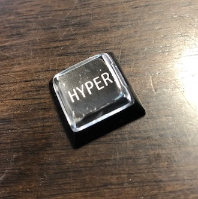
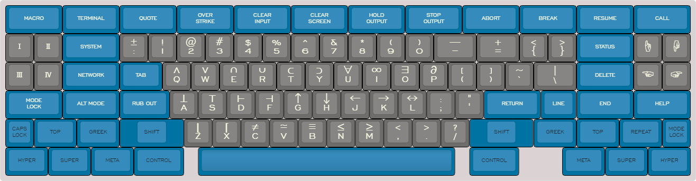

# ハイパーキーの設定

ハイパーキー (HYPER KEY) をご存知でしょうか．ハイパーキーはコントロールキー (Ctrl) やシフトキー (Shift) のような補助キーの一つです．周辺事項を説明しながらハイパーキーについて述べたいと思います． ハイパーキーを語るには私では力不足ですが，少しでもキーボードの世界に興味を持っていただければと思います．

## 七つの補助キー

かつてキーボードの世界 (?) には七つの補助キーがありましたが，現代では次の補助キーしか表立っては生き残っていません．

- Ctrl
- Shift
- Alt
- Super

### スーパーキーでみる世界の版図

\[embed\]https://www.youtube.com/watch?v=3cuILtoQbZE\[/embed\]

はて？スーパーキー？

何でしょうか？

これは Windows OS なら Windows キーのことです． 同様に macOS なら Command キーのことです． 名を変えて生き残っています．

考えても見てください．入力装置に会社のロゴが必ず入っているのです． そしてほとんど誰もがそのようなキーボードを持っています． 某社がどれほどのパワーをもっているか，改めて理解できます．

我々は M 社や A 社の OS 上で彼らのソフトウェアを使用して文書やソフトウェアを作成し， 困ったことがあったら G 社のサービスで検索したり動画を見て， 必要なものは A 社で買い物をし， F 社のサービスを通して私的なことを書き留める． そして手持ち無沙汰のときは誰もが A 社の端末とにらめっこ．

そう [BIG5](https://ja.wikipedia.org/wiki/%E3%83%93%E3%83%83%E3%82%B0%E3%83%BB%E3%83%86%E3%83%83%E3%82%AF) です．

「スーパーキーって何？」

そう思ったあなたは BIG5 によって塗り替えられた世界の版図に既に染まっているのです．

### 失われた補助キー

ではここまでで挙がっていない残りの補助キーとは何でしょうか．それは次の補助キーです．

- Hyper
- Meta
- Top
- Front

あれ？

全部合わせると合計で八つありますね．

実は Meta キーは Alt キーという後から出てきた補助キーに統合されました． これでようやく数が合います．

<script async src="//pagead2.googlesyndication.com/pagead/js/adsbygoogle.js"></script>

<script>(adsbygoogle = window.adsbygoogle || []).push({});</script>

あまり信じられないかもしれませんが，Alt キーというのは，かつてはしばしば省略されたり，他の名前を持っていました． このため (Emacs ユーザだけかもしれないですが) 年季の入っておられる方は Alt キーではなく，Ctrl-\[ で Alt キーの代用[1](#fn-1180-ESC)をしたり，Alt キーを自分で「この場所」という風に決めておられる方もおられます．

このように Alt キーは世代間格差を感じさせる補助キーです．

### スペースカデットキーボード

七つの補助キーは 1982 年ころに作られたスペースカデットキーボードが源流です． スペースカデットキーボードのレイアウトは次のとおりです．



[スペースカデットキーボードレイアウト](http://www.keyboard-layout-editor.com/#/samples/symbolics-spacecadet)

このキーボードは宇宙船のコックピットにあるような大量のキースイッチを彷彿とさせるため， 宇宙飛行士の訓練生のキーボード (スペースカデットキーボード) と呼ばれています．

訓練生というところが何とも良い感じです． ホントの宇宙船はもっとすごいんだぞ，という感じが伝わってきます．

スペースカデットキーボードが製造された 1982 年周辺の宇宙開発に関する年表要約が下記にあります．

[宇宙開発の年表](https://ja.wikipedia.org/wiki/%E5%AE%87%E5%AE%99%E9%96%8B%E7%99%BA%E3%81%AE%E5%B9%B4%E8%A1%A8#1981%E5%B9%B4%E4%BB%A5%E9%99%8D)

1980 年代はチャレンジャー号の悲劇に冷戦終結と，宇宙開発競争がある意味で一段落していく時代でした．

<script async src="//pagead2.googlesyndication.com/pagead/js/adsbygoogle.js"></script>

<script>(adsbygoogle = window.adsbygoogle || []).push({});</script>

本題に戻すと，スペースカデットキーボードでは Shift キーで大文字が打てるようなノリで， Top や Front を押すとギリシア文字や数学記号が打てました．

なんで Top とか Front と呼ばれているかといいますと，キーの刻印の上部分と前部分にそれぞれどんな文字が打たれるかが書いてあるためです． Front はほぼほぼギリシア文字と決まっているので，Greek とも書かれています．

今の時代，ギリシア文字や数式を打ち込むには TeX を使うと思うのですが，いかんせん，まだ TeX もできたばかりでした．

[TeX の歴史](https://texwiki.texjp.org/?TeX%E3%81%AE%E6%AD%B4%E5%8F%B2)

今では J 言語というかもしれませんが，古参のプログラミング言語に APL という言語があります．

[APL](https://ja.wikipedia.org/wiki/APL)

APL は数学記号のような記号をバンバン使用して記述する言語です． スペースカデットキーボードも APL 推奨の標準レイアウトではないですが， APL で使用するグリフがスペースカデットキーボードにはあしらわれています．

<script async src="//pagead2.googlesyndication.com/pagead/js/adsbygoogle.js"></script>

<script>(adsbygoogle = window.adsbygoogle || []).push({});</script>

現代の常識でかつてのキーボードを見ると，とても奇異に感じるかもしれませんが，歴史を紐解いていくと，Top や Front も数学の本格的な文書を作成するのに必須のものだったのであろうことが想像されます．

今やキーボードは大衆化して無個性なものが巷には溢れています． しかし少し立ち止まって見ると重厚な営みが見えてくることがわかります．

\[embed\]https://www.youtube.com/watch?v=oDozftThFMw\[/embed\]

### Emacs とハイパーキー

七つの補助キーのうち，「Shift」「Top」「Front」は文字を変化させるものでした． これに対して，「Ctrl」「Meta」「Super」「Hyper」は制御コード (古くはバッキービットと言われました) に関わる補助キーです． これら補助キーは Emacs の各種のコマンドを実行するためのコンビネーションとして使用されます．

現代ではほとんどの場合に独立な Meta キーがないので，Alt キーか Esc キーで代用することになっています．このことは Emacs のリファレンスマニュアルにも明示されています．

多くの Emacs ユーザは Ctrl キーと Meta キーを使用するだけで，Super キーや Hyper キーは使用しないと思います． Emacs のエコーエリアにはコマンドが C-x とかいった形で表示されますが， Super キーは小文字の s，Hyper キーは大文字の H で表示されます． あまり使用されないだけで廃止されておらず，今でも用意されています． 細かいことを言えば，Alt (A) と Meta (M) も区別されているので，頑張ればこれらを区別して Emacs を使役できます．

[Modifer Keys](https://www.emacswiki.org/emacs/ModifierKeys)

まとめると潜在的に Emacs は五つの制御用の補助キー「Ctrl」「Meta」「Alt」「Super」「Hyper」が使用可能だということです．

### 現代のハイパーキー

ハイパーキーは原義では独立した補助キーですが，メタキーがそうであるように，現代ではハイパーキーは本来の独立した意味を失っており，おおよそ次のような意味合いでハイパーキーが扱われます． (よって Emacs でいうところのハイパーキーとは違うことになります)

> (現代の) ハイパーキーとはコントロールキー，シフトキー，オルトキー，スーパーキーの同時押しのことをいう．

現代のハイパーキーは指を四つ消費してようやく打つことができるのです．

<script async src="//pagead2.googlesyndication.com/pagead/js/adsbygoogle.js"></script>

<script>(adsbygoogle = window.adsbygoogle || []).push({});</script>

## 現代のハイパーキーの設定

真の意味でのハイパーキーの設定は Emacs 依存なところもあるので，以下では現代の意味でのハイパーキーについて，設定方法をご紹介します．

但し Window10 以降，何度かのアップデートで， スーパーキーである Windows キーとのコンビネーションが， ユーザ側で制御がどうもできなくなってきたようで， 完全支配されてしまっているかもしれません．

### AutoHotKey

Windows OS でキー変更をソフトウェア側で解決する定番ソフトが AutoHotKey です．

[AutoHotKey](https://autohotkey.com/)

今回はこれを使って現代のハイパーキーを作ってみます．

<script async src="//pagead2.googlesyndication.com/pagead/js/adsbygoogle.js"></script>

<script>(adsbygoogle = window.adsbygoogle || []).push({});</script>

### ahk ファイル

AutoHotKey はスクリプトを記述することでプログラマブルにキー割り当てを変更できます． 単なる割り当て以上により複雑なこともできます．

現代のハイパーキーのスクリプトファイルについても次で議論されていました．

[How to emulate hyper key in Windows 10 using autohotkey](https://stackoverflow.com/questions/40435980/how-to-emulate-hyper-key-in-windows-10-using-autohotkey)

これをベースにしたスクリプトが下記です．

```
#NoEnv ; recommended for performance and compatibility with future autohotkey releases.
#UseHook
#InstallKeybdHook
#SingleInstance force

SendMode Input

;; deactivate capslock completely
;; SetCapslockState, AlwaysOff

;; note: must use tidle prefix to fire hotkey once it is pressed
;; not until the hotkey is released
~AppsKey::
    ;; must use downtemp to emulate hyper key, you cannot use down in this case 
    ;; according to https://autohotkey.com/docs/commands/Send.htm, downtemp is as same as down except for ctrl/alt/shift/win keys
    ;; in those cases, downtemp tells subsequent sends that the key is not permanently down, and may be 
    ;; released whenever a keystroke calls for it.
    ;; for example, Send {Ctrl Downtemp} followed later by Send {Left} would produce a normal {Left}
    ;; keystroke, not a Ctrl{Left} keystroke
    Send {Ctrl DownTemp}{Shift DownTemp}{Alt DownTemp}{LWin DownTemp}
    KeyWait, AppsKey
    Send {Ctrl Up}{Shift Up}{Alt Up}{LWin Up}
    ;; remap apps key to hyper
    ;; if apps key is toggled, remap it to X
    if (A_PriorKey = "AppsKey") {
        Send {AppsKey} ;; X
    }
return
```

上記のスクリプトではメニューキーをハイパーキーに割り当てています． 単にメニューキーを押しただけの場合は本来のメニューキーが処理され，何かとのコンビネーションの際にはじめて同時押しが作用するようにスクリプトが書かれてあります．

## 参考

- [ハッカー英語辞典 (自然社ペーパーバックス)](https://amzn.to/2B38NND)
- [Hyperkey | The extra macOS modifier key](https://hyperkey.app/)

| [](https://www.amazon.co.jp/gp/product/4774143278/ref=as_li_tl?ie=UTF8&camp=247&creative=1211&creativeASIN=4774143278&linkCode=as2&tag=alexandritefi-22&linkId=d9361715afbdaf8475b89995bee5e787) | [](https://www.amazon.co.jp/gp/product/487311277X/ref=as_li_tl?ie=UTF8&camp=247&creative=1211&creativeASIN=487311277X&linkCode=as2&tag=alexandritefi-22&linkId=eb41872aa70e16a7483bfac5fe4c7cb2) | [](https://www.amazon.co.jp/gp/product/9888381954/ref=as_li_tl?ie=UTF8&camp=247&creative=1211&creativeASIN=9888381954&linkCode=as2&tag=alexandritefi-22&linkId=f947c2f955d8f61392e590e2772473b9) |
| --- | --- | --- |

<script type="text/javascript">amzn_assoc_ad_type ="responsive_search_widget"; amzn_assoc_tracking_id ="alexandritefi-22"; amzn_assoc_marketplace ="amazon"; amzn_assoc_region ="JP"; amzn_assoc_placement =""; amzn_assoc_search_type = "search_widget";amzn_assoc_width ="auto"; amzn_assoc_height ="auto"; amzn_assoc_default_search_category =""; amzn_assoc_default_search_key ="Emacs";amzn_assoc_theme ="light"; amzn_assoc_bg_color ="FFFFFF";</script>

<script src="//z-fe.amazon-adsystem.com/widgets/q?ServiceVersion=20070822&amp;Operation=GetScript&amp;ID=OneJS&amp;WS=1&amp;Marketplace=JP"></script>

* * *

2. Ctrl-\[ が Alt キーの代用を果たすのは，これが ESC キーのバイナリに相当し，且つ ESC が Alt の一つの原型である Meta キーの代用であるためです．つまり制御コードを直打ちをしているわけです． [↩](#fnref-1180-ESC)
