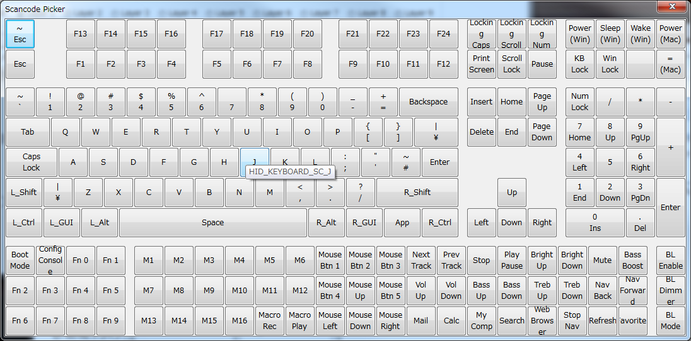
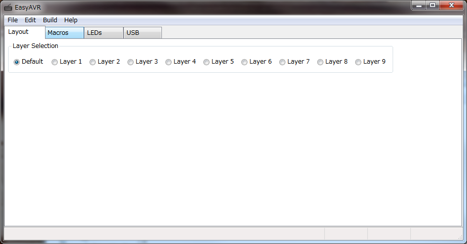
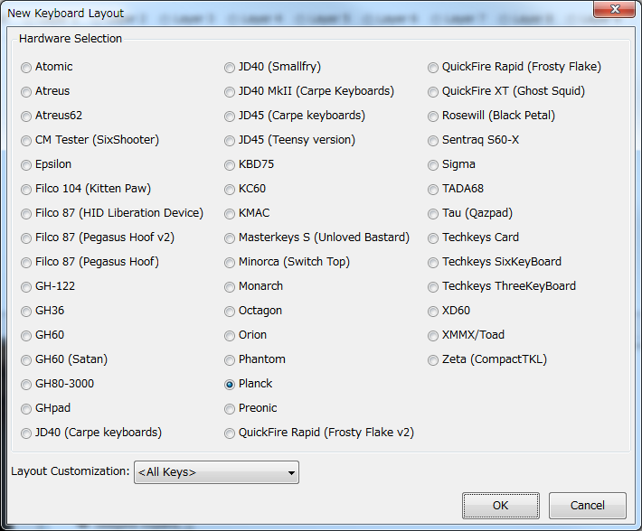
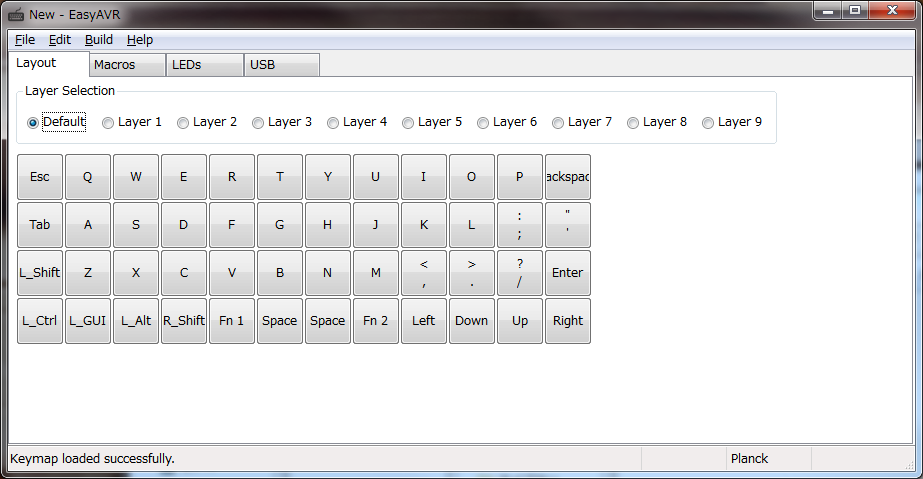
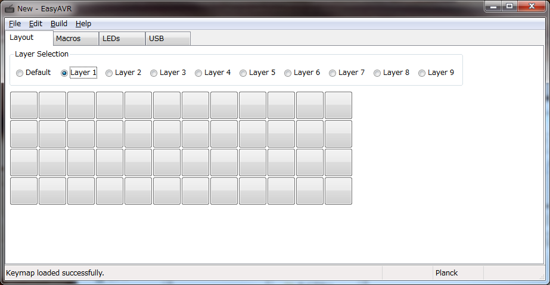
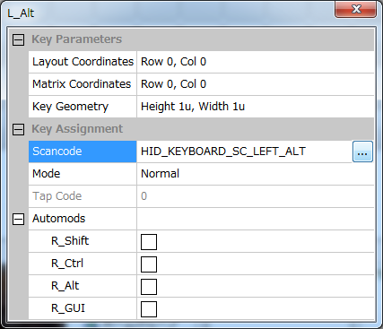

# カスタムツールの導入

Planck Keyboard はかなり自由度の高いカスタマイズが可能です．

## 必要なツール群

カスタマイズ方法は (日を追うごとに整備されていって) とても簡単で，ここで Windows の場合をご紹介しましょう．必要になるのは次のツールです．

- easykeymap.exe
- qmk\_toolbox.exe
- dfu-programmer.exe

これらのツールについて導入方法と使い方を，以下に順に説明していきます (2018/5/x 現在)．

## easykeymap.exe

easykeymap.exe は好みのカスタマイズを GUI 上で行うツールです．バージョンごとに UI が変わる可能性がわりかし高いと思われますが，まぁ，なんとかなるさ，と大きく構えましょう．

[EasyAVR](https://github.com/dhowland/EasyAVR/releases)

上記から easykeymap\_windows\_x\_xx\_xx.zip (x は最新の番号) をクリックしてダウンロードしてください．

その後，解答すると easykeymap.exe があります．インストール作業はこれで終わりです．easykeymap.exe を叩いて起動させましょう．すると次の画面が初期画面として表示されることでしょう．

ここでメニューバーの \[File\] から \[New...\] を選択するか，Ctrl-N を押して次の画面に進んでください．

この画面のように Planck を選び，Grid 配列であれば を選びます．MIT 配列であれば MIT を選んでください．そうしたら \[OK\] ボタンを押すと，QWERTY な初期レイアウトが表示されます．

ここから自由にレイアウトや LED の振る舞いを編集していくわけですが，詳しい編集方法はまたの機会にして，Layout タブの簡単な説明だけをします．

Layout タブではキーレイアウトを編集できます．Layer 1 から Layer 9 はそれぞれ Fn 1 から Fn 9 キーを押している際に有効になる Layer です．はじめはすべて空欄になっていると思います．この空欄は Scancode (スキャンコード - Wikipedia) でいうところの 0 番である NULL が割り当てられています．

どこか一つその空欄をクリックしてみてください．次のダイアログが開きます．

次に \[...\] を押すと割り当て可能な Scancode をビジュアルで確認して，クリックすることで Scancode を選択できます．この作業を気が済むまで延々と繰り返します．

それでようやく終わったら，メニューバーの File から Save を押すか，Ctrl-S を押して設定を保存します．設定は JSON ファイルとして保存されます．

JSON で保存されている設定内容でキーボードのファームウェアを更新するには，ビルドを行って hex ファイルを生成する必要があります．このためにはメニューバーの Build から Build を押すか，F7 を押して保存先を指定して hex ファイルを生成します．

以上が easykeymap.exe の役割です．お疲れ様でした．

## qmk\_toolbox.exe と dfu-programmer.exe

Planck Keyboard は下記のツール (qmk\_toolbox.exe) を利用してファームウェアの書き換えを GUI 上から行うようにできています．

[qmk\_toolbox](https://github.com/qmk/qmk_toolbox/releases)

 qmk\_toolbox.exe をダウンロードしたら後は起動するだけです．qmk\_toolbox.exe から easykeymap.exe で生成した hex ファイルを読み込んで，ファームウェアの書き換えを行います．

ファームウェアの書き換え手順は次のとおりです．

1. Placnk Keyboard を PC に繋げます．
2. Planck Keyboard の背面に RESET というボタンがついているかと思います．これを押すことでファームウェア書き込みの待機状態にします．すると「ジッ」という音が繰り返し鳴ります．ああ壊れたのか，と最初は不安になりました．
3. 初回の場合はここでドライバのインストールを行います．これは少し長くなるので後述します．そちらを御覧頂いて実行してから次の手順に進みましょう．
4. Microcontroller のコンボボックスにて atmega32u4 を選択してください．
5. \[Open\] ボタンを押して，easykeymap.exe でビルドした hex ファイルを選択してください．
6. \[Flash\] ボタンを押します．すると正しく繋がっていれば，「カチカチカチカチ．．．．」とすごい勢いで何やら書き換えを演出してくれます．ログ出力が一段落するまで待ちましょう．これでお終いです！

ドライバーのインストール作業は次のとおりです．

1. デバイスマネージャーを開いてください．例えば「コントロールパネル＞ハードウェアとサウンド＞デバイスマネージャー」とたどって開けます．
2. 『Planck Bootloader』なるものを右クリックして，プロパティを選択してください．
3. \[ドライバーの更新\] を押してください．
4. \[コンピューターを参照してドライバーソフトウェアを検索します\] を選択してください．
5. \[参照\] ボタンを押してディレクトリチューザーを開いたら，dfu-programmer.exe が置いてある dfu-prog-usb-x.x.x フォルダーを選択して \[OK\] を押してください．
6. \[サブフォルダーも検索する\] のチェックが入っていることを確認して \[次へ\] を押してください． インストールを承認すると，インストール作業が始まります．無事，インストールが終われば，作業終了です！

いかがでしたか？とっても簡単ですよね！

これで心ゆくまでカスタマイズを行ってみてください！

なおここで用いたツールは Planck Keyboard 以外でも QMK ファームウェアであれば，どのキーボードでも同じようにカスタマイズができます．この素晴らしい世界へようこそ！楽しんでいきましょう！！

## 次回 

Planck Keyboard の LED についてご紹介したいと思います．

