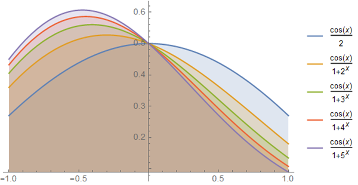

# 定積分 No.1

$$ \int_{-1}^1 dx \frac{\cos x}{e^{\frac{1}{x}} + 1} = \sin 1 $$

## 使用するトリック

奇関数 $f_{\mathrm{ODD}}(x)$ は原点対称な積分領域について定積分は $0$ となる．

$$ \int_{-a}^a dx f_{\mathrm{ODD}}(x) = 0 $$

なお与えられた任意の関数からは次のようにして偶関数と奇関数を構成できる．

$$ \begin{eqnarray} f_{\mathrm{EVEN}}(x) &=& \frac{f(x) + f(-x)}{2} \\ f_{\mathrm{ODD}}(x) &=& \frac{f(x) - f(-x)}{2} \end{eqnarray} $$

このことは任意の関数が偶関数と奇関数の和に分解できることもまた示している．

$$ \begin{eqnarray} f(x) = f_{\mathrm{EVEN}}(x) + f_{\mathrm{ODD}}(x) \end{eqnarray} $$

## 導出

もっと一般に次の定積分を考える．

$$ I := \int_{-a}^a dx \frac{\cos x}{d(x) + c} $$

そして被積分関数を $f(x)$ と置く．

$$ f(x) := \frac{\cos x}{d(x) + c} $$

積分領域が $[-1,1]$ と対称なので，$f(x)$ を偶関数と奇関数の和に分解する．

$$ I = \int_{-a}^a dx f(x) = \int_{-a}^a dx f_{\mathrm{EVEN}}(x) + \int_{-a}^a dx f_{\mathrm{ODD}}(x) = \int_{-a}^a dx f_{\mathrm{EVEN}}(x) $$

ここで奇関数の定積分を落とした．

今の $f(x)$ を代入して整理すると次のようになる．

$$ I = \int_{-a}^a dx \frac{\cos x}{2}\left[ \frac{d(x) + d(-x) +2c}{d(x)d(-x) + cd(x) + cd(-x) + c^2} \right] $$

被積分関数の括弧が $1$ となるような場合を特に考えると，それは次が成り立つときである．

$$ d(x)d(-x) = c = 1 $$

特に $d(x) = e^{\frac{1}{x}}$ は上記を満たす． よって次を得る．

$$ \int_{-a}^a dx \frac{\cos x}{e^{\frac{1}{x}} + 1} = \int_{-a}^a dx \frac{\cos x}{2} = \sin a $$

## 感想戦

偶関数については次が成り立つが，今回の導出では特に本質ではないことがわかる．

$$ \int_{-a}^a dx f_{\mathrm{EVEN}}(x) = 2\int_0^a dx f_{\mathrm{EVEN}}(x) $$

関数 $d(x)$ が $d(x)d(-x)=1$ を満たす限り，同じ結果を得るところが面白い．

$$ \sin 1 = \int_{-1}^1 dx \frac{\cos x}{e^{\frac{1}{x}} + 1} = \int_{-1}^1 dx \frac{\cos x}{e^x + 1} = \int_{-1}^1 dx \frac{\cos x}{2^x + 1} = ... $$

下記の各曲線の塗り潰された領域の面積はすべて $\sin 1$ に等しい．

さて奇関数は次を満たした．

$$ \int_{-a}^a dx f_{\mathrm{ODD}}(x) = 0 $$

これをもう少しだけ抽象的に捉えると，定積分することは偶関数への射影演算子とみれる．

$$ P_{\mathrm{EVEN}} := \int_{-a}^a dx $$

実際，偶関数に対しては上記の積分作用は恒等的に作用する． では奇関数への射影演算子は何だろか． それは例えば次のように与えられる．

$$ P_{\mathrm{ODD}} := \int_{-a}^a dx \mathrm{sgn}(x) $$

ここに $\mathrm{sgn}(x)$ は符号関数である．超関数を持ち出せば次の関係に意味をもたせることができる．

$$ \frac{d}{dx}|x| := \mathrm{sgn}(x) $$

よって今与えた奇関数への射影演算子は次のようにも書ける．

$$ P_{\mathrm{ODD}} = \int_{-a}^a d|x| $$

## 参考

- [積分計算 – オススメの参考書・問題集](https://mathrelish.com/calculation/recommended-books-in-integral-calculus)

