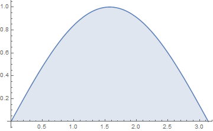

# 定積分 No.21

$$ \int_0^{\frac{\pi}{2}}dx \ln(a\sin x) = \int_0^{\frac{\pi}{2}}dx \ln(a\cos x) = \frac{\pi}{2}\ln\frac{a}{2} ~~ (a > 0) $$

## 使用するトリック

積分変数のフリッピング $y = \frac{\pi}{2} - x$ はちょうど余角の関係を与えるから，次のとおり正弦と余弦についての定積分が等しいことは直ちにわかる．

$$ \sin\left( \frac{\pi}{2} - \theta \right) = \cos\theta $$

二つの異なる表式の和をとって，対数関数によって積の形に直すことで，三角関数の積を得るが，再び単一の三角関数に変形できる．そして再び同一の定積分の形が得られそうである．

主にこういった基本に忠実に式変形を探る．

## 導出

積分変数のフリッピングで得られる二つの異なる表式について和をとって整理する．

$$ I := \frac{1}{2} \int_0^{\frac{\pi}{2}}dx [\ln(a\sin x) + \ln(a\cos x)] = \frac{1}{2} \int_0^{\frac{\pi}{2}}dx \ln\left(\frac{a^2}{2}\sin 2x\right) $$

ここで三角関数について二倍角の公式を用いた．

次に上手く元の表式に戻るように被積分関数のうち関係する部分と関係しない係数部分をわける．

$$ I = c + \frac{1}{2} \int_0^{\frac{\pi}{2}}dx \ln(a\sin 2x) ~~ \left( c := \frac{\pi}{4}\ln\frac{a}{2} \right) $$

積分部分の二倍角部分を $t=2x$ と置換積分すると次を得る．

$$ \int_0^{\frac{\pi}{2}}dx \ln(a\sin 2x) = \frac{1}{2}\int_0^{\pi} dx \ln(a\sin x) $$

ここで正弦関数は $[0,\pi]$ で $\frac{\pi}{2}$ について対称である．

よって $\frac{\pi}{2}$ を境に分けた二つの定積分は同一の値をとるから次を得る．

$$ \frac{1}{2}\int_0^{\pi} dx \ln(a\sin x) = \int_0^{\frac{\pi}{2}}dx \ln(a\sin x) = I $$

以上を合わせて次を得る．

$$ I = c + \frac{I}{2} $$

これを整理すれば所望の結果を得る．

## 感想戦

今回の定積分は $a=1$ の場合を特にオイラーの対数正弦積分といい，今回のようにいろいろな拡張の基礎になっている．例えば冪についての拡張は次でまとめられている．

[Log Sine Function](http://mathworld.wolfram.com/LogSineFunction.html)

この他，小山信也および黒川信重による多重三角関数との関係を論じたものもある．

- [EULER’S INTEGRALS AND MULTIPLE SINE FUNCTIONS](http://www.ams.org/journals/proc/2005-133-05/S0002-9939-04-07863-3/S0002-9939-04-07863-3.pdf)

何れの場合もゼータ関数と関連していて，オイラーの対数正弦積分の重要性を物語っている．

## 参考

- [積分計算 – オススメの参考書・問題集](https://mathrelish.com/calculation/recommended-books-in-integral-calculus)

