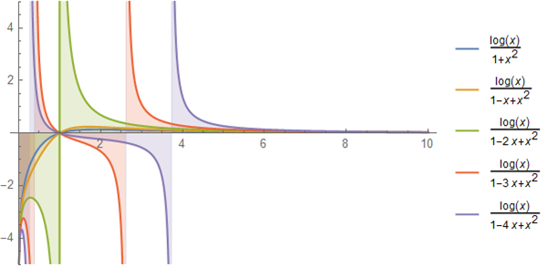

# 定積分 No.25

$$ \int_0^{\infty} dx \frac{\ln x}{1 - bx + x^2} = 0 ~~ (\forall b\in\mathbb{C}) $$

## 使用するトリック

導出のために次の定積分を考える．

$$ \int_0^{\infty} dx \frac{\ln(x^a + 1)}{1 - bx + x^2} ~~ (a\neq 0) $$

すると次の変数変換による積分変数のフリッピングは，[定積分 No.24](https://mathrelish.com/mathematics/definite-integral-24)での計算とよく似て，再び似たような定積分を吐き出す．

$$ y = \frac{1}{x} $$

この事実から自動的に示される．

## 導出

我々は次の定積分を考える．

$$ I := \int_0^{\infty} dx \frac{\ln(x^a + 1)}{1 - bx + x^2} ~~ (a\neq 0) $$

そしてこの定積分について次の変数変換による置換積分を行う．

$$ y = \frac{1}{x} $$

これによって次を得る．

$$ I = I - \int_0^{\infty} dx \frac{\ln x}{1 - bx + x^2} $$

故に所望の結果を得る．

## 感想戦

ここまでに至るまでの定積分を解いていないと，導出を思い付くのは難しいだろう． 一見，魔法のように見える式変形は基礎的な計算の積み重ねであることが多い． これを誰かに共感してもらうには中々大変であろう．

今回得た結果は次の定積分を特殊な場合として含むことが直ちに了解されよう．

- [定積分 No.2](https://mathrelish.com/mathematics/definite-integral-2)
- [定積分 No.9](https://mathrelish.com/mathematics/definite-integral-9)

幾つかの $b$ についてプロットしたのが下図である． これはみな共通して定積分が $0$ となる．

## 参考

- [積分計算 – オススメの参考書・問題集](https://mathrelish.com/calculation/recommended-books-in-integral-calculus)

