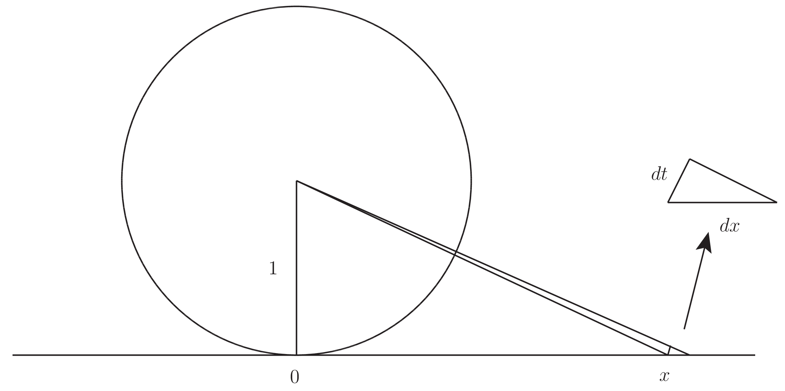

# 定積分 No.3

$$ \int_0^{\infty} dx \frac{1}{1 + x^2} = \frac{\pi}{2} $$

## 使用するトリック

逆正接関数 $\arctan$ を用いるよく知られた例だが，ここでは 1719 年にイタリアの数学者 Giulio Fagnano (1682-1766) による方法を使用する．

[Giulio Carlo de' Toschi di Fagnano](https://en.wikipedia.org/wiki/Giulio_Carlo_de%27_Toschi_di_Fagnano)

## 導出

単位円の円弧の長さ $l$ と角度 $\theta$ の間に次式が成立した．

$$ l = \theta = \int_0^{\theta}dt $$

最右辺を次のように目的の被積分関数へと変形していく．

$$ l = \int_0^{\theta}dt \frac{\frac{1}{\cos^2t}}{\frac{1}{\cos^2t}} = \int_0^{\theta}dt \frac{\frac{1}{\cos^2t}}{1 + \tan^2t} $$

ここで $x=\tan\theta$ と変数変換して次を得る．

$$ l = \int_0^{\tan\theta}dx \frac{1}{1 + x^2} $$

ところでこれは元を辿れば $\theta$ だったから次を得る．

$$ \int_0^{\tan\theta}dx \frac{1}{1 + x^2} = \theta $$

特に $\theta=\frac{\pi}{2}$ とすれば所望の結果を得る．

## 感想戦

Giulio の方法は逆正接関数 $\arctan$ を用いた方法と比べて無理なく定積分が計算されているということが優れている．逆正接関数 $\arctan$ による置換積分を代数的にしか理解していない場合には特に新鮮に映るかもしれない．どうしてこの置換が有効であるのかを教えてくれるわけである．それは次のとおり．

次の図を考えてみよう．

このとき角度が無限小であるならば，円弧は無限小線分とみなせ，且つ実直線への射影部分を斜辺とする三角形の高さは無限小線分の長さ $dt$ と無限に近いとみなせて，同じく $dt$ の長さと考える．また高さが $1$，底辺の長さが $x$ の直角三角形と射影で得られている無限小の直角三角形とは相似とみなせる．これから高さと斜辺について次の比が成立している．

$$ 1:1+x^2 = dt:dx $$

これを整理して次を得る．

$$ dt = \frac{dx}{1+x^2} $$

この積分の左辺は有限な円弧の長さを表し，且つ右辺は今回の主題となった積分に他ならない．

## 参考

- [積分計算 – オススメの参考書・問題集](https://mathrelish.com/calculation/recommended-books-in-integral-calculus)

