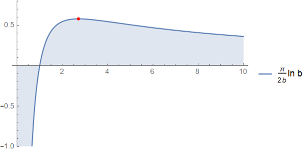

# 定積分 No.9

$$ \int_0^{\infty} dx \frac{\ln x}{x^2 + b^2} = \frac{\pi}{2b}\ln b $$

## 使用するトリック

[定積分 No.2](https://mathrelish.com/mathematics/definite-integral-2) を拡張した定積分である． そこで用いた同じ変数変換 $t =\frac{1}{x}$ による置換積分を実行して，$b=1$ の場合に帰着できるような変数変換を更に考えるということを行う．

## 導出

変数変換 $t=\frac{1}{x}$ を行って，次のように定積分を評価する．

$$ I := \int_0^{\infty} dx \frac{\ln x}{x^2 + b^2} = -\int_0^{\infty} dt \frac{\ln t}{1 + b^2t^2} $$

ここで更に変数変換 $s=bt$ を行って，定積分の評価を続ける． 対数関数は積を和に直すので，上手く $b=1$ の場合を吐き出すと見越せる．

$$ I = \frac{1}{b}\left[-\int_0^{\infty} ds \frac{\ln s}{s^2 + 1} + \int_0^{\infty} ds \frac{\ln b}{s^2 + 1} \right] = 0 + \frac{\ln b}{b}\arctan\infty = \frac{\pi}{2b}\ln b $$

## 感想戦

得られた結果は $b=1$ で以前に [定積分 No.2](https://mathrelish.com/mathematics/definite-integral-2) で求めた定積分の結果に矛盾しない． 特殊な場合を基礎にしているので，置換積分が面白くなってくる小気味良い定積分の例だと言えよう．

定積分値が最大となる $b$ の値は直ちに求めることができて，それは $e=2.71828\cdots$ である．

そしてその場合の定積分値は (2018/9/1 現在で) 超越数かどうかが未解決な例としてよく挙げられる値 $\frac{\pi}{e}$ の半分の値となる． これを意図して二倍した次の定積分は対称な感じがして美しい．

$$ \int_0^{\infty} dx \frac{\ln x^2}{x^2 + e^2} = \frac{\pi}{e} $$

## 参考

- [積分計算 – オススメの参考書・問題集](https://mathrelish.com/calculation/recommended-books-in-integral-calculus)

