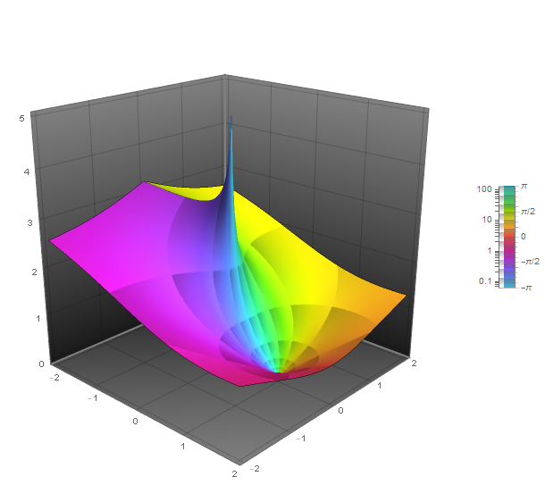
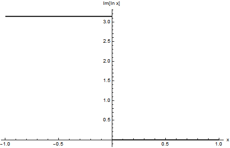
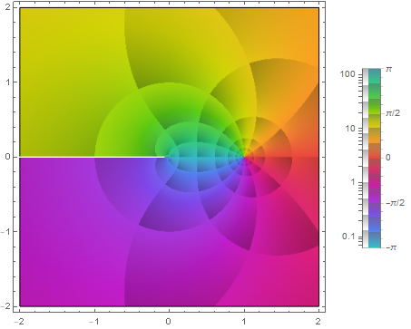

# 不連続関数のギャップ

不連続関数は明らかに微分可能な関数ではない． また連続関数だからといって，絶対値関数のように微分可能な関数とは限らない． それが道理というものである．

その事実は認めた上で超関数の意味で微分を拡張すると， 不連続関数までもが「微分」の対象として扱えるようになる．

すると思わぬボーナスが得られる． 不連続関数のギャップの定量化である．

## 着想と背景

区分的に滑らかな関数であれば，その区分の端点を除いて通常の微積分が実行し得た． そしてそれら端点では右極限と左極限の和や差が特徴的に表れた． 各種の積分変換の逆変換は正にそのような端点で一意には元の関数へは戻らなくなった．

不連続点でのそのような振る舞いは忌み嫌われるような印象がある． 感覚的に言えば微分不可能な点での傾きに値が定まらず， それ以上は何も言えないというところが関数の汚点のような印象を抱かせる．

ところが超関数論の下で扱えば， 不連続量を計算の一部として定量的に含めたまま取り扱い可能なのである． それが今回の主題である．

## 主題

無限の論理を一つずつ消化していくごとに， 新たな飛躍のない極限描像を獲得していく． 超関数もその一つであろう．これを見ていきたい．

### ギャップ

不連続関数の不連続さには分類が存在している． それが以下の概念である．

簡単のため関数 $f(x)$ の不連続点を $x=a$ とし，それ以外に不連続点はないような定義域を考えるとする．

このような場合に右極限と左極限が存在して等しく，且つそれらが有限であるような不連続点を可除不連続点という．

$$ f(a+0) = f(a-0) < \infty $$

また右極限と左極限が存在するがそれらは等しくなく，何れも有限であるような不連続点を跳躍不連続点といい， それら左右の極限の差をギャップといって次で表す．

$$ \lfloor f(a)\rceil := f(a+0) - f(a-0) $$

そして右極限と左極限の何れかが存在しないか，有限でないような不連続点を真性不連続点という．

以上，三種の不連続点のうち，可除不連続点と跳躍不連続点を第一種不連続点といい， 真性不連続点を第二種不連続点という．

以下では第一種不連続点のみを取り扱う． なお定義からギャップが $0$ の跳躍不連続点が特に可除不連続点になっている．

### 不連続関数の連続関数化

さて関数 $f(x)$ として $x=a$ でのみ第一種不連続点を一つ持つ次の一価連続な関数を考えよう[1](#fn-2590-func)．

$$ f(x) := \begin{cases} f_+(x) & (x>a), \\ f_-(x) & (x<a) \end{cases} $$

するとこの関数のギャップは次のとおり．

$$ \lfloor f(a)\rceil = f_+(a+0) - f_-(a-0) $$

このような関数に対して次の関数を構成してみる．

$$ [f(x)]_{\mathrm{c}} := \begin{cases} f_+(x) - \lfloor f(a)\rceil & (x>a), \\ f_-(x) & (x<a) \end{cases} $$

こうして定義された関数は定義域全体で連続関数となる． そして元の関数とは次の関係にある． 但し $\theta(x)$ は Heaviside 関数である．

$$ f(x) = [f(x)]_{\mathrm{c}} + \lfloor f(a)\rceil \theta(x-a) $$

第一項が連続関数部分であり，第二項が不連続関数部分を表しているため， これは連続と不連続の分解方法を与えている．

### 興味深い等式

今，以上にして考えた関数 $f(x)$ は，不連続点以外では通常の意味で微分可能だと仮定する． すると超関数の意味で両辺を微分できて次が得られる．

$$ \tilde{\partial}f(x) = \partial [f(x)]_{\mathrm{c}} + \lfloor f(a)\rceil \delta(x-a) $$

我々はこうして興味深い等式を得ることができた．

## コメント

### 一般的な取り扱い

第一種不連続点を一つのみで議論したが，$n$ 個の場合も同様に議論できて，次を得ることができる．

\begin{eqnarray} f(x) &=& [f(x)]_{\mathrm{c}} + \sum_{k=1}^n \lfloor f(a_k)\rceil \theta(x-a_k), \\ \tilde{\partial}f(x) &=& \partial [f(x)]_{\mathrm{c}} + \sum_{k=1}^n \lfloor f(a_k)\rceil \delta(x-a_k) \end{eqnarray}

また一階導関数が連続であることを仮定したが，二階導関数が連続とは限らない． 仮に連続ではなく，第一種不連続点を持つのならば， 再び同様の議論を行うことができる． これは次の階数の導関数について，第一種不連続点を持つ限り，帰納的に行うことができる．

### 不連続点と複素関数

実関数では第二種不連続点であっても複素関数に拡張すると，第一種不連続点となる場合がある． 例えば実対数関数は原点を第二種不連続点としてもつ． 左極限は存在せず，右極限は有界ではない． しかしながら複素対数関数であれば，定義域は複素平面へと接続されて， 以下のディラックの微分公式の例で述べるようにギャップは有限となる．

## 例

### ディラックの微分公式

ディラックは著書『The Principles of QUANTUM MECHANICS』の中で次の式を披露している．

$$ \frac{d}{dx}\log x = \frac{1}{x} - i \pi \delta(x) $$

これはどう理解したものだろうか． それは次のとおりである．

1. 左辺があたかも実関数の通常の微分のように書かれているが，複素対数関数に対する超関数の意味での微分だと考える．
2. 複素対数関数を考えたとき，原点が分岐点で不連続な特異点になっている．以下ではブランチカットとしては原点と負の無限遠点 $-\infty$ を結ぶ，負の実軸に設定して，偏角の定義域を $(-\pi,\pi]$ にとる． 
3. ここでは特に複素対数関数の主値を考える．
4. ギャップの評価は実軸上の右極限と左極限なので，複素変数で考えると極座標表示した場合のそれぞれ偏角を $0$ および $\pi$ とした場合での原点への極限の差を計算する．

以上から複素対数関数の極座標表示として次を考える．

$$ f(|z|,\arg z) := \log z = \ln |z| + i\arg z ~~ (\arg z \in (-\pi, \pi] ) $$

これに対して，次のギャップが計算できる．但し極限操作として実軸上で主値をとる．

$$ \lfloor f(0)\rceil = \lim_{|z|\to 0} [f_+(|z|, 0) - f_-(|z|, \pi)] = -i\pi $$

こうして実数に制限して次の式が得られた．

$$ \tilde{\partial}\log x = \frac{1}{x} - i\pi \delta(x) $$

### プレメリの公式との関連

[コーシーの主値と超関数](https://mathrelish.com/physics/cauchy-principal-value-and-generalized-function)

我々は以前に上記の考察の中で，プレメリの公式というものに触れた． その公式は特に原点に関しては次のようになる．

$$ \frac{1}{x \pm i0_\varepsilon} = \mathrm{P} \frac{1}{x} \mp i\pi \delta(x) $$

ここで左辺は対数関数の微分で得られるから次が得られる．

$$ \frac{d}{dx} \ln(x \pm i0_\varepsilon) = \mathrm{P} \frac{1}{x} \mp i\pi \delta(x) $$

特に上側の符号を選択すれば，ディラックが示した超関数の意味での対数関数の微分が得られる． つまり両者は同値である．

そして複素比例定数 $C=-i\pi$ の幾何学的な意味が明らかとなった． 即ちギャップとしての側面であり，実軸上で原点について両極限を同じに取る主値として特に $-i\pi$ となる．そうでなければ一般に複素数となる．

というのも複素関数として扱うとギャップの定義も複素平面上に拡張されて，$\arg z$ が $0,\pi$ でなく任意の偏角となり次のようになるからだ．

$$ \lfloor f(0)\rceil = f_1(\varepsilon_1, \theta_1) - f_2(\varepsilon_2, \theta_2) = \ln\frac{\varepsilon_1}{\varepsilon_2} + i(\theta_1 - \theta_2) \in \mathbb{C} $$

## 番外

### 謎めいたセリフを紐解く！

さて我々は以下の記事で，IQ300 の水野亜美さんが次のように解説していたことを思い出して欲しい．

[複素数って存在するの？](https://mathrelish.com/mathematics/do-complex-numbers-really-exist)

> 「どうやらこの空間は閉鎖された虚数空間らしいの．つまりね．理論上では私達のいた実数空間とは三次元どうしでは直接繋がっていなくて，二次元どうしでのみ正と負の逆位相で0次元を仲介して繋がっているはずなんだけど・・・」 — セーラーマーキュリー 美少女戦士セーラームーン 第35話「よみがえる記憶！うさぎと衛の過去」

おわかりいただけただろうか

これはひょっとして次のことを言っていたのではないだろうか．

- どうやらこの空間は閉鎖された虚数空間らしいの．
    
    - どうやらこの空間は実軸を除いた複素平面のようです．
- つまりね．理論上では私達のいた実数空間とは三次元どうしでは直接繋がっていなくて，
    
    - つまり，これは複素関数でみた不連続関数のギャップが存在していて，
- 二次元どうしでのみ正と負の逆位相で $0$ 次元を仲介して繋がっているはずなんだけど・・・
    
    - 複素平面に拡張して，右極限と左極限を原点でとって，連続関数化されいているはずなんだけど・・・

ΩΩΩ＜な、なんだってー！？

水野亜美さんはディラックの微分公式を噛み砕いて説明されていたということですネ！

## 参考

- [デルタ関数と微分方程式【応用数学叢書】 (岩波オンデマンドブックス)](https://amzn.to/2NaLYx6)
- [The Principles of QUANTUM MECHANICS](https://amzn.to/2GhwC74)
- [Does the derivative of log have a Dirac delta term?](https://mathoverflow.net/questions/127601/does-the-derivative-of-log-have-a-dirac-delta-term)

* * *

2. 以下，不連続点での値を何か指定することはなく不定なため，実のところ関数ではなく，この時点で既に超関数を考えている． [↩](#fnref-2590-func)
