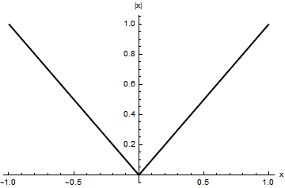

# 誤謬

　

連続関数ならば微分可能である．

　

## 判定方法

関数の右極限と左極限が一致して連続であっても， 導関数の右極限と左極限が一致するとは限らない．

## 反例

絶対値関数 $f(x):=|x|$ は連続関数だが，原点で微分可能でない． ちなみにこの絶対値記号はワイエルシュトラスによって導入された．

\begin{eqnarray} \lim_{h\to+0} f(0+h) &=& \lim_{h\to+0} |h| = \lim_{h\to+0} +h = 0, \\ \lim_{h\to-0} f(0+h) &=& \lim_{h\to-0} |h| = \lim_{h\to-0} -h = 0 \end{eqnarray}

よって原点で連続である．

\begin{eqnarray} \lim_{h\to+0} \frac{f(0+h) - f(0)}{h} &=& \lim_{h\to+0} \frac{|h|}{h} = \lim_{h\to+0} \frac{h}{h} = 1, \\ \lim_{h\to-0} \frac{f(0+h) - f(0)}{h} &=& \lim_{h\to-0} \frac{|h|}{h} = \lim_{h\to-0} \frac{-h}{h} = -1 \end{eqnarray}

よって原点で右極限と左極限は一致しない． 故に導関数が一意に定まらない． つまり原点で微分可能でない．

## コメント

この誤謬を抱く要因としては以下の事柄が予想される．

- 微分可能な関数に応用解析の入口で頻繁に遭遇する．
- 微分可能な関数ならば連続関数である．(真なる命題)

何はともあれ，不連続関数を最初に相手にすることが甚だ少ない． まずは一次関数，二次関数そして三角関数に指数関数などなど， 極限操作に習熟する以前に連続関数を肌で感じることになる． すると次のことが起こりやすい．

- 見た目が正に「連続」であり，連続関数を極限操作なしに理解できてしまう．
- 微分計算を機械的に習熟する時間が必要で，極限操作なしに微分できてしまう．
- 微分可能な関数のみ扱ってしまう，もしくは十分であることが常々である．

微分方程式を立式および求積する段階まで進んでも， そもそも微分方程式を立てるということは， 微分可能な関数が解になるので，やはり出くわすことができない．

但し境界や初期値では微分可能とは限らないため， ここで誤謬に遭遇できるチャンスがあるが， 微分方程式を求積するという目的では積分定数の決定にのみ費やされて， やはり多くは見過ごすか，目下の応用上，興味ある対象になりにくい．

というより，Newtonの運動方程式やMaxwellの方程式など， そもそもそれらが微分可能性を要求しているので， 古典論的な自然界に「連続だが微分可能でない」という事象を探すことがとても難しい． ブラウン運動のようなところまで進む必要がある．

## 参考

- [ベクトルからはじめる電磁気学](https://amzn.to/2SdbiCC)
