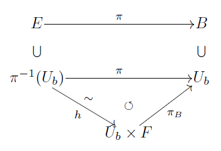
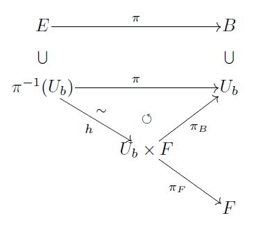
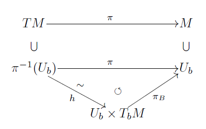

# ファイバー束

ファイバー束は数学の専門課程を経ない場合には， 位相空間以上の構造を伴って導入が図られることが多い． その構造とは微分可能多様体としての構造だが，余りにも多くの思惑が入り混じって， そのような ファイバー束はギトギトした定義になる． ここではより澄んだファイバー束について述べる．

[The Math Relish Journal Volume 1S](https://mathrelish.booth.pm/items/1123647/)

## 着想や背景

突然だが収束の一意性はたいへん望ましい性質だ． そのような性質を保証するには位相空間はハウスドルフであればよい． このような理由によって，ハウスドルフ性は微分可能多様体を定義する際に 必要な条件の一つになる．

このため，微分可能多様体として扱いたい幾何的対象があるときに， ハウスドルフ性を備えているかどうかは一つの重要なチェック項目になる．

個々にハウスドルフ性をチェックすることをしてもよいが，そういうことは少ない．

ところである対象の例を様々に構成したいときに，既に知られた例の商空間を考えることで， 例を構成するということが数学ではよくある．

そこで戦略として，商空間によって微分可能多様体の例を構成したい場合に， 予めハウスドルフ性を備えているような枠組みがあれば， それを土台に微分可能多様体を論じることができて elegant である．

このような枠組みの例がファイバー束 $(E, \pi,B, F, h)$ である．

## 定義

ファイバー束とは次の存在定理で定義される組 $(E,\pi,B,F,h)$ のことをいう．

次の条件を満たす組 $(E,\pi,B,F,h)$ が存在するとする．

\- $E$ は位相空間である． - $B$ はハウスドルフな位相空間である． - $\pi:E\rightarrow B$ は連続写像である． - $F$ はハウスドルフな位相空間である． - $B$ の各点 $b$ の開近傍 $U_b$ について $h:\pi^{-1}(U_b)\rightarrow U_b\times F$ は同相写像である． - $\pi_B\circ h = \pi$ である．但し $\pi_B:U_b\times F\rightarrow U_b$ なる $B$ への射影である．

即ち次の図式が成立しているとする．

このとき，$E$ はハウスドルフである．

前提から $B,F$ がハウスドルフ性であるから， これらと $E$ を結びつける $\pi,h$ からハウスドルフ性を伝播させて $E$ がハウスドルフであることを示す．

$x_1,x_2\in E$，$x_1\neq x_2$ とする． これらが開集合で分離できることを $\pi(x_1)\neq\pi(x_2)$ と $\pi(x_1) = \pi(x_2)$ に場合分けして示す．

**$\pi(x_1)\neq\pi(x_2)$ の場合** $\pi(x_1),\pi(x_2)\in B$ で $B$ はハウスドルフだから，これら相異なる $2$ 点を分離する開集合 $U_1,U_2\subset B$ がとれる．

$$\pi(x_1)\in U_1,~ \pi(x_2)\in U_2,~ U_1\cap U_2 = \emptyset$$

ここで $\pi$ は連続写像だったから，逆像 $\pi^{-1}(U_1),\pi^{-1}(U_2)$ は $E$ の開集合である． そして $x_1\in\pi^{-1}(U_1),x_2\in\pi^{-1}(U_2)$ であり，$U_1\cap U_2 = \emptyset$ の両辺の逆像をとって，次を得る．

$$\pi^{-1}(U_1)\cap \pi^{-1}(U_2) = \emptyset$$

つまり相異なる $2$ 点 $x_1,x_2$ は開集合で分離できる． この場合は $B$ のハウスドルフ性が根拠になった．

**$\pi(x_1) = \pi(x_2)$ の場合** $b := \pi(x_1) = \pi(x_2)$ とする．前提からこのような $b\in B$ について，$h:\pi^{-1}(U_b)\rightarrow U_b\times F$ が同相写像で $\pi_B\circ h = \pi$ を満たすことができる開近傍 $U_b$ をとることができる． すると $\pi(x_1) = \pi(x_2)$ と $\pi_B\circ h = \pi$ から $(\pi_B\circ h)(x_1) = (\pi_B\circ h)(x_2)$ である． 即ち $\pi(x_1) = \pi(x_2)$ とは $B$ 成分が一致する場合である．

今，$\pi_F:U_b\times F\rightarrow F$ なる $F$ への射影を考える．

このとき $F$ 上の $2$ 点 $(\pi_F\circ h)(x_1),(\pi_F\circ h)(x_2)$ は相異なる点である．

$$(\pi_F\circ h)(x_1) \neq (\pi_F\circ h)(x_2)$$

何故ならば，もし $(\pi_F\circ h)(x_1) = (\pi_F\circ h)(x_2)$ と仮定すると，$(\pi_B\circ h)(x_1) = (\pi_B\circ h)(x_2)$ であることも含めて，$h(x_1),h(x_2)$ を $B,F$ の何れに射影しても両辺で同じ元に写ることになる． つまり射影する前は等しいことになる．即ち $h(x_1) = h(x_2)$ である． ところで $h$ は同相写像だったから，明らかに単射性を持ち，従って $x_1 = x_2$ が帰結される． しかし $x_1 \neq x_2$ なのでこれは矛盾である． 従って $(\pi_F\circ h)(x_1),(\pi_F\circ h)(x_2)$ は相異なる $2$ 点である．

よって $(\pi_F\circ h)(x_1),(\pi_F\circ h)(x_2)\in F$ で $F$ は ハウスドルフだから，これら相異なる $2$ 点を分離する開集合 $V_1,V_2\subset F$ がとれる．

$$(\pi_F\circ h)(x_1) \in V_2,~ (\pi_F\circ h)(x_2) \in V_2,~ V_1\cap V_2 = \emptyset$$

このとき $i=1,2$ として，$x_i\in h^{-1}(U_b\times V_i)$ であるが，$h^{-1}$ は同相写像，$U_b,V_i$ は開集合なので，再び $h^{-1}(U_b\times V_i)$ は開集合である．また $V_1\cap V_2 = \emptyset$ だから，$(U_b\times V_1)\cap (U_b\times V_2) = \emptyset$ が従い，この両辺の逆像をとれば，次式を得る．

$$h^{-1}(U_b\times V_1) \cap h^{-1}(U_b\times V_2) = \emptyset$$

つまり相異なる $2$ 点 $x_1,x_2$ は開集合で分離できる． この場合は $F$ のハウスドルフ性が根拠になった．

以上から何れの場合も開集合で分離できることが示された． よって $E$ はハウスドルフである．■

## コメント

### 名称

ファイバー束 $(E,\pi,B,F,h)$ の各構成要素には次の名称がある．

- $E$ を束空間とか全空間という．
- $B$ を底空間という．
- $\pi:E\rightarrow B$ を射影という．
- 組 $(E,\pi,B)$ を束という．
- $F$ をファイバーという．

### ファイバー束の具体例構成の難しさ

ファイバー束は底空間とファイバーの局所的な直積を同相写像 $h$ を束ねていくことで，束空間という全貌が構築されるものである． この様子が名称に反映されている．

アイデアとしてはそれだけではあるが，構成要素が多く対象がファイバー束であることを示すことはとても面倒である． よくメビウスの帯がファイバー束の例として引き合いに出されるが， このような簡単な例でも (決して難しいわけではないが) すんなりとはファイバー束であることを示せない． 加えてメビウスの帯以外に，自明でないファイバー束の例は想像すら難しく，「(決して難しいわけではないが)」と断った部分も省略できなくなってしまう． そういった事情もあり，メビウスの帯しかファイバー束の具体例に挙げられないのが常である．

## 例

### 接束

接束とよぶある種の商空間 $TM$ が，微分可能多様体であることを示す際には，ハウスドルフ性が非自明な性質として問題になる． 元の空間がハウスドルフであっても，そこから構成する商空間もまたハウスドルフであるとは限らず，またハウスドルフであることを示すことも必ずしも簡単なことではないからである．

接束 $TM$ のハウスドルフ性はファイバー束の構造を $TM$ がもっていることを根拠に示すと見通しが良い． 接束 $TM$ は次の構造を有しているからである．

### 三次元球面のホップ・ファイブレーション

[embed]https://youtu.be/fpZfucQZMvU[/embed]

## 参考

|  |  |
| --- | --- |

- [幾何学〈1〉多様体入門 (大学数学の入門)](https://amzn.to/2xXpUP1)
- [ファイバー束とホモトピー](https://amzn.to/3zeqGBz)

