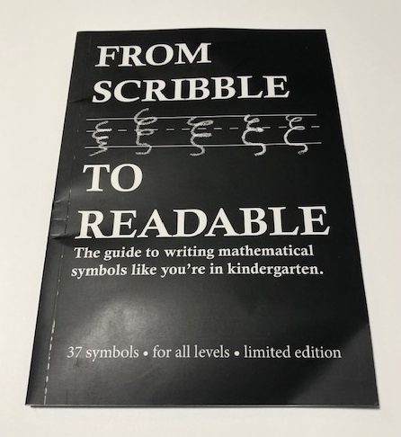
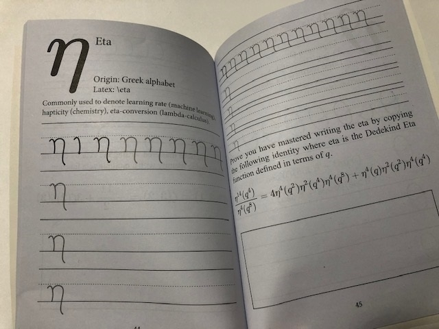
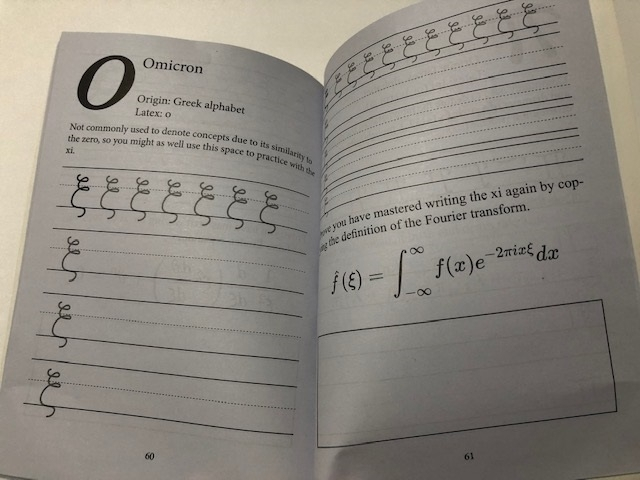
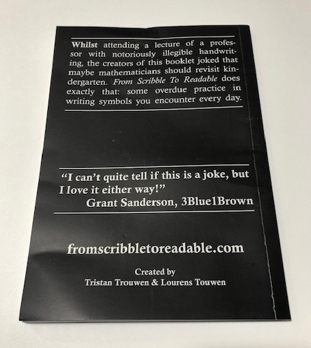
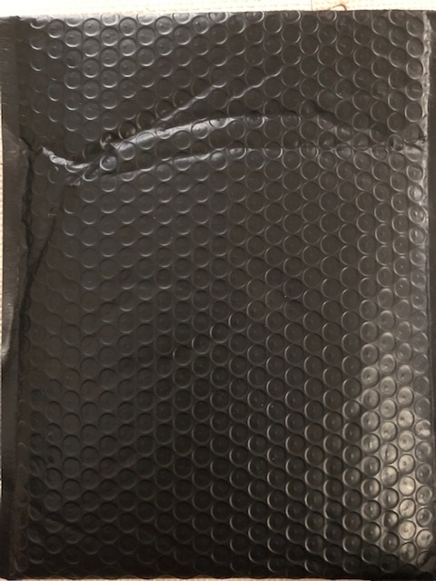
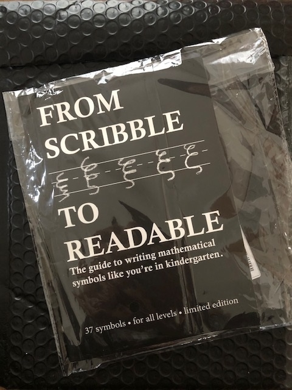
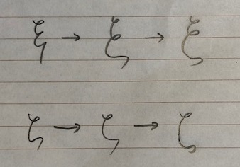

# 37 種の数学シンボルの書き方が学べる本の紹介 - From Scribble to Readable

今回は [From Scribble to Readable](https://fromscribbletoreadable.com/) という本の紹介です！

<iframe width="480" height="270" src="https://www.kickstarter.com/projects/mathwriting/from-scribble-to-readable/widget/video.html" frameborder="0" scrolling="no"></iframe>

## どんな本？

### 読めない板書

我々日本人にとって，数学や物理などで表れる様々な数学シンボルは， 自己流で書いておられる方が過半数ではないでしょうか．

結果，何が起こるでしょうか．

そうです．読めないということです． もっとストレートにいうと「字が汚い」ということです．

どうやらこの話は，なんと母語に近い海外でも同じように， 字が汚くて「読めない」ということが起こっているようです．

> We (two mathematics students) were sitting in the lecture hall, watching our lecturer write down eigenvectors and denoting them with the greek letter xi. The small tornado that presented the Xi was not only difficult to read but even more difficult to reproduce.

$\xi$ が**竜巻のような落書き**に見えてしまうんですネ．

### 落書きから読めるように！

そこで生まれたのが本書です！

この本ではそういった「数学で記号を書くのが難しい文字 37 種」を まるで幼稚園にいるかのように書き方を身につけられる本なのです！

それでいて，数学シンボルがどこで使われているかが， 粋な数式と一緒に練習できる作りになっています！

## ショートレビュー

買ってみての楽しみがなくならないよう，数ページだけのレビューにいたします．

### 高度な数式

見てください．右下の使用例を． コレ，懐かしすぎて笑いました．

デデキントの $\eta$ 関数です！ こういう恒等式がそれはもう山のようにあるんですが， まさかこんなところで出してくるとは．． ポイント高いです！

他の数学シンボルについても，ニヤリとするような例が選ばれていて， 本書は書き方の練習だけでなく，眺めるだけでも面白いです．

### ジョークもあり

おっと，印刷ミスでしょうか？？

いえ違います．

左上の文章をよく読んでみてください．

omicron なんて zero とかぶるから， このスペースは $\xi$ の練習に使っちゃおう， とあります．

これも笑ってしまいました．

こういうところで文字に対する文化的なものが感じられてとてもいいです．

## 購入方法

### Kickstarter とウェブショップ

[From Scribble to Readable](https://www.kickstarter.com/projects/mathwriting/from-scribble-to-readable)

はい，これは Kickstarter のプロジェクトなため，現時点ではプレッジできません． しかし幸いにも好評なプロジェクトだったため，近くショップサイトができるそうです！ →できました！！

↓↓↓

[Webshop coming soon!](https://fromscribbletoreadable.com/)

### 届くまで

はい，日本在住の場合は届くまでが大変です． Covid-19 の全世界的な影響もやはりでています． そんな中，発送連絡が次のように来ました．

> Dear Backers, Good news! All rewards have been printed and have been handed over to the couriers! However, when it comes to shipping, not all countries are created equally. We cannot give exact shipping time estimates and the ongoing pandemic makes shipping times unreliable. Despite that, we have the following estimates:
> 
> - European (The Netherlands not included): You will receive a tracking link for the status of your reward somewhere next week.
> - US: You will receive the tracking link for your reward in the days after that, as soon as the rewards are handed over from the intercontinental to the national courier.
> - The Netherlands: You will receive an email around the same time, indicating their rewards are on the way. After that, you can expect your reward in 1-2 days.
> - Backers not in the aforementioned countries, and not in Brazil, Russia, Israel, or South Africa: Possibly you have already received a tracking link, if not, depending on your location these will come in over the following days.
> - Backers in Brazil, Russia, Israel, or South Africa: Sadly, small-scale shipping to your country is slow and expensive. You can expect an email indicating the reward is on its way in a week and a half, but shipping can take anywhere from 1 week - 4 weeks.
> 
> We will keep you posted on any progress, but keep in mind that none of these shipping times are set in stone! Best regards and thank you for your patience, Lourens & Tristan

ふむふむ・・・

つまり要約すると**「日本は信じて待て」**ということでした． (いや，もしかしたら tracking あったかもですが．．．)

だいたい三週間ほど経って黒い郵送物が届きました．

おお！期待が高まる！！

**入ってました！！！！！**

私自身，もう何冊か欲しいなー，と思っているので， 今後はウェブショップを利用したいと思ってます！

## 練習の成果

購入して苦手な $\xi$ と $\zeta$ を何枚もコピーして，年甲斐もなく何度か練習しました．下が練習成果です．ちょっとわざとらしいですが．．．

いやぁ，きれいに書けたときは気持ちいいです．

## 作者不詳の類書

非常によく似たコンセプトの作者不詳の一冊． 対象年齢は一歳から百五歳とのこと．この時点でネタ本が確定している． 目次や前付けはないですが，長い序文があり，これを引用すると次のとおり．

> Who does no know the professor (at least in the natural science) who writes some mathematical formulas and proofs on the blackboard and for some reason all indices are the letters i and j or m and n, and while the professor writes and writes they all merge into one single undecipherable mess of letters that all look the same. Something like this: Gamma. Or they may use greak symbols and this is what this book is about I have practiced the letters Xi, Zeta and Sigma countless times. And while my handwriting is still far from beautiful, at least I do not struggle as much as when I was a beginning student. This book uses example equations form physics and gives you space to practice the symbols by yourself. You will not find all greek letters in this book as some of them are actually quite easy and do not require further practice. Therefore only the more difficult and commonly used greek letters as used in math and physics are included here. On the first page of each letter you will find one equation that usually contains the symbol to practice on this page. You may also try to write the whole equation instead. On the opposite site you will find more lines to practice and my actual handwritten attempts to write the symbol in question. Yes my handwriting in greek may be even worse than in latin letters, but they get the job done. You might have noticed that the book has a humorous touch, so please don't take everything seriously :)

本文の中身は序文にあるように物理学で現れる数式が例として挙げられていて，なかなか楽しい一冊になってました． 見開き右ページ左上に著者の直筆と思しき練習の成果(？)が例としてあるのですが，「う～ん．美しくなったのか・・・な？」というのが正直な感想．著者としては "Yes my handwriting in greek may be even worse than in latin letters, but they get the job done." といっているので，ま，そこも含めてユーモラスな一冊になってました．

本書のゼータの書き方は初めて見たので，知らないことが多いか，いやいやそもそもあっているのか，判断つかないので，これを機に色々調べないといけないかも．．

Daniel Sussman 氏が (おそらく) 学生から本書をプレゼントしてもらい，お返しに練習を兼ねたモザイク作品作成の動画が以下にありました．サービス精神旺盛です．

[embed]https://www.youtube.com/watch?v=BMmEyiIOQxU[/embed]

- [Advanced Math and Physics Symbols Writing Practice For Toddlers: Learn Writing Greek Letters for Quantum Mechanics Like in Kindergarten!](https://amzn.to/3LI2FKT)
