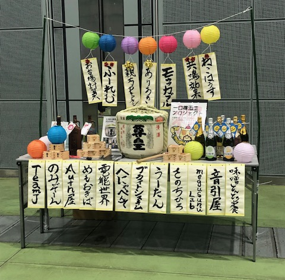
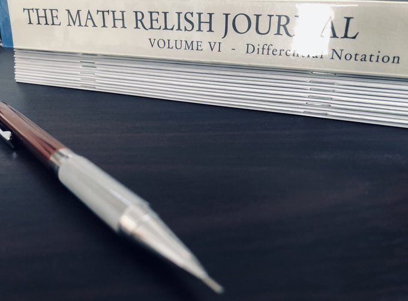
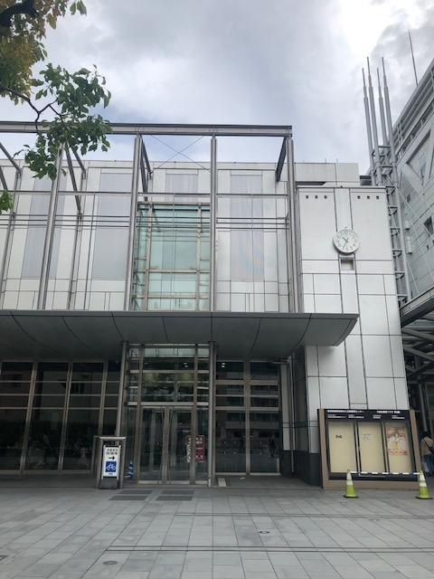
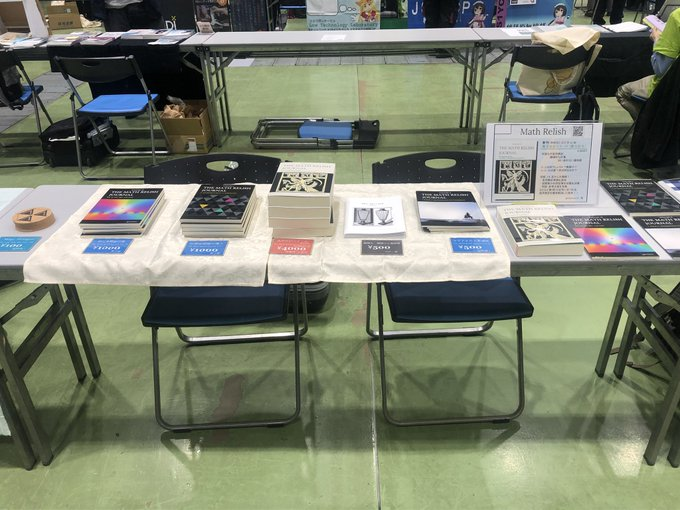
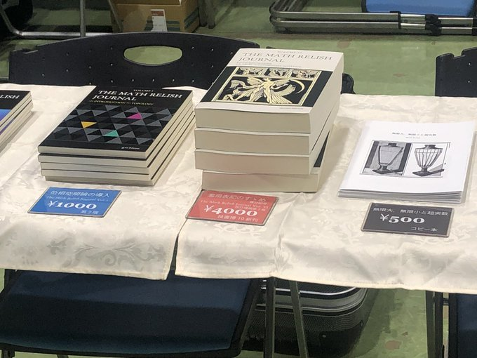
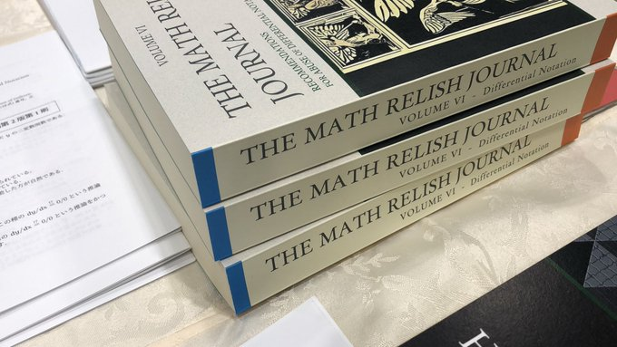
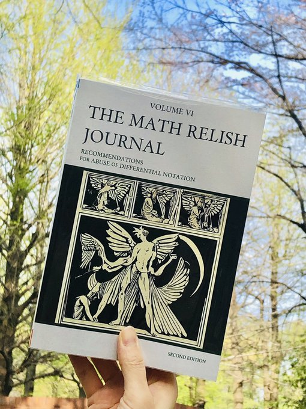

# 技書博１０出店参加レポート in 蒲田

[技書博１０](https://gishohaku.dev/)

Math Relish は第十回技術書同人誌博覧会 (技書博１０) に 出店サークルとして参加いたしました． そのときのレポートを以下に記録として記したいと思います．

## 新刊の執筆作業

とんでもない分量を書いてしまいました．．

### 改訂増補

今回の新刊は技書博７で出した『[濫用表記のすゝめ (微分記号)](https://mathrelish.booth.pm/items/5738559) 』の改訂増補第二版です．

元々，238 頁もあったのですが，ここまでくると， いろんなことを詰め込める状態になっているんですね．

そう，あれもこれもと．

そうして 422 頁に膨れ上がりました． もうほんと，微分にまつわるよくある話題は全部書いたのではないかと． そしてこんな本は自分が知る限りは和書洋書に限らず，一冊もないのではないかと．

### 内容

内容については下記の一連のつぶやきをご参照ください．

[内容](https://twitter.com/mathrelish/status/1779038843196592178)

## 現地当日

### 設営

設営するとわかるのですが，拡大してみましょう．

新刊の存在感が圧倒的です．際立っています．分厚い・・・

### 頒布のよろこび

開幕早々，ほんとに早々です． 新刊を頒布させていただきました． 多分最速なのではないかと思う速さでびっくりしました．

お聞きするとこの新刊を待っていただいたとのこと． 本当にありがたいことです． (しかも今回は話のタネにと，三冊も専門書を持ってきて話をさせてもらいました．ありがとうございます．)

書いてる最中は，同人がゆえに好きなことを書くわけなのですが， それはつまりだんだんと共感度が減っていく行為でもあります． majority から minority へ，この妙な恐怖感というか孤独感というか， そういう感情がやっぱりあるわけです．

ただ書いていると「いやこれはもっと知ってほしい」という気持ちも湧いてくるわけです． まぁほんと身勝手ですねｗ

今回は 422 頁とか，気軽な分量ではありません． そもそも刷るだけで割高なわけです． しかも当サークルは知名度が高いわけでもなく，爆死する可能性は高いわけです． (幸い，[Booth 通販](https://mathrelish.booth.pm/items/5738559)も入れれば，技書博の目標分はギリギリ頒布できました)

そんな当日の不安感の中，待ってた，気になってた，とか感想いただけると， 救われるとともに，お届けできるよろこびを感じます．

### 技書博の良さ

当サークルの頒布物は親しみやすさとか可愛い絵柄とか一切なく， おそろしくとっつきにくい見た目です．

しかしいざ，中を見てみると，爆笑してもらったりして， その瞬間にどこかがしっかりと繋がれた感覚になります． そのあとで頒布物を通してしばし談笑させてもらえて交流ができたと思います．

こういった空間的，時間的な余裕は技書博の良さでしょうか． 非常に良いと思います．参加させていただいていつも満足しております．

過去の頒布物の感想をいただけることもあります． これもまた本当うれしいですね． こう言っては何ですが，何か感想をいただけるというのは，そう滅多にないわけです． 一方通行というと言い過ぎですが，なかなかそういった機会がありません．

今回の新刊は 4000 円とかなり高いです． しかしその分，これでもかと詰め込みました． ダメ押しで補足ノートも書きました．

かつて Leibniz は正しく記号を定めれば，不毛な論争をすることなく， 何事もあとは計算するだけだという夢を見たといいます． 本書はその夢を応援する本でもあります．

少しでも貢献できていたらと願っています．

[濫用表記のすゝめ](https://mathrelish.booth.pm/items/5738559)

皆様，ありがとうございました．

* * *

次は 5/26 の[技術書典16](https://techbookfest.org/event/tbf16)でお会いしましょう！

[技術書典16](https://techbookfest.org/event/tbf16)
