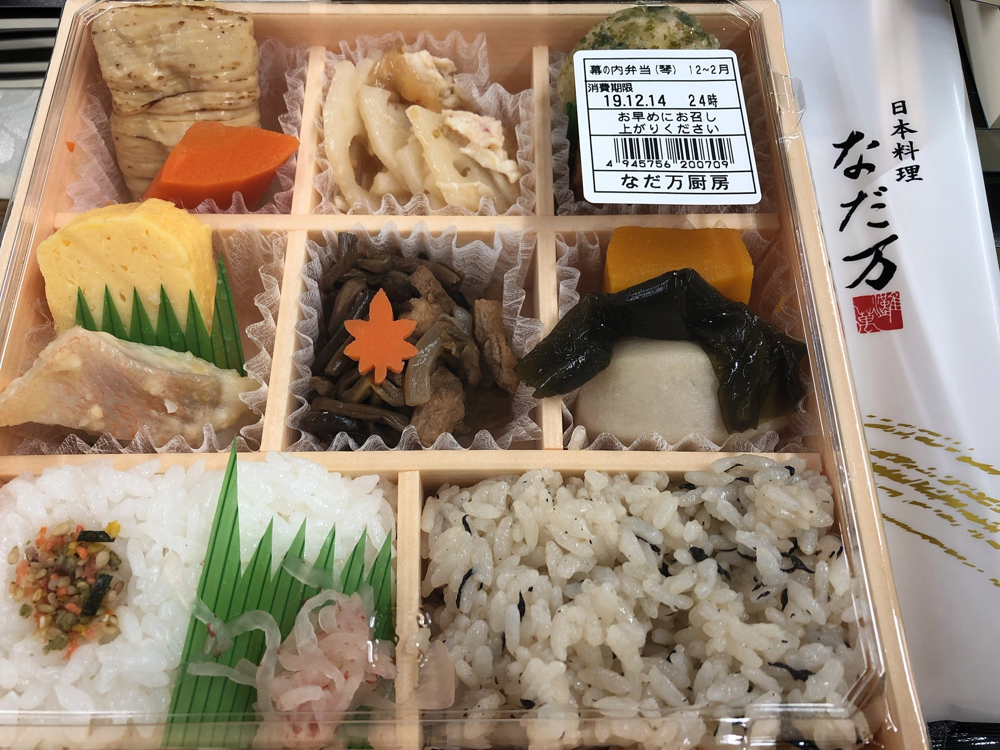
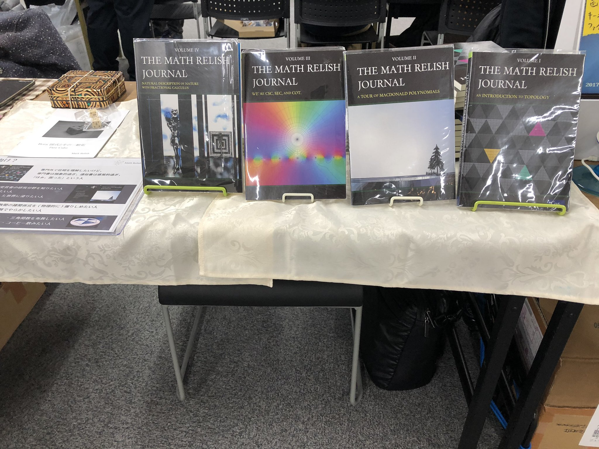
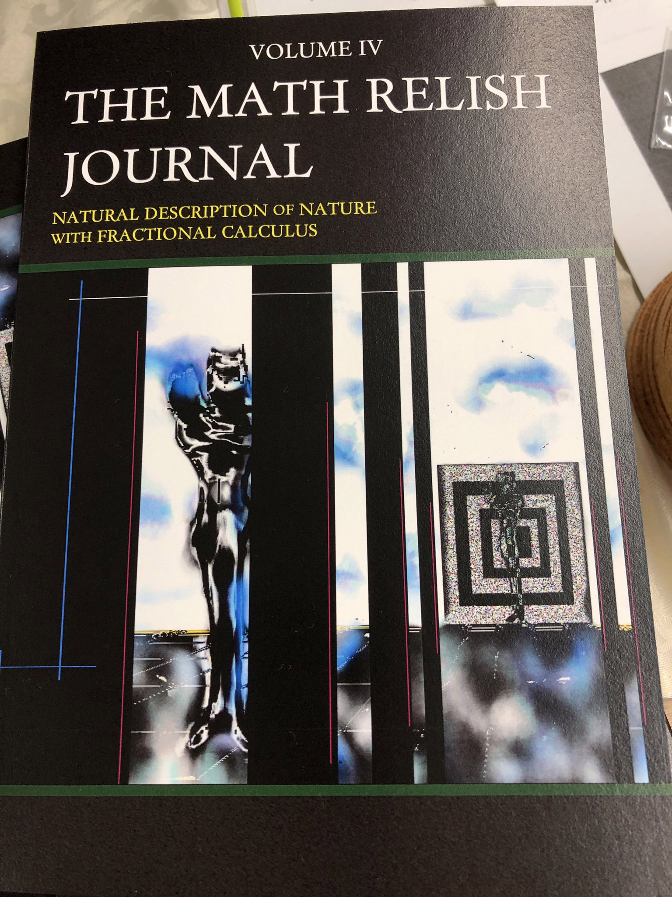

技書博２に出店！！

[Math Relish](https://gishohaku.dev/gishohaku2/circles/QHslMxxV529XBLM28QuR)

# 技書博２出店参加レポート

[技書博２](https://gishohaku.dev/)

Math Relish は第二回技術書同人誌博覧会 (技書博２) に， この度，出店サークルとして参加いたしました． そのときのレポートを以下に記録として記したいと思います．

## 会場まで

荷物をパンパンにつめて会場まで出発しました．

事前に宅配業者に運んでもらうこともできたのですが， 今回は当日まで全く時間がなく「まぁ運ぶかぁ」ということに．

お弁当が出るとのことで，モノさえ持っていけばいいという手軽感が 自分を後押ししておりました．

### 東京駅最深部

最寄り駅として馬喰町駅を選んだのですが，東京駅で総武線乗り換えのために， 噂に聞いていた東京駅最深部の地下５階へと足を踏み入れることになりました．

[東京駅地下世界](https://dailyportalz.jp/kiji/110808146626)

休日ということもあり，地上はどこも人でいっぱいで歩くのが大変だったのですが， 地下５階に降りると，

> 「誰もいない？」(言い過ぎ)

というほどガラ～ンとした世界が広がっていました． 貴重な体験でした．

## 会場入り

馬喰町駅のエレベータをなんとか見つけて，ようやく地上に出て， 技書博２の会場「プラザマーム」に到着できました．

### 設営

 ささっと設営を行いまして，和やかに技書博が始まりました． 会場入りした際に「なだ万」のお弁当券をいただいて，

> 「お茶買い忘れたぁ・・・」

と気付いたのですが，なんとそもそもお茶付きでした． 当たり前なのかもしれないのですが，個人的には「別でしょ」という世界観が身に沁み過ぎていて嬉しかったです．

院生のときにティッシュ箱や計算用紙といったインフラ的な日用品が 歳を重ねるごとに次々に有料になっていったことを思い出します． 今思い出してもこんな風に徐々に外堀がなくなっていく， あの過酷な環境は貴重な体験だったと思います． それ故に運営の皆様のお心遣いの有り難みがよくわかりました．

### サークル様どうしの交流

技書博２はゆったりと時間が過ぎていて，近くのサークル主様と歓談をすることが時折ありました． 「４２」のお話からいろいろな SF 小説の話題を共有できてとても楽しかったです．

どうしてもいろいろな知識を持っているとハード SF に趣向が行くのは自然なことなんだろうなぁと思う場面があったり，一方で私達がとても高度になって，地球外知的生命体がそうそういないことを知りだして SF なんだけど「ひょっとしたら」ということが少なくなってさみしいなと個人的に思っています．

つい百年前までは地球外知的生命体が割と近くにいるような存在だったと思います． 某特撮でも金星人という設定もそれなりにハードだったように思います． コンピュータについても登場当初に比べてその神秘性はかなり失われているように思います．

Rudy Rucker や Greg Egan が個人的には好きな作家ですが， これからのハード SF はどうなっていくのか興味あるところです．

### 高級なお弁当

[美味しゅうございました](https://twitter.com/mathrelish/status/1205692654438141952)

お昼になると 1830 年創業の日本料理店「なだ万」がつくるお弁当がサークルブースに届けられました．

[琴](https://www.nadaman.co.jp/catering/products/list.php?category_id=5#product1628)

今回のイベントでは一人で回していたため，「良いタイミングでお弁当を取りに行かなくちゃ」と内心ソワソワしていたのですが，届けてくれるシステムでした． 凄すぎて，「まぁ本が売れなくても来てよかったわぁ」と思ってしまいました．

## 書籍頒布

技書博２の開始早々，フルセットをお買い上げいただけました． あまりの速さにぽか～んとしたほどです． むちゃくちゃ嬉しかったですね．深夜の書籍作成を頑張った甲斐があったというものです．

### 技書博２の傾向

とはいえ，飛ぶようには売れず， 立ち寄っていただける方はかなりピンポイントにいらっしゃる方か， 数理的に濃い方が多かった印象があります． でも数学が苦手なんだぁ，という方でも立ち寄ってもらってとても有り難かったです．

そのような中で他の即売会と違って， お手に取っていただいた方と会話できることが多かったのが， 技書博２の特徴だと思いました．

とても一日では回りきれないサークル数とか，人多過ぎといったことが， 良い意味で技書博２にはなく， 心の余裕が参加者全体にあったように思います．

### 新刊について

今回の新刊は非整数階微積分に関する一冊 『非整数階微積分による自然界の自然な記述』です． 250 ページと全然薄くない本ですが， その分，ゆるい話から少しずつ専門的な話に入っていけるようにまとめた本です．

和書で非整数階微積分を取り上げた本は数冊ありますが， どれも丸々一冊が非整数階微積分であるような本はおそらく一冊もないので， 本書はとてもレアな本だと思います．

長らく整数階のモデリングが現象の記述を担ってきましたが， より自然なモデリングのために非整数階微積分方程式が 用いられていくことになるかもしれません． ぜひ，皆様もこれを機会に非整数階微積分を始めてみてはいかがでしょうか．

[Math Relish 物販部](https://mathrelish.booth.pm/)

### 最後に

技書博２はとても素敵な即売会でした． 運営の皆様，お立ち寄りいただいた皆様，サークル出店の皆様ありがとうございました． またの機会があれば，また参加したいと思います．
