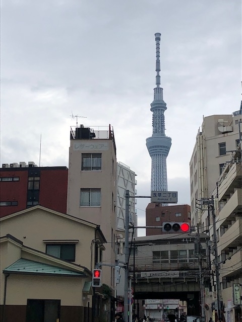
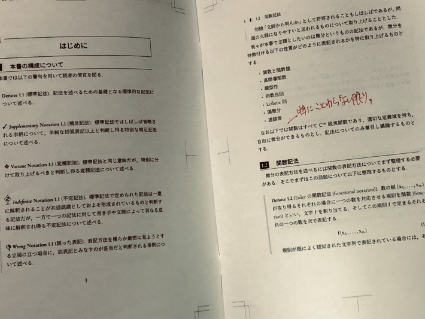
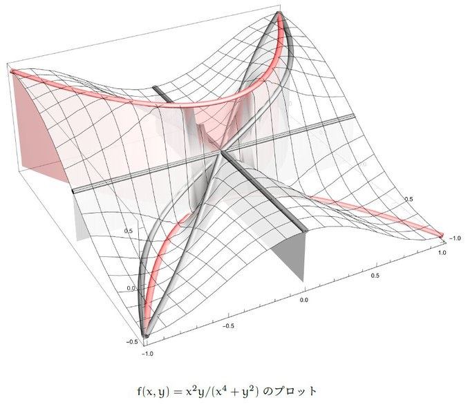
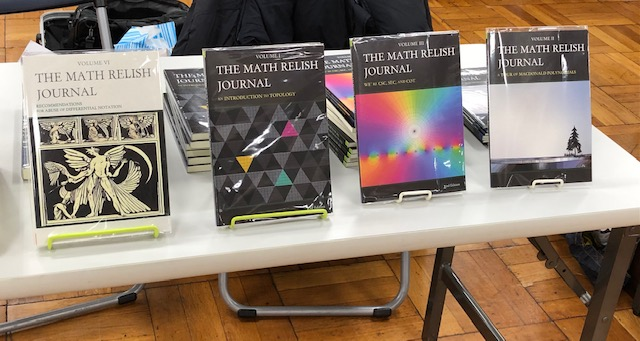

# 技書博７出店参加レポート in 浅草

[技書博７](https://gishohaku.dev/)

Math Relish は第七回技術書同人誌博覧会 (技書博７) に， この度，３年弱ぶりに出店サークルとして参加いたしました． そのときのレポートを以下に記録として記したいと思います．

## 新刊の執筆作業

即売会への参加はコロナ禍の影響もあり，オフラインは実に３年弱ぶり． いやぁ，ここまでが長かったです． プライベートでも色々あり，まぁとにかく大変でした．

### コロナ禍の影響

新刊である『[濫用表記のすゝめ (微分記号)](https://mathrelish.booth.pm/items/4287485) 』は， 最初，高々 40 頁ほどの企画でした．

それが，コロナ禍が長期化することで「塵も積もれば山となる」となって， どんどん頁が増えていき，結局，238 頁までなってしまいました．

### 新刊の思い入れとか

[濫用表記のすゝめ (微分記号)](https://mathrelish.com/mathematics/recommendations-for-abuse-of-differential-notation)

個人的には汎関数微分と高階導関数をまとめることができたのは大きかったです．

汎関数微分って，あんまり講義で手厚く扱わないと言うか何と言うか， 参考書任せなところは否めないかなぁというのが印象としてあります． そのくせ，素粒子論ではバンバン使うんですよね． で，ついつい私なんかは適当に書いていたと思います． それを反省する良い機会でしたね．

高階導関数については Leibniz の微分記号 $dy/dx$ にまつわる， 様々な (_あえていえば_) **大衆的混乱** を整理する良い機会でした． 今や，この一冊を書くことができて， 私としては微分記号に対して満ち足りた心境です．

また不定期の勉強会で，濫用表記について指摘が入るときがあり， その時の私的なメモを掘り起こす時間もできて， これも頁数増加に繋がりました．

以上のようなこともあり，頁数がどんどん増えていきました．

ただ，まとまった執筆時間があったわけではないので， 広げた風呂敷をどう納めるか悩みました．

### まとめ作業

ようやく一週間ほど時間を確保する機会が巡ってきて， その際に一気にまとめ作業を行いました．

ちょうど編集用マシンの調子が悪くなり，起動が怪しくなったマシンを新調したばかりで， 環境構築から手を着けたので結構焦ってました．

ですが今は楽ですね．[TeX Live](https://www.tug.org/texlive/) のおかげで TeX 環境はすぐ整いました． その流れで参考文献リストも Mendeley で管理していましたからスムーズに行くかと思いきや， Mendeley Desktop が 2022/8/31 で終了していたのです．．． それで，最新版の Mendeley を再インストールするも，大幅に機能ダウンしてました．

というわけで[昔のバージョンのインストーラ](https://www.mendeley.com/release-notes/v1_19_8)を探して，何とか事なきを得ました．

続けてメンバーに依頼していたレビューが，脱稿前に大量の返答を戴きました． あり得ない typo やら論理矛盾など，読んでくれて未然に多くを潰せたと思います． (忙しい中，メンバーの皆様ありがとうございます．)

また新刊レビュー会では次の関数が話題になりました． (γ 氏の的確なコメントと多岐にわたる適切な参考文献紹介に感謝いたします．)

$$ f(x,y) = \frac{x^2y}{x^4+y^2} $$

プロットは Wolfram Function Repository にある `ResourceFunction["SectionPlot3D"]` が活躍しました．

[SectionPlot3D](https://resources.wolframcloud.com/FunctionRepository/resources/SectionPlot3D/)

最後，深夜四時まで修正作業が続き，時間いっぱいまでできる限りのことをしました． 久しぶりに少し生き甲斐を感じました．

### 装丁について

今回，これまで黒系統だった装丁を思い切って白系統にしました．

特に表紙絵は，

微分といえば $dx$ で， $dx$ といえば Leibniz で， Leibniz といえば[モナドロジー](https://amzn.to/3C7BZjF)で， [モナドロジー](https://amzn.to/3C7BZjF)といえば Leibniz の悪魔 (え？)

ということで，Leibniz の悪魔をイメージしました． 悪魔が微分について教えている様子です．

ちょうど「[デビルマンのうた](https://www.youtube.com/results?search_query=%E3%83%87%E3%83%93%E3%83%AB%E3%83%9E%E3%83%B3%E3%81%AE%E3%81%86%E3%81%9F)」を聞いていたので， 表紙絵作成中は[飛鳥了](https://ja.wikipedia.org/wiki/%E9%A3%9B%E9%B3%A5%E4%BA%86)のことがよぎりっぱなしでした．

表紙に選んだ紙は奮発して「[ミランダスノーホワイト](https://www.starbooks.jp/doujin/paperinfo/paperInfo.php?indSearch=107)」にしました． 落ち着いた色合いと，ほのかにキラキラとしたガラスフレークで，堕天使感があって最高です．

[濫用表記のすゝめ (微分記号) (The Math Relish Journal Volume 6: Recommendations for Abuse of Differential Notation)](https://mathrelish.booth.pm/items/4287485)

## 現地当日

### リアルの良さ

やはり直にリアルで本を紹介できるのがいいですね． オンラインもオンラインの良さ (遠方参加とか) がありますが， リアルに本を手にとってパラパラ見れるのが大きいです．

何より頒布側としては読み手の感想や印象， 少しでも共感してくれたときに弾む会話のやりとりが最高です． ついつい長話になってしまいますが，苦労が報われる瞬間でもあります． 技書博は特に余裕があるので，落ち着いて話せるのがいいですね．

およそ３年弱ぶりの参加でしたが， なんと私たちを覚えていただいていた方もおられ，非常に嬉しかったです．

### 売れ行きとか

今回，天候が悪く，足が遠のくかなぁと思っておりましたが， 開始早々，[新刊](https://mathrelish.booth.pm/items/4287485)を一冊頒布できて，良いスタートが切れました． 新刊が頒布できると，「ああ，頑張った甲斐があった」と思えるものです． 現在多忙を極めるメンバーの β 氏も，かつて同じようなことを言ってました．

新刊だけでなく，既刊もそこそこ頒布できたのも良かったです． 今回持っていった既刊が「[位相空間](https://mathrelish.booth.pm/items/1123647)」「[マクドナルド多項式](https://mathrelish.booth.pm/items/1244077)」「[割三角関数](https://mathrelish.booth.pm/items/1473837)」なので， 技術者という括りの中ですら，とっつきやすいものではありません． ですが，以外や以外，この手の話題が懐かしいという方や興味があるという方もおられて， 持っていって良かったなぁと言う感想でした．

１６時が終了時刻だったのですが，最後，持っていった頒布物をすべてお求めいただきました． これには当日手伝ってもらった ϝ 氏からも，たまらず驚きと歓喜の言葉が漏れました． 弊サークルの同人書籍がお役に立っていることを願うばかりです．

蓋を開けると新刊は完売． 皆様，ありがとうございました．

* * *

なお今回の記事はビネガーシンドロームを修理したモバイルギアで書きました． キーボードがとてもいいです．流れるように打てるんですよね．

[DOS モバ (Mobile Gear) のビネガーシンドローム修理の簡易ログ](https://mathrelish.com/electronic-kit/mobile-gear-vinegar-syndrome)
