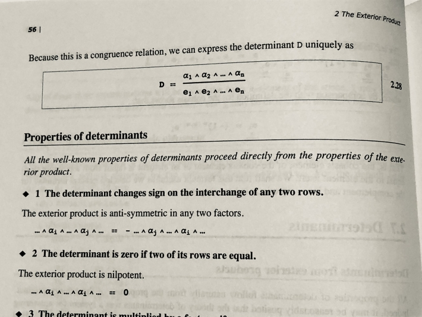
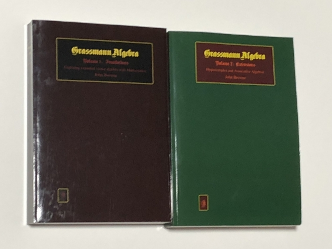

# Grassmann 代数と Cramer の法則 (連立一次方程式の解法)

Grassmann 代数と Cramer の法則の関連について述べる． これは連立一次方程式の解法の一つである． かつて Grassmann がこれを考案した後，忘れられて久しい．

ベクトルの除法が不当に禁忌とされる今日に， この忘れられた解法は[一階偏導関数のより深い応用](https://mathrelish.com/mathematics/grassmann-algebra-and-first-partial-derivative-with-denkers-notation)への基礎となる．

この話題の文献としては [Grassmann Algebra: Foundations: Exploring Extended Vector Algebra With Mathematica](https://amzn.to/3Rjo00u) が詳しい．

## Grassmann 代数を用いた連立一次方程式の解法

次の連立一次方程式の解法について考える． 但し $m$ 個の方程式は独立であり，$m\leq n$ とする．

\begin{equation} \sum_{j=1}^n A_{ij}x_j = b_i ~~ (i\in\{1,\ldots,m\}) \label{eq:liner-equation} \end{equation}

考える連立一次方程式に対して基底 $\{e_i\}_{i=1}^n$ を用いて次の $1$-要素を定める．

\begin{eqnarray} C_0 &:=& \sum_{i=1}^m b_i e_i, \\ C_j &:=& \sum_{i=1}^m A_{ij} e_i ~~ (j\in\{1,\ldots,n\}) \end{eqnarray}

連立一次方程式を $n$ 個の変数 $x$ について解くのだが， これを Grassmann 代数を用いて以下のように行う．

### 解法の手びき

まず連立一次方程式の両辺を $\sum_{i=1}^m e_i$ で足し上げる．

\begin{equation} \sum_{i=1}^m \sum_{j=1}^n A_{ij}x_j e_i = \sum_{i=1}^m b_i e_i \end{equation}

これを$C_0$および$C_j$で書き直して次を得る．

\begin{equation} \sum_{j=1}^n x_j C_j = C_0 \end{equation}

今，□${}_a$ は $a$ 番目が空位であることを表すものとして，次を定義する．

\begin{equation} \underline{C_a} := C_1\wedge\cdots \wedge □_a \wedge\cdots\wedge C_n \end{equation}

すると次が直ちに得られる．

\begin{equation} x_a(C_a\wedge\underline{C_a}) = C_0\wedge\underline{C_a} \end{equation}

行列式 $D$ の分数表示と同様の議論によって，$x_a$ もまた一意に定まるので， 次の分数表記が得られて解が得られたこととなる．

\begin{equation} x_a = \frac{C_0\wedge\underline{C_a}}{C_a\wedge\underline{C_a}} = \frac{C_1\wedge\cdots\wedge C_{a-1}\wedge C_0\wedge C_{a+1}\wedge\cdots\wedge C_n}{C_1\wedge\cdots\wedge C_n} \end{equation}

最右辺は分子分母で交代する数が等しいので，符号が生じないことに注意する． こうして得られた解の表示は，分子分母を $e_1\wedge\cdots\wedge e_n$ で除して行列式に書き直すことで， [Cramerの法則](https://en.wikipedia.org/wiki/Cramer%27s_rule)に他ならないことがわかる．

\begin{equation} x_a = \frac{(C_1\wedge\cdots\wedge C_{a-1}\wedge C_0\wedge C_{a+1}\wedge\cdots\wedge C_n)/(e_1\wedge\cdots\wedge e_n)}{(C_1\wedge\cdots\wedge C_n)/(e_1\wedge\cdots\wedge e_n)} = \frac{\det A_a}{\det A} \end{equation}

ここで $A_a$ は $A$ の $a$ 列目を $b$ で置き換えて得られる行列である．

## 例

### 変数$n$と方程式の数$m$が等しい場合

次の連立一次方程式の解をGrassmann代数を用いて求める．

\begin{equation} \begin{pmatrix} 1 & -2 & 3 & 4 \\ 2 & 0 & 7 & -5 \\ 1 & 1 & 1 & 1 \\ 0 & 1 & -3 & 1 \end{pmatrix} \begin{pmatrix} x_1 \\ x_2 \\ x_3 \\ x_4 \end{pmatrix}= \begin{pmatrix} 2 \\ 9 \\ 8 \\ 7 \end{pmatrix} \end{equation}

この連立一次方程式に対して次の $1$-要素を定める．

\begin{eqnarray} C_0 &:=& 2e_1 + 9e_2 + 8e_3 + 7e_4, \\ C_1 &:=& e_1 + 2e_2 + e_3, \\ C_2 &:=& -2e_1 + e_3 + e_4, \\ C_3 &:=& 3e_1 + 7e_2 + e_3 - 3e_4, \\ C_4 &:=& 4e_1 - 5e_2 + e_3 + e_4 \end{eqnarray}

これから次を得る．

\begin{eqnarray} C_1\wedge C_2\wedge C_3 \wedge C_4 &=& 41(e_1\wedge\cdots\wedge e_4), \\ C_0\wedge C_2\wedge C_3 \wedge C_4 &=& 509(e_1\wedge\cdots\wedge e_4), \\ C_1\wedge C_0\wedge C_3 \wedge C_4 &=& -30(e_1\wedge\cdots\wedge e_4), \\ C_1\wedge C_2\wedge C_0 \wedge C_4 &=& -117(e_1\wedge\cdots\wedge e_4), \\ C_1\wedge C_2\wedge C_3 \wedge C_0 &=& -34(e_1\wedge\cdots\wedge e_4) \end{eqnarray}

故に次のとおり解が求められる．

\begin{equation} (x_1,x_2,x_3,x_4) = \left(\frac{509}{41}, -\frac{30}{41}, -\frac{117}{41}, -\frac{34}{41}\right) \end{equation}

### 変数 $n$ と方程式の数 $m$ が $m$<$n$ の場合

次の連立一次方程式の解を Grassmann 代数を用いて求める．

\begin{equation} \begin{pmatrix} 1 & -2 & 3 & 4 \\ 2 & 0 & 7 & -5 \\ 1 & 1 & 1 & 1 \end{pmatrix} \begin{pmatrix} x_1 \\ x_2 \\ x_3 \\ x_4 \end{pmatrix}= \begin{pmatrix} 2 \\ 9 \\ 8 \end{pmatrix} \end{equation}

この連立一次方程式に対して次の $1$-要素を定める．

\begin{eqnarray} C_0 &:=& 2e_1 + 9e_2 + 8e_3, \\ C_1 &:=& e_1 + 2e_2 + e_3, \\ C_2 &:=& -2e_1 + e_3, \\ C_3 &:=& 3e_1 + 7e_2 + e_3, \\ C_4 &:=& 4e_1 - 5e_2 + e_3 \end{eqnarray}

元の連立一次方程式はこれらを用いて次のように書き直せる．

\begin{equation} \sum_{i=1}^4 x_iC_i = C_0 \end{equation}

ここで今考えているGrassmann代数の最大次数は $3$ であるから， この両辺には高々次数 $2$ の基底としか楔積をとれない．

例として $C_1\wedge C_4$ を右から乗じると次を得る．

\begin{equation} (x_2C_2 + x_3C_3)\wedge C_1\wedge C_4 = C_0\wedge C_1\wedge C_4 \end{equation}

よって次を得る．

\begin{equation} \frac{(x_2C_2 + x_3C_3)\wedge C_1\wedge C_4}{C_0\wedge C_1\wedge C_4} = 1 \end{equation}

ここで次を用いる．

\begin{eqnarray} C_0\wedge C_1\wedge C_4 &=& -63(e_1\wedge e_2\wedge e_3), \\ C_2\wedge C_1 \wedge C_4 &=& -27(e_1\wedge e_2\wedge e_3), \\ C_3\wedge C_1 \wedge C_4 &=& 29(e_1\wedge e_2\wedge e_3) \end{eqnarray}

故に次の関係が得られる．

\begin{equation} \frac{-27x_2 + 29x_3}{-63} = 1 \end{equation}

## 関連

[Grassmann 代数と一階偏導関数 (Denker 記法)](https://mathrelish.com/mathematics/grassmann-algebra-and-first-partial-derivative-with-denkers-notation)

## 参考

- [John Browne](https://www.grassmannalgebra.com/)
    
    - [Grassmann Algebra: Foundations: Exploring Extended Vector Algebra With Mathematica](https://amzn.to/3XL3pV9)
    - [Grassmann Algebra](https://sites.google.com/site/grassmannalgebra/)
- [A History of Vector Analysis: The Evolution of the Idea of a Vectorial System (Dover Books on Mathematics)](https://amzn.to/3Jw3LL3)
- [ベクトルとテンソル | くさび積を用いて連立一次方程式を解く](http://dyna.geo.kyushu-u.ac.jp/~yoshida/japanese/lecture/math-exercise/)
- [Peeter Joot](http://peeterjoot.com/)
    
    - [Cramer’s rule](http://peeterjoot.com/archives/geometric-algebra/ga_wiki_cramers.pdf) [embed]https://www.youtube.com/watch?v=a1oqatTEq64[/embed]
- [線型代数 (ちくま学芸文庫)](https://amzn.to/3YOjvgZ)
- [行列|Matrix 第2版 -グラスマンに学ぶ線形代数入門-](https://amzn.to/3IiljJz)
- [Grassmann 代数と行列式](https://mathrelish.com/mathematics/grassmann-algebra-and-determinant)
- [濫用表記のすゝめ (微分記号)](https://mathrelish.booth.pm/items/5738559)

* * *

Grassmann 代数それ自体について，Mathematica を利用できる方は下記の講演も参考になろう．

[embed]https://www.youtube.com/watch?v=iFXw9KWEjg0[/embed]
