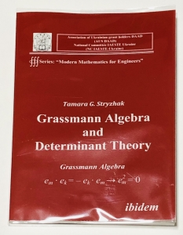
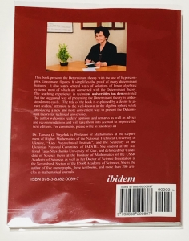

|  |  |
| --- | --- |

# Grassmann 代数と行列式 (楔積による定式化)

行列式と Grassmann 代数の関連について述べる． この話題の文献としては [Grassmann Algebra and Determinant Theory](https://amzn.to/3kRSKcL) が入門的で易しい．

## 行列式との対応

最初に第 $i$ 成分のみ $1$ で他は $0$ とした基底 $e_i$ から標準基底 $\{e_i\}_{i=1}^n$ を集めて，次の $1$-要素を定めておく．

$$ a_j := \sum_{i=1}^n A_{ij}e_i $$

これより次の $n$ 次正方行列 $A$ を考える．

$$ A := \begin{pmatrix}a_1 & \cdots & a_n\end{pmatrix} = \begin{pmatrix} A_{11} & \cdots & A_{1n} \\ \vdots & \ddots & \vdots \\ A_{n1} & \cdots & A_{nn} \end{pmatrix} $$

このとき次が成り立つ．

行列式 $D:=\det A$ は楔積を用いて次のようにかける．

$$ D = \frac{a_1\wedge\cdots\wedge a_n}{e_1\wedge\cdots\wedge e_n} $$

証明は以下のとおり．

$a_1\wedge\cdots\wedge a_n=\sum_{i_1\cdots i_n}A_{i_11}\cdots A_{i_nn} (e_{i_1}\wedge\cdots\wedge e_{i_n})$ であるが， ここで $e_{i_1}\wedge\cdots\wedge e_{i_n}$ は [Levi--Civita の完全反対称テンソル](https://en.wikipedia.org/wiki/Levi-Civita_symbol) $\varepsilon$ を用いて次の評価ができる．

$$ e_{i_1}\wedge\cdots\wedge e_{i_n} = \varepsilon_{i_1\cdots i_n}(e_1\wedge\cdots\wedge e_n) $$

よって行列式の定義から直ちに次が得られる．

$$ a_1\wedge\cdots\wedge a_n = D (e_1\wedge\cdots\wedge e_n) $$

今，もし与えられた基底と行列 $A$ に対して，上式を満たす $D$ が一意に定まるのならば，除算を定めることができる． そこで次の二式を考える．

\begin{eqnarray} a_1\wedge\cdots\wedge a_n &=& D_1 (e_1\wedge\cdots\wedge e_n), \\ a_1\wedge\cdots\wedge a_n &=& D_2 (e_1\wedge\cdots\wedge e_n) \end{eqnarray}

これらの辺々を引いて次を得る．

$$ (D_1-D_2) (e_1\wedge\cdots\wedge e_n) = \underset{n}{0} $$

ここで $\underset{n}{0}$ は $\underset{n}{\Lambda}$ の零元である． こうして得た式が成り立つために，まず $D_1\neq D_2$ の場合を考えると， $e_1\wedge\cdots\wedge e_n = \underset{n}{0}$ でなければならなくなるが，これは明らかに成立しない． よって $D_1=D_2$ のみが残る．これは $D$ が一意に定まることに他ならない．■

### コメント

証明では $e_{i_1}\wedge\cdots\wedge e_{i_n} = \varepsilon_{i_1\cdots i_n}(e_1\wedge\cdots\wedge e_n)$ を用いたが， これは楔積の反対称性を表すものであり， 一般に標準基底でなくとも $a_{i_1}\wedge\cdots\wedge a_{i_n} = \varepsilon_{i_1\cdots i_n}(a_1\wedge\cdots\wedge a_n)$ が従う． よってまた次を得る．

$$ \frac{a_{i_1}\wedge\cdots\wedge a_{i_n}}{a_1\wedge\cdots\wedge a_n} = \varepsilon_{i_1\cdots i_n} $$

## 行列式の諸性質との対応

楔積を用いた行列式の分数表記は，行列式の多重交代線型性を代数的によく表している． また分数表記は共通因数の約分という操作を想起させるが， これも行列式の計算と対応させることができる．

### 線型性

\begin{eqnarray} \frac{a_1\wedge\cdots\wedge(a_i+b_i)\wedge\cdots\wedge a_n}{e_1\wedge\cdots\wedge e_n} &=& \frac{a_1\wedge\cdots\wedge a_i\wedge\cdots\wedge a_n}{e_1\wedge\cdots\wedge e_n} + \frac{a_1\wedge\cdots\wedge b_i\wedge\cdots\wedge a_n}{e_1\wedge\cdots\wedge e_n}, \\ \frac{a_1\wedge\cdots\wedge (ca_i)\wedge\cdots\wedge a_n}{e_1\wedge\cdots\wedge e_n} &=& c \frac{a_1\wedge\cdots\wedge a_i\wedge\cdots\wedge a_n}{e_1\wedge\cdots\wedge e_n} \end{eqnarray}

### 交代性

$$ \frac{a_1\wedge\cdots\wedge a_i\wedge\cdots\wedge a_j \wedge\cdots\wedge a_n}{e_1\wedge\cdots\wedge e_n} = -\frac{a_1\wedge\cdots\wedge a_j\wedge\cdots\wedge a_i \wedge\cdots\wedge a_n}{e_1\wedge\cdots\wedge e_n} $$

この他にも，ある列に別の列を加えても行列式の値が不変であることも，冪零性から明らかである．

$$ \frac{a_1\wedge\cdots\wedge \left(a_i + \sum_{j\neq i}c_ja_j \right) \wedge\cdots\wedge a_n}{e_1\wedge\cdots\wedge e_n} = \frac{a_1\wedge\cdots\wedge a_i \wedge\cdots\wedge a_n}{e_1\wedge\cdots\wedge e_n} $$

### 単位行列の行列式

行列 $A$ が単位行列であるということは $a_i=e_i$ の場合である． すると分子は分母に等しくなり「約して $1$ とする」という計算と対応させることができる．

$$ \frac{e_1\wedge\cdots\wedge e_n}{e_1\wedge\cdots\wedge e_n} = 1 $$

これと Grassmann 代数と行列式の関係から次もまた従う．

$$ \frac{a_1\wedge\cdots\wedge a_n}{a_1\wedge\cdots\wedge a_n} = 1 $$

つまり約分ができる．

### 行列式の乗算

行列 $A,B,C$ が $C=AB$ の関係にあったとする． この場合に $(\det C =) \det(AB) = (\det A)(\det B)$ が従うという性質があった． これは次の単純な約分の関係に対応しており，遥かに見通しが良い．

$$ \frac{c_1\wedge\cdots\wedge c_n}{e_1\wedge\cdots\wedge e_n} = \frac{c_1\wedge\cdots\wedge c_n}{a_1\wedge\cdots\wedge a_n} \frac{a_1\wedge\cdots\wedge a_n}{e_1\wedge\cdots\wedge e_n} $$

証明は次のとおり．まず $C=AB$ より行列 $C$ の $(i,j)$-成分 $C_{ij}$ は $C_{ij}=\sum_{k=1}^n A_{ik}B_{kj}$ である．

今，行列 $C$ を $C=\begin{pmatrix}c_1 & \cdots & c_n\end{pmatrix}$ と分解する場合に，$c_j$ は $c_j=\sum_{i=1}^n C_{ij}e_i$ である． これらのことから次が得られる．

$$ c_j = \sum_{i=1}^n \sum_{k=1}^n A_{ik}B_{kj} e_i = \sum_{k=1}^n B_{kj} \sum_{i=1}^n A_{ik}e_i = \sum_{k=1}^n B_{kj} a_k $$

すると次の評価ができる．

$$ c_1\wedge\cdots\wedge c_n = (\det B) (a_1\wedge\cdots\wedge a_n) = (\det B)(\det A)(e_1\wedge\cdots\wedge e_n) $$

一方で左辺は $c_j=\sum_{i=1}^n C_{ij}e_i$ であることより次が従う．

$$ c_1\wedge\cdots\wedge c_n = (\det C)(e_1\wedge\cdots\wedge e_n) $$

よって $\det(AB) = (\det A)(\det B)$ が得られたことになる．

### 逆行列の行列式

$\det A^{-1}=1/\det A$ であるが，これは単位行列 $E$ に対して $E=AA^{-1}$ であることより， Grassmann 代数では，先の「行列式の乗算」で示した等式より次が対応する．

$$ 1 = \frac{e_1\wedge\cdots\wedge e_n}{a_1\wedge\cdots\wedge a_n} \frac{a_1\wedge\cdots\wedge a_n}{e_1\wedge\cdots\wedge e_n} $$

つまり次を得る．

$$ \frac{e_1\wedge\cdots\wedge e_n}{a_1\wedge\cdots\wedge a_n} = \left. 1 \middle/ \left(\frac{a_1\wedge\cdots\wedge a_n}{e_1\wedge\cdots\wedge e_n}\right) \right. $$

これは分子分母の単純な式の操作に対応している．

## 関連

[Grassmann 代数と Cramer の法則](https://mathrelish.com/mathematics/grassmann-algebra-and-cramers-rule)

## 参考

- [Grassmann Algebra and Determinant Theory](https://amzn.to/3kRSKcL)
- [Grassmann Algebra: Foundations: Exploring Extended Vector Algebra With Mathematica](https://amzn.to/3XL3pV9)
- [線型代数 (ちくま学芸文庫)](https://amzn.to/3YOjvgZ)
- [行列|Matrix 第2版 -グラスマンに学ぶ線形代数入門-](https://amzn.to/3IiljJz)
- [矩形行列の行列式](https://amzn.to/3l5w7kV)
- [濫用表記のすゝめ (微分記号)](https://mathrelish.booth.pm/items/5738559)
