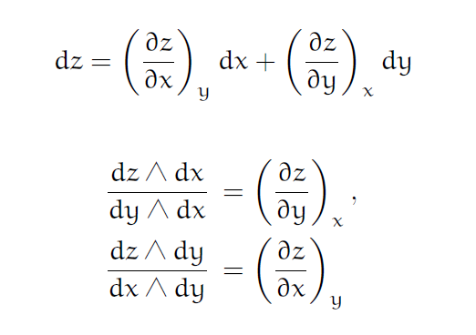

# Grassmann 代数と一階偏導関数 (Denker 記法)

Grassmann 代数を基礎に一階の偏導関数に対する John Denker による分数表記を以下に与える． 代数的に完結したこの表記法は，一階偏導関数の間の様々な関係式を機械的に導くことができる優れた記法である． 偏微分計算への印象も様変わりすることだろう．

## 全微分と連立一次方程式

一般化は容易であるから，簡単のため，$z=f(x,y)$ という二変数関数があったとして， これが偏微分可能だとしよう． そしてその全微分を考えたとしよう．

$$ dz = \left(\frac{\partial z}{\partial x}\right)_y dx + \left(\frac{\partial z}{\partial y}\right)_x dy $$

そして $dx$ と $dy$ を Grassmann 代数の文脈で基底 $e_1$ と $e_2$ に対応させ，$1$-要素 $dz$ があると考えよう． Grassmann 代数としては最高次数が $2$ の場合を考えることになる．

偏導関数の部分を未知数と考え，連立一次方程式としての構造に着目すれば， 我々はこの対象に対して次を得ることができる．

\begin{eqnarray} dz\wedge dx &=& \left(\frac{\partial z}{\partial y}\right)_x dy\wedge dx, \\ dz\wedge dy &=& \left(\frac{\partial z}{\partial x}\right)_y dx\wedge dy \end{eqnarray}

そして我々はこれをもって次に至る．

\begin{eqnarray} \left(\frac{\partial z}{\partial y}\right)_x &=& \frac{dz\wedge dx}{dy\wedge dx}, \\ \left(\frac{\partial z}{\partial x}\right)_y &=& \frac{dz\wedge dy}{dx\wedge dy} \end{eqnarray}

よって次のように全微分を表記できる．

$$ dz = \frac{dz\wedge dy}{dx\wedge dy}dx + \frac{dx\wedge dz}{dx\wedge dy} dy $$

ここでの議論は [Grassmann Algebra: Foundations: Exploring Extended Vector Algebra With Mathematica](https://amzn.to/3XL3pV9) の 4 章 10 節「Decomposition into Components」を合わせて参照するとよい．

Grassmann はこのような分解に対して，右辺第一項を「$dy$ を除く $dx$ 上の $dz$ の影 (shadow)」とよんだ．同じく右辺第二項は「$dx$ を除く $dy$ 上の $dz$ の影」とよんだそうだ．

おそらく $dz$ が $dz=adx+bdy$ と与えられた場合に $dx$ や $dy$ の各スカラー部分をとってくるためであろう．

上記の議論は多変数になっても同様であり， 例えば $w=f(x,y,z)$ という三変数関数の場合には次などが得られる．

$$ \left(\frac{\partial w}{\partial x}\right)_{y,z} = \frac{dw\wedge dy\wedge dz}{dx\wedge dy\wedge dz} $$

## Denker 記法

以上から我々は一階の偏導関数について次の代数的な記法を見出す． 但し □${}_i$ は $i$ 番目が空位であることを表す．

多変数関数 $f(x_1,\ldots,x_n)$ について，その全微分を仮定する．

$$ df = \sum_{i=1}^n \left(\frac{\partial f}{\partial x_i}\right)_{\underline{(x_i)}} dx_i $$

この場合に $f$ の一階偏導関数は，微分を基底ベクトルとした Grassmann 代数上の次の楔積で表記できる．

$$ \frac{df\wedge \underline{dx_i}}{dx_i\wedge \underline{dx_i}} = \left(\frac{\partial f}{\partial x_i}\right)_{\underline{(x_i)}} $$

但しここで次を用いた．

\begin{eqnarray} \underline{(x_i)} &:=& (x_1,\ldots,□_i,\ldots, x_n), \\\\ \underline{dx_i} &:=& dx_1\wedge\cdots\wedge □_i\wedge\cdots\wedge dx_n \end{eqnarray}

楔積を用いた記法がいつ頃からあったのかは定かではないが， 少なくとも 2004 年には [John Denker](https://www.av8n.com/jsd/) が PHYS-L への[投稿](https://www.phys-l.org/archives/2004/12_2004/msg00253.html)と関連して， この記法の熱力学への応用を説いている．

[Explicit Wedge-Product Representation](https://www.av8n.com/physics/partial-derivative.htm#sec-wedge-ratio)

本稿では全微分と一階偏導関数の関係にベクトル空間の構造を見出し， Grassmann 代数の下で一貫した記法である，という立場に立とうとした．

## コメント

### PHYS-L とは

[PHYS-L](https://www.phys-l.org/) は最も長い歴史と最大の会員数 (約 650 人)，そして最も多彩なテーマの投稿を持つ， 物理教育者のためのフォーラムのメーリングリストの最古参である．

[Communities of on-line physics educators](https://aapt.scitation.org/doi/10.1119/1.880507)

[BITNET](https://en.wikipedia.org/wiki/BITNET) (Because It's Time Network の略称でインターネットに先行する電子メールネットワーク，かつて米国を中心に大学間での情報交換に用いられた) 上の最初の PHYS-L リストは，1987 年に 7 人のメンバーで構成された．

今日，PHYS-L は 1996 年 2 月以降のすべての投稿のアーカイブと， リストのメンバーの個人的なホームページへのリンクが残されている．

### 記法の再発見

SNS の普及・成熟に伴って，この記法の再発見または言及が話題となることがある． 例えば 2020 年代以降では 2021 年 9 月 13 日 に， John Carlos Baez 氏と Jules Jacobs 氏の Twitter 上の[やりとり](https://twitter.com/JulesJacobs5/status/1437415867185344517)があった．

この一連のやりとりは下記に整理してまとめられている．

[The Cyclic Identity for Partial Derivatives](https://johncarlosbaez.wordpress.com/2021/09/13/the-cyclic-identity-for-partial-derivatives/)

また 2022 年 6 月 10 日には，@lagu_ran 氏による[投稿](https://twitter.com/lagu_ran/status/1534967698307702785)もある． (引用リツイート先にある @adhara_mathphys 氏の文献案内も参考になる)

しかしそれら SNS 上のやりとりは概念上の疑念を伴っている面も否めず， 例えば daudaudaudau 氏による 2010 年 1 月 25 日から始まる PhysicsForums の投稿では， 否定的な回答が目立つ．

[Connection between cross product and partial derivative](https://www.physicsforums.com/threads/connection-between-cross-product-and-partial-derivative.372510/)

### 高階の場合

Denker 記法は帰納的に高階の場合も考えることはできる．

例えば二階の偏導関数は次のように一階の偏導関数の全微分を考えればよい．

\begin{eqnarray} d\left(\frac{\partial f}{\partial x}\right) &=& \frac{\partial^2f}{\partial x^2}dx + \frac{\partial^2f}{\partial y\partial x}dy, \\ d\left(\frac{\partial f}{\partial y}\right) &=& \frac{\partial^2f}{\partial x\partial y}dx + \frac{\partial^2f}{\partial y^2}dy \end{eqnarray}

これから次が得られる．

\begin{eqnarray} \frac{\partial^2f}{\partial x^2} &=& \frac{df_x\wedge dy}{dx\wedge dy}, \\ \frac{\partial^2f}{\partial y\partial x} &=& \frac{df_x\wedge dx}{dy\wedge dx}, \\ \frac{\partial^2f}{\partial x\partial y} &=& \frac{df_y\wedge dy}{dx\wedge dy}, \\ \frac{\partial^2f}{\partial y^2} &=& \frac{df_y\wedge dx}{dy\wedge dx} \end{eqnarray}

この他，実際の計算に際しては Jacobi の公式も利用するとよい．

$$ d(\det A) = \mathrm{tr}(\mathrm{adj}(A)dA) $$

以上にして高階の場合も代数的に扱うことができるが， 実際の手計算は非常に大変であるため，筋の良い計算とはとても言えない． 一階の場合に限定して用いるのが現実的であろう．

## 例

Denker 記法の有用性は一階偏導関数に関する各種の公式の代数的な導出である． これについて最後に述べておこう．

それらは代数的に完結しており，実に elegant である．

### 共通因数

$$ \frac{df\wedge \underline{dx_i}}{dx_i\wedge \underline{dx_i}} = \frac{c}{c}\frac{df\wedge \underline{dx_i}}{dx_i\wedge \underline{dx_i}} = \frac{c(df\wedge \underline{dx_i})}{c(dx_i\wedge \underline{dx_i})} = \frac{d(cf)\wedge \underline{dx_i}}{d(cx_i)\wedge \underline{dx_i}} $$

分子分母の共通因数 $c(\neq 0)$ を上記のように変形できるから，次が成り立つ．

$$ \left(\frac{\partial f}{\partial x_i}\right)_{\underline{(x_i)}} = \left(\frac{\partial (cf)}{\partial (cx_i)}\right)_{\underline{(x_i)}} $$

このような式変形の例として，例えば，群速度 $v_g=\partial\omega/\partial k$ に対して，Dirac 定数 $\hbar$ の逆数を分子分母に乗ずれば，$E=\hbar\omega$ および $p=\hbar k$ であるから，次の変形ができる．

$$ v_g = \frac{\partial\omega}{\partial k} = \frac{\partial E}{\partial p} $$

### 陰関数の連鎖律 (相反公式)

$$ \left(\frac{\partial x}{\partial y}\right)_z = \frac{dx\wedge dz}{dy\wedge dz} = \frac{1}{\frac{dy\wedge dz}{dx\wedge dz}} = \frac{1}{(\partial y/\partial x)_z} $$

造作もない．実に simple だ．

### Euler の連鎖式 (循環公式)

\begin{eqnarray} \left(\frac{\partial x}{\partial y}\right)_z \left(\frac{\partial y}{\partial z}\right)_x \left(\frac{\partial z}{\partial x}\right)_y &=& \frac{dx\wedge dz}{dy\wedge dz} \frac{dy\wedge dx}{dz\wedge dx} \frac{dz\wedge dy}{dx\wedge dy} \\ &=& \frac{dx\wedge dz}{dy\wedge dz} \frac{-(dx\wedge dy)}{-(dx\wedge dz)} \frac{-(dy\wedge dz)}{dx\wedge dy} \\ &=& (-)^3 \frac{dx\wedge dz}{dy\wedge dz} \frac{dx\wedge dy}{dx\wedge dz} \frac{dy\wedge dz}{dx\wedge dy} \\ &=& -1 \end{eqnarray}

$-1$ が見事に交代性から導かれている．

### 合成関数の連鎖律

$z=f(x,y),x=\phi(u,v),y=\psi(u,v)$ のとき次を考える．

$$ \left(\frac{\partial z}{\partial u}\right)_v = \frac{dz\wedge dv}{du\wedge dv} $$

ここで右辺について次を代入する．(そう！**代入** ができるのだ！)

$$ dz = \frac{dz\wedge dy}{dx\wedge dy}dx + \frac{dx\wedge dz}{dx\wedge dy} dy $$

すると次を得る ($dx$ と $dy$ の係数がスカラーであることに注意)．

$$ \frac{dz\wedge dv}{du\wedge dv} = \frac{dz\wedge dy}{dx\wedge dy} \frac{dx\wedge dv}{du\wedge dv} + \frac{dz\wedge dx}{dy\wedge dx}\frac{dy\wedge dv}{du\wedge dv} $$

これは次の合成関数の連鎖律に他ならない．

$$ \left(\frac{\partial z}{\partial u}\right)_v = \left(\frac{\partial z}{\partial x}\right)_y\left(\frac{\partial x}{\partial u}\right)_v + \left(\frac{\partial z}{\partial y}\right)_x\left(\frac{\partial y}{\partial u}\right)_v $$

> しばしば Euler の連鎖式や多変数の合成関数の連鎖律をもって「偏微分は約分できないから分数ではない」という言説が唱えられることがあるが，これは誤った推論から導かれた結論である． というのも，例えば連鎖律には $\partial x$ が分母と分子に表れているが，これらは固定している変数が異なっているので，そもそも別物である．ところがしかし，次のように略記してしまうと同じものに見間違えてしまう． $$ \frac{\partial z}{\partial x} \frac{\partial x}{\partial u} = \frac{\partial z}{\partial u} ~~ (\mathrm{wrong!}) $$ 異なった量はそもそも約分できない．よって「偏微分は約分できないから分数ではない」という文章はそもそも成立していないことがわかる． ところで Denker 記法であれば，異なった量であることが誰の目にも明らかであり，そして代数的に求めることができた．このようなところに Denker 記法の有用性があるのである．

### 三変数関数の陰関数定理

$f(x,y,z)=0$ および $z=\zeta(x,y)$ に対して， これらより $df=0$ および $dz=d\zeta$ であるから次が得られる．

$$ f_x dx + f_y dy + f_z d\zeta = 0 $$

これに「$\wedge dy$」を作用させて次を得る．

$$ -\frac{f_x}{f_z} = \frac{d\zeta\wedge dy}{dx\wedge dy} = \zeta_y $$

同様に「$\wedge dx$」を作用させて次を得る．

$$ -\frac{f_y}{f_z} = \frac{d\zeta\wedge dx}{dy\wedge dx} = \zeta_x $$

ところで上記の計算は，[Grassmann 代数と行列式](https://mathrelish.com/mathematics/grassmann-algebra-and-determinant)から，次のようにも解釈できる．

$$ -\frac{(df\wedge dy\wedge dz)/(dx\wedge dy\wedge dz)}{(df\wedge dx\wedge dy)/(dz\wedge dx\wedge dy)} = \frac{df\wedge dz\wedge dy}{df\wedge dx\wedge dy} = \begin{vmatrix} 1 & 0 & 0 \\ 0 & \zeta_x & 0 \\ 0 & \zeta_y & 1 \end{vmatrix}_{df,dx,dy} = \begin{vmatrix} \zeta_x & 0 \\ \zeta_y & 1 \end{vmatrix}_{dx,dy} = \frac{d\zeta\wedge dy}{dx\wedge dy} $$

ここで一つ目の行列式は基底 $df,dx,dy$ で考えているので，上記の成分表示になっている． 次にこれを簡約して二つ目の行列式にできるが，このとき基底は $dx,dy$ になっていて整合している．

### 直交座標と極座標の相互変換

直交座標 $(x,y)$ と極座標 $(r,\theta)$ に対して次を示そう．

$$ \left(\frac{\partial x}{\partial r}\right)_{\theta} = \left(\frac{\partial r}{\partial x}\right)_y $$

> 以下の計算は面倒ではあるものの，機械的にできるという点が評価できる． Denker 記法の整合性の確認の意味合いもある． 簡単に済まそうと思えば，左辺を直ちに $\cos\theta$ と評価し， $r^2=x^2+y^2$ から $rdr=xdx+ydy$ であり， よって $r(dr\wedge dy)=x(dx\wedge dy)$ より， 右辺もまた $\cos\theta$ であることを述べて終わりである．

説明の便宜で右辺から左辺を導く．

まず $dx\wedge dy=r(dr\wedge d\theta)$ である． そして $y=r\sin\theta$ から $dy=\sin\theta dr + xd\theta$ であり， $r=x\sec\theta$ から $dr=\sec\theta(dx + x\tan\theta d\theta)$ である．

よって次を得る．

$$ dr\wedge dy = dr\wedge (xd\theta) = r(dx\wedge d\theta) $$

これより次の評価ができる．

$$ \left(\frac{\partial r}{\partial x}\right)_y = \frac{dr\wedge dy}{dx\wedge dy} = \frac{r(dx\wedge d\theta)}{r(dr\wedge d\theta)} = \frac{dx\wedge d\theta}{dr\wedge d\theta} = \left(\frac{\partial x}{\partial r}\right)_{\theta} $$

同様に次を示すことができる．

$$ \left(\frac{\partial y}{\partial r}\right)_{\theta} = \left(\frac{\partial r}{\partial y}\right)_x $$

それは次のとおり．

$x=r\cos\theta$ から $dx=\cos\theta dr - yd\theta$であり， $r=y\csc\theta$ から $dr=\csc\theta(dy - \cot\theta d\theta)$ である．

よって次を得る．

$$ dr\wedge dx = dr\wedge (-yd\theta) = -r(dy\wedge d\theta) $$

故に次の評価ができる．

$$ \left(\frac{\partial r}{\partial y}\right)_x = \frac{dr\wedge dx}{dy\wedge dx} = \frac{-r(dy\wedge d\theta)}{-r(dr\wedge d\theta)} = \frac{dy\wedge d\theta}{dr\wedge d\theta} = \left(\frac{\partial y}{\partial r}\right)_{\theta} $$

上記の評価で $\wedge$ の交代性 $dy\wedge dx=-(dx\wedge dy)$ に注意する．

この他，得られた二つの式を Denker 記法で考えて割れば，次も代数的に導くことができる．

\begin{eqnarray} \left. \left(\frac{dr\wedge dy}{dx\wedge dy}\right) \middle/ \left(\frac{dr\wedge dx}{dy\wedge dx}\right) \right. &=& \left. \left(\frac{dx\wedge d\theta}{dr\wedge d\theta}\right) \middle/ \left(\frac{dy\wedge d\theta}{dr\wedge d\theta}\right) \right. \\ - \frac{dy\wedge dr}{dx\wedge dr} &=& \frac{dx\wedge d\theta}{dy\wedge d\theta} \end{eqnarray}

即ち次を得た．

$$ -\left(\frac{\partial y}{\partial x}\right)_r = \left(\frac{\partial x}{\partial y}\right)_{\theta} (=\cot\theta) $$

### 直交座標と極座標についての合成関数の微分公式

直交座標 $(x,y)$ と極座標 $(r,\theta)$ に対して，$f(x,y)$ を考えるとき，次が成り立つ．

$$ (f_x)^2 + (f_y)^2 = (f_r)^2 + \frac{1}{r^2}(f_{\theta})^2 $$

これは次のように直接に代数計算によって示すことができる．

$$ \left(\frac{df\wedge dy}{dx\wedge dy}\right)^2 + \left(\frac{df\wedge dx}{dy\wedge dx}\right)^2 = \frac{(df\wedge dx)^2 + (df\wedge dy)^2}{(dx\wedge dy)^2} $$

ここで $dx=\cos\theta dr - r\sin\theta d\theta$ および $dy=\sin\theta dr + r\cos\theta d\theta$ を代入して整理すれば， 分母は $r^2(dr\wedge d\theta)^2$ であり，また分子は交叉項が相殺して次式になる．

$$ (df\wedge dx)^2 + (df\wedge dy)^2 = r^2(df\wedge d\theta)^2 + (df\wedge dr)^2 $$

よって次を得る．

$$ \left(\frac{df\wedge dy}{dx\wedge dy}\right)^2 + \left(\frac{df\wedge dx}{dy\wedge dx}\right)^2 = \left(\frac{df\wedge d\theta}{dr\wedge d\theta}\right)^2 + \frac{1}{r^2}\left(\frac{df\wedge dr}{d\theta\wedge dr}\right)^2 $$

これは示すべき等式に他ならない．

### Cauchy--Riemannの方程式

正則な複素関数 $f$ は二つの実変数 $(x,y)$ の関数ではなく，真に一つの複素変数 $z$ についての関数である．

$$ \frac{\partial f}{\partial \bar{z}} = 0 $$

左辺は $(df\wedge dz)/(d\bar{z}\wedge dz)$ と書けるから，このことは次を意味する．

$$ df\wedge dz = 0 $$

よって $dz=dx+idy$ および二つの実関数に対して，$f(z) = u(x,y) + iv(x,y)$ と分解するとき，$df=(u_x+iv_x)dx + (u_y+iv_y)dy$ であるから，これらを代入して次の評価ができる．

$$ (-(u_y+v_x)+i(u_x-v_y))(dx\wedge dy) = 0 $$

故に二変数実関数 $u,v$ が満たすべき方程式として Cauchy--Riemann の方程式が得られた．

\begin{eqnarray} u_x &=& v_y, \\ u_v &=& -v_x \end{eqnarray}

### 偏微分の順序交換と外微分

$1$-形式への外微分 $d_1$ を考えるとき，$f(x,y)$ の全微分 $df$ が次を満たしたとしよう．

$$ d_1df = 0 $$

> 外微分と通常の微分とは区別しよう． 何れも単に $d$ と書いて記述を簡便化するのが標準的であり， また $d^2f=0$ というように冪で書いたりするが， この指数 $2$ は同じものを二つ重ねていることを意味していない． 単に略記しているだけである． このことを強調するために，ここでは略さずに書いている．

$d_1df = 0$ を満たす $f$ の条件は，偏微分について可換であることに他ならない． それは次のようにして，直接の代数計算によってわかる．

$$ 0 = d_1df = df_x\wedge dx + df_y\wedge dy $$

よって $dx\wedge dy$ で割って整理すれば次が得られる．

$$ \frac{df_y\wedge dy}{dx\wedge dy} = \frac{df_x\wedge dx}{dy\wedge dx} $$

これは次式に他ならない．

$$ \frac{\partial^2 f}{\partial x\partial y} = \frac{\partial^2 f}{\partial y\partial x} $$

### Poisson 括弧と Nambu 括弧

Poisson 括弧の定義を次に与えよう． 但し $\partial(f,g)/\partial(a,b)$ は $f(a,b)$ および $g(a,b)$ に対する Jacobi 行列である．

$$ \{f,g\}_{a,b} := \det\frac{\partial(f,g)}{\partial(a,b)} = \left(\frac{\partial f}{\partial a}\right)_b \left(\frac{\partial g}{\partial b}\right)_a - \left(\frac{\partial g}{\partial a}\right)_b\left(\frac{\partial f}{\partial b}\right)_a $$

Nambu 括弧とはこれを多変数の場合に拡張した次の括弧積のことである．

$$ \{f_1,\ldots,f_n\}_{a_1,\ldots,a_n} := \det\frac{\partial(f_1,\ldots,f_n)}{\partial(a_1,\ldots,a_n)} $$

さて上記に述べた二つの括弧積と Denker 記法の関係を述べよう． これら括弧積は行列式が基礎になっているから，[Grassmann 代数と行列式](https://mathrelish.com/mathematics/grassmann-algebra-and-determinant)の関係から次が従う．

\begin{eqnarray} \{f,g\}_{a,b} &=& \frac{df\wedge dg}{da\wedge db}, \\ \{f_1,\ldots,f_n\}_{a_1,\ldots,a_n} &=& \frac{df_1\wedge\cdots\wedge df_n}{da_1\wedge\cdots\wedge da_n} \end{eqnarray}

これから括弧積の間の様々な関係式を代数的に容易に示すことができる．

例えば $f(a,b),g(a,b),h(a,b)$ があって，$(\partial f/\partial g)_h$ という量を考えるとき，次を導出できる．

$$ \left(\frac{\partial f}{\partial g}\right)_h = \frac{df\wedge dh}{dg\wedge dh} = \left. \left(\frac{df\wedge dh}{da\wedge db} \right) \middle/ \left(\frac{dg\wedge dh}{da\wedge db}\right) \right. = \frac{\{f,h\}_{a,b}}{\{g,h\}_{a,b}} $$

同様に $k(a,b)$ という二変数関数を考えて，次を導出できる．

$$ \{f,g\}_{h,k} = \frac{df\wedge dg}{dh\wedge dk} = \left. \left(\frac{df\wedge dg}{da\wedge db} \right) \middle/ \left(\frac{dh\wedge dk}{da\wedge db}\right) \right. = \frac{\{f,g\}_{a,b}}{\{h,k\}_{a,b}} $$

以上は Poisson 括弧を例にしたが，Nambu 括弧でも全く同様で， $n$ 変数 $(a_1,\ldots,a_n)$ の関数 $f,g,h_1,\ldots,h_{n-1}$ および $f_1,\ldots,f_n$ と $g_1,\ldots,g_n$ に対して，次が成り立つ．

\begin{eqnarray} \left(\frac{\partial f}{\partial g}\right)_{h_1,\ldots,h_{n-1}} &=& \frac{\{f,h_1,\ldots,h_{n-1}\}_{a_1,\ldots,a_n}}{\{g,h_1,\ldots,h_{n-1}\}_{a_1,\ldots,a_n}}, \\ \{f_1,\ldots,f_n\}_{g_1,\ldots,g_n} &=& \frac{\{f_1,\ldots,f_n\}_{a_1,\ldots,a_n}}{\{g_1,\ldots,g_n\}_{a_1,\ldots,a_n}} \end{eqnarray}

## 関連

[Grassmann 代数と行列式](https://mathrelish.com/mathematics/grassmann-algebra-and-determinant)

[Grassmann 代数と Cramer の法則](https://mathrelish.com/mathematics/grassmann-algebra-and-cramers-rule)

## 参考

- [Grassmann Algebra: Foundations: Exploring Extended Vector Algebra With Mathematica](https://amzn.to/3XL3pV9)
- [arXiv:1411.2582 | Hessian matrix, specific heats, Nambu brackets, and thermodynamic geometry](https://arxiv.org/abs/1411.2582)
- [Grassmann 代数と Cramer の法則](https://mathrelish.com/mathematics/grassmann-algebra-and-cramers-rule)
- [濫用表記のすゝめ (微分記号)](https://mathrelish.booth.pm/items/5738559)
