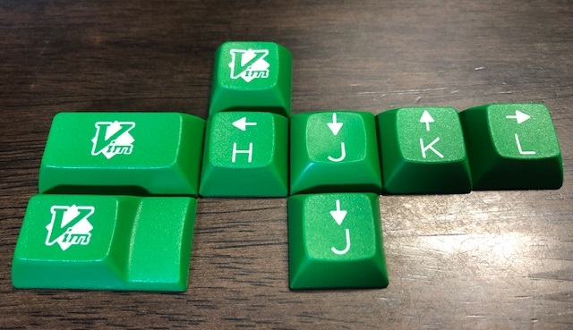
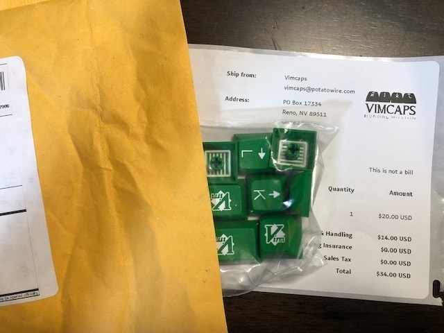
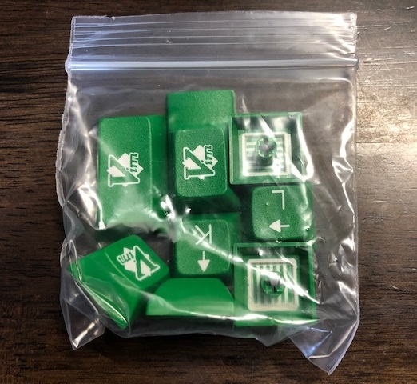
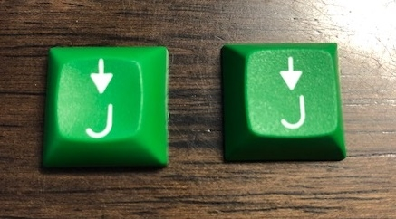

# Green Vimcaps

ようやく緑色の Vimcaps を手に入れました！

## 緑色の Vimcaps について

[Vimcaps](https://mathrelish.com/electronic-kit/sa-carbon-vimcaps)

以前に上記で SA Carbon Vimcaps をご紹介しました．

SA Carbon Vimcaps とは SA プロファイルの Carbon という配色テーマに従った Vimcaps のことです．それはそれでよかったのですが，Vim のシンボルカラーともいうべき緑配色が一番欲しかったのです．

当初，Vimcaps ではそのような緑色のキーキャップを扱っていて，有名になり（？），品切れ状態に陥りました． その間に他の配色テーマを販売するなど，手広く普及させていました．

そこへ来て，ようやく緑配色が再販されることになりました． しかも SA と DSA の二つのプロファイルで，です！

個人的に DSA プロファイルのものを待ちわびていたので，今回はこちらを購入しました！

## 注文から届くまで

### 注文

Vimcaps は下記のページで売っています．

[Vimcaps](https://vimcaps.com/)

SA Carbon のときと違って，PayPal 購入ページがすぐ見つかるようになっていました．助かる！

### 日本語住所に苦戦

PayPal で購入する際に日本語住所になっていました． 以前にこれでも届いたような曖昧な記憶があったので，そのまま購入手続きを進めたのですが， 後日，Brandon さんから日本語は処理できないシステムだから， 英語表記でお願いいたします，という旨のメールがきました．

「PayPal 英語住所」とか検索すると，やり方の解説ページが山ほど出てくるので， それを参考に変更して再び購入して事なきを得ました． (以前の注文はキャンセル扱い)

### 届く！

SA Carbon Vimcaps のときと違って，一週間くらいでしょうか，すぐに届きました． 何気に上記の画像右上にロゴがありますが，こういうところが愛着を持てるポイントです．

生きていれば，再販という機会に恵まれるんですね．健やかに生きたいです． 年令を重ねるとこの意味がよくわかってきます．

はい，というわけで早速中を見ていきます． (包装は「チャック付きポリ袋」でした)

### J について

J が二つ入っているのですが，これらの違いは右手側のホームポジションの有無です． 公式サイトでは dish (皿) のあるなしで表現しています．

実物を見るとパッと見では一緒に見えるのですが，よく見るとホームポジションがある方は凹んでいます． つまり皿があります．上記画像では左が皿あり，右が皿なしです．

確かに人差し指でなぞってみると，違いを実感できます． 目立たない程度でこの違いを出せているのに驚きました．

これで Vim が一段と楽しくなるかなと思います！

## Vim 書籍

|  |  |  |  |
| --- | --- | --- | --- |

