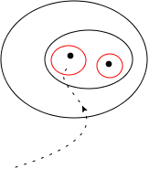
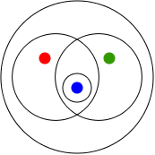

# ハウスドルフ空間

位相幾何学や多様体を扱う際にハウスドルフであることを仮定することが多い． それはどうしてだろうか．一つの理由について述べたい．

[The Math Relish Journal Volume 1S](https://mathrelish.booth.pm/items/1123647/)

## 着想や背景

### 近傍と点列の収束

ハウスドルフ空間を理論構成の道具立てとして議論で仮定する理由は， 点列の収束の一意性を保証したいからである． このことを考える過程で自然とハウスドルフ空間の定義が見えてくる．今，それを見てみよう．

まず位相空間上での点列の収束を次のように定義する．

位相空間 $S$ 上の点列 $\lbrace x_n\rbrace_{n=1}^{\infty}$ が $x\in S$ に収束するとは，$x$ の任意の近傍 $U$ について次が成り立つことをいい，これを $x_n\rightarrow x$ とかく． $$\forall U\ni x,~ \exists N,~ \lbrace x_n\rbrace_{n\geq N} \subset U$$

これは点列のある点から先は収束先となる点の近傍にすべて含まれることをいっている． 集合だけで収束性を表現できているのである．素晴らしい．

### 望ましくない収束例

位相空間上の収束の定義から，位相によっては次のことがあり得ることになる．

- 収束が一意でない．
- 収束できない点列がある．

このようなあまり歓迎しない位相の例として，それぞれ密着位相 $\lbrace \emptyset, S\rbrace$ と離散位相 $2^S$ を挙げることができる．

密着位相では収束の定義にある近傍は全体集合 $S$ しかないから，$N$ は $1$ となり，$S$ のどんな点も点列の収束先になる．

離散位相ではすべての部分集合が位相として存在するため，ある $n$ から同一の値を取り続ける点列 $\lbrace \cdots,x_{n-2},x_{n-1},a,a,a,\cdots\rbrace$ しか収束できない． 例えば点列 $\lbrace 1,1.4,1.41,1.414,1.4142,\cdots\rbrace$ は有限な $N(<\infty)$ では近傍 $U$ が定まらないので $\sqrt{2}$ に収束できない．つまりどんなに点列の添字を大きくしても，$U=\{\sqrt{2}\}$ に属するようにはできず，収束の定義にある「任意の開集合に対して」に反する開集合が存在することとなり収束しない．

### 収束が一意であるのはどのような場合か？

次の説明から収束の一意性を保証するような位相とはどのような位相かが予想できる． 位相の自由度で収束の一意性を保証しようとしているので，近傍としては開近傍を前提として以下では考える.

図に示すように点列が破線のように推移していくとき， もし収束先が一意でなければ，$U$ には二つ以上の元が属していることになる．

今，赤線で記したような開近傍の存在が保証されていたとしよう． これらは互いに素であることによって，二つの元を分離できている．

いつでもこのような開近傍による「分離」が可能な位相を考えれば， 仮に赤線の中でもまた二つ以上の元があったとしても， 再び同じように一つの元しか含まないような開近傍をとることができる． 図の黒枠はその履歴である． これがいつでもそうなので，収束の一意性が保証されていると予想できる．

## 定義

位相空間 $S$ の相異なる任意の二点 $p_1,p_2$ に対して，$U(p_1)\cap U(p_2)=\emptyset$ を満たす開近傍 $U(p_1),U(p_2)$ が存在するならば，位相空間 $S$ はハウスドルフ空間もしくは $T_2$ 空間であるという．

定義よりハウスドルフ空間とは，相異なる点の近傍は重ならないように「分離」できる位相空間のことをいう．

### ハウスドルフ性と収束の一意性

位相空間 $S$ がハウスドルフであるならば，$S$ 内の収束する点列の収束先は一意である． 即ちハウスドルフ性は収束の一意性に対する十分条件である．

背理法で示す．$x_n\rightarrow a_1,a_2(a_1\neq a_2)$ が成立したとする． $a_1$ にも $a_2$ にも収束するということは次のことを意味する．

$$\forall U_i\ni a_i,~ \exists N_i,~ \lbrace x_n\rbrace_{n\geq N_i} \subset U_1 ~ (i=1,2)$$

これから $N:=\max(N_1,N_2)$ とするとき次が成り立つ．

$$\lbrace x_n\rbrace_{n\geq N} \subset U_1 \cap U_2$$

これは $U_1\cap U_2\neq\emptyset$ であることを意味している． ところが一方でハウスドルフ性より，$U_1\cap U_2=\emptyset$ である． よって前提に矛盾したから背理法により，$a_1=a_2$ であり命題は真である．■

## コメント

### 密着位相と分離

位相のハウスドルフ性は収束の一意性に対する十分条件であったから，その対偶命題「収束が一意でないならばハウスドルフでない」が得られる．これにより例えば密着位相はハウスドルフではないとわかる．ここで特に密着位相について直接にハウスドルフではないことを示すと，「分離」という用語により近づける．証明は次のとおり．

密着位相はハウスドルフではない．

$S$ の相異なる二点 $p_1,p_2$ を任意にとるとき，何れの点についても開近傍 $U$ は密着空間が採用する位相の元 (開集合) から選ばなければならないが，それは全体集合 $S$ しかない．何故ならば空集合 $\emptyset$ はその中に要素を一つも含まないのだから，そもそも任意の点に関して近傍に成り得ず，全体集合 $S$ しかあり得ないからである．よって $U(p_1)\cap U(p_2)= S\cap S = S\neq\emptyset$ を得ることになる．即ち開近傍は互いに素ではなく，従ってハウスドルフでない．■

密着位相の「密着」という語の由来も，上記の証明からわかるだろう． つまりどの点についても，近さの数学的な尺度である開近傍は，全体集合それ自身となる． よってすべての点が「近く」にあることになり，このことを「密着」と形容しているのである． 密着位相はすべての点が「近く」にあるのでどうやっても「分離」できないような自明な例である． ハウスドルフ性は二つの開近傍が重ならない程度に「分離」できることを言っているのである．

### 分離公理

「分離」という考え方はどれだけ二点が「近い」かを表現する概念という側面を持っており， 位相空間の分類指標として役立つと考えられる． そこで様々な「分離」が考えられてきた． それらは分離公理とよばれ今日に至っている．

ハウスドルフ空間を $T_2$ とよんでいるのはそのことが由来している． 「分離公理」を意味するドイツ語の Trennungsaxiom に由来しているからである．

分離公理は公理と冠しているが，制約条件のような意味合いである． つまり位相空間それ自体を定義付けるものではなく，分類の尺度に用いられる位相が満たすべき条件のことを指す． 何を「公理」とするかは，強く文脈や書き手に依存する訳だが， あまりそのような強い意味はなく，「公理」とよぶのはあくまで習慣に過ぎない．

ハウスドルフ空間 $T_2$ よりも原始的な分離公理として次の二つの定義を与えておこう．

#### コルモゴロフ空間 ($T_0$ 空間) の定義

位相空間 $S$ の相異なる任意の二点 $p_1,p_2$ に対して，$p_1\in U \wedge p_2\not\in U$ または $p_1\not\in U \wedge p_2\in U$ を満たす開近傍 $U$ が存在するならば，位相空間 $S$ はコルモゴロフ空間もしくは $T_0$ 空間であるという．

#### フレシェ空間 ($T_1$ 空間) の定義

位相空間 $S$ の相異なる任意の二点 $p_1,p_2$ に対して，$p_2\not\in U(p_1)$ 且つ$p_1\not\in U(p_2)$ を満たす開近傍 $U(p_1),U(p_2)$ が存在するならば，位相空間 $S$ はフレシェ空間もしくは $T_1$ 空間であるという．定義から $T_2$ 空間のように開近傍 $U(p_1),U(p_2)$ は必ずしも互いに素でなくてよい．

フレシェ空間という用語は関数解析学でも表れる．しかしこれらは名称は同じだが異なるものである． 通常この混乱を避けるために，フレシェ空間とは言わずに $T_1$ 空間という．

## 例

### ハウスドルフである例

密着位相はハウスドルフではなかったが，次に示すとおり対照的に離散位相はハウスドルフの自明な例である．

離散位相はハウスドルフである．

離散位相は任意の部分集合を開集合とする位相である． このため一点集合であるシングルトンもまた開集合である． 今，相異なる任意の二点をとってきたとき， これらが属する開集合として，それらから定まるシングルトンが考えられる． そして相異なる二点をとってきているので，それら開集合は互いに素である．

$$ U(p_1) \cap U(p_2) = {p_1} \cap {p_2} = \emptyset $$

これはハウスドルフであることに他ならない．故に離散位相はハウスドルフである．■

先にも述べたように離散位相での収束列は華やかさに欠けるところがあるが， それでも収束する場合は一意性を保証する例である．

### ハウスドルフでない例

物理学の議論に必要な数学や，そうでなくとも通常の多様体を論ずる場合には，大抵の場合，ハウスドルフ空間が仮定される．このため人によってはハウスドルフでない空間の例を欲することがある．

例として考える以上は，ハウスドルフでない例のうち，$T_1$ 空間であるが，$T_2$ 空間でない例の方が価値があるだろう．

何故ならば，定義からわかるように $T_2$ 空間であるならば $T_1$ 空間であり，$T_1$ 空間であるならば $T_0$ 空間という包含関係が成り立つからである．

#### シェルピンスキー位相

よくハウスドルフでない例として，密着位相が挙げられるが，これは開近傍が全体集合唯一つなので，他方を含んでしまうことになって明らかに $T_0$ 空間にすら成り得ない． 密着位相は言ってみればひどい例である．

まず $T_0$ 空間だが，$T_1$ 空間でない例として次を挙げる．

全体集合が $S := \lbrace 0,~1\rbrace$ であり，位相を $\mathfrak{O} := \lbrace\emptyset,~ \lbrace 0\rbrace,~ S \rbrace$ とする位相空間は $T_0$ 空間であるが，$T_1$ 空間でない.

考える集合は二点集合なので，$0$ および $1$ について言及すればよい． まず $U:=\lbrace 0\rbrace$ は $0\in U\land 1\notin U$ を満たす開近傍として考える位相空間に存在する．よって $T_0$ である．

また一方で $1$ の開近傍は全体集合のみであるから，どうしても $0$ を含むことになる．よって $T_1$ でない．■

同様の例として次を挙げる．

全体集合が $S := \lbrace a,~b,~c\rbrace$ であり，位相を $\mathfrak{O} := \lbrace\emptyset,~ \lbrace a\rbrace,~ \lbrace a,~ b\rbrace,~ \lbrace a,~ c\rbrace,~ S \rbrace$ とする位相空間は $T_1$ 空間でも，$T_2$ 空間でもない. 

この位相空間では，異なる二点 $b,c$ について，これらを含む開集合はそれぞれ $S,\lbrace a,b\rbrace,\lbrace a,c\rbrace$ の何れかしか無いため，点 $b$ を含む如何なる開集合と点 $c$ を含む如何なる開集合を取っても，それらの共通部分は空にはならない．事実，問題となる開集合を $U_1,U_2$ とするとき次式が成立する．

$$U_1 \cap U_2 = \lbrace a\rbrace \neq \emptyset$$

よって $T_2$ 空間でない．

またこれら二点 $b,c$ を含む開集合は必ず点 $a$ を含む． よって与えられた位相に於いてこれら二点は $a$ と $T_1$ 分離できない．■

#### 補有限位相

以上に見たように，$T_1$ 空間であるが，$T_2$ 空間でない例を挙げることは実のところ少々容易なことではなく，一つ重要で本質的な例を挙げるとすれば補有限位相 (cofinite topology) がある．

[Cofiniteness](https://en.wikipedia.org/wiki/Cofiniteness)

　

位相空間 $S$ に対して次の位相を補有限位相という．

$$ \mathfrak{O}_{\mathrm{cf}}(S) := \{U\subset S \mid U = \emptyset \lor |S\setminus U| < \infty \} $$

　

補有限位相は確かに位相である．

第一に，補有限位相の定義から空集合を含む． また空集合は元の数が $0$ だから，これを補集合にもつ集合は位相の元であるが，それは全体集合に他ならない．

第二に，二つの補有限位相の元 $U_1,U_2$ があったとき，これらの補集合である有限集合をそれぞれ $V_1,V_2$ とする．すると交わりは次の評価ができる．

$$ U_1\cap U_2 = V_1^c\cap V_2^c = (V_1\cup V_2)^c $$

すると $V_1\cup V_2$ は再び有限集合なので，これを補集合に持つ $U_1\cap U_2$ は再び補有限位相の元である．

同様に第三に，和は次の評価ができる

$$ U_1\cup U_2 = V_1^c\cup V_2^c = (V_1\cap V_2)^c $$

すると $V_1\cup V_2$ は再び有限集合なので，これを補集合に持つ $U_1\cup U_2$ は再び補有限位相の元である．このようにして次が問題となる．

$$ \bigcup_{i}U_i = \bigcup_i V_i^c = \left(\bigcap_i V_i\right)^c $$

無限個の交わりを考える場合にも各項は有限集合であるから，その結果はやはり再び有限集合となる． よって無限個の和もまた補有限位相の元である．

以上の事柄は補有限位相が位相の公理を満たすことに他ならない．■

　

無限集合 $S$ に対して，補有限位相を入れた位相空間は $T_1$ 空間であるが，$T_2$ 空間でない．

まず $T_1$ であることは次のとおり．

任意の異なる二点 $p_1,p_2$ をとってきて，その開近傍として次を考える．

$$ U(p_1) := S\setminus \{p_2\} $$

$$ U(p_2) := S\setminus \{p_1\} $$

するとこれらの補集合は有限であり，by definition で $p_2\notin U(p_1)\land p_1\notin U(p_2)$ であり，$T_1$ に他ならない．

次に $T_2$ でないことは次のとおり．

再び任意の異なる二点 $p,q$ をとってきて，その開近傍として次を考える．

$$ U(p) := S\setminus \{a_1,\ldots,a_n\},~ (p\neq a_i,~ \forall i\in\{1,\ldots,n\}) $$

$$ U(q) := S\setminus \{b_1,\ldots,b_m\},~ (q\neq b_j,~ \forall j\in\{1,\ldots,m\}) $$

ここで $n,m$ を任意に取ることで，任意の開近傍を考えることができる． すると $U(p)\cap U(q) \neq \emptyset$ で，空でないどの二つの開集合も互いに素ではない．

実際，二つの開近傍は定義からその補集合は有限集合なのだから，これらをそれぞれ $V(p),V(q)$ と置けば次の評価ができる．

$$ U(p)\cap U(q) = V^c(p)\cap V^c(q) = (V(p)\cup V(q))^c $$

するとこの最右辺が空集合となる場合は $V(p)\cup V(q)=S$ の場合に限ることになる． しかし $S$ は無限集合であるから，$V(p),V(q)$ が有限集合であることに矛盾する．よってこれらは互いに素ではない．つまり $T_2$ でない．■

　

また関連して商空間を議論する際に $T_1$ 空間であるが，$T_2$ 空間でないように同値関係を定めることができる．それは中途半端に同一視して点列の収束を一意でないようにした空間である． このように商空間がハウスドルフでなくなるということが，ともすると起こるため，微分可能多様体の独立な仮定としてハウスドルフを仮定することになっている．

## 参考

- [集合・位相入門](https://amzn.to/2sU95yL)
- [Counterexamples in Topology (Dover Books on Mathematics)](https://amzn.to/36uC91Q)

