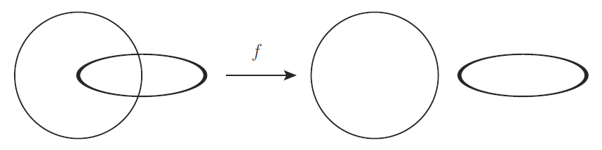
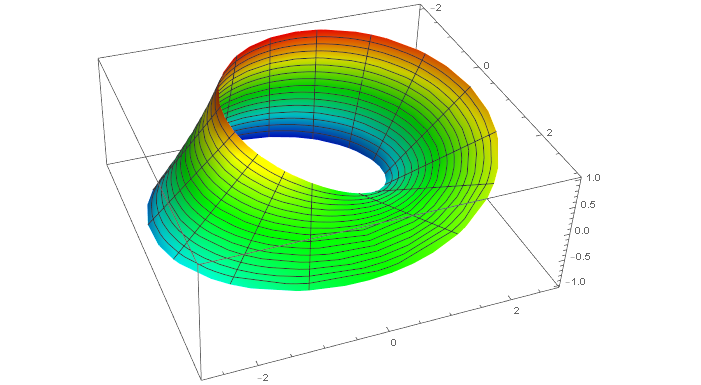
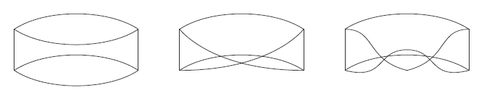

# 同相写像

位相空間論で最も重要なものは同相写像であろう．

ところで一般向けに位相空間論という分野を説明するときに， 開集合の話から始めることは少ない． 限られた時間で非専門家に説明しなくてはいけない場合には， 小難しい話をせずに興味を引く話をし，且つ，重要なことをわかりやすく言わねばならない．

「グニャグニャと変形します」とふわっと言ったり， もしくはもう少し正確さを損なわないように， 「必要ならばハサミとノリを使って変形します」とか言ったりする．

さて正確にはどういうことなのだろうか．

[The Math Relish Journal Volume 1S](https://mathrelish.booth.pm/items/1123647/)

## 着想と背景

### コーヒーカップとトーラス

[embed]https://youtu.be/4iHjt2Ovqag[/embed]

位相空間論を一般向けに説明するとき，コーヒーカップとトーラスの話をよくする． その説明はわかりやすく「ああ，なんて簡単なんだ．」ときっと誰しも思うだろう． ところが，いざ位相空間のテキストを開くと， その例え話とは程遠い集合と写像の抽象的な議論が延々と続く．

**「あれ？」**

と抱くや否や，このギャップが「使えれば良い」という発想を生んで， その先の多様体論や諸々の現代幾何学を理解するための諸概念を醸成できず時が過ぎてしまう． 例えば複雑な計量や接続は結局の所は代数的なので，根気でできた気になってしまう．

コーヒーカップとトーラスが同相であることを単にイラストだけでなく， 連続写像や同相写像の定義に照らして理解することが， その先の議論を理解する最初のステップと言えるだろう．

## 定義

### 同相写像

二つの位相空間 $S,S^{\prime}$ の間の写像 $f:S\rightarrow S^{\prime}$ が同相写像であるとは， 写像 $f:S\rightarrow S^{\prime}$ が次の条件を満たすことをいう．

\- $f$ は全単射である．(よって $f$ に対する逆写像 $f^{-1}$ が存在する) - $f$ は連続写像である． - 逆写像 $f^{-1}$ も連続写像である．

そして同相写像が存在するとき，二つの位相空間は同相であるという．

これが同相写像の定義である． 同相写像は特別な連続写像だとわかる．

### ホモトピーとイソトピー

同相写像による変形をよく理解するために，更にホモトピーとイソトピーを定義しておく．

二つの位相空間 $S,S^{\prime}$ の間の連続写像 $f,g:S\rightarrow S^{\prime}$ があったとする． このとき $H_0 := f,~ H_1 := g$ とし，任意の $t\in [0,1]$ について， $H_t$ が連続写像であるならば，$H$ をホモトピーという． またこのとき連続写像 $f$ と $g$ はホモトープであるといい， この二項関係を次のように書く．

$$ f \overset{H}{\sim} g $$

イソトピーの定義はホモトピーの定義を同相写像の場合に格上げしたものになっている．

二つの位相空間 $S,S^{\prime}$ の間の同相写像 $f,g:S\rightarrow S^{\prime}$ があったとする． このとき $I_0 := f,~ I_1 := g$ とし，任意の $t\in [0,1]$ について， $I_t$ が同相写像であるならば，$H$ をイソトピーという． またこのとき同相写像 $f$ と $g$ はイソトープであるといい， この二項関係を次のように書く．

$$ f \overset{I}{\sim} g $$

## コメント

### 同相写像の定義について

同相写像 $f:S\rightarrow S^{\prime}$ としての最初の条件である全単射は， 位相空間の台である二つの集合 $S,S^{\prime}$ は濃度が等しく， その間の対応は $f$ で与えられることを述べている．

そして残りの $f,f^{-1}$ が連続写像であるという条件は， $S$ での点の繋がり方と $S^{\prime}$ での点の繋がり方が， 保たれていることを述べている． このような幾何的な言い回しの他に，次の statement も重要である．

同相写像 $f:S\rightarrow S^{\prime}$ は $S$ の開集合を $S^{\prime}$ の開集合に移す．またその逆も真である． 即ち同相写像で対応する部分集合が開集合であるかどうかを変えない写像である．

証明は位相空間上の連続写像の定義から，殆ど明らかであるが，それは次の通りである． $f^{-1}$ が連続写像であるから，$(f^{-1})^{-1} = f$ は $S$ の開集合を $S^{\prime}$ の開集合へと移す． 一方で $f$ が連続写像であることより，$S^{\prime}$ の開集合を $S$ の開集合へ移す．■

合同変換が「二点間の ユークリッド距離」を不変にしたことと同様に， 同相写像による変換 (位相変換) は「部分集合が開集合であるかどうか」という事柄を不変にする変換である．

### 同相写像による連続変形という用語のなお一層の注意

同相写像によって点の繋がり方が保たれていることから， グニャグニャと形を変える「連続変形」の下で，二つの対象が同相だと説明がなされる．

そこでつい，物理的な感覚で「連続変形」という用語を聞くに， 始状態と終状態の間の中間状態を**暗に仮定**しながら議論をしているように聞こえる．

しかし単に同相写像といったときの議論に於いては必ずしもそうではないし， 積極的に考えている訳では決してない．

連続写像 $f:A\rightarrow B$ があったとき，$A$ と $B$ の関係さえ情報があれば， それが正に $f$ の定義であるから，それ以外の情報はそもそも必要としていない． 故に当然の帰結として，$A$ から $B$ に移る間の中間状態なるものを議論の中で何ら仮定する必要はない． このことは同相写像についても全く同様だからである．

連続性を連続写像によって定式化したため，そのような変換による変形を「連続変形」ということは自然な流れであるが，そのことと弾性体の「連続変形」とは全く別の事柄である．

「同相写像とは弾性体の連続変形である」と感覚的に説明される場合が多いが， 中間状態までも含めた連続変形は，ホモトピー変形やイソトピー変形によって， よく区別されて説明されるものである．

## 例

### 同相であることと弾性体の連続変形とは別概念

#### ホモトピー変形ではない例

例えば下図の写像 $f$ は連続写像であるが，ホモトピー変形ではない．

$\mathbb{R}^3$ では**途中**で切断しなければ，二つの輪に分けることができないからである． 切断したときのある $t$ についての写像 $H_t$ は連続写像ではない． よってすべての $t$ について $H_t$ は連続写像ではないため，ホモトピーではない．

しかし $H_1=f$ 自体は連続写像である． 何故ならば連続写像の定義には**途中**をラベルするパラメータはなく， $f$ を通した最初と最後しか話題にしていないからである．

#### 円筒とメビウスの帯

円筒とメビウスの帯 $M$ を考える． 閉区間を $I$ とすれば円筒は $S^1\times I$ である． 一方でメビウスの帯は，単なる $S^1\times I$ ではなく， ファイバー束として定式化される図形である．

ここにメビウスの帯はパラメータ表示で次のように書ける．

$$ M := \begin{pmatrix} (2 + r\cos\theta)\cos 2\theta \\ (2 + r\cos\theta)\sin 2\theta \\ r\sin\theta \end{pmatrix} ~~(r \in [-w,w],~ \theta\in[0,\pi)) $$

これを $w=1$ で図示すると次のようになる． CDF ファイルも合わせて置いておく．

 [wpdm_package id='460']

直感的にもわかるように円筒とメビウスの帯は同相ではない． 同相であることの証明は位相不変量や連結の概念を導入すると見通しが良いが省略する．

ここではグニャグニャと「連続変形」しても一方から一方へは移り変わらないことが重要である． この事実を覚えておいて，帯をもう一回ひねってみよう．

#### 帯のひねり

円筒とメビウスの帯という二つの図形について下図に示すような例を考えてみる． 図の左から順に「円筒」「メビウスの帯」「二回ひねって繋げた帯」である．

このとき「円筒」と「二回ひねって繋げた帯」は同相である． しかし「円筒」から「二回ひねって繋げた帯」もしくはその逆は， どんなに弾性体に与えるような物理的な連続変形を加えても，$\mathbb{R}^3$ では移り合うことはない．

これらの「移り合わない」という連続変形についての特徴は $S^1\times I$ の $\mathbb{R}^3$ への埋め込みが 「イソトピー変形ではない」として区別される．

このように同相写像の説明につきものの「連続変形」という用語は， それ自身が独自の意味を持っていることに注意する．

またここまでにみた例からもわかるように，どのような空間で考えるかによって， ホモトピー変形もしくはイソトピー変形の実行可能性が変わってくることに注意する．

## 参考

- [ざっくりわかるトポロジー 内側も外側もない「クラインの壺」ってどんな壺? (サイエンス・アイ新書)](https://amzn.to/2MRV6CP)
- [トポロジー入門](https://amzn.to/2lz8AXz)
- [位相への30講 (数学30講シリーズ)](https://amzn.to/2xXqPiD)
- [はじめての集合と位相](https://amzn.to/2sTBx3T)
- [はじめよう位相空間](https://amzn.to/2MeUwPt)
- [解いてみよう位相空間〔改訂版〕](https://amzn.to/2l1Mih7)
- [集合・位相入門](https://amzn.to/2sU95yL)

