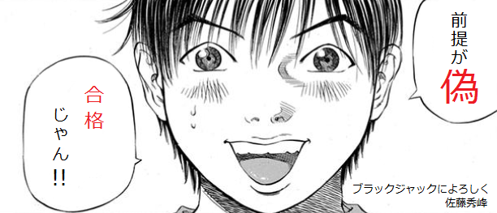

# 前提命題が偽ならば全体の命題は真

証明や議論の中でこの種の話に混乱することがあるかもしれない． 直感的でないのが主な原因であろう．

[The Math Relish Journal Volume 1S](https://mathrelish.booth.pm/items/1123647/)

## 着想や背景

$P\Rightarrow Q$ があったとする．今，前提 $P$ が偽であったとする． すると帰結 $Q$ の真偽にかかわらず問答無用で $P\Rightarrow Q$ は真となる． こういう訳なのだが，ここで次の二つの混乱が起こりやすい．

1. 「前提 $P$ が偽ならば帰結 $Q$ は真」と間違って理解する．覚えてしまう．
2. 「前提 $P$ が偽ならば，帰結 $Q$ の真偽にかかわらず全体の命題 $P\Rightarrow Q$ は真」であることが受け入れられない．

一つ目の混乱は不幸というより他ない． そこで二つ目についてだけ述べたい．

## 定義

結論を先に述べよう．

$$P\Rightarrow Q \Leftrightarrow \lnot P\lor Q$$

この右辺 $\lnot P\lor Q$ を見ると，確かに「前提 $P$ が偽ならば，帰結 $Q$ の真偽にかかわらず全体の命題 $P\Rightarrow Q$ は真」であることがわかる．

### 含意 $\Rightarrow$

まず素朴には $X := P\Rightarrow Q$ というのは「$P$ が真ならば $Q$ も真である」を問う論理式である． この論理式自体もまた一つの真偽値を与えるものである．

ここまでの定義であれば，$X$ は $P$ が偽である場合に，命題全体 $X$ が真偽の何れであるか未定義で不完全である． 不完全さを補うために更に次のことを定義に含める．

- $Q$ が $P$ にかかわらず真であるならば，$X$ は真である．

この定義は含意 $\Rightarrow$ という推論を問う場合には，それほど不自然ではないはずだ． 命題 $Q$ が真であることは $P$ とは独立なわけだから，そのような推論は正しいと感じることは自然であろう．

今，こうして定義した事柄の対偶をとってみると，次が得られる．

- $P$ が $Q$ にかかわらず偽である．

これは $X$ の対偶命題である． 背理法の原理を認めるならば，この対偶命題もまた真でなければならない． そう次の事柄が成り立たねばならない．

- $P$ が $Q$ にかかわらず偽であるならば，$P\Rightarrow Q$ は真である．

こうして含意 $\Rightarrow$ を定めるとき，$P\Rightarrow Q$ という論理式は $\lnot P\lor Q$ に等しいことがわかる．

## コメント

### 行き着くところは約束

$\lnot P\lor Q$ が含意 $\Rightarrow$ の定義であって，「そういうもの」で話は終わりである． そのことを尤もらしく説明しただけに過ぎない．これを忘れてはいけない．

よく空集合にかかわる論証を行う際に，前提が偽だから命題は真という論証を行うことがある． それが面倒だからと，その論証を空集合にかかわる約束事だとして不問に付すことがある． あまりよろしくない態度かもしれない．

しかしたどってみると，含意 $\Rightarrow$ の定義をどうするか，という話に後退するだけで，約束事をしていることには変わりない． そういったこともあってか，こなれてくると「約束します」と脱線事として扱うようになる．

自然言語の「ならば」と論理での「ならば」は同じ概念ではない． そこを同じだとして，あれこれと直感に合わない例を作り出すことができる． それらは人を欺こうとするまやかしだ．

### 用語

$X:=P\Rightarrow Q$ を全体の命題と述べたが，これは「条件文」という． 条件とついているので，前提と似ており，ここでは冒頭で述べた第一の混乱がないように全体の命題と称することにした．

またここで取り上げた事柄には特別の用語がある． それは Vacuous truth と Trivial true である．

Vacuous truth は前提 $P$ が偽である場合に条件文 $X$ が真であることを形容するものである． 使い方としては「条件文は vacuous truth である」となる． Vacuous は「空虚な」「空の」とか「無為の」「中身のない」といった意味をもつ． 正に前提が偽である場合の真を形容した用語である． 「これは空虚な真さ」と言ってもよいだろう．

対して Trivial true は常に帰結 $Q$ が真である場合に条件文 $X$ が真であることを形容するものである． これも使い方としては「条件文は trivial true である」であり，上手く表現した用語である． そう，一言，「自明だ」と言うわけである．

### iff (if and only if)

前提が偽であるならば条件文が真であるという数学的な真理 (？) の名の下，あなたは次のようなことを思いつくかもしれない．

> 『テストで 60 点以上ならば，合格とする．』 しかし私の手元には 42 点の結果がある． 「待てよ，『(テストで 60 点以上) $\Rightarrow$ (合格とする)』ということは，今の私は前提が偽だ．ということは次の条件文は真だ．」 『テストで 60 点未満ならば，合格とする．』 「はは，まったく，先生は論理の素養がないから困る． 早速，不合格を取り消してもらわねばっ！！」

あなたはきっと変わり者だと目を付けられるに違いない．

「テストで 60 点以上ならば，合格とする．」と言っている以上，「テストで 60 点未満ならば，不合格とする．」と暗黙に言っているからである．

いやいや，でも前提が偽ではないか．

さて何がおかしいのだろうか．

日常会話の「ならば」には二種類あるのだ．

今の文脈だとこれは含意「$\Rightarrow$」ではない． 同値「$\Leftrightarrow$」の方である．

今のように文脈が明らかな場合は判別できるのだが，抽象的で複雑になってくると，記号に二つの同じ呼び名があるのはとても辛い．

そこで数学では $P$ if and only if $Q$ の略語である iff という同値を意味する言葉を文脈の中で用いる．「$P$ が成り立つのは $Q$ が成り立つときに限る．」という意味である．もちろん $\Leftrightarrow$ という記号を適宜使ってもよい．

先の例え話は真偽の判定ができない複素数のような点数を取らない限りは取り合ってもらえないことがわかる．

## 例

### 空集合 $\emptyset$ は任意の集合 $A$ の部分集合である．

集合をリンゴやミカンの集まりのような感覚で考えると，空集合は何もない集合な訳だから，これが部分集合であるのはどういう状況？などと，自分を納得させる迷宮へ足を踏み入れることになる．

果物屋さんで売っているものからなる集合を考えたとき，その部分集合にはリンゴとミカンのセットがあったりするわけだが，なんと空集合もあるわけである．早速，空集合にも値札を貼らなくてはならない．

というような調子で，$\emptyset\subset A$ のようなすぐに真偽のよくわからないものは，$P\Rightarrow Q$ の形に直してやるとよい．

今それを行うと次のようになる．

$$x\in\emptyset \Rightarrow x\in A$$

部分集合だから，当然，部分集合の元は包含する集合の元でなければならない． それを表現した．

ここで空集合は一切の元を含まない集合のことだったから，$x\in\emptyset$ はどんな元 $x$ についても偽な命題である． よって命題全体としては真である． つまりは $\emptyset\subset A$ が成り立つ．■

## 参考

- [集合・位相入門](https://amzn.to/2sU95yL)
- [例題で学ぶ集合と論理](https://amzn.to/2MXBYTf)
- [独習コンピュータ科学基礎I 離散構造](https://amzn.to/2unCaDG)
- [数理論理の手法 - 証明の発見と背理法の除去](https://amzn.to/2sPEyCi)
- [Vacuous truth](https://en.wikipedia.org/wiki/Vacuous_truth)

