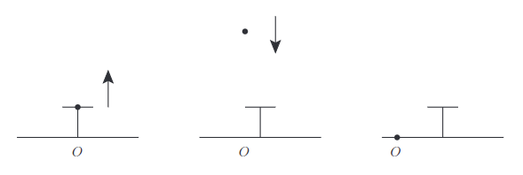
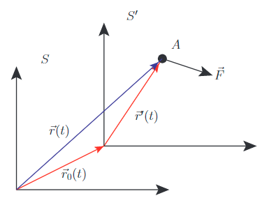

# 慣性

慣性という概念に独りでにたどり着くのは難しい． そして物理学を学ぶ上で最初にでくわす概念でもある． 大衆教育の中では一項目に過ぎず，電車の例えや関連する演習問題によって， 「そういうものか」と一応の理解を得て，深入りすることがないかもしれない．

慣性はニュートンの運動法則と密接に関係し，力の概念を明確にする． また慣性の概念に人類が至る過程は，物理学史の観点からも大変に興味深いものである．

## 着想や背景

### 慣性と関連する様々な用語

慣性は Inertia の訳語で，かつては惰性とも訳されていた． 古いテキストをみると惰性と書かれていることがよくある． 今日では，惰性は精神的変化に対して，慣性は物質的変化に対して使い分けられている． このため物理学の文脈では惰性と言わず，慣性という訳語を普通は用いている．

この慣性という単語は物理学を学ばない限り，そうそう出くわすことのない単語である． (かつてのように惰性とよんでいたら，単語からある程度のイメージが湧いたのではないかと思う) あまり聞き慣れない単語だが，慣性は物理学を理解する上で基礎となる重要な概念の一つである． 実際，慣性それ自身に加えて，次のように慣性と名の付く物理学の用語は多々ある．

- 慣性運動
- 慣性系
- 慣性の法則
- 慣性質量
- 慣性モーメント
- 慣性力
- ...

### アリストテレスの自然学

慣性やそれに関連する用語を理解することはたやすいことではない． 慣性の理解は天動説と地動説という歴史的な流れとも密接に関係している． 地動説の弱点は次のような事柄への答えに窮するところがあったからである．

> もし地球が回転しているとしたら，空中に投げられたものは後ろに落ち，鳥は宇宙に吸いこまれ，壊滅的な暴風が吹き荒れて地上のものがすべてを吹き飛ばしてしまうだろう．

つまりは図のようなことが起こっていないではないか． という，他ならぬ万学の祖アリストテレスによる地動説への反論である．

彼の生きていた時代はまだ天動説と地動説が意見を戦わせていた時代だ． しかも天動説が宗教的性質を色濃く帯びることなく， コソコソと地動説を論じないでよかった時代だ． 地動説が天動説よりも優位に立てなかった大きな理由の一つには， この反論が誤りであることを言えなかったところにある．

仮にアリストテレスを宇宙ステーションに連れて行って， 地動説という事実を認めさせたとしても， なぜ，大地が動いているにもかかわらず，投げた石はまた自分の手に戻ってくるのか， その経験的事実の説明自体が問題になるからである．

「それが慣性です．」という一言にはいろいろな思いが詰まっている．

### 動いているとは？

自然界にはいろいろな運動があるが， その多様性の要因 (摩擦とか) をひとつずつ剥ぎ取っていくと， 慣性という性質が残るのである．

「運動する」というのは，物体に「力を加えて動かす」こと，という感覚でいると， 何もしていないのに動く，という奇妙な statement に絡め取られてしまう． 空気の抵抗や摩擦がない理想的な状態を考えれば，ツーっと動き続けるのである． これはわかる．

重要なのはここからだ．

そのツーっと等速直線運動している物体 A を見ている物体 B があったとしよう． すると物体 A から 物体 B をみると逆向きに等速直線運動をしていて， 物体 A 自身は静止していることになる． 物体 A と物体 B の役割が入れ替わったのである．

ここを「屁理屈だ．A には何もしていないのだから静止していることに変わりない．B に力を加えて動かしたが，A にはそのようなことをしていないわけだから．」と考えるか， 「動いていることと止まっていることとは視点の違いである．」と考えるかが大きな分かれ目となる．

もしこれから定義する慣性という性質が物体になかったら， 物体 B に継続的に力を加えないとやがては止まってしまう．

そうなれば何か絶対的な静止という状態があって， そこから「力」を与えて動かす，という発想がでてくる． 馬車や船，電車，飛行機，そういったものに乗っている人は動いていないが， それら乗り物は絶えず「力」を与えて動いているではないか． だから乗っている人が動いていないというのはおかしな話だ． 「力」を与えるからこそ動く． また，その絶対的な静止しているものは不動の中心たる地球であるとか， 日常経験「大地は動いていない」といった目に見える様々な事柄が綺麗にハマっていく． …ように思える．

しかし自然界はそうはなっていない． 理想的な状態を考えると，運動は継続するのである． 動くとか静止するといった事柄が重要ではなく， 等速直線運動かそうでないかが運動の本質として重要だったのである．

慣性という性質は視点の違いからくる運動の相対的な形容 (動いている・止まっている) と矛盾しない． より正しい認識を与え，そして「力」の正しい定式化への道を拓く．

## 定義

慣性とは他から力を受けない限り，物体は運動をし続けるという性質である． またこのような他から力を受けない運動を特に慣性運動といい， 慣性運動をしている物体に張り付いた座標系を慣性系という．

ニュートンの運動法則の第一法則である慣性の法則とは次のような法則である．

慣性という性質がすべての物質について成り立ち，且つ，慣性運動は等速直線運動である．

以下，静止は速度 $0$ の等速直線運動とする．

## コメント

### 慣性法則と空間の一様等方性および時間の一様性

慣性運動が等速直線運動であるということが普遍の物理法則として昇格するために， 次のことが前提として必要となる．

- 慣性運動であるために，ずっと動き続ける必要があり，空間に端があってはならない．
- どれだけ行ったところでも，いつでも同じ慣性運動をする．
- どの向きに行ったところでも，いつでも同じ慣性運動をする．
- 時間の原点をどこにとっても，いつでも同じ慣性運動をする．

端のない空間には直線と円周がある． 地球が丸いということは当時よく知られていたので， 慣性運動としては等速直線運動ではなく等速円運動のことだと， ガリレオは慣性運動の概念に到達していながらそう考えていた． 一方で，デカルトやニュートンは等速直線運動だと考えたのである． 即ち空間は有限ではないことをいっている． もし有限だと端での振る舞いを規定する法則を追加しなくてはいけないからだ．

どれだけ行ったところでも，というのは， どのような平行移動をした位置でも空間には特別な場所はなく， 同じ物理法則を与えるということをいっている． これを空間の一様性という．

同様に，どの向きに物体が進もうとも空間には特別な向きがなく，同じ物理法則を与える． これを空間の等方性という．

空間の一様等方性は天上世界と地上世界は同一の物理法則であることを述べている． どこか特別な場所などなく，「力」が作用しないことによってのみ慣性運動するのである．

物理法則が時間の原点に依存しないことは，時間の流れにムラがなく一定であることをいっており，これを時間の一様性という． ある一つの基本的な時間の単位があって，それがどの時刻でも用いれるのである． これは時間に特別な原点がなく，共通の単位で時刻が経過していくことを述べている．

以上からニュートンの第一法則は，物体がある種，probe となって時空間を規定していると考えられる．

### 力，運動方程式，動力学，静力学

慣性の定義の中に「力」という用語が表れている． これは等速直線運動からのズレの要因が「力」であると暗にいっている． では「力」によってどのような非等速直線運動になるだろうか．

ニュートン以前のかつての人々は「力は速度に比例する．」と考えていた． しかしよく観察してみると，物体の運動は初期位置と初速度だけで完全に定まるように自然界はなっている． それら初期条件は現代の我々の言葉で言えば，時間積分の積分定数であるから， 「力」が作用した際に生じる「等速直線運動でない運動」とは加速度運動ということになる． よって時間の微分は二階までで十分となる[1](#fn-324-jerk)．

ニュートンの第二法則である運動の法則は，この経験則を原理に置くものである．

$$\vec{F} = \frac{d}{dt}\vec{p}$$

これがかのニュートンの運動方程式であり，上記のように運動量の時間微分が力に等しいことを述べている． このように運動量の変化に着目して力や運動の考察を行う学問や考え方を動力学 (Dynamics) という． 対して運動量の変化がないか無視できる範囲で，力の釣り合いに代表される平衡な物理を扱う学問や考え方を静力学 (Statics) という．

### 慣性質量，慣性モーメント

物体として特に質点を考えると運動量は加速度に比例する． 質点に対して様々な力を作用させて，加速度を測定すると， それらの量の間に比例関係が成立する．

$$\frac{|\vec{a}_1|}{|\vec{F}_1|} = \cdots = \frac{|\vec{a}_n|}{|\vec{F}_n|}$$

これは加えた力の種類に依存しない． 比が変わるのは異なる質点に変えた場合だけである． よってこの比例関係を成立させる定数は質点固有の定数だとわかる． これを質量とよんで $m_I$ と書けば，運動方程式は次のようになる．

$$\vec{F} = m_I\vec{a}$$

力を一定とするとき，質量 $m_I$ が大きいほど，加速度が小さい運動となるため， 物体がその場に留まって動きにくい程度を表す量とわかる． このため $m_I$ は慣性質量とよばれている． そして質点の議論を剛体に一般化した概念が慣性モーメントである．

### 質量という次元の単位

質量の定義は長さや時間を基準にしていない． つまりどういう物体を選んだら良いかということは長さや時間の基準とは関係なしに選べる． このことは質量が長さや時間とは別の独立した次元をもっていることを表している．

### 質量の加算性

質量 $m_1,m_2$ の二つの質点があったとする． これら質点を重ねて一つの質点として扱うとき， その質量 $M$ は単純な和であることが仮定される．

$$ M = m_1 + m_2 $$

これは大きさを持った物体がもっている実験的事実を意図した要求であり， 公理のようなものである．

例えば全く同じ二つの石をくっつけて一つの石にしたとしよう． 一定距離 $x$ だけバネを引っ張って，この一つにした石をくっつけて離したときの加速度 $A$ と， 元の石をくっつけて離したときの加速度 $a$ とでは， 何れも同一の力がはたらくことになるが，そのときの加速度については $2A=a$ の関係がある． つまり一つにした石は質量は二倍の質量となったことになる． このことは異なる物質の間についても同様であることが実験から知られている．

以上の話はアタリマエのことではない． つまりどんな物体も単に和をとるだけの加算性を有しているとは限らないが， 運動方程式ではそのことが暗に仮定されている． このことは質点という，正に点という極微のスケールまで真に成り立つのかは自明ではないことの注意である．

実際，質量の加算性は原子レベルのスケールでは，一般には成り立たなくなる． 例えば重水素は陽子一つと中性子一つからなっているが， それら個別の陽子と中性子の質量の和は， 重水素の質量には**等しくない**．

質量保存の法則が成り立たず，重水素の方が少しだけ質量が小さいのである． 減った分だけ陽子と中性子が結びついているためのエネルギーに費やされているのである． これを質量欠損という．

このように思ったよりも自然界は巧妙にできているのだが， 幸運にもそれらが上手く隠蔽されていて， はじめから難しい問題を考えないで済むようになっている．

### 非慣性系と慣性力

どれが動いていて，どれが止まっているかは区別ができないということを， 慣性という概念は内包していた． つまりある慣性系が「動いている」ということを絶対的に判定する基準はなく， 「動いている」ということは相対的な価値観でしかない．

一方で物体に加える力は，人間が定める任意の座標系とは関係なしに， 存在していて，絶対的に判定できる．

これらの違いが慣性系と運動方程式の関係の理解を深め，そして慣性力という概念を導く． それは次のとおり．

今二つの座標系 $S,S^{\prime}$ を考える． これらは時刻 $0$ で原点が一致していたとする． そして $S^{\prime}$ は $S$ に対して，ある加速度で平行移動していたとする． このような状況で質点 $A$ に力 $\vec{F}$ がはたらいていたとして， 下図のように記号を定義する．

すると $S^{\prime}$ からみた位置，速度，加速度は次のように書ける[2](#fn-324-rel)．

$$ \begin{eqnarray} \vec{r}^{\prime}(t) &=& \vec{r}(t) - \vec{r}_0(t) \\ \vec{v}^{\prime}(t) &=& \vec{v}(t) - \vec{v}_0(t) \\ \vec{a}^{\prime}(t) &=& \vec{a}(t) - \vec{a}_0(t) \end{eqnarray} $$

ここから次の事実を得る．

互いに慣性系の関係にあれば，運動方程式がそのままの形で成立する． しかし一方が非慣性系であれば，その限りではない．

$S,S^{\prime}$ を慣性系とする． この仮定を数式で表すと次のとおり．

$$\vec{a}_0(t) = 0$$

よって次を得る．

$$\vec{a}^{\prime}(t) = \vec{a}(t)$$

すると $S,S^{\prime}$ での運動方程式はそれぞれ次のように同一の方程式として書ける．

$$\vec{F} = m\vec{a}$$

また一方で $S^{\prime}$ を非慣性系とすると， 次の一般的な関係で加速度が結ばれていることになる．

$$\vec{a}^{\prime}(t) = \vec{a}(t) - \vec{a}_0(t)$$

よって $S,S^{\prime}$ での運動方程式はそれぞれ次のように異なる．

$$ \begin{eqnarray} \vec{F} &=& m\vec{a}(t) \\ \vec{F} &=& m\vec{a}^{\prime}(t) + m\vec{a}_0(t) \end{eqnarray} $$

故に $S$ で運動の法則が成り立っていても，$S^{\prime}$ では $\vec{a}_0(t) = 0$ でない限り運動の法則が成り立たない．■

非慣性系では運動の法則が成り立たないことをみた． しかしそのズレを次のように力の一部と便宜的に扱って，左辺全体を力とすれば表面上は運動方程式の形となる．

$$\vec{F} - m\vec{a}_0(t) = m\vec{a}^{\prime}(t)$$

これを修正された運動の法則とでもよび，$-m\vec{a}_0(t)$ というみかけの力を質点の慣性から生じているということで慣性力という．

## 例

### ルターとコペルニクス

コペルニクスが生きた時代はちょうどルターに始まる宗教改革運動が吹き荒れた時代であり，カトリックとプロテスタント (Protestant (抗議者)) の争いが激化していく時代だった． それ以前はまだ神学をアリストテレスのギリシア哲学によって理論化，体系化するという，ある意味では牧歌的な雰囲気で良い意見があれば積極的に取り入れていく気概があり，そして建前があれば異端的な議論でも容認されるような時代だった．しかしそれが段々と許されなくなっていった．

ルターの生存期間が 1483.11.10～1546.2.18 で，コペルニクスが 1473.2.19～1543.5.24 なので，二人は殆ど同じ年を生きた．このためルターはコペルニクスの地動説を知っていたし，実際，コペルニクスは手酷くルターから次のように批判されていた[3](#fn-324-L_C)．

> 「天や太陽や月ではなしに，地球が回転するのだということを証明しようとする新しい天文学者は，ちょうど動いている馬車や船に乗っていながら，自分は停まっていて大地や樹木の方が自分を通り過ぎて動いているのだと考える男のようなものだ．ところがこれが現状なのである．誰でも賢明らしく見せるには，何か独自のもの，それも自分の最良のものを生み出さなければならない！ この馬鹿者は全天文学を上下転倒しようとしている．しかし聖書が証明しているように，ヨシュアが止まれと命じた[4](#fn-324-bible)のは，太陽であって，地球ではない．」

早い話が，「聖書に太陽が動くって書いてあるでしょ，なんで分からないの？」ということだが，穿った見方をすれば，ルターが「動いている馬車や船に乗っていながら，自分は停まっていて...」と言及していることから，この当時の多くの人々含め，「停まっている」という状況を捉え損なっていることがわかる．

もう少し噛み砕けば次のようになるだろう．

「何もしていない，だからこそ停まっている，一方で走れば動いている，況んや停まってはいない．何故か？正に走っているからだ．これは見て分かることだ．馬車や船に乗って動いているからといって，自分が停まっているなどとはおかしな話だ．馬車や船が動いているのだから．そんなこともわからない馬鹿者がいる．」

我々は弁証のみに頼ることの恐ろしさを垣間見る．いやしかし仮に現代の我々が，二つの座標系を導入して両者の違いを立式して示したとしても，果たして納得させることができるだろうか．

「それは数学的な虚構に過ぎない，動いているのは何であれ，原動力をもっているものであって，数学的な虚構をもってして，これを取り違えることなど完全な誤りだ．確かにそう思っても矛盾はないかもしれないが，意味のないことだ．」

などと反論を受けてもおかしくない． それでもあなたは叫び続けることができるだろうか， 無数の信者と群衆そして複雑に絡み合った利害関係の中で．

慣性の概念を受け入れることは自然界の見方の大きな転換を意味し，この時代の当事者たちが易易と理解できることではない[5](#fn-324-gravity)．

## 参考

- [自然学 (新版 アリストテレス全集 第4巻)](https://amzn.to/2t02T9t)
- [われ思う、故に、われ間違う―錯誤と創造性](https://amzn.to/2tfHCYK)
- [物理学史 1 (新物理学シリーズ 5)](https://amzn.to/2tf15bT)
- [物理学の七つの革命―古代ギリシアからクォークの発見まで](https://amzn.to/2td13RT)
- [力学レクチャー](https://amzn.to/2HPd1GC)
- [力とはなにか](https://amzn.to/2LULBBF)
- [力学のききどころ](https://amzn.to/2HVCTAN)
- [力学の考え方](https://amzn.to/2yj1Fes)
- [古典力学の形成―ニュートンからラグランジュへ](https://amzn.to/2M0aYlv)
- [The Principia](https://amzn.to/2HVEczm)
- [世界の名著〈26〉ニュートン](https://amzn.to/2HXPWl7)
- [プリンキピアを読む―ニュートンはいかにして「万有引力」を証明したのか?](https://amzn.to/2t6g34L)
- [太陽よ,汝は動かず―コペルニクスの世界](https://amzn.to/2t285d4)
- [旧約聖書〈4〉ヨシュア記 士師記](https://amzn.to/2JTtZFB)

* * *

2. ちなみに三階微分を躍度 (jerk) といい，四階以上は順に snap, crackle, pop とよばれている． [↩](#fnref-324-jerk)

4. 二つの座標系 $S,S^{\prime}$ での時間 $t,t^{\prime}$ は等しいとしている．この時間への相対性の暗黙の仮定 (絶対時間の仮定) はアインシュタインの相対性理論で修正される． [↩](#fnref-324-rel)

6. Martin Luthers sämtliche Schriften herausgegeben von Johann Georg Walch, Bd.22: Colloquia oder Tischreden, S. 2260 [↩](#fnref-324-L_C)

8. 旧約聖書のヨシュア記でのイスラエル人とアモリ人が戦ったときに神が太陽の動きを止めたという奇跡の記述のこと． [↩](#fnref-324-bible)

10. またもしこの時代に慣性を正しく理解している者がいたとしても，慣性力はやはりどこか仮想的で数学的な虚構に映ってしまうことだろう．まさかこれが (少なくとも古典的には) 重力の本性 (等価原理) であるとはどうして思い至ろうか． [↩](#fnref-324-gravity)
