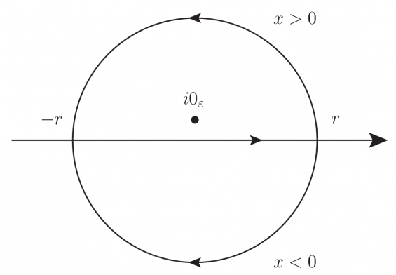

# ヘヴィサイド関数の積分表示について (フーリエ変換との関連)

ヘヴィサイド関数 $\theta$ は定義が非常に単純であるが故に，原点での特異性がしばしば議論から覆い隠されるか，超関数的な観点の議論でも導関数としてディラックのデルタ関数を与える程度の言及となることがしばしばである．

一方でヘヴィサイド関数の数ある積分表示の中でフーリエ変換と関連する表示は，具体的な計算，もっと言えば (一つの事例として) 素粒子論の計算で多用されるため，単純に次式以上の知識を知ることは非常に有益である．

$$ \frac{d\theta}{dx}(x) = \delta(x) $$

以下の記事でヘヴィサイド関数のフーリエ変換について，少しだけ触れた． 本稿はその補足となる．

[コーシーの主値と超関数 (クーロンポテンシャルへの短い言及を通して)](https://mathrelish.com/physics/cauchy-principal-value-and-generalized-function)

## 定義

改めてヘヴィサイド関数の定義を述べよう．なおヘヴィサイド関数は下記の $\theta$ の他に Heaviside の $H$ や，おそらくヘヴィサイドがアドミタンス関数として用いたために $Y$ であるとか，もしくはデルタ関数との統一的な扱いのために超関数としてよく使われる記号 $\Phi$ がよく用いられる．

ヘヴィサイド関数 $\theta$ は次を満たす (超) 関数である．

$$ \theta(x) := \begin{cases} 1 & (x>0), \\ 0 & (x<0) \end{cases} $$

ここで任意の実数について次の等式を要求し，原点の値はこの等式を満たすこと以外は未定義で不定とする．

$$ \theta(x) + \theta(-x) = 1, $$

$$ \theta(x)\theta(-x) = 0 $$

仮に何かしら原点の値を決めた場合には次で表記し，通常の関数として扱うものとする．

$$ \theta_c(x) := \begin{cases} 1 & (x>0), \\ c & (x=0), \\ 0 & (x<0) \end{cases} $$

特に次が単位ステップ関数とよばれる関数であるが，超関数としてのヘヴィサイド関数とは区別する．

$$ u(x) := \theta_1(x) $$

定義の中で非自明なのは，$\theta(x) + \theta(-x) = 1$ であるが，これを説明することが主題の一つになる．ここで $\theta(0) + \theta(-0) = 2\theta(0) = 1$ なので $\theta(0)= 1/2$ と不定な量の和を行わないことに注意する．

但しもし普通の関数の意味で値を定義するならば $\theta(0)= 1/2$ とすると良いとも言える．この値の定義はまた不連続点でのフーリエ変換との完全一致としても丁度良くなっている．

一方で $\theta(x)\theta(-x) = 0$ は超関数どうしの積について踏み込んで述べたもので，$\int dx [\theta(x)\theta(-x)]\phi(x) = 0$ と想定するものであり，我々はただこの関係式を要求するのみで原点については超関数の意味で未定義としておく．

## 主題

[以前](https://mathrelish.com/physics/cauchy-principal-value-and-generalized-function#toc_id_4_1_4)，次式に言及した．

$$ \pi\delta(k) - i\mathrm{P}\frac{1}{k} = \int_{-\infty}^{\infty}dx \theta(x) e^{-i(k-i0_{\varepsilon})x} = \frac{1}{i}\frac{1}{k - i0_{\varepsilon}} $$

これは重要な式で以下の二つのことがわかる．

### ヘヴィサイド関数とディラックのデルタ関数の整合条件

最左辺と中辺に着目しよう．最左辺を仮に $f(k)$ と置いて，$f(k)+f(-k)$ を評価すると次が得られる．

$$ \delta(x) = \int_{-\infty}^{\infty}\frac{dx}{2\pi} [e^{-0_{\varepsilon}x}\theta(x) + e^{+0_{\varepsilon}x}\theta(-x)] e^{ikx} $$

これがディラックのデルタ関数の積分表示と整合するためには任意の実数について次が必要である．

$$ e^{-0_{\varepsilon}x}\theta(x) + e^{+0_{\varepsilon}x}\theta(-x) = 1 $$

これはしばしばなされる略記表記でヘヴィサイド関数に課した条件に他ならない．

### ヘヴィサイド関数と符号関数

中辺はヘヴィサイド関数のフーリエ変換に他ならない．

$$ \mathcal{F}[e^{-0_{\varepsilon}x}\theta(x)]{}(k) = \frac{1}{i}\frac{1}{k-i0_{\varepsilon}} $$

よって中辺と最右辺とからフーリエ逆変換として超関数の意味で次が得られる．

$$ e^{-0_{\varepsilon}x}\theta(x) = \mathcal{F}^{-1}\left[\frac{1}{i}\frac{1}{k-i0_{\varepsilon}}\right]{}(x) = \int_{-\infty}^{\infty}\frac{dk}{2\pi i} \frac{e^{ikx}}{k-i0_{\varepsilon}} $$

この右辺はデルタ関数と主値積分の和であったから，積分を実行して次を得る．

$$ \frac{1}{2\pi i}\mathrm{P}\int_{-\infty}^{\infty} dk \frac{e^{ikx}}{k} = e^{-0_{\varepsilon}x}\theta(x) - \frac{1}{2} $$

ここで符号関数をヘヴィサイド関数によって定義しよう．

符号関数 $\varepsilon$ は次を満たす (超) 関数である．

$$ \varepsilon(x) := e^{-0_{\varepsilon}x}\theta(x) - e^{+0_{\varepsilon}x}\theta(-x) = \begin{cases} +1 & (x>0), \\ -1 & (x<0) \end{cases} $$

この最右辺は略記表記している．超関数でない通常の実関数としての符号関数は次で定義され，超関数としての符号関数とは区別する．

$$ \mathrm{sgn}(x) := \begin{cases} x/|x| & (x\neq 0), \\ 0 & (x=0) \end{cases} = \begin{cases} +1 & (x>0), \\ 0 & (x=0), \\ -1 & (x<0) \end{cases} $$

すると次の式変形ができる．

$$ e^{-0_{\varepsilon}x}\theta(x) - \frac{1}{2} = \theta(x) - \frac{1}{2} [e^{-0_{\varepsilon}x}\theta(x) + e^{+0_{\varepsilon}x}\theta(-x)] = \frac{1}{2}\varepsilon(x) $$

故に次の超関数の意味で成立する定積分が得られる．

$$ \mathrm{P}\int_{-\infty}^{\infty} dk \frac{e^{ikx}}{k} = i\pi\varepsilon(x), $$

$$ \mathrm{P}\int_{-\infty}^{\infty} dk \frac{\cos kx}{k} = 0, $$

$$ \int_{-\infty}^{\infty} dk \frac{\sin kx}{k} = \pi\varepsilon(x) $$

## コメント

### 整合条件と符号関数

我々は符号関数をヘヴィサイド関数で定義したので，ヘヴィサイド関数とディラックのデルタ関数の整合条件から，符号関数とヘヴィサイド関数は次の関係にあった．

$$ \theta(x) = \frac{e^{0_{\varepsilon}x}}{2}(1 + \varepsilon(x)) $$

この右辺の符号関数は左辺にあるヘヴィサイド関数によって定義されているので，$\varepsilon(0)=0$ という通常の実関数として与えられる符号関数を不用意に引用してはならない．引用は強い制限を意味する．

符号関数を複素関数とみた場合に複素変数 $z=re^{i\theta}$ の $e^{i\theta}$ を与える関数だと考える方が幾分整合的である．これは原点については偏角が自由なため不定であり，ヘヴィサイド関数の原点の不定性を損なわない．それ故に我々が導入した符号関数は次を満たす範囲で自由だと考える．

$$ \varepsilon(x) + \varepsilon(-x) = 0 $$

更に $\theta(x)\theta(-x) = 0$ を符号関数について換言すると次のとおり．

$$ [\varepsilon(x)]^2 = 1 $$

これは超関数としての符号関数どうしの積について述べるものである．

### 符号関数の導関数

符号関数の定義とヘヴィサイド関数の導関数としての性質とから次が直ちに得られる．

$$ \frac{d}{dx}\varepsilon(x) = (e^{-0_{\epsilon}x} + e^{+0_{\epsilon}x})\delta(x) - 0_{\epsilon} $$

これは略式表記すると次である．

$$ \frac{d}{dx}\varepsilon(x) = 2\delta(x) $$

### 符号関数の原始関数

符号関数は超関数の意味で原始関数として絶対値関数を持つ．

$$ \frac{d}{dx}|x| = \varepsilon(x) $$

これの一つの応用は次の公式の証明である．

$$ \delta(|x| - a) = \delta(x-a) + \delta(x+a) ~~ (a\neq 0) $$

デルタ関数の公式として次があった．

$$ \delta(f(x)) = \sum_{i=1}^n \frac{1}{|df(x_i)/dx|}\delta(x-x_i) ~~ \left(\frac{df}{dx}(x_i) \neq 0\right) $$

ここで各 $x_i$ は $f(x_i)=0$ で零点のことである．

すると特に $f(x) = |x| - a$ の場合を考えると，公式にある微分は超関数の意味で行う必要性が生じる．今の場合に零点は $x=\pm a$ なので，先に与えた超関数の意味での導関数に対する元の関数の零点の値を代入すれば，所望の公式が得られるとわかる．

### 留数計算と積分表示

$$ e^{-0_{\varepsilon}x}\theta(x) = \int_{-\infty}^{\infty}\frac{dk}{2\pi i} \frac{e^{ikx}}{k-i0_{\varepsilon}} $$

上記のヘヴィサイド関数の積分表示を留数計算と関連付けると次のとおり．

$$ \oint_C \frac{dz}{2\pi i} \frac{e^{izx}}{z-i0_{\varepsilon}} = \sum_{p}\mathrm{Res} \frac{e^{ipx}}{p-i0_{\varepsilon}} $$

極は明らかに $z=i0_{\varepsilon}$ のみである．

そして $z=r\exp(i\theta)$ とすると，半円状の積分路 $C$ を上半平面 $\theta:0\rightarrow +\pi$ とすべきか，下半平面 $\theta:0\rightarrow -\pi$ とすべきかは被積分関数の中で減衰項となる次の部分に着目すれば良い．

$$ \exp(-xr\sin\theta) $$

これより $r\rightarrow\infty$ に対して，$x > 0$ の場合には $\sin\theta > 0$ であればよいから上半平面に積分路を取ればよく，留数を拾うことになる．

対して $x < 0$ の場合には $\sin\theta < 0$ であればよいから下半平面に積分路を取ればよく，留数を拾わない．

よって留数定理から $x\neq 0$ について次を得る．

$$ \int_{-\infty}^{\infty}\frac{dk}{2\pi i} \frac{e^{ikx}}{k-i0_{\varepsilon}} = \begin{cases} e^{-0_{\varepsilon}x} & (x>0), \\ 0 & (x<0) \end{cases} $$

故に総合すれば次が得られたことになる．

$$ \theta(x) = \begin{cases} 1 & (x>0), \\ 0 & (x<0) \end{cases} $$

$x=0$ については収束の方法や多価関数を指定する必要があり不定である．

### 不定な計算

超関数 (distribution) は滑らかなテスト関数との内積をつくって整合性をもたせることができた． このテスト関数をヘヴィサイド関数やディラックのデルタ関数のような超関数にしてしまうと，矛盾というおかしな帰結を幾らでも導いてしまうことになる．

例えばテスト関数 $\phi$ にヘヴィサイド関数の二乗を盲目的に設定したとしよう．

$$ [\theta(0)]^2 = \int_{-\infty}^{\infty} dx [\theta(x)]^2 \delta(x) $$

そしてこの右辺について次を用いたとしよう．

$$ \frac{d}{dx}\frac{[\theta(x)]^3}{3} = [\theta(x)]^2 \delta(x) $$

すると次が得られる．

$$ \int_{-\infty}^{\infty} dx [\theta(x)]^2 \delta(x) = \left[\frac{[\theta(x)]^3}{3}\right]_{x=-\infty}^{x=\infty} = \frac{1}{3} $$

よって次の評価が得られた．

$$ [\theta(0)]^2 = \frac{1}{3} $$

ここでもしフーリエ変換対としての整合性を優先して $\theta(0)=1/2$ と設定するならば，$1/4=1/3$ という矛盾を得てしまう．こうして我々は不定な計算を行ってしまった．

## 例題

### 超球体の体積

半径 $r$ の $m$ 次元超球体の体積 $V_m(r)$ はよく知られているように次の公式で求めることができた．

$$ V_m(r) = \frac{\pi^{m/2}}{\Gamma(m/2+1)} r^m $$

この公式の導出例として，ヘヴィサイド関数を用いた次の積分式の評価を紹介する．

$$ V_m(r) = \int d^m x \chi_r(x) = \int d^m x \theta(r^2 - x^2) $$

被積分関数はヘヴィサイド関数の定義から，$r^2>x^2:=\sum_{k=1}^m x_k^2$ の領域のみ $1$ であるような指示関数となっている．特に $r=x$ については積分領域を除外している．

上記の表式に対して，ヘヴィサイド関数の積分表示 (運動量表示) を行う．

$$ \theta(r^2-x^2) = e^{0_{\varepsilon}(r^2-x^2)} \int_{-\infty}^{\infty}\frac{dk}{2\pi i}\frac{e^{ik(r^2-x^2)}}{k-i0_{\varepsilon}} $$

これを代入して積分順序を変更すれば次が得られる．

$$ V_m(r) = \int_{-\infty}^{\infty}\frac{dk}{2\pi i} \frac{e^{i(k-i0_{\varepsilon})r^2}}{k-i0_{\varepsilon}} \int d^m x e^{-(0_{\varepsilon} + ik)x^2} $$

ここで $m$ 次元積分部分は次式のように一次元に分解できる．

$$ \int d^m x e^{-(0_{\varepsilon} + ik)x^2} = \left( \int dx e^{-(0_{\varepsilon} + ik)x^2} \right)^m $$

こうして分解した積分はGauss積分となっており，次を用いることができる．

$$ \int_{-\infty}^{\infty} dx e^{-ax^2} = \sqrt{\frac{\pi}{a}} ~~ (\Re[a] > 0) $$

我々は $0_{\varepsilon}$ があるために，上記を実行できて次式を得ることができる．

$$ V_m(r) = \pi^{\frac{m}{2}} \int_{-\infty}^{\infty}\frac{dk}{2\pi i} \frac{e^{i(k-i0_{\varepsilon})r^2}}{k-i0_{\varepsilon}} \frac{1}{(0_{\varepsilon} + ik)^{m/2}} $$

ここで $A:=0_{\varepsilon} + ik$ に対して，[シュウィンガートリック](https://en.wikipedia.org/wiki/Schwinger_parametrization)を用いる． 再び $0_{\varepsilon}$ があるために評価できることに注意する．

$$ \frac{1}{A^n} = \frac{1}{\Gamma(n)}\int_0^{\infty} du u^{n-1} e^{-uA} ~~ (\Re[A] > 0 \land \Re[n] > 0) $$

すると積分順序を変更して次が得られる．

$$ V_m(r) = \frac{\pi^{\frac{m}{2}}}{\Gamma(m/2)} \int_0^{\infty} du u^{m/2-1} \left[e^{0_{\varepsilon}(r^2-u)} \int_{-\infty}^{\infty}\frac{dk}{2\pi i} \frac{e^{i(r^2 - u)k}}{k-i0_{\varepsilon}}\right] $$

これをみると括弧部分がヘヴィサイド関数の積分表示となっているから，次の評価ができる．

$$ V_m(r) = \frac{\pi^{\frac{m}{2}}}{\Gamma(m/2)} \int_0^{\infty} du u^{m/2-1} \theta(r^2 - u) = \frac{\pi^{\frac{m}{2}}}{\Gamma(m/2)} \int_0^{r^2} du u^{m/2-1} $$

こうして得られた定積分は初等的であり，容易に評価できて，$z\Gamma(z)=\Gamma(z+1)$ を用いれば所望の公式が得られる．

## 参考

- [微分方程式 物理的発想の解析学 (サイエンス・パレット)](https://amzn.to/3oD2BlO)
- [Heaviside step function Integral representations](https://functions.wolfram.com/GeneralizedFunctions/HeavisideTheta/07/01/01/)
- [Integral representation of the Heavyside step function](http://scipp.ucsc.edu/~haber/ph215/Stepfun18.pdf)

- [オリヴァー・ヘヴィサイド―ヴィクトリア朝における電気の天才 その時代と業績と生涯](https://amzn.to/3gAOKrL)
- [Origin of the Heaviside function?](https://hsm.stackexchange.com/questions/8302/origin-of-the-heaviside-function)
