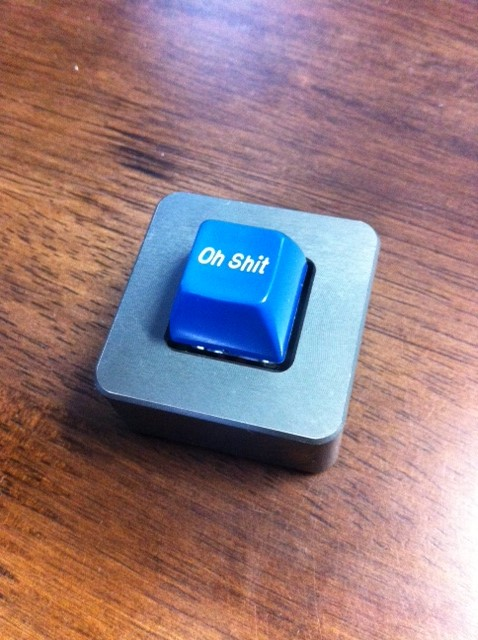
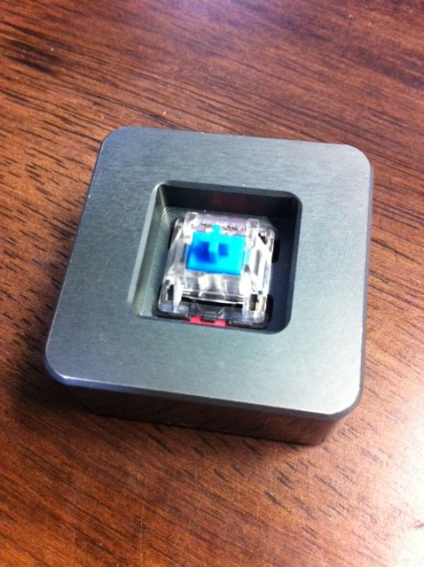

# キーボード用品の購入先

今回はキーボード用品の購入先について，幾つか代表的なところをご紹介します．

## はじめに

自作キーボードの総合的な観点から見ると， ~~まだまだ攻め目なショップは国内には少なく，多くは海外になるかと思います．~~

国内専門ショップが 2019 年にできました！！！！

[遊舎工房](https://yushakobo.jp/)

１月某日の閉店間際に実店舗へ行ってきました． 閉店間際であることに加え，立地的にかなりポツーンとしているのですが， 人だかりがすごかったです．

ディスプレイされている実物を見ると，もうテンションが上ってしょうがない． それにキーキャップのガチャが個人的にはすごくオススメです．

これからどんどん盛り上がっていくことでしょう！

* * *

さて自作と一口に言っても，最終的には基盤発注の完全自作だと思うのですが， とりあえずはパーツの付替えとか出来合キットのはんだ付けから入った方が良いでしょう．

自作キーボードは子供時代でいうところのミニ四駆のような，そんな側面を日々感じています． 子供の頃はミニ四駆のパーツを買う金がなく，妄想で終わるところが多かったです． それでも楽しかったものです．実際，以下に紹介するサイトを眺めるだけでも楽しめます． 私だけかも知れませんが．．．

## TechKeys

[TechKeys](https://techkeys.us/)

海外通販ではじめてキーキャップを購入したところが TechKeys です． 今となっては結構 Sold Out な製品が多いですが，まだいろいろな種類のキーボード用品が販売されています．

個人的に気に入っているのは一つしかキーがないキーボード (?) です．

[OneKeyBoard](https://techkeys.us/collections/accessories/products/onekeyboard/)

この一つのキーはプログラマブルなキーとなっています． 何か適当なテキストエディタを開いて，長押しすると背面の基盤にある LED が白く光って， 開いたテキストエディタ上にいろいろ説明などが表示されて，編集モードに入ります． なおキースイッチは予め付いており青軸でした．またキーキャップは自分で用意します．

## PMK (pimpmykeyboard)

[PIMP MY KEYBOARD](https://pimpmykeyboard.com/)

通称，PMK とよばれているこの界隈では定番な通販サイトです． 私はまだ購入したことがないですが，キーキャップセットが揃っており， 一つのテーマをすぐに実現できるという点では良い買い物ができるのかなと思います．

私は PMK ではブランクキーやノベルティキーをよく購入しています． DSA な次のキーが個人的には気に入っております．

[DSA RELEGENDABLES (PACK OF 10)](https://pimpmykeyboard.com/dsa-relegendables-pack-of-10/)

## 1upkeyboards

[1upkeyboards](https://www.1upkeyboards.com/)

ここは自作用品が一通り揃っています．とてもオススメです． また周辺アイテムも粋なものがあります． 例えばキーボードスリーブをオーダーメイドできます．

[MADE-TO-ORDER Standard Sleeves](https://www.1upkeyboards.com/shop/sleeves/made-to-order-sleeves/)

この他，全体的にセンスが良く，ピラーもここで買ったのを愛用しています．

[NPKC Keycap Puller – Stainless Steel](https://www.1upkeyboards.com/shop/parts-and-tools/npkc-keycap-puller-stainless-steel/)

## Keeibo

[Keeibo](https://keeb.io/)

自作キーボードの命名にはいろいろな規則があるようですが， 有名科学者の名にあやかるのも Planck 以外にも幾つかあります． Keeibo では Fourier，Laplace，Nyquist があります．

[Fourier](https://keeb.io/collections/frontpage/products/fourier-40-split-staggered-keyboard/)

[Laplace](https://keeb.io/collections/frontpage/products/laplace-40-staggered-keyboard?variant=8130176548970/)

[Nyquist](https://keeb.io/collections/frontpage/products/nyquist-keyboard?variant=48309318150/)

見ているだけで欲しくなります．

上記の命名規則ではないですが，Dilly は Gherkin のような 30% キーボードです．

[Dilly](https://keeb.io/collections/frontpage/products/dilly-3x10-ortholinear-keyboard-for-kailh-choc-low-profile-switches/)

欲しい．めっちゃ欲しい．限界に挑むところがなんとも惹かれます．

## 番外

単に少ないだけであれば，4% キーボードジャンルというべきか，次のようなキーボードもあるようです．

[kee4](http://kee4.com/)

\[embed\]https://youtu.be/\_sw5sMGb1E4\[/embed\]

ちょっとこれは個人的には違いますね．

