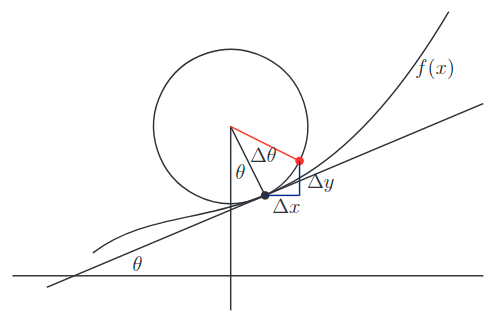
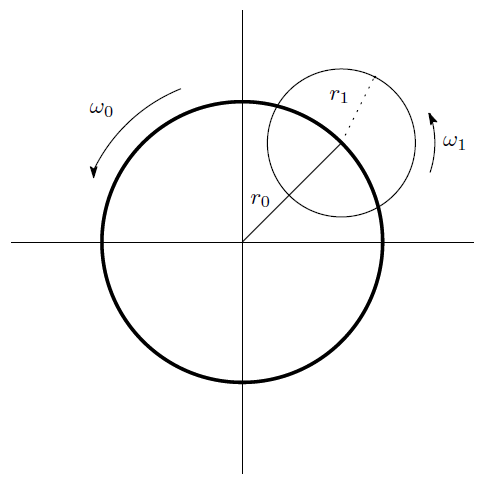

# 運動学

運動を扱う学問もしくは切り口に運動学 (Kinematics) がある． そのようなものの見方から脱することが，今日言うところの物理学と言ってもよいほどだ． 現代ほど洗練されていないにしても，それはニュートンによって成し遂げられた．

物理学を理解する上で，とかく難解な数式にだけ目が向けられがちで， 結果として，しばしば運動学的な難しさだけに腐心してしまうことがある． というよりも，そもそも運動学という言葉自体を知らない人も多いのかもしれない．

## 着想や背景

位置，時間，速度や加速度． これらの概念は物体が動いている有様を見れば，自ずと構築される概念である． その辺の石ころを投げたときの軌跡や天体の運動を，辛抱強く記録していけば， 物体の位置と時間の関係を数量化できるからである． つまり物体の位置 $x$ を時間 $t$ の関数として表すことができる．

$$x = f(t)$$

様々な対象について，実験や観察から上記の関数関係を導出できるだろう． しかしその一連の思索は関数 $f$ の具体化に費やされる． それ以上の意味は汲みしない． またそういった観点には，力や運動量，エネルギーという概念を必要としない．

このような姿勢が運動学という姿勢である．

## 定義

運動学とは力のことを考えないで，もしくはもっと一般に運動の要因というものを考えないで，幾何学的関係を調べて運動を数量的に扱う学問もしくは考え方をいう．

## コメント

運動学は時間に対する位置，速度，加速度の関数形を定量化する学問といえる． 速度と加速度はそれぞれ位置に対する時間の一階微分と二階微分と定義される量である． こういったことから次の事柄が運動学では基本的な問題となる．

- 運動を直線運動と円運動に分解する方法
- 直交座標系や球面座標系などの様々な座標系での速度と加速度の表式の導出

運動学は今では物理学の素養の一つに過ぎないが， ニュートン以前の古代では主題となることは珍しくなかった．

## 例

### 曲率半径 $\rho$

円運動でない一般の曲線を描く運動の場合でも，その微小部分をとれば円運動とみなせる． この意味で運動は一般に直線運動と円運動で合成されていると考えられる． (更に言えば直線運動は半径無限大の円運動ともみなせる)

円運動を特徴づけるパラメータは円軌道の半径であるが， 微小部分の円運動を考えたとき，その円軌道を与えている円を曲率円という． そして曲率円の半径 $\rho$ を曲率半径といい，逆数を曲率という．

曲率半径 $\rho$ は次のように求められる．

$$\rho = \frac{(1 + y^{\prime 2})^{\frac{3}{2}}}{y^{\prime\prime}}$$

少々いかめしいが次のように導くことは難しくはない． 以下での導出は典型的な物理らしい無限小の扱いで行う．

上図のように曲線 $f(x)$ に接する円を考える． そして赤点で示す点を次第に黒点の点へ近づける． 即ち $\Delta\theta$ を限りなく小さくしていく．

すると黒点と赤点を端点とする円弧は曲線 $f(x)$ の微小部分に十分近づいていく． そのような近似が十分に良い場合を考える．

そしてこのとき定まる円を曲率円といい，その半径を曲率半径 $\rho$ といった． 微小な円弧の長さを $\Delta l$ とすれば， 半径と円弧の関係から曲率半径は次の極限値であるとわかる．

$$\rho = \lim_{\Delta\theta\rightarrow 0}\frac{\Delta l}{\Delta\theta} = \frac{dl}{d\theta}$$

無限小の円弧は線素として十分によく近似されており，次が成り立つと考える．

$$dl^2 = dx^2 + dy^2$$

また曲率円を考える極限では黒点での接線の傾きが，無限小の円弧の傾きに一致するから，次が成り立つ．

$$y^{\prime} = \frac{dy}{dx} = \tan\theta$$

よって二つを合わせると次を得る[1](#fn-308-sec)．

$$\left(\frac{dl}{dx}\right)^2 = 1 + \tan^2\theta = \frac{1}{\cos^2\theta} = \frac{d}{d\theta}\tan\theta = \frac{dy^{\prime}}{d\theta}$$

最左辺と最右辺の比を取り直して次を得る．

$$\frac{dx}{d\theta} = \frac{dl}{dx}\frac{dl}{dy^{\prime}} = \frac{dl}{dx}\frac{dl}{dx}\frac{dx}{dy^{\prime}} = \left(\frac{dl}{dx}\right)^2 \frac{1}{\frac{dy^{\prime}}{dx}} = \left(\frac{dl}{dx}\right)^2 \frac{1}{y^{\prime\prime}}$$

ここまでを踏まえて曲率半径 $\rho$ を次のように式変形する．

$$\rho = \frac{dl}{dx}\frac{dx}{d\theta} = \frac{\left(\frac{dl}{dx}\right)^3}{y^{\prime\prime}} = \frac{(1 + y^{\prime})^{\frac{3}{2}}}{y^{\prime\prime}}$$

これは所望の表式である．■

### 周転円理論という運動学的なモデル

古代では円は均整の取れた図形であり，その完全な対称性は神の意志の表れとされた． 「天上世界は神の霊的な世界だ．天体の周回軌道は円軌道に違いない．」 といったように．

現代の我々には支離滅裂な主張に聞こえてもおかしくないが， この考え方はたいへん長い間，人々の生活に深く浸透していたことであろう．

ところが観測をしてみると，やはりズレというものがどうしても消せなかった． そこで円軌道の様々な合成が考えられた．

下図はプトレマイオスの周転円理論の最も基本的な図である．

大きい円を従円，小さい円を周転円とよび，それぞれ独立な回転速度で回転している． 周転円の中心は従円上にあり，そして天体はその周転円上に乗って運動していると考える運動学的なモデルである．

このモデルは見ての通り，円軌道の合成である． 図では一つしかないが，適宜，観測と合うように周転円を追加していった． 当時の人々は観測の誤差内に収まるまで「神聖な円軌道」を増やしていったのだ．

ちょうど複素平面に見立てれば，この円軌道の合成は次の級数を考えていることに相当する．

$$\sum_{n}r_ne^{i\omega_n t}$$

これはフーリエ級数に他ならない．

我々はこのことから，どれほど周転円理論が厄介な説で，彼らを惑わし，一生を食い潰したかを知ることできる． つまり円軌道を増やすほど，観測に合うように修正することができるのである． 周転円理論に根ざした天動説は果たして「間違っている」のだろうか．

そう軌道を予言するという観点だけでは，この問題に決着を着けることができないのである． 天動説は正しくもあり，また誤ってさえいるのである．

上記の周転円理論は円運動の合成であるから，運動学の例としては格好の対象である． 但し合成と言っても観測と合うようにするのは大変な計算である． 計算というものは怖いもので，計算それ自体の中毒性や達成感が時として， 物理学から遠ざかっていく遠因になることがある． 運動学にはそういった怖さがある．究極の現象論と言っていいかもしれない．

## 参考

- [力学レクチャー](https://amzn.to/2HPd1GC)
- [量子と場―物理学ノート](https://amzn.to/2sVF6qX)
- [ドクトル・クーガーの数学講座〈2〉](https://amzn.to/2sXLvC0)
- [概念と歴史がわかる　西洋哲学小事典 (ちくま学芸文庫)](https://amzn.to/2NaAeXA)

* * *

2. 正割関数 $\sec$ を使用する数少ない局面かもしれない．[Magic Hexagon](https://mathrelish.booth.pm/items/878992) の出番でもある． [↩](#fnref-308-sec)
