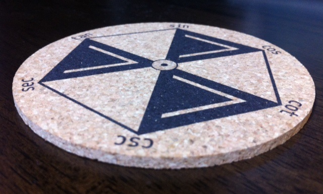
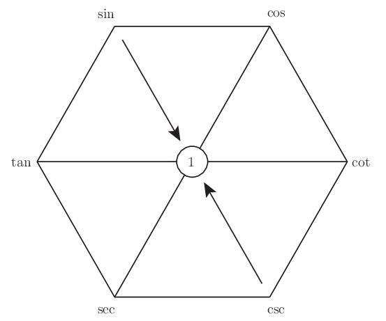
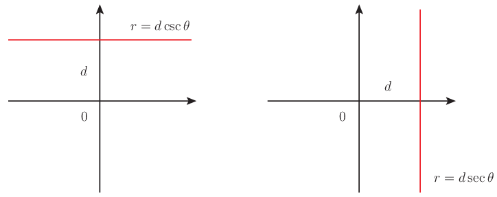
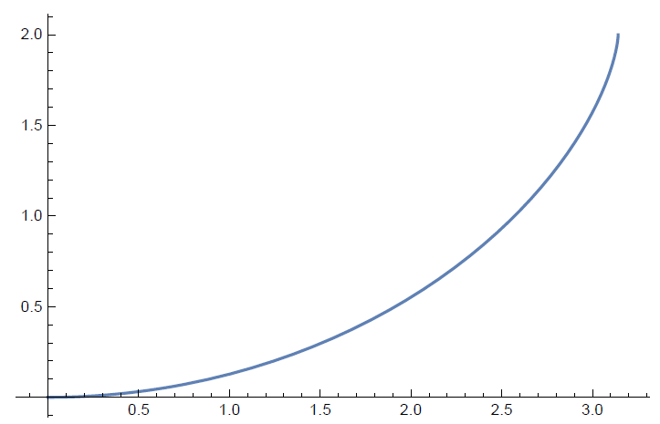

暑い夏や寒い冬を Magic Hexagon Coaster と乗り切ろう！

[コースター販売ページへ](https://mathrelish.booth.pm/items/878992/)

## 三角関数の社会的地位

突然ですが三角関数は理系と文系を冷酷に分断するきっかけの一つではないでしょうか[1](#fn-941-rikei_vs_bunkei)．

### 常識という非常識

理系ならば三角関数がどれだけ重要で基本的で頻出する関数なのかは，誰しも理解しています． しかしこの常識は一歩外に出ると全く通用しません．

例えばクイズ番組．三角関数の影も形もありません． せいぜいパズルやひらめきとかいう寄せ集めです． 望みがあるとすれば「たけしのコマ大数学科」や「平成教育委員会」くらいでしょうか． ビートたけししか思いつきません・・・．ごめんなさい．

では三角関数を知っている人は外の世界の人々にはどう見えるのでしょうか． きっと TV ドラマの「ガリレオ」の湯川のような別世界の人に見えていると思います．

### 著名人の発言

そうそうお茶の間に現れない三角関数ですが，何か教育を語るときに， 何故かネガティブな例としてよく挙げられます．

> 鹿児島県知事：伊藤祐一郎 「女子に『（三角関数の）サイン、コサイン、タンジェントを教えて何になるのか』」

や，

> 元大阪府知事：橋下徹 「元素記号やサイン・コサイン・タンジェント、どこで使うの？使ったためしがない。」

といったものです[2](#fn-941-sincostan)．

そう，彼らの発言がどうあれ，三角関数は「何か難しいモノ」という象徴になっているのです． これが三角関数の社会的地位ではないでしょうか．

[コースター販売ページへ](https://mathrelish.booth.pm/items/878992/)

### 繰り返される悲劇

ちょっと脱線してしまいますが，何も三角関数だけが拷問 (?) にあっているわけではありません． 二次方程式の解の公式に至ってはかつて次のような発言が発端となって，中学数学から姿を消しました．寄ってたかって嬲り殺されたかのように．

> 作家：三浦朱門 「曾野綾子のように『私は2次方程式もろくにできないけれども、65歳になる今日まで全然不自由しなかった』という数学嫌いの委員を半数以上含めて数学の教科内容の厳選を行う必要がある」

現在では下記にあるように，復活しています．

[中学校学習指導要領（平成 29 年告示）解説 数学編](http://www.mext.go.jp/component/a_menu/education/micro_detail/__icsFiles/afieldfile/2018/05/07/1387018_4_2.pdf)

更に遡るとこんなことを述べていた人もいます．

> 小説家、劇作家、実業家：菊池 寛 「幾何の時間に習って役に立ったことは三角形の二辺の長さの和は残りの辺の長さより長いということである、しかしこんなことは犬や猫も知っている」

『公理とはなんぞや』というユークリッド原論がどれほどまでに偉大であったかを改めて痛感するものです． 物理学史でのアリストテレスの力学とも共通するものがありますが，何か特別な力と言えばよいのでしょうか，そういったモノはないんだよ，という冷徹なまでの事実と向き合うことから話が始まっているという，根本的なところで袂を分かっているように思われます．

ではこんな考えを抱くのは彼らが数学とは縁遠い法律家や作家だからでしょうか． そんなことはありません．あのイトカワやハヤブサの由来になった彼もこう漏らしていたようです．

> 工学者：糸川英夫 「私ですら社会へ出て『ピタゴラスの定理』を一度も使ったことがない。社会で最もこれを使っているのは中学の数学の先生だけではないか」

大げさかもしれませんが，古代ギリシアとローマ帝国を分かつ実用数学という甘美な響きが聞こえてくるようです．

ここまで振り返ってみて思われることは，三角関数を理解できたり，何かしら思い入れがある人というのは，よほど変わった人であり，特別な感覚を身に着けた人だと言えるでしょう．また数学というものはいとも簡単に断絶が生じる恐れのあるものであることが想像されます．

[コースター販売ページへ](https://mathrelish.booth.pm/items/878992/)

## 誰もが体験した三角関数

高校進学率 98% 超えの現代では，誰しも三角関数を一度は習ったといっていいでしょう． これまで $x,y$ とかだったのが，ここではじめて $\theta$ とかいうギリシア文字を目にするきっかけでもあると思います．$\alpha,\beta$ ならまだしも下手すると $\phi$ もでてきます[3](#fn-941-greek)． しかも大量の公式も表れます．

$\sin,\cos,\tan$ と関数名が二文字以上で，しかも初見ではわけのわからない略語です． 「サイン，コサイン，タンジェント？？」目に浮かびます． 更に和訳が正弦，余弦，正接です．これで余計わからなくなった方は多いと思います． 「余」やら「接」による言葉からのイメージも乏しい中，「三角」というのが唯一想像できる部分にもかかわらず，提出される問題は「三角」とは程遠いものばかり．

三角関数は，一体，何万人の高校生を数学嫌いにしたことでしょうか．

そんな三角関数という洗礼を受けると，「三角関数を理解していること」ということから， 知的でクールな男性像・女性像が自然とできあがると思います．

どうしてアイツは涼しげにできるのか，と．

[コースター販売ページへ](https://mathrelish.booth.pm/items/878992/)

## Magic Hexagon Coaster

Math Relish 物販部では皆様に三角関数をもっと身近に感じてもらうために， Magic Hexagon Coaster というコースターを作りました．

[Magic Hexagon Coaster](https://mathrelish.booth.pm/items/878992/)

あなたはこの魔法のコースターを手にすることで， 三角関数として覚えておくべき事柄をいつでも数多く引き出せます． さりげなく置かれたコースターをきっかけに， 彼女や彼氏，友人，同僚に三角関数の魅力を肴にして語ってみてはいかがでしょうか． 次々にコースターから公式を引き出す様は魔法のように映るはずです[4](#fn-941-remark)．

魔法に見えたらしめたもの．間違いなくその日から一目を置かれます． 三角関数を知っているという事実だけで，あなたへの見方や印象が， $\cos\pi$ 変わると言っても過言ではありません．

[コースター販売ページへ](https://mathrelish.booth.pm/items/878992/)

### $\csc,\sec,\cot$ って？

Magic Hexagon Coaster は $\sin,\cos,\tan$ にとどまりません． $\csc,\sec,\cot$ たちもいるのです！

$\csc,\sec,\cot$ これらは理系出身者でもそうそうお目にかかった方は少ないかと思います． 順にコセカント，セカント，コタンジェントです．和名は余割，正割，余接です． 「だから何？」と思われるかもしれません．仮にこれらの定義を忘れても大丈夫． Magic Hexagon Coaster があれば，次のようにすぐにわかります．

上の図は次の式に対応しています．

$$ \sin\theta\csc\theta = 1 $$

そう，相対する三角関数を乗じたものが $1$ になるのです． つまり $\csc$ (コセカント) は $\sin$ (サイン) の逆数だと思い出せます！

$$ \csc\theta = \frac{1}{\sin\theta} $$

上記以外の基本公式を読み取る手続きの一覧の冊子も同梱しております． この機会にぜひお買い求めください．

[コースター販売ページへ](https://mathrelish.booth.pm/items/878992/)

### $\csc$ の表記揺れについて

$\csc$ のことを $\mathrm{cosec}$ とする表記揺れがありますが，これは古い記法です． それを物語るように LaTeX では `\cosec` コマンドがありません．

もう少し掘り下げてみると，18 世紀と 19 世紀では $\mathrm{cosec}$ を用いる著者の記録が優勢でした． 一方で $\sec$ はこの時代でも既にこの表記に落ち着いています． このように結構長い間，$\mathrm{cosec}$ だったのですが，現代に於いては $\csc$ を普通用いますので注意してください．

[コースター販売ページへ](https://mathrelish.booth.pm/items/878992/)

### $\csc,\sec$ の有用な性質

ところで $\csc,\sec,\cot$ という見慣れない三角関数はいつ出会うのでしょうか． $\cot$ ならまだ馴染みがあるかもしれませんが，$\csc,\sec$ は一度でもあったらかなりの場数を踏んだ人だと言えます． そういうことも手伝ってか，無用の長物という評価が $\csc,\sec$ になされるときがあります．

そこで一つ $\csc,\sec$ の役立つと思われる性質をご紹介します．

突然ですが我々は関数をプロットするとき，直交座標プロットを当たり前のように考えます． いわゆる $y=f(x)$ という形式のもので図示するものです．

一方で極座標プロットというものは殆ど考えません． $r = f(\theta)$ という極座標での方程式を図示することがなかなかないのです．

さてここで関数形 $f$ として $\csc,\sec$ を選んでみましょう．

$$ \begin{eqnarray} r &=& d\csc\theta \\ r &=& d\sec\theta \end{eqnarray} $$

するとなんと！ これらはそれぞれ軸から $d$ だけ離れた水平および垂直な「直線」になります！

何故かといえば，例えば $d$ だけ離れた垂直な直線上の点を考えますと， この点の直交座標は $(x,y)=(d,y)$ となります． すると $y = r\sin\theta$ であり，且つ $\tan\theta = \frac{y}{x} = \frac{y}{d}$ ですから，これらを合わせて整理すると，$r = d\sec\theta$ が導かれるからです．$r = d\csc\theta$ も同様です．

極座標プロットの例はだいたい Emacs の学習曲線のようなクルクルした曲線と相場が決まっているのですが，それらとは一線を画する例を $\csc,\sec$ は与えます．

このことから $V(r)$ と表されるような関数，例えば原点からの距離 $r$ に依存するポテンシャルがあったとして，その分布を直交軸に平行な直線方向に沿って知りたい場合には $V(d\csc\theta), V(d\sec\theta)$ を調べれば良いとわかります． ここが逆数だとあんまり美しくないなぁと感じることでしょう． $\csc,\sec$ の良さが映えるというものです．

ただ単にサインやコサインの「逆数」というふうにコセカントとセカントを捉えていると， 代数的な印象が強烈で有用性が掴みづらいです． しかし今のような幾何的な印象を持っていると， 式変形の際に偶然表れた「逆数」でも少し立ち止まって， 想像したい気持ちにさせてくれます．

[コースター販売ページへ](https://mathrelish.booth.pm/items/878992/)

### 等時曲線 (tautochrone)

さてこの曲線 $C$ は何でしょうか． これは次で与えられる $r=1$ の場合を描いたサイクロイド曲線です．

$$ \begin{eqnarray} y &=& r(\theta + \sin\theta) \\ x &=& r(1 - \cos\theta) \end{eqnarray} $$

そしてサイクロイド曲線が従う微分方程式として次を立てることができます．

$$ 1 + \left[\frac{d}{dx}C(x)\right]^2 = \csc^2\frac{\theta}{2} $$

座標系を取り替えるとコセカントがセカントになったりしますが， ここで注目すべき点はサイクロイド曲線が等時曲線であるということです．

等時曲線とは，曲線上のどの点から質点を落としても等しい時間で滑り落ちる曲線のことです． 何故，等時曲線となるのかといったことは省略しますが， 数学の歴史上，積分方程式が最初に現れた例でもあり，由緒正しい例になっています．

このような例がコセカントで簡潔に書けるというところが鑑賞に値するところです．

よく $\csc$ や $\sec$ は特異点を持つから，使えない奴らだと評されることがあります．

でもちょっと待ってください．

今の場合，曲線の終わりという意味を持っていて，自己完結的ではありませんか． 「もう，ここまでだよ」 そんな声が聞こえてきませんか？ 嗚呼，なんと美しい…

以上，いろいろと見てきましたが，役立たずの烙印を押さずに，ちょっと散策してみてはいかがでしょうか． きっと違った世界が広がっていると思います．野辺に咲く一輪の花に気づきたいものです．

[コースター販売ページへ](https://mathrelish.booth.pm/items/878992/)

## 参考

- [初等・中等教育において算数・数学を学ばせる意味および社会的, 生活的状況の事例の研究](http://www.kurims.kyoto-u.ac.jp/~kyodo/kokyuroku/contents/pdf/1657-08.pdf)
- [数学、この大いなる流れ](http://mathsoc.jp/publication/tushin/0302/ueno3-2.pdf)
- [教育制度分科会（第6回）　議事録](http://www.mext.go.jp/b_menu/shingi/chukyo/chukyo1/gijiroku/1263482.htm)

|  |  |  |
| --- | --- | --- |

[コースター販売ページへ](https://mathrelish.booth.pm/items/878992/)

* * *

2. この分け方はあまり好きではありません． [↩](#fnref-941-rikei_vs_bunkei)

4. それにわかります，「サイン・コサイン・タンジェント」ってリズム感があるのも．「エロイムエッサイム」のようなものでしょう．きっと言いたくてしょうがないわけです． [↩](#fnref-941-sincostan)

6. 信じられないかもしれませんが，理系でも $\psi$ をファイとか言ったり，$\phi$ をプサイとか言ってしまう人が珍しくありません．日本人だけかもしれません． [↩](#fnref-941-greek)

8. Magic Hexagon Coaster は倍角公式や半角公式，和積の公式，合成それに微分公式のような複雑な公式まではカバーできません．Magic Hexagon だけでは覚えた方が早いような無理が生じます．他の記憶術が必要です． [↩](#fnref-941-remark)
