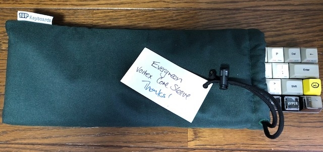
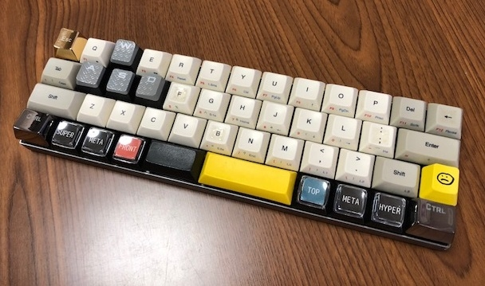
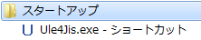

# 40% キーボードの導入に最適な Vortex Core

40% キーボードの自作が難しいという方や， そもそも「40% キーボードって何さ？」のような方には， Vortex Core が導入に最適です．

なおマニュアルは本家マニュアルのが詳しいです．

- [日本語マニュアル](http://www.archisite.co.jp/wp-content/uploads/2017/06/CORE-Manual.pdf)
- [本家マニュアル](http://vortexgear.tw/db/upload/webdata4/vortex_20198523345811246.pdf)

Fn1 キーと Pn キーの入れ替えは早々にしました．

## 40% キーボードは難しくない

40% キーボードを実務レベルで使用するには，ある程度の慣れが必要です． かといってタイピングの練習は全くせずに現在に至っています． キーを打つたびに手に馴染んでいく過程がなんとも素晴らしかったので， 特に頑張って慣れる的な苦痛はありませんでした．

慣れを気にして 40% キーボードを怖れる必要はありません． むしろデスクを広く使えるようになるは，自分の設定を持ち運びができるはと， いいことづくめです．

信じられないかもしれませんが，あの [HHKB](https://amzn.to/2ANlhZk) がデカく見えてきます．

まぁキー割り当てをある程度は自分で設定できるので， それだけでもわざわざ練習しなくても使えました．

キーキャップもあれこれと自分好みにできるのが楽しいです． ホームポジションのでっぱりのような手触りで， 自分用に場所を特定したい場合にはキーボードタッチセンサーとかいうシールが役立ちます．

 [キーボードタッチセンサー](https://amzn.to/2sVkY7T)

どうやら好評で 2021/1/2 に新しい商品が出ました！

 [キーボードマーキングシール 打ち間違い防止シール](https://amzn.to/3uZt9OH)

## Vortex Core と過ごす日常

私は [Vortex Core (クリア軸)](https://amzn.to/2JGdqQF) が最初の 40% キーボードでした． 最初は違和感がありますが，不思議なことに慣れるものです． 妙にフィットする瞬間が必ず訪れます． それはまた HHKB がでかく感じる瞬間でもあります． 40% キーボードの領域に自分が降り立った達成感というべきか，高揚感というべきか，に包まれます．

クリア軸は重いので 40% が故の押し間違えをある程度は防いでくれると思い， 私はクリア軸を選びました． スピードシルバー軸も日常的に使用していて， 軽すぎるが故の打ち間違いはよく経験しているので， まぁこれでいいかなと．

### 重さの利点

プログラミングは別に速く打ち込む必要はないですからね． 間違いなく打ち込んで，一つでもバグが減らせればそれでよいわけです． 重いとタイプ数も減って，[LOC](https://ja.wikipedia.org/wiki/LOC) も自然と減るでしょう．

ほどよく疲れるというのも重要です． 無理してゾーン状態の時に凄いコーディングをしないようになります．

### キーボードスリーブ

後はキーボードスリーブを下記から購入しました． どこでも自分の設定を持ち歩けるというのは大きいです．

[MADE-TO-ORDER Standard Sleeves](https://www.1upkeyboards.com/shop/sleeves/made-to-order-sleeves/)

## カーソルキーあれこれ

40% キーボードはカーソルキーをどうするかというのに個性がすごく出ます． カーソルキーというのは矢印キーのことです． これらは文字を打ち込むものではない特殊キーの一つで，そこから派生してカーソル移動は宗教戦争の種にさえなります．

[Arrow keys](https://en.wikipedia.org/wiki/Arrow_keys)

### 救済措置配列

Vortex Core の[本家マニュアル](http://vortexgear.tw/db/upload/webdata4/vortex_20198523345811246.pdf)にも記載していますが， 左Win-左Alt-右Space という三つ同時押しで，次の表にあるような配列に切り替えられます．

| キー | カーソル移動方向 |
| :-- | :-- |
| 右Shiftキー | ↑ |
| 右Winキー | ← |
| メニューキー | ↓ |
| 右Ctrlキー | → |

これは見慣れた配列です．私はこれを勝手に Vortex Core の救済措置配列とよんでいます． Vortex Core を買ってまでこの配列を常用するのはもったいないです．

### IJKL

Vortex Core 購入時点では Fn キーを押しながら，IJKL で上左下右のカーソルキーになります． これがとんでもなく初見殺しです．Vortex Core は購入者に試練を課してきます．

一応補足しますと，IJKL というのはゲームの 2 プレイヤー側の十字キーによく割り当てられる定番のキーアサインです．なぜ 2 プレイヤー側なのか，疑問に持つというのは野暮というもの．試されているのです．109 配列や 108 配列のブラインドタッチが到達点だと勘違いしていないかと．

私であれば次のように対処します．

1. 手で「4」の形を取ります．
2. 親指を Fn キーに置きます．
3. 人差し指を J，中指を IK，薬指を L にそれぞれ割り当てます．
4. 小指は Delte, Backspace を担当させます．

ただこれはこれでよいのですが，自分の道を歩いてみたい．

### WASD

そこで WASD に上左下右のカーソルキーを割り当てて，キーキャップをゲーム用でよくある傾斜のついたものに変えました．私の場合，キーキャップは [CORSAIR K95 RGB PLATINUM](https://amzn.to/2OPl0bm) についてきた WASD キーキャップを使っています．高さがちょうどよく，傾斜も気が利いており，なおかつ滑り止め加工がなされていて，これがいい感じにガイドしてくます．

ただこのためだけに [CORSAIR K95 RGB PLATINUM](https://amzn.to/2OPl0bm) 購入するのはアレだと思いますので，例えば次のような WASD だけのキーキャップを購入すると良いかもしれません． 私は試していないので何ともわからないのですが．．．

[](https://www.amazon.co.jp/%E3%82%AD%E3%83%B3%E3%82%B0%E3%82%B9%E3%83%88%E3%83%B3-Kingston-%E3%83%A1%E3%82%AB%E3%83%8B%E3%82%AB%E3%83%AB%E3%82%AD%E3%83%BC%E3%83%9C%E3%83%BC%E3%83%89%E4%BA%A4%E6%8F%9B%E7%94%A8-HXS-KBKC1-MOBA%E3%82%B2%E3%83%BC%E3%83%A0%E5%90%91%E3%81%91/dp/B0743YSX36/ref=as_li_ss_il?_encoding=UTF8&pd_rd_i=B0743YSX36&pd_rd_r=308c1a22-9a4c-11e8-8885-67218285f4de&pd_rd_w=Kk7AD&pd_rd_wg=DtBmi&pf_rd_i=desktop-dp-sims&pf_rd_m=AN1VRQENFRJN5&pf_rd_p=5805929820760247504&pf_rd_r=QVBPGE3E1AWPPWFXYE0W&pf_rd_s=desktop-dp-sims&pf_rd_t=40701&psc=1&refRID=QVBPGE3E1AWPPWFXYE0W&linkCode=li3&tag=alexandritefi-22&linkId=f23bf5936ea7c2c19972de1678c52bca) [キングストン Kingston ゲーミング キーキャップ メカニカルキーボード交換用 レッド](https://amzn.to/2OPI4XC)

[](https://www.amazon.co.jp/%E3%82%AD%E3%83%B3%E3%82%B0%E3%82%B9%E3%83%88%E3%83%B3-Kingston-%E3%83%A1%E3%82%AB%E3%83%8B%E3%82%AB%E3%83%AB%E3%82%AD%E3%83%BC%E3%83%9C%E3%83%BC%E3%83%89%E4%BA%A4%E6%8F%9B%E7%94%A8-HXS-KBKC2-MOBA%E3%82%B2%E3%83%BC%E3%83%A0%E5%90%91%E3%81%91/dp/B0743ZZYDX/ref=as_li_ss_il?_encoding=UTF8&pd_rd_i=B0743ZZYDX&pd_rd_r=3e4ee61a-9a4c-11e8-ad37-27c7ea2ab43d&pd_rd_w=xltyI&pd_rd_wg=ZNhoj&pf_rd_i=desktop-dp-sims&pf_rd_m=AN1VRQENFRJN5&pf_rd_p=5805929820760247504&pf_rd_r=4TJPTD1DSQN2C0E75PSM&pf_rd_s=desktop-dp-sims&pf_rd_t=40701&psc=1&refRID=4TJPTD1DSQN2C0E75PSM&linkCode=li3&tag=alexandritefi-22&linkId=f2779fcde8114caf1319547b771c5dfa) [キングストン Kingston ゲーミング キーキャップ メカニカルキーボード交換用 チタンカラー](https://amzn.to/2njSQJ7)

WASD も補足しますとこれはゲームの 1 プレイヤー側の十字キーによく割り当てられる定番のキーアサインです． 「早稲田配列」と私は勝手によんでいます．AKB と似たようなノリです．

WASD 配列は IJKL 配列での扱いが活きてくるんですね． 40% キーボードは縮退しまくっているので，どっかしらは重なってきて，無駄にはならないんです． ここでは親指が依然として Fn キーに置かれて，左手が WASD を「4」の形を取らずに自由に動き回れます． そして右手の薬指と小指がそれぞれ Delete, Backspace キーを担当します． そう，IJKL での親指と小指のポジショニングが受け継がれているのです． 気づけたでしょうか．

更に親指は Fn キーとその左にある 右Space キーを担当します． カーソルの移動が止まった瞬間，右Space キーが叩かれる． そして即座に Fn キーに戻ってカーソルが動き出す． 親指の動きに全く無駄がないのです．

プログラムを書くときには半角スペースを入れたいときがよくあります． だからこの動きの良さは本当に重宝します．

### IJKL はどうする？

WASD にカーソルキーを任したので，IJKL が手薄になりました． これらには音量上下，ミュート，再生などを割り当てます． ちょうどデフォルトの UIOJKL と QWEASD を置換する割り当てです．

音量操作は頻繁には使用しませんが，滅多に使用しないというわけでもなく， 私は曲が変わったり，盛り上がりたいときに音量を変化させる癖があるので， それが IJKL を触るのにちょうどよい使用頻度になっています．

マウスで音量操作するより遥かに楽になっています．

## 日本語を打つための備え

40% キーボードでおそらく困ることといえば，日本語入力でしょうか． US 配列という壁はもちろん，当然ながら次のキーがなく，混乱すると思います．

- 半角/全角キー
- 無変換キー

### US 配列

#### US 配列への切り替え

何はともあれ．US 配列にしたいと思います． どうやればよいでしょうか．

まさか OS の言語を英語にするわけには行きません． またコントロールパネルから US 配列にするのもなんだかんだと大変です．

そこで [ULE4JIS](https://www.vector.co.jp/soft/winnt/util/se476294.html) です．

これがあれば，いつでも好きなときに US 配列にできますし，やめることもできます！ レジストリも汚しません．

なおマシン起動時に毎回 [ULE4JIS](https://www.vector.co.jp/soft/winnt/util/se476294.html) を叩くのが面倒な場合は Windows OS でしたら，スタートアップフォルダにショートカットを置けば，起動時に自動で実行してくれます．

#### US 配列の記号配置の覚え方

US 配列に不慣れな方は記号がどの数字キーのモディファイか迷うことでしょう． 指が覚えているというのもありますが，私はというと次のようなことを想像しています． 参考にしてみてください！

| 数字キー | 記号 | 覚え方 |
| :-- | :-- | :-- |
| 1 | ! | 1 と ! は同じ形 |
| 2 | @ | A と同じ位置にあるので，atmark と思い出す |
| 3 | # | S と同じ位置にあるので，sharp (ホントは number sign) と思い出す |
| 4 | $ | D と同じ位置にあるので，dollar と思い出す |
| 5 | % | F と同じ位置にあるので，float と思い出す (ここまでくると結構なこじつけ) |
| 6 | ^ | G とあるので，Emacs の Dired と関連して「上」のディレクトリへ Go で思い出す |
| 7 | & | 慣れ |
| 8 | \* | 慣れ |
| 9 | ( | これは気合 |
| 0 | ) | これは気合 |

上の表にあるとおり，( と ) はまぁ覚えられるとして，私自身，%, &, \* は慣れでした．

そもそもなんでこんな配列になっているのか気になるかもしれません． 下記の本にいろいろと書かれているので，参考にしてみてください．

 [キーボード配列QWERTYの謎](https://amzn.to/2PKWHvx)

理由はこうだ！と単純に割り切れない事情を知ることができると思います．

### 半角/全角キー

Alt-\` が半角/全角キーに通づる役目を果たします． 問題は \` (アクサングラーブ) をどう打つかですが，私は左スペースキーに割り当てました．

### 無変換

これは簡単．F7 キーを日本語変換中に押せばよいのです．

ああ，ファンクションキーが下火になって久しいです． かつてはスクリーンの下に鎮座していました． Alt-F4 がアプリケーションの終了であるなど，これはもう義務教育すべき事柄だと私は思います．

## タイピング

ところで私は滅多にしないですが，タイピング練習ソフトというのでタイピングだけを練習できたりします． 40% キーボードに限らず，ただそれだけの練習にはもってこいです．

### タイピングソフト

タイピング練習ソフトは，昔から，それこそ DOS 時代から「美佳タイプ」のような練習ソフトがありました． 時代を感じますね．昔は人の名前を付けるアプリケーションが多かったように思います．

- 一太郎・三四郎・花子などのジャストシステム関係
- 寺関係
- 光(ひかる)の辞典などのテグレット関係

などなど．

今風のタイピング練習ソフトに，Typing Cat なるブラウザアプリがあります．

[Typing Cat](http://thetypingcat.com/)

### 神タイパー

「極めるとどこまで速くのだろうか．」 そんな単純な疑問が湧きます．

私もいつかこの方のような神速タイピングをしてみたいです． 片手でこの速さ．「片手だからこそ」でしょうか．

\[embed\]https://www.youtube.com/watch?v=sJlulcHEH4Q\[/embed\]

この動画の詳細が全くわからないですが， 周囲が全く驚いていないところがまたなんともいえないスゴさを演出しています．

たとえバブルソートのプログラミングでもこの速度はまず出せないんですが， メールとか書く時なら望みはかすかにあるように思いたいところです．

