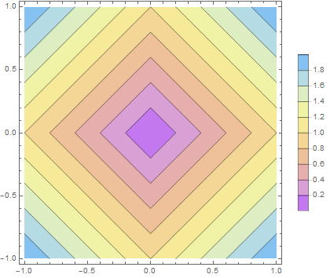
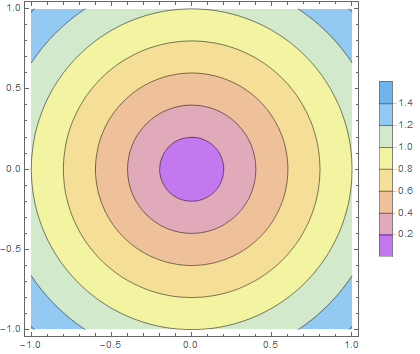
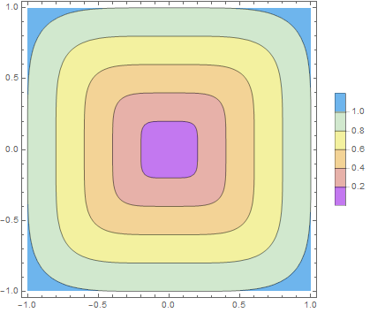
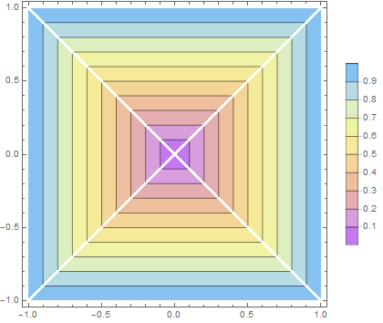
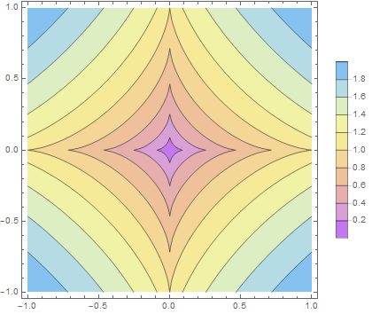
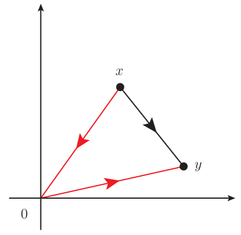

# 距離空間

距離という概念は，有史以来，身近であり続けた概念の一つであろう． 単純なユークリッド距離を母体として，より一般的な距離の定義へと至る． ちょうど絶対値 $|\cdot|$ の一般化がノルム $\|\cdot\|$ であるのと同じである．

そうして構成された距離空間という構造は，ハウスドルフ空間の例でもあり， 距離空間は基本的な位相空間のクラスとなっている．

[The Math Relish Journal Volume 1S](https://mathrelish.booth.pm/items/1123647/)

## 着想と背景

普通，距離と聞いて想像するのは次のユークリッド距離のことであろう．

$$ d_2(x,y) := \sqrt{\sum_{i=1}^n (x_i-y_i)^2} $$

これを一般に二点間の関数 $d(x,y)$ とみたとき，どのような性質が本質的だろうか． 「距離」というには何が要求されなければならないだろうか． そういったことを考えることで，ユークリッド距離以外にも様々な「距離」を見出すことができる．

数学では，よく知られた事柄が満たしている性質をもって， 今度は逆にその性質でもって事柄を定義するということがよくある．

そのような感覚を養う上で，距離空間は比較的わかりやすく，また可視化もしやすく， そして豊富な応用例があるという，実に適した例ではないだろうか．

## 定義

集合 $S$ の任意の二つの元 $a,b$ に対して次の四条件を満たす実数 $d(a,b)$ が一意に定まるならば， $d$ を距離関数とか単に距離という．

非負条件 $$ d(a,b) \geq 0 $$

対称性条件 $$ d(a,b) = d(b,a) $$

三角不等式条件 $$ d(a,b) \leq d(a,c) + d(c,b) $$

非退化性条件 $$ d(a,b) = 0 ~\Leftrightarrow~ a=b $$

距離の公理を構造として抽象的に捉えることで距離空間の定義を得る．

集合 $S$ の任意の元について，距離 $d$ が定義されているとき， 組 $(S,d)$ を距離空間という．

距離空間の中でも最も素朴な距離空間がユークリッド空間である．

距離空間 $(\mathbb{R}^n,d_2)$ をユークリッド空間という．

## コメント

### 既存の距離から新しい距離を生成

一般に距離空間 $(S,d)$ があったとしよう． このとき $d$ から新しい距離関数 $d^{\prime}$ をつくって，距離空間 $(S,d^{\prime})$ をつくることができる．

#### 規格化

次のように規格化された新しい距離関数 $d_{[0,1)},d_{[0,1]}$ をつくれる．

$$ \begin{eqnarray} d_{[0,1)}(x,y) &:=& \frac{d(x,y)}{1 + d(x,y)} \in [0,1) \\ d_{[0,1]}(x,y) &:=& \min(1,d(x,y)) \in [0,1] \end{eqnarray} $$

#### 雪片

次のように新しい距離関数 $d^{\alpha}$ をつくれる．

$$ d^{\alpha}(x,y) := [d(x,y)]^{\alpha} ~~ (0 < \alpha < 1) $$

特にこの距離空間 $(S,d^{\alpha})$ は距離空間 $(S,d)$ の雪片という．

### 距離と開集合

距離は開集合と密接な関係がある．例えば開区間 $(a,b)$ の規模を定量的に表現するのに，その中点 $\frac{a+b}{2}$ を中心とする半径 $\frac{b-a}{2}$ の $1$ 次元の開球体 $B^1$ と表現してもよい．ここに半径 $r$，中心 $p=(a_1,\cdots,a_n)$ の $n$ 次元開球体 $B^n(r;p)$ は次のように定義される．

$$ B^n(r;p) := \{ x\in\mathbb{R}^n ~|~ d_2(x,p) < r \} $$

開区間を開球体として捉えることで，この議論は一般の $\mathbb{R}^n$ へと自然に拡張できて，$n$ 次元の開球体 $B^n$ が開集合のある一つの実現例となる．ここで実現例である開球体の定義には中心と半径という二つの要素が必要である．中心とは点のことであって集合の元と同定されるものであるから，特に新しくはないが，一方で半径は集合の二つの元に対して一意に定まるある実数値のことであって，それが何であるかの定義が必要である．それが距離に他ならない．つまり開集合を実現する例を構成するのに，距離の定義が必要となる．

どうにかしてこの距離という具象性を外せば，より抽象性が増すというものであるが， それが開集合や位相空間のことである．

### 距離空間のハウスドルフ性と連続性

距離空間は位相空間の一つの例である．そしてどのような異なる二点をとってきても，それらを中心とする二つの開球体を考えるとき，半径を適当に取ることで重なりがないように分離することができる．つまり距離空間はハウスドルフ空間の例でもある．これにより収束の一意性がいろいろな距離の定義に基づいたすべての距離空間について保証されていることがわかる．

また連続性を直観的に記述すれば次のようになって， その意味でも距離の概念が開集合よりも具象的に「近さ」を捉えている．

例えば $\mathbb{R}^2$ 上の部分集合 $A$ 上で関数 $f:A\rightarrow\mathbb{R}$ が定義されているとする．このとき関数 $f$ が $A$ のある一点 $p=(a_1,a_2)$ で連続であるとは，$A$ の点 $x=(x_1,x_2)$ が点 $p$ に近づくとき，即ち点 $x$ と点 $p$ の距離が $0$ に近づくとき，$f(x_1,x_2)$ の値が $f(a_1,a_2)$ に限りなく近づくこと，即ち $f(x)$ と $f(a)$ の距離が $0$ に近づくときをいう．このことはつまり，任意に与えられた正数 $\varepsilon$ に対して，適当な正数 $\delta$ をとれば次式が成立することを言っている．

$$ d(x,p) < \delta \Rightarrow d(f(x),f(p)) < \varepsilon $$

このように連続性の議論を定量的に行うには，距離という概念が必要に見える． しかし開集合を理解することで，位相というより抽象的な階層で連続性という概念が構築されることがわかるようになる．

## 例

距離空間の例は距離のいろいろな定義の例でもある．

### $L^p$ 距離 (ミンコフスキー距離)

$L^p$ 距離もしくはミンコフスキー距離とは次のように定義される $d_p$ のことである．

$$ d_p(x,y) := \begin{cases} 1 - \delta_{x,y} & (p=0) \\ \left(\sum_{i=1}^n|x_i-y_i|^p\right)^{\frac{1}{p}} & (1 \leq p < \infty) \\ \max_{1\leq i\leq n}(x_i - y_i) & (p=\infty) \end{cases} $$

$p=0,1,2,\infty$ をそれぞれ「離散距離」「マンハッタン距離」「ユークリッド距離」「チェビシェフ距離」という． そして $1\leq p < \infty$ を $p$-乗平均距離という．

各距離について原点から等距離にある位置をプロットすると次のようになる．

**$L^1$ 距離 (マンハッタン距離)** 

**$L^2$ 距離 (ユークリッド距離)** 

**$L^5$ 距離** 

**$L^{\infty}$ 距離 (チェビシェフ距離)** 

### $l^p$ 距離

$l^p$ 距離とは次のように定義される $d_p$ のことである．

$$ d_p(x,y) := \sum_{i=1}^n|x_i-y_i|^p ~~ (0 < p < 1) $$

下図は $p=\frac{2}{3}$ とした距離について，原点から等距離にある位置 (等高線) をプロットした図である．

定義から $l^p$ 距離の等高線はアステロイド曲線となる．

### $L^p$ 距離 (関数)

$p$ 乗可積分関数の $L^p$ 距離とは次のように定義される $d_p$ のことである．

$$ d_p(f,g) := \begin{cases} \left(\int_a^b dx |f(x) - g(x)|^p\right)^{\frac{1}{p}} & (1 \leq p < \infty) \\ \sup_{a\leq x\leq b}|f(x) - g(x)| & (p=\infty) \end{cases} $$

### 数列空間上の距離

実数列 $x:=\{x_n\}_{n=1}^{\infty}$ 全体の集合を $\mathbb{R}^{\infty}$ とする．このとき $\mathbb{R}^{\infty}$ の二つの元に対して定める次の関数 $d$ は距離となり，$(\mathbb{R}^{\infty},d)$ を数列空間という．

$$ d(x,y) := \sum_{n=1}^{\infty}\frac{1}{2^n}\frac{|x_n - y_n|}{1 + |x_n - y_n|} $$

### ブリティッシュレール距離

ブリティッシュレール距離 (British Rail metric) とは次のように定義される $d$ のことである．

$$ d(x,y) := \begin{cases} \|x\| + \|y\| & (x\neq y) \\ 0 & (x = y) \end{cases} $$

何故，ブリティッシュレール距離という名がついているかというと， 目的地へ向かうのに，わざわざロンドンを一度経由する必要があるような鉄道網を表現しているからである．

その様子は下図のとおりである．

本当は黒線で行けばよいのだが，そのような鉄道網とはなっておらず， 必ず原点であるロンドンを経由しなければならない，ということを表現している． つまり赤線が最短経路となる．

ブリティッシュレール距離はこの他にも次のような別称がある．

- 郵便局距離 (post office metric)
- SNCF 距離 (SNCF metric)

SNCF とは Société nationale des chemins de fer français で， フランス国有鉄道のこと．この場合，ロンドンはパリのことを意味する．

### キャンベラ距離

キャンベラ距離とは次のように定義される $d$ のことである．

$$ d(x,y) := \sum_{i=1}^n\frac{|x_i - y_i|}{|x_i| + |y_i|} $$

但し総和の中で不定 $\frac{0}{0}$ が生じる場合は，その項は $0$ と計算する．もしくは原点を除いた集合で距離空間を定義する．

キャンベラ距離は定義から次の重みを持ったマンハッタン距離だとわかる．

$$ w(x_i,y_i) := \frac{1}{|x_i| + |y_i|} $$

つまり個々の成分が $0$ に近いほど，その成分の重みが効くことになる．

### 行列ランク距離

行列ランク距離とは次のように二つの行列の間に定義される $d$ のことである．

$$ d(X,Y) := \mathrm{rank}(Y - X) $$

### ハミング距離

ハミング距離とは同じ長さの二つの文字列に対して，同位置にある文字を比較したとき，異なる文字があった位置の数のことをいう．

文字列を " で囲むとき，ハミング距離の例は次のとおり．

$$ \begin{eqnarray} d(\textrm{""}, \textrm{""}) &=& 0 \\ d(\textrm{"110"}, \textrm{"101"}) &=& 2 \\ d(\textrm{"rock"}, \textrm{"lock"}) &=& 1 \end{eqnarray} $$

### その他

距離関数の例は実にたくさんある．その一部を以下に記す．

$$ \begin{eqnarray} d_+(x,y) &:=& \left|\log \frac{y}{x}\right| ~~ (x,y\in\mathbb{R}_{>0}) \\ d(x,y) &:=& \log(1 + |x − y|) \\ d(x,y) &:=& |x^3 − y^3| \end{eqnarray} $$

## 参考

- [はじめよう位相空間](https://amzn.to/2MeUwPt)
- [解いてみよう位相空間〔改訂版〕](https://amzn.to/2l1Mih7)
- [集合・位相入門](https://amzn.to/2sU95yL)
- [現代数学への招待:多様体とは何か (ちくま学芸文庫)](https://amzn.to/2lMkb5M)
- [Encyclopedia of Distances](https://amzn.to/2KB8IUS)

