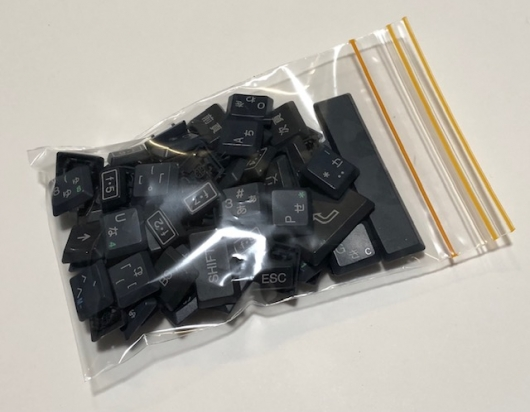
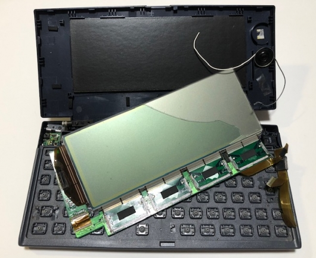
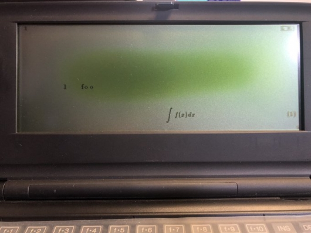
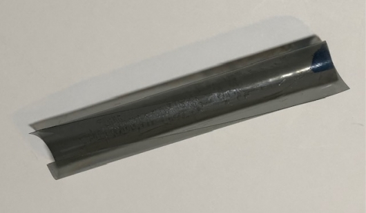
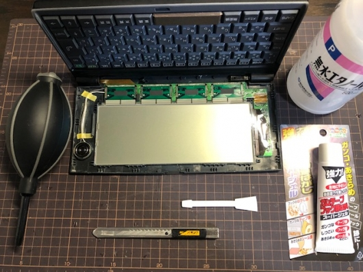
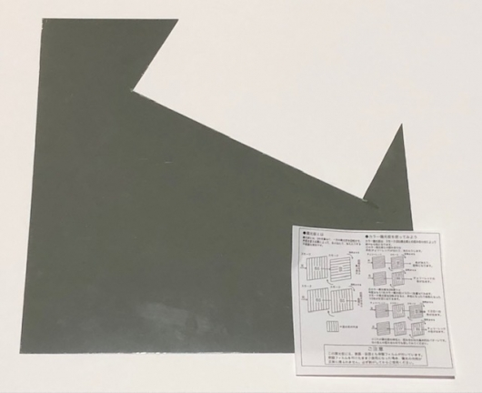
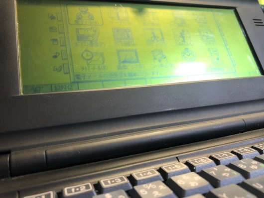
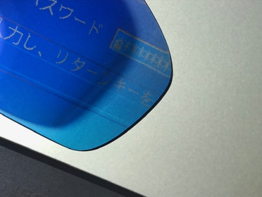

# DOS モバ (Mobile Gear) のビネガーシンドローム修理の簡易ログ

DOS モバとは MS-DOS を動かして楽しむことができる Mobile Gear のことで， 初めての方は下記をご参照いただければと思います．

[「初心者のためのモバイルギア徹底活用講座」](https://www.mobile-gear.net/)

発売は [1996 年](https://ja.wikipedia.org/wiki/1996%E5%B9%B4%E3%81%AE%E6%97%A5%E6%9C%AC)ころ．日本にまだ世界を牽引する勢いと，同時に確実に忍び寄る老いの足音が少しずつ感じられた時代 (と思う)．

\[embed\]https://www.youtube.com/watch?v=C\_kTzS7em2Y\[/embed\]

名機 Mobile Gear にもまた老いが忍び寄る． ビネガーシンドロームを発症してしまいました． 以下はその修理の簡易ログです．

## NEC Mobile Gear MC-MK32 の経過

### 20xx-xx-xx

MC-MK32 の液晶画面にビネガーシンドロームが発症していることを確認． ヤフオクで入手した部品取り用のマシン (MC-MK11) から， 液晶パネルを抜き取って付け替えで対応．

キーキャップも回収！ マイナスドライバーを使って，てこの原理で少し力を加えれば簡単に取れます．

### 201x-xx-xx

加水分解が相当進行したため再塗装．このときの分解は相当心臓に悪かった． こう言っては何だが，外科医の凄さを間接的に知った． 自分なら間違いなく失敗する．

分解に当たっては，部品取り用のマシンを完全ジャンクになるほど調査． 今回のビネガーシンドロームの修理でも，偏光板とは何かなど，知るのに非常に役立った． ぶっつけ本番，一発勝負とはいかないのだ．

### 2021-08-21

再び液晶画面にビネガーシンドロームが発症していることを確認． 予備の部品がないためひとまず放置．

なぜ発症したのかは本当のところはわからないが，保管場所の湿気が多かったのかもしれない．

### 2022-11-05

ビネガーシンドロームが画面全体に進行し，我慢して使うのも困難な状況に進展． 理論的には偏光板のみ取り替えればよいので，直せるはずである． 修理方法が比較的確立されているのだ．

ということでビネガーシンドロームの修正を決断・実行． MC-MK32 を捨てるには，もしくは手放すには，あまりに忍びない！

## 簡易作業ログ

1. 本体の液晶前面パネルを取り外す．ここがまず難関．ツメががっちりしているので，慎重に慎重に取り外しを行った．「バキッ」という聞きたくない音を聞く度に神経が磨り減る．
2. 液晶パネルを本体から取り外すことは避けた．理由は次のとおり．
    
    - フレキシブルケーブルが繊細なので，さわりたくない．
    - 取り外さない状態でも作業難易度はそれほど変わらない．
    - 電源を入れて，状況を確認できるため．
3. カッターを寝かせて，偏光板と液晶の隙間を確保するためにほんの少し隙間を作り，その隙間に樹脂製へらを入れ，偏光板を取り去る．取り去る際にビネガーシンドロームが生じている部分にへらが到達すると，ツンとした酢酸臭が鼻をつく． 
4. 偏光板をすべて取り去ると，ビネガーシンドロームを起こしていた部分に粘着物がべたぁっと残る．「[高森コーキガムテープフック跡はがし](https://hands.net/goods/4956497060378/)」で，それら粘着物を剥ぐ．
    
    - ここですぐに作業せず，再びカッターを寝かせて，今度は粘着層をへらで物理的にできるだけ剥がすべきだったかもしれない．粘着層はどうやら三層構成になっており，これを一層ずつ剥がしていくことになる．僅かに残っている正常な部分が画面周辺にあるため，ここからへらで予め取り外しておけば，時間短縮ができたと思われる．剥離剤だけでは私の場合，相当な時間を使ってしまった．休日深夜からの作業で 8 時間は使った．作業時間が長時間に及んだため，液晶にストレスがかかって寿命を縮めてしまったかも知れない．
5. 粘着物を相当落としたが，霞のようなうすーいカスが所々にしぶとく残った．剥離剤を塗布してもびくともしなかった．そこでカッターの刃先で慎重に霞だけに切り込みを入れるように線状に削った．そこに無水エタノールで拭くと，その少し削った隙間にうまく浸透してくれて，このカスを一掃することができた．こうして光り輝く液晶面に到達できた．
6. 通電させて偏光板をかざすことで異常がないことを確認． 

さてここで大きく修理作業の手順が分かれることと思う． 偏光板をくっつけて液晶前面パネルを元に戻すか， 元に戻してから偏光板をくっつけるかである．

私は後者を選んだ．

繰り返しとなるが，できる限り前面パネルを開けたくなかったからである． 偏光板をとりつけるのも実のところ，相当，繊細な作業である． 「あ，やっぱりこの角度にしよ」とかいう微調整は後でしたくなるはずだ． 単純に偏光板だけ取り替えたいのに，分解破損というリスクを負いたくない．

ということで，私は液晶前面パネルを戻して， ジャストの寸法で偏光板を切り出して，ただ置くことにした．

そして復活！！！！！

はぁ，感無量です．

## 偏光板を使わないという選択肢について (偏光眼鏡の可能性)

今回，偏光板の取り替えの際に，偏光板をいちいちかざしながら， 剥離作業がうまくできているかを確認していたのですが， 偏光眼鏡をかけて作業すれば良かったと気付きました．

しかも偏光眼鏡をかけていれば，偏光板なしでも自分だけ見えるじゃないですか． 理論上は・・

果たして本当にできるのか，ということで偏光眼鏡を探しました． はじめは自作しようと思ったのですが，公共の場では耐えられないと思い断念しました． そもそもどう頑張って不自然ですが，市販のほうがまだマシかなと．

で，探すのですが，赤・緑 (青) の偏光眼鏡がありましたが， これはもう自作よりも公の場では目立って仕方がないので，却下．

いろいろ検討して探した結果，スポーツ用品の紫外線カット用の[偏光眼鏡](https://amzn.to/3VeSkKM)に行き着きました．

これなら眼鏡にくっつけるだけですし，「はね上げ式」なので切り替えもできます． モバイルギアの画面サイズならば，問題なく視覚に収まります． ただ偏光が反転色となりました． しかしこれはダークモードと思えば．MCMK-32 の黒とあいまって統一感もあります．

まぁ，子供騙しですが， 色々な楽しみ方の選択肢ができたと思えば， 令和の DOS モバライフも悪くありません．

## 参考

- [ミッドタウン 偏光板 のり無し BSP250 250×250 (今回使った偏光板)](https://hands.net/goods/2401017181870/)
- [【2018年度版】MS-DOS版Mobile Gear（モバイルギア）の分解方法完全解説](http://hitoriblog.com/?p=54273)
- [NECインフロンティア Mobile Gear Age | MC-MKシリーズ 仕様一覧](https://support.nec-lavie.jp/product/mobilegear/mgvitamin/age/mp_mk.html)
- [List of DOS-based palmtop computers｜NEC MobileGear MC-MK32](https://gadgets.notjakob.com/DOSPALMTOP/necmcmk32.html)
