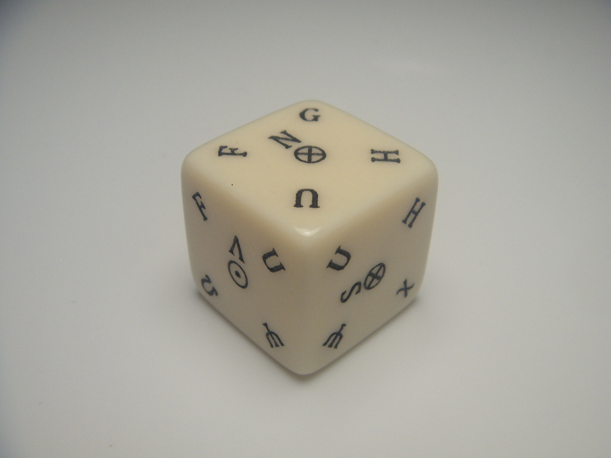
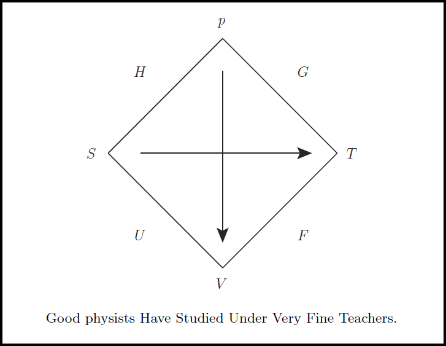
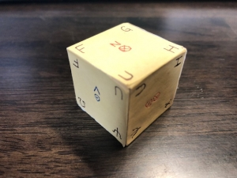
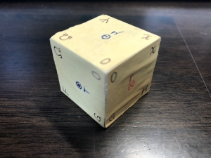
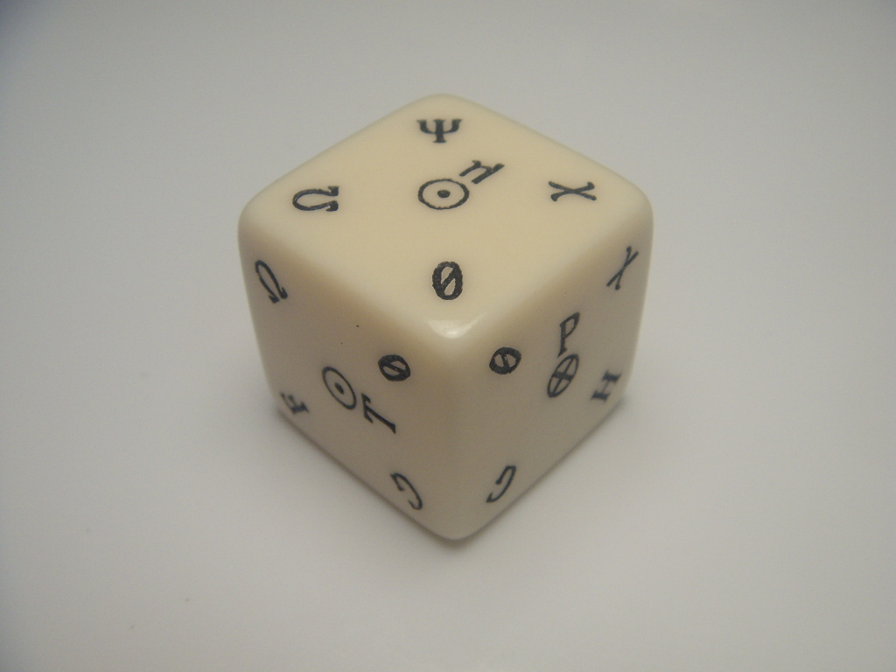

Pate Cube，これぞ熱力学の至宝なり！ 「エントロピー」「温度」「内部エネルギー」「自由エネルギー」「エンタルピー」「マクスウェルの関係式」など熱力学の重要な物理量すべてが，今，ルジャンドル変換の下で一堂に会する！

[Pate Cube 販売ページへ](https://mathrelish.booth.pm/items/879076/)

## 馴染みのない物理量

熱力学を学んでいると馴染みのない物理量の多さに驚かされます． 力学でも「時間」「位置」「速度」「加速度」「運動量」「角運動量」「エネルギー」などなど出てきますが，全くイメージが湧かないとまではいかないと思います．

しかし熱力学では「エントロピー」を筆頭に「自由エネルギー」「内部エネルギー」「エンタルピー」など，日常経験では到達がかなり難しい概念がいっぱい立ちはだかります．

そして順当に学んでいくと次に悩まされることでしょう．

- 完全な熱力学関数のポテンシャルの引数
- 完全な熱力学関数のポテンシャルの全微分
- マクスウェルの関係式

例えば「内部エネルギー」というポテンシャル $U$ が完全な熱力学関数であるためには， 次式のようにある決まった引数 (自然な変数) を取る必要があります． これら以外は不完全な熱力学関数です．

$$ U[;(S,V)] $$

なお完全な熱力学関数は角括弧で区別します． またここではわかりやすいように，示強変数と示量変数をセミコロンで区切っています．

これがまたメンドクサイんですね．いろんなポテンシャルがあるので．．．

[Pate Cube 販売ページへ](https://mathrelish.booth.pm/items/879076/)

## ボルン図式 (熱力学の四角形)

教える側に立つとこの面倒くささに手を焼きます． 「公式を覚えることは本質ではない！」 とかいって教える側は適当に済ませることもできるんですが， 教えられる側としては，じゃあ覚えなくていいかぁ，とはならない訳で．．．

そこで昔のある偉い学者は講義中に次のような図式を描きました．

その学者とはマックス・ボルンのことで，彼が 1929 年に考えたのでこの図式をボルン図式とか熱力学の四角形 ([Thermodynamic square](https://en.wikipedia.org/wiki/Thermodynamic_square))といっています[1](#fn-996-bornDiagram)． ボルンはあの量子力学で有名なハイゼンベルクの師匠でもあり， 量子力学の一つの重要な公理である波動関数の確率解釈を提唱した人で， これによってノーベル物理学賞を 1954 年に受賞しています．

[Max Born](https://www.nobelprize.org/nobel_prizes/physics/laureates/1954/born-bio.html)

ハイゼンベルクとその師ボルンとの関係を想起させる次の語呂でボルン図式を覚えましょう！

> **G**ood **p**hysists **H**ave **S**tudied **U**nder **V**ery **F**ine **T**eachers.

内部エネルギー $U$ は図式の辺に割り当てられています． そしてその辺の両端点にはエントロピー $S$ と体積 $V$ が割り当てらています． これらが内部エネルギー $U$ が完全な熱力学関数であるための引数を表しています． このような読み取り方で，他の以下のポテンシャルが完全な熱力学関数であるための引数がわかります．

- エンタルピー $H[p;S]$
- ギブスの自由エネルギー $G[(T,p);]$
- ヘルムホルツの自由エネルギー $F[T;V]$

フレミングの左手や右手の法則もフレミングが講義で法則を教えるために考案したものですし， 業績を残される方は教育者しても優れていることがあります． どうもこういった記憶術は嫌われる傾向にありますが，ガンガン利用していくべきでしょう．

[Pate Cube 販売ページへ](https://mathrelish.booth.pm/items/879076/)

## な，なんだコレは！？

ボルン図式は偶然の産物でしょうか．都合の良い記憶術に過ぎないのでしょうか． この問いかけはボルン図式を単なる便法ではなく，熱力学が持っている一種の対称性を表す図式へと導きます．

ボルン図式は閉鎖系の示強変数と示量変数にとどめたものですが， 例えば粒子数が変化する開放系となると，化学ポテンシャル $\mu$ という示強変数と粒子数 $N$ という示量変数が追加されます．

この場合でもボルン図式が持っていた情報量を壊さないように一般化できるでしょうか． それもいびつな図式にならないように！

それが可能なのです！！ 大量にあるマクスウェルの関係式は systematic に存在していたのです．

Math Relish 物販部では開放系のボルン図式に相当する熱力学の立方体ともいうべき図式 Pate Cube を作りました．

[Pate Cube](https://mathrelish.booth.pm/items/879076)

熱力学を一度でも学んだ方は，Pate Cube を肴に熱力学が持っている美しさを， 思い出したり語ったりしてみてはいかがでしょうか．

[Pate Cube 販売ページへ](https://mathrelish.booth.pm/items/879076/)

## こだわり

Pate Cube を具現化するために次のような試作品を作ったりしていました． その試行錯誤を基にしているので，使い込むほど Pate Cube の良さを実感してもらえると思っています．

|  |  |
| --- | --- |

[Pate Cube 販売ページへ](https://mathrelish.booth.pm/items/879076/)

### 文字配置のこだわり

Pate Cube がもつ美しい数理構造を少しでも損なわないように， 文字をどう回転して配置すればよいか悩みました． 試作品からはその試行錯誤の苦労が偲ばれます．

Pate Cube は頂点を見ることが，まず基本動作となるので， 最終的には上記の試作品ではなく，どの角度から見てもいいようにしました．

また示量変数および示強変数の間の矢線については，矢羽記号 $\otimes$ (arrow feathers symbol) と矢先記号 $\odot$ (arrow head symbol) についてそれぞれ上と下に配置しました． これでそれぞれ正符号と負符号を意図する配置にしています．

例えば $U$ をみるとこのことから瞬時に次を思い出せます．

$$ dU = TdS -pdV +\mu dN $$

これは強力です．

[Pate Cube 販売ページへ](https://mathrelish.booth.pm/items/879076/)

### 配色のこだわり

透明にしてしまうと反対側が透けて見えてしまい，視認性が落ちます． 柔らかい象牙色を背景色として，物理量は黒をアクセントに効かせています．

[Pate Cube 販売ページへ](https://mathrelish.booth.pm/items/879076/)

### フォントのこだわり

物理学の普遍性を表すのにふさわしいように， 各物理量のフォントは格調高いフォントを選択しました． そしてギブズ・デュエムの式を見るのに数値の $0$ が必要になるのですが， この $0$ のフォントにもこだわりました． 見間違えがないようにスラッシュ・ゼロ[2](#fn-996-slashZero) Ø で仕上げています．

Pate Cube を理解し，手にとったとき， あなたは真理の一端に触れたことに感銘を受けるでしょう！

[Pate Cube 販売ページへ](https://mathrelish.booth.pm/items/879076/)

### 記法のごだわり

各熱力学ポテンシャルや示強変数，示量変数の文字としてどの文字を用いるかも， なるべく標準であるように努めました．

ただそう単純には割り切れないところもありました．

例えばヘルムホルツの自由エネルギーは $A$ が IUPAC, ISO, IEC のような国際機関的には推奨されるのですが，正直，これまで $F$ の方が馴染み深いので，こっちを優先しました[3](#fn-996-internationalVersion)．

[Pate Cube 販売ページへ](https://mathrelish.booth.pm/items/879076/)

## マクスウェルの関係式を我が手に！

Pate Cube はより一般的な熱力学系の場合への一般化を示唆します． この一般化は存在して熱力学の超立方体を考えることができます．

熱力学の超立方体はルジャンドル変換の御業ともいえるでしょう．

通常のボルン図式や Pate Cube の使い方についても言及した冊子を同梱しておりますので， この機会にぜひお買い求めください．

[Pate Cube 販売ページへ](https://mathrelish.booth.pm/items/879076/)

## 参考

|  |  |  |  |  |
| --- | --- | --- | --- | --- |

[Pate Cube 販売ページへ](https://mathrelish.booth.pm/items/879076/)

* * *

2. ボルン図式は熱力学四角形 (Thermodynamic square) とも言います．Born, Max. (1929). “Lecture on Maxwell’s Relations”, Gottingen Lectures on Thermodynamics. [↩](#fnref-996-bornDiagram)

4. スラッシュ・ゼロ Ø といえば [R-TYPE III R-9Ø](https://ja.wikipedia.org/wiki/R-TYPE_III#R-9%C3%98%EF%BC%88%E3%82%A2%E3%83%BC%E3%83%AB%E3%83%8A%E3%82%A4%E3%83%B3%E3%83%BB%E3%82%B9%E3%83%A9%E3%83%83%E3%82%B7%E3%83%A5%E3%83%BB%E3%82%BC%E3%83%AD%EF%BC%89) をいつも思い出してしまいます．あの世界観が好きです．「幻獣666」「電界25次元」すごいネーミングセンスです．大好きです． [↩](#fnref-996-slashZero)

6. Pate Cube の売れ行きが良ければ，そのようなバージョン違いも作成したいです． [↩](#fnref-996-internationalVersion)
