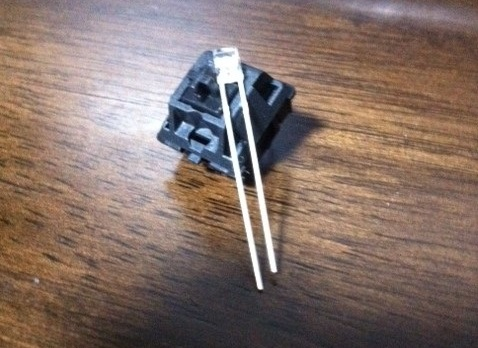
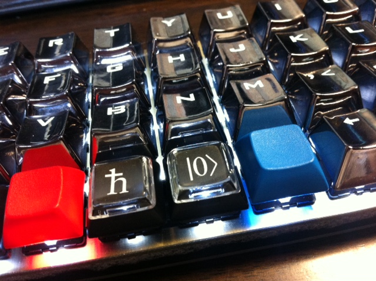

# LED について

Planck Keyboard Rev 5 では単色 LED に対応しています．

## LED とは

LED とは発光ダイオードのことです．そしてダイオードとは一方向にしか流れない能動回路素子です．

LED には向きがあり，足の長い方がプラス (+) で短い方がマイナス (-) で，+ → - という方向に電流が流れます．プラス (+) はアノードとよばれ，マイナス (-) はカソードとよばれます．まぁ今回の電子工作程度であれば，LED の説明はこの程度で十分でしょう．

 LED は一方向にしか流れないため，よく通電がなされているかの視覚的確認のために使われています．安価で手軽ということもあり，電光掲示板にも使われます．まぁ色んな所に使われている基本中の基本な素子です．電子工作でも「Lチカ」がプログラミングでのいわゆる Hello World で，やっぱり身近な素子です．

このように幅広く使われている LED にはいろんな種類があります．今回，気にする属性は次のものです．

- 光度
- 発光色
- 形

私は白色 2x3x4 LED にしました．2x3x4 とは直方体の寸法です．つまり形としては直方体を選びました．この形は「角型」と業界ではいいます．どうやらこの形がベストだとか．

[Best LED for Planck?](https://www.reddit.com/r/olkb/comments/602j94/best_led_for_planck/)

## LED の購入

問題はそのような LED を手に入れることです．探し方が悪いのか，2x3x4 な LED がないのです．例えば 1UP Keyboards では写真を見る限り帽子型に見えます．売れ行きから白が人気のようです．

[LEDs – 65pk](https://www.1upkeyboards.com/shop/parts-and-tools/leds-65pk-2/)

困りました．秋月にも売ってないような感じです．あれこれ検索して次のサイトを見つけて，私はここで買いました．

[角型2．3．4　ホワイト色（白色）　LED（50本）【482】](http://led-shop.jp/?pid=61692786)

順電圧と順電流がどれだけなのかデータシートがないので，正直，怖かったです．ただまぁ光度は店名から察するに十分だと思いました．

## LED を基盤にはんだ付け

キースイッチに比べて LED のはんだ付けは，ちょっと気を使うところがあります．

アノードとカソードの距離が近いということもありますが，MIT 配列と Grid 配列を分けている部分の LED の取り付け部分が，どうも不安定なためです．

その部分以外は特に難しくはないです．

## LED の点灯

はい，はんだ付けを終えたら，疑問が浮かぶでしょう．「どうやって点灯させるのか」と．ただ単に USB を接続しても点灯しません．

LED を点灯させるには，(例えば) easykeymap.exe で，\[BL Enable\] をキーに割り当てます．これを押すことで点灯の ON/OFF を切り替えられます．

この他，LED の点灯にかかわるキーとして次があります．

\[BL Dimmer\] 光度の強さを調整します． \[BL Mode\] 光り方のパターンを変更します． これでグッと Geek さ (?) が演出されるのではないでしょうか．

自己満足の世界ですが，キーボードは他でもない自分が使うので，自己満足という指標はとても意義のある指標でしょう．どんどん光らせていきましょう！

## キーキャップ

LED の点灯が映えるように，キーキャップもなるべく光を透過するものを選ぶと良いです．残念ながら安価には国内ではなかなかそういうのがないです．補助キーは大きさが合いませんが，例えば次のようなものがあります．

 [E元素銀色104キーメカニカルキーボード専用交換用キーキャップセット](https://amzn.to/2sWtB1E)

その他，国外通販の pimpmykeyboard であれば，透明キーキャップを購入できます．

[DCS CLEAR KEYS - SPECIAL SHAPES (SOLD INDIVIDUALLY)](https://pimpmykeyboard.com/dcs-clear-keys-special-shapes-sold-individually/)

## 次回 

キーキャップについて最後に触れましたが，関連してキーボード用品の購入先について幾つかご紹介したいと思います．

