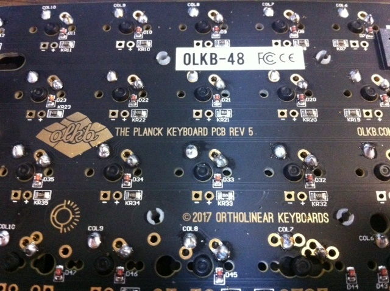
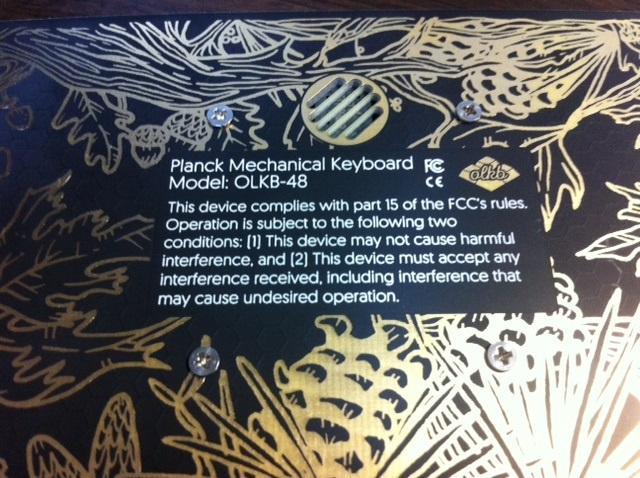
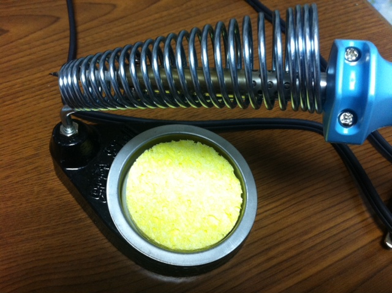
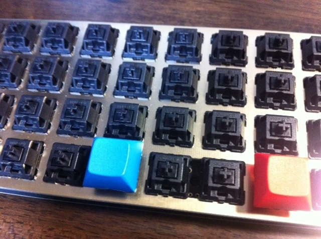
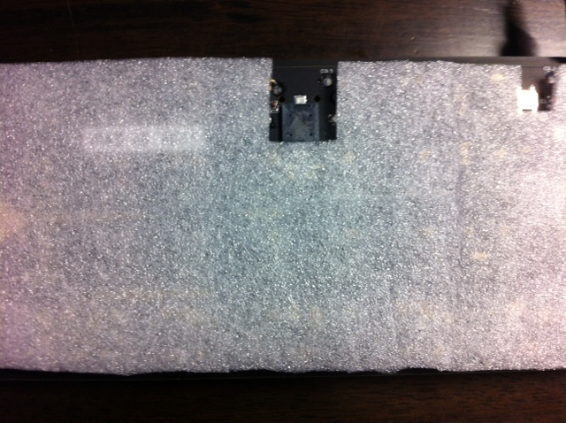

# EOTW デビュー

   Planck Keyboard EOTW (Rev 5) を組み立てました．

## ハイセンスな Bottom Plate

もう既に Planck Keyboard は日本でもかなり有名な部類と思います．

Rev 5 から EOTW (easy-on-the-wallet) がラインナップされました．

EOTW は文字通り安価なラインナップで，自作キーボードの敷居の一つであった資金面の問題をかなり解決したのではないかと思っています．

安かろう悪かろう，と考えるところですが，背面はセンスの良い美麗な柄が施されています．

## 組み立て

EOTW でも Planck Keyboard の組み立ては，次のとおりでとても簡単です．

ちなみに私は MIT 配列ではなく，Grid 配列を選択しました．

なんせ Planck を冠する訳ですから，量子化，即ち Grid 配列一択でしょう．

1. 基盤 (PLANCK PCB) に USB ケーブルを繋げて導通チェックをする．ドライバのインストールが走ったら，終わるまで待ちましょう．そして緑色の LED が点灯すれば OK です．繋げた瞬間にピロリロという音も (おそらく) 鳴ります．以上は下記のページの PREPARATION の作業です．チェックしたら USB ケーブルを外しましょう． Guide — OLKB
2. 好みのキースイッチをプレート (PLANCK EOTW TOP PLATE) にパチパチとはめる．私は Cherry MX の黒軸です．適度な重さと静けさが欲しいためです．後は黒体輻射に敬意を持って…．
3. プレートを基盤に重ねる．このときキースイッチの二本足がちゃんと端子穴から出ているか確認する．重ねた際に誤って曲がってしまう可能性があるためです．
4. 各キースイッチを基盤に (トップの写真にあるように) はんだ付けする．
5. ちっちゃい白いネジ受けを 10 箇所，基盤に付けてください．トップの画像の \[OLKB-48\] というシールの両サイドにそのネジ受けが見えると思います．それです．私は何故だが 1 個余りました．
6. 基盤のネジ受けとボトムプレート (PLANCK EOTW BOTTOM PLATE) が合うようにむき出しの基盤を覆い隠して，ネジ止めしてください．私は何故だがネジが 8 個しかなかったです．そういうものでしょうか．
7. ボトムプレートの四隅に透明な足をペタペタ貼ってください．  キースイッチは今回 Cherry MX の黒軸でした．他に赤軸，青軸，茶軸，白軸であれば，黒軸含めて，ジェイダブルシステムで購入するのが速くてオススメです．

[メカニカル MXスイッチ Aタイプキートップ](https://www.jw-shop.com/P-keyboard-mswitch10/page45/detail.htm)

## 完成！！

これで完成です！！

ここまで終えたら，USB を繋げて PC に接続してください．

それで，ポチポチと押して，下記のページにある初期レイアウトになっているか確認します．

[QMK Firmware](https://qmk.fm/keyboards/planck/)

## 問題と解決

私はここで二つの問題にぶち当たり，次のようにして解決しました．

1. 動作確認でポチポチ押したら，ボタンによっては一文字ではなく複数文字が押された挙動をしました．これには文鎮化したのかと焦りました．どうやらボトムプレートのネジ止めをギチギチにやってしまって，誤った通電が生じていたようです．ネジをほどほどに緩めて解決しました．
2. 複数文字はなくなったのですが，いわゆる Qwerty でない反応を示しました．「はは，Dvorak でオーダーしたっけ．」と記憶を呼び起こし，冷静さを取り戻しました．このままでも良いのですが，カスタマイズの良いきっかけとすることにしました．

Planck Keyboard はオーダーしてから二，三ヶ月は待つ必要がありました．

記憶が薄れるのも無理ないでしょう．

そして順調に改良が続けられており，Rev 6 の販売受付がなされています (2018/5/13 現在)．

[PLANCK PCB](https://olkb.com/planck/pcb)

## 消えぬ問題と EOTW な解決

二つの問題を解決しましたが，しばらく使っていると，打鍵が強いのか，どうしても誤った通電が生じる問題に再び悩まされました．

そこで私は図のように薄い梱包材？緩衝材？と形容する名前がよくわからないアレを挟むことにしました．ちょうど LED を購入したときについてきたものを利用しました．

これでやってみると悩まされていた問題が生じなくなりました．実にお財布に優しい解決方法です．

さてさてこの機会に自作キーボードの世界に入ってみてはいかがでしょうか．キーボードを DIY する体験は中々にいいものです．

それに Planck Keyboard はとても敷居が低いにもかかわらず，カスタマイズがいろいろできて，入門にはもってこいです！

## 次回 

Planck Keyboard のカスタマイズツールについてご紹介したいと思います．

