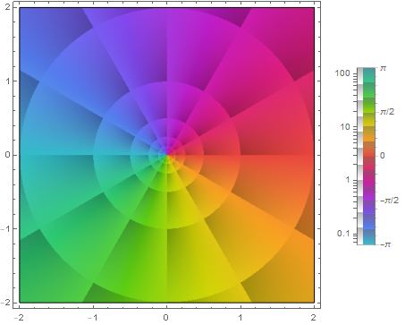
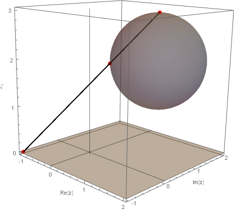
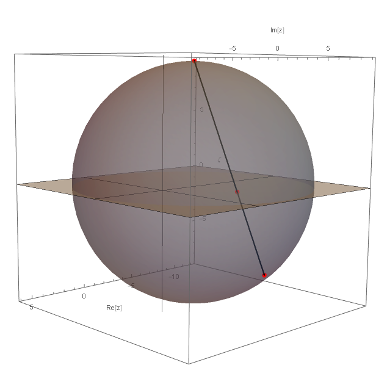
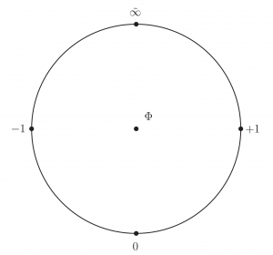
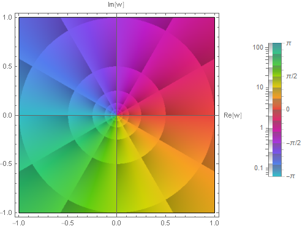
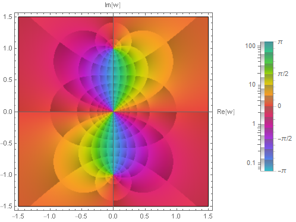
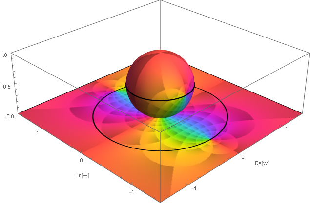
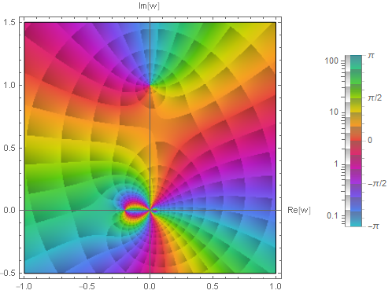
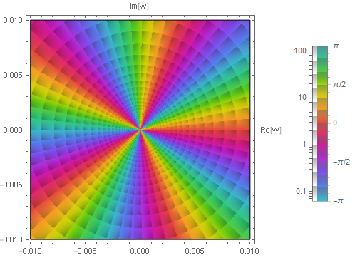
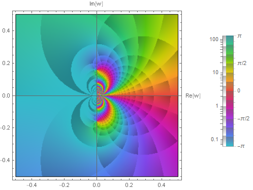

# 複素解析での無限遠点とは - リーマン球面への立体射影

無限遠点と聞くと到達できない遥か先の点を正に思い浮かべる． その名の通りである．

一方で無限大記号 $\infty$ は実数や複素数のどの元でもなく， 数のように扱うには何か規則を定める必要がある．

実解析では極限操作でのみ顔を出すだけだったが，複素解析ではより積極的に数 (加法・乗法といった演算が定義される集合の元) の一つとして扱うことになる．

## 背景と着想

### 実解析での無限大

実軸上で正の方向に沿って動くと，どこまでもどこまでも果てなく動ける． 実数の集合の中には最大元がないのだ．つまり次を満たす元 $M$ は実数集合にない．

$$ (\forall a \in \mathbb{R})(a\leq M) $$

これは負の方向でも同様であり最小元がない．

以上から恰も一つの数のように $\lim_{x\to +0}1/x=\infty$ と $\infty$ を書いたりするが，この $\infty$ は実数集合のどこを探してもない．

無限大 $\infty$ は極限操作で「限りなく大きくなる」ということを言い表すものである一方，限りなく大きくなったところで実数集合には最大元がないので，厳密に実数だけを考えているのならば，それはつまり存在しないことになる．禅問答のようである．

単に「ありません」で済まさずに，$f(x):=1/x$ とする場合に $f(0)$ の値をあれやこれやと想像する者の痕跡が絶えない．

$\lim_{x\to +0}1/x=\infty$ は $f(0) = \infty$ だということは一切主張していない．もし考えたいのならば，$f(x):=1/x$ という関数は原点では定義されていないのだから，極論を言えばどんな実数値 $C$ で追加の定義文を次のように書くことになる．

$$ f_C(x) := \begin{cases} 1/x & (x\neq 0), \\ C (\in\mathbb{R}) & (x=0) \end{cases} $$

ここで $C$ をどのように選んでも原点での右極限と左極限を一致させることができない． 以上の実解析の話は複素解析ではどのようになるだろうか．

### 複素解析での無限大

実解析から複素解析に移行すると，舞台は複素平面という方角を全方位に伴った開けた世界になる． すると $f(z):=1/z$ という複素関数は $z=re^{i\theta}$ として原点を除いて次のように変換する．

$$ f(z) = r^{-1}e^{-i\theta} ~~ (r \neq 0) $$

これから原点への偏角 $\theta$ の直線に沿った極限値は次のようになる．

$$ \lim_{z\to e^{i\theta}\cdot 0}f(z) = e^{-i\theta}\infty $$

実解析の場合と違って偏角の回転方向に依存し，それは逆回転方向に発散することがわかる． 極限操作をとった直線方向にのみ大小関係を定めても，問題は実直線と同じになり，再び $e^{-i\theta}\infty$ なる量が複素数の集合にはないことが明らかになる． そしてやはり原点での複素数値をどのように定めても極限値を一致させることができない．

### 一対一対応および零点と極

結局，複素平面でも $f(z):=1/z$ は原点と種々の方角の無限大とは一対一に対応していない． 一方で原点を除いては一対一に対応している．

そこで様々な無限大 $e^{-i\theta}\infty$ を一つの無限大 $\tilde{\infty}$ (複素無限大) として同一視してしまって，原点に対応する元として地位を与えることを考える．そして次式の右辺は数として見ることになる．

$$ \lim_{z\to0} \frac{1}{z} = \tilde{\infty} $$

この同一視によって零点と極とが一対一に対応したとも述べることができる．

余談だが，応用上，極と零点はそれぞれ湧き出しと吸い込みに対応させることができるため，この対応によって流れの場を上手く扱えるようになる．

## 定義

### 拡張複素平面

複素無限大としての無限遠点 $\tilde{\infty}$ を単なる極限操作の振る舞いを記述するための記号ではなく，一つの元として，つまり他の複素数と合成可能な量として以下に定義する．

複素解析での無限遠点 $\tilde{\infty}$ とは加法と乗法および除法について以下を満たす元 $\tilde{\infty}$ のことである．但し $\hat{\mathbb{C}}:=\mathbb{C}\sqcup\{\tilde{\infty}\}$ であり，これを拡張複素平面またその元を拡張複素数とよび，更に拡張複素平面を球面上に立体射影したものを Riemann 球面とよぶ．

\- 加法

$$ z + \tilde{\infty} = \tilde{\infty} + z := \tilde{\infty} ~~ (z\in\mathbb{C}) $$

\- 乗法

$$ z \cdot \tilde{\infty} = \tilde{\infty} \cdot z := \tilde{\infty} ~~ (z\in\hat{\mathbb{C}}\setminus\{0\}) $$

\- 除法

$$ \frac{z}{\tilde{\infty}} := 0 ~~ (z\in\mathbb{C}), $$

$$ \frac{z}{0} := \tilde{\infty} ~~ (z\in\hat{\mathbb{C}}\setminus\{0\}) $$

これらに加えて次も定義に含める．

\- 絶対値

$$ |\tilde{\infty}| =: \infty $$

\- 複素共役

$$ \tilde{\infty}^\* := \tilde{\infty} $$

上記を除いた演算は未定義または不定とする．

なお $\tilde{\infty}$ という記号は同一視にしばしば用いる二項関係記号 $\sim$ を無限大記号の上部にあしらうことで，他の偏角方向の無限大を同一視していることを表現した記号になっている．

$\tilde{\infty}$ をここでは複素無限大と呼ぶことにしているが，実数でも同様のことを行って正負の無限大を同一視しても $\tilde{\infty}$ に相当する無限大が得られる．このためより厳密には $\tilde{\infty}$ を「符号無し無限大」と呼ぶことが正確であろう．

### 拡張複素平面上の複素関数

無限遠点なる元を定義したので，$\hat{\mathbb{C}}:=\mathbb{C}\sqcup\{\tilde{\infty}\}$ を定義域にもつ関数の取り扱いを次で定義する．

拡張複素平面または Riemann 球面 $\hat{\mathbb{C}}:=\mathbb{C}\sqcup\{\tilde{\infty}\}$ 上の複素関数 $f(z)$ とは無限遠点での値を次のように定めて得られる関数のことである．

$$ f(\tilde{\infty}) := \left.f(1/w)\right|_{w=0} $$

上記の定義の延長として無限遠点での導関数を次で定義する．

拡張複素平面または Riemann 球面 $\hat{\mathbb{C}}:=\mathbb{C}\sqcup\{\tilde{\infty}\}$ 上の複素関数 $f(z)$ の導関数とは無限遠点での値を次のように定めて得られる関数のことである．

$$ f^{\prime}(\tilde{\infty}) := \left.\left[ -w^2\frac{d}{dw}f(1/w) \right]\right|_{w=0} $$

これから $g(w)=f(1/w)$ が原点で微分可能で値が $\mathbb{C}$ の元として複素数値であるならば，$f^{\prime}(\tilde{\infty}) = 0$ である．

上記の定義は次の議論から演繹される．

$z=1/w$ で $w=0$ が $\tilde{\infty}$ に対応する点だった．これから $dz=-dw/w^2$ なので，次の評価ができる．

$$ \frac{d}{dz}f(z) = -w^2 \frac{d}{dw}f(1/w) $$

よって次を得る．

$$ \left.\frac{d}{dz}f(z)\right|_{z=\tilde{\infty}} = \left.\left[ -w^2\frac{d}{dw}f(1/w) \right]\right|_{w=0} $$

この左辺は $f^{\prime}(\tilde{\infty})$ とすべき量に他ならない．

導関数の定義から無限遠点での正則性が次で定義される．

拡張複素平面または Riemann 球面 $\hat{\mathbb{C}}:=\mathbb{C}\sqcup\{\tilde{\infty}\}$ 上の複素関数 $f(z)$ の導関数が無限遠点で正則であるとは，$g(w)=f(1/w)$ が原点近傍のすべての点で微分可能であることをいう．

## コメント

### 実無限大について

複素無限大を数のように演算可能な数として扱うことになるとき，その絶対値と実無限大を次のように結びつけた．

$$ |\tilde{\infty}| =: \infty $$

これによって実無限大もまた単に極限操作を形容するための記号ではなく，演算可能な数として複素無限大とは別に導入した．同様に $-\infty$ なる実無限大も演算可能な数として含めたい．更に複素平面で考えれば Riemann 球面の北極である複素無限大への向かい方が他の方位も増えるので，より一般に近づく速度も考慮すれば複素数 $z$ の正の実数倍方向に対する絶対値が無限な複素量として「方向付けられた無限大 $\infty_z:=z\infty$」も含めたい．

これらは拡張複素平面 $\hat{\mathbb{C}}$ を考える場合には同一視されて複素無限大 $\tilde{\infty}$ になるので，$\hat{\mathbb{C}}$ 上の議論では表れないが，ある偏角に限定した議論に移行する際に使用することになる．

### 不定との関係

複素無限大とは偏角を問わない無限大であるから，定義から不定記号を ¿ で表記すれば次の関係も得られるものと考える．

$$ \infty_{¿} = \tilde{\infty} $$

これは方向付けられた無限大についての不定の評価であって，不定と実無限大との積が複素無限大であるとは主張していないことに注意する．そのような積は不定となる．

$$ ¿\cdot \infty_{z} = ¿ $$

### より完全な拡張複素平面上の演算表

複素無限大で定められていない次のような演算に対しては不定な結果となる．

$$ \tilde{\infty} - \tilde{\infty} = ¿ $$

上記は一例であり，その他，複素無限大以外の不定でない場合も含めて一覧を記述すれば次のようになる．

| $x+y$ | $y=1$ | $0$ | $\infty$ | $-\infty$ | $\tilde{\infty}$ |
| :-- | :-- | :-- | :-- | :-- | :-- |
| $x=1$ | $2$ | $1$ | $\infty$ | $-\infty$ | $\tilde{\infty}$ |
| $0$ | $1$ | $0$ | $\infty$ | $-\infty$ | $\tilde{\infty}$ |
| $\infty$ | $\infty$ | $\infty$ | $\infty$ | ¿ | ¿ |
| $-\infty$ | $-\infty$ | $-\infty$ | ¿ | $-\infty$ | ¿ |
| $\tilde{\infty}$ | $\tilde{\infty}$ | $\tilde{\infty}$ | ¿ | ¿ | ¿ |

| $x-y$ | $y=1$ | $0$ | $\infty$ | $-\infty$ | $\tilde{\infty}$ |
| :-- | :-- | :-- | :-- | :-- | :-- |
| $x=1$ | $0$ | $1$ | $-\infty$ | $\infty$ | $\tilde{\infty}$ |
| $0$ | $-1$ | $0$ | $-\infty$ | $\infty$ | $\tilde{\infty}$ |
| $\infty$ | $\infty$ | $\infty$ | ¿ | $\infty$ | ¿ |
| $-\infty$ | $-\infty$ | $-\infty$ | $-\infty$ | ¿ | ¿ |
| $\tilde{\infty}$ | $\tilde{\infty}$ | $\tilde{\infty}$ | ¿ | ¿ | ¿ |

| $x\cdot y$ | $y=1$ | $0$ | $\infty$ | $-\infty$ | $\tilde{\infty}$ |
| :-- | :-- | :-- | :-- | :-- | :-- |
| $x=1$ | $1$ | $0$ | $\infty$ | $-\infty$ | $\tilde{\infty}$ |
| $0$ | $0$ | $0$ | ¿ | ¿ | ¿ |
| $\infty$ | $\infty$ | ¿ | $\infty$ | $-\infty$ | $\tilde{\infty}$ |
| $-\infty$ | $-\infty$ | ¿ | $-\infty$ | $\infty$ | $\tilde{\infty}$ |
| $\tilde{\infty}$ | $\tilde{\infty}$ | ¿ | $\tilde{\infty}$ | $\tilde{\infty}$ | $\tilde{\infty}$ |

| $x/y$ | $y=1$ | $0$ | $\infty$ | $-\infty$ | $\tilde{\infty}$ |
| :-- | :-- | :-- | :-- | :-- | :-- |
| $x=1$ | $1$ | $\tilde{\infty}$ | $0$ | $0$ | $0$ |
| $0$ | $0$ | ¿ | $0$ | $0$ | $0$ |
| $\infty$ | $\infty$ | $\tilde{\infty}$ | ¿ | ¿ | ¿ |
| $-\infty$ | $-\infty$ | $\tilde{\infty}$ | ¿ | ¿ | ¿ |
| $\tilde{\infty}$ | $\tilde{\infty}$ | $\tilde{\infty}$ | ¿ | ¿ | ¿ |

| $x^y$ | $y=1$ | $0$ | $\infty$ | $-\infty$ | $\tilde{\infty}$ |
| :-- | :-- | :-- | :-- | :-- | :-- |
| $x=1$ | $1$ | $1$ | ¿ | ¿ | ¿ |
| $0$ | $0$ | ¿ | $0$ | $\tilde{\infty}$ | ¿ |
| $\infty$ | $\infty$ | ¿ | $\tilde{\infty}$ | $0$ | ¿ |
| $-\infty$ | $-\infty$ | ¿ | $\tilde{\infty}$ | $0$ | ¿ |
| $\tilde{\infty}$ | $\tilde{\infty}$ | ¿ | $\tilde{\infty}$ | $0$ | ¿ |

表の中で非自明なものは次だ．

$$ 1^{\infty} = ¿,~ \infty^{\infty} = \tilde{\infty} $$

ここでは冪は次のように定義されているものと考える．

$$ x^y := \exp[y(\ln|x| + i\mathrm{Arg}[x] + 2\pi i n)] ~~ (n\in\mathbb{Z}) $$

この了解の下で，それぞれ次のとおりである．

#### $1^{\infty}$ について

これは極限の表記法が主な注意点である． つまり $1^{\infty}$ は次だけを意味しない．

$$ 1^{\infty} = \lim_{x\to\infty} 1^x $$

$1^{\infty}$ は底と指数がそれぞれ関数であり，そのままの値を意味していない． これは $g(t)^{h(t)}$ について，$g(t)\to 1$ 且つ $h(t)\to\infty$ なる意味である．

つまり次もまた $1^{\infty}$ を意味する．

$$ \lim_{t\to\infty} \left(1 + \frac{1}{t}\right)^t = e = 2.718281828... $$

同様に以下はすべて $1^{\infty}$ のことであり，不定であることがわかる．

$$ \lim_{t\to\infty} \left(1 + \frac{a}{t}\right)^t = e^a $$

$$ \lim_{t\to\infty} \left(1 + \frac{1}{t^2}\right)^t = 1 $$

$$ \lim_{t\to\infty} \left(1 + \frac{1}{t^{1/2}}\right)^t = \infty $$

極限値が不定である一方で，$1^{\infty}$ を一つの数として評価するとやはり不定である．

$$ 1^{\infty} = \exp[\infty(\ln 1 + 2\pi i n)] = \exp[\infty\cdot 0 + i\infty] $$

ここで $\infty\cdot 0$ が不定であるので，全体としても不定である．

#### $\infty^{\infty}$ について

冪の定義に従えば次のようになる．

$$ \infty^{\infty} = \exp[\infty (\ln \infty + i \mathrm{Arg} \infty + 2 π i n)] = \exp[\infty + i\infty] $$

これは大きさが無限大で偏角が不定であるとみなせて，$\tilde{\infty}$ に簡約されるものと考える．

### 有理関数の連続性と拡張複素平面

有理関数とは分子分母が有理式で与えられる関数だった． これは拡張複素平面を考えることで次の性質を満たす．

任意の有理関数 $f$ は拡張複素平面 $\hat{\mathbb{C}}$ 上の連続関数 $f:\hat{\mathbb{C}}\to\hat{\mathbb{C}}$ である．

我々は一般性を失わないので有理関数として $f(z)=P(z)/Q(z)$ が既約な場合を仮定する．

$f$ は $Q\neq 0$ の任意の点で連続である．問題は $Q(z_0)=0$ なる点 $z_0\in\mathbb{C}$ である．この場合は無限遠点での値の定義から $f(z_0) = \tilde{\infty}$ である．一方で $\lim_{z\to z_0}f(z)$ は極限操作に応じて $e^{i\theta}\infty$ に発散するが，これらをすべて同一視したものが拡張複素平面であり，その点が $\tilde{\infty}$ であった．

よって極限値はその点での値に一致する．つまり連続である．

最後に $f(\tilde{\infty})$ だが，これは $\lim_{z\to \infty}f(z)$ のことであった．以上によって示された．■

以上の話は実解析に限っても同じである．

### 極と零点の総数

方向付けられた無限大をすべて同一視することで，極と零点の総数について以下のことが成り立つようになる．

拡張複素平面 $\hat{\mathbb{C}}$ 上の任意の有理関数 $f:\hat{\mathbb{C}}\to\hat{\mathbb{C}}$ は極と零点の総数が一致する． 但しこれらの総数は位数を含めて勘定する．

我々は一般性を失わないので有理関数として $f(z)=P(z)/Q(z)$ が既約な場合を仮定する．

分子分母の次数の大小で場合分けを行う． 以下，$(m,n):=(\deg P,\deg Q)$ とする．

**$m \leq n$ の場合**

考えている数体が複素数体なので，代数学の基本定理より分子分母の多項式は一次式に分解できる． すると分子分母のそれぞれで $0$ となるのは $m$ 回および $n$ 回であり，それぞれ零点と極の数に対応する．

一方で $z=1/w$ として式を整理すると次が得られる．

$$ f(1/w) = w^{n-m} \frac{p(w)}{q(w)} $$

ここで $(\deg p,\deg q)=(m,n)$ なる次数をもった多項式である． こうして整理した式で $w=0$ に対して $0$ になるのは $w^{n-m}$ の部分のみであるから，無限遠点では $n-m$ 回だけ $0$ となる． 式を整理する中で $P,Q$ から $p,q$ を得るのは，単に逆数となった次数を払っているだけで代数方程式の解は本質的に変わらないので，この部分については新たに勘定しなくてよい．

以上から零点の総数 $\# N$ と極の総数 $\# P$ は次式のとおり一致する．

$$ \# N = m + (n-m) = n = \# P $$

**$m > n$ の場合**

先に行った議論と同様で次の勘定式が得られる．

$$ \# P = n + (m-n) = m = \# N $$

つまり極と零点の総数は一致する．

以上より題意は示された．■

### Riemann 球面について

Riemann 球面の説明では Riemann 球面の配置が次の何れかのみが紹介されることが多い． 但し Riemann 球面の中心座標を $(a,b,c)$ とし，半径を $r$ とする．

- $(a,b,c;r) = (0,0,0;1)$
- $(a,b,c;r) = (0,0,1;1)$

これらだけが拡張複素平面を球面上に射影できる配置ではない． 一般の配置を想定すると，拡張複素平面上の点 $z=x+iy$ と Riemann 球面上に射影される点 $(\xi,\eta,\zeta)$ とは次のように対応する．

$$ \xi = \frac{2 r (c + r)}{(x - a)^2 + (y - b)^2 + (c + r)^2}(x - a) + a, $$

$$ \eta = \frac{2 r (c + r)}{(x - a)^2 + (y - b)^2 + (c + r)^2}(y - b) + b, $$

$$ \zeta = \frac{(x - a)^2 + (y - b)^2 + c^2 - r^2}{(x - a)^2 + (y - b)^2 + (c + r)^2}(c + r) $$

導出は次のとおり．

1. Riemann 球面の北極座標は $(a,b,c+r)$ である．
2. 北極と点 $(x,y,0)$ とを結ぶ線分を $L$ とする．
3. 線分 $L$ と Riemann 球面の交点座標を $(\xi,\eta,\zeta)$ とする．

以上を実行すればよい．線分 $L$ の方程式は北極と点 $(x,y,0)$ の位置ベクトルの差を求めて，各軸方向について傾きが一致することから，方程式が次のように求められる．

$$ \frac{\xi-a}{a-x} = \frac{\eta-b}{b-y} = \frac{\zeta-(c+r)}{c+r} $$

これと Riemann 球面の次の方程式を連立させて $(\xi,\eta,\zeta)$ について解けばよい．

$$ (\xi-a)^2 + (\eta-b)^2 + (\zeta-c)^2 = r^2 $$

Riemann 球面への立体射影の様子は次で，$(x,y;a,b,c;r)=(-1, -1; 1, 1, 2; 1)$ の例である．

拡張複素平面と Riemann 球面が交わる場合には Riemann 球面の上下に球面で区切られた外部と内部がそれぞれ立体射影される．次は拡張複素平面の点が内部にある場合に，Riemann 球面の下部に射影される場合である．

このように Rieamnn 球面の配置を一般化しておくと，次のメビウス変換 (一次分数変換) とよばれる応用上重要な変換が，Riemann 球面の剛体的変換と一致することが見出される．

$$ z\mapsto \frac{az+b}{cz+d} $$

メビウス変換は有理関数なので Riemann 球面上で連続であり，また全単射で同相写像へと昇格する非常に扱いやすい関数でもある．次の YouTube デモは [Douglas N. Arnold](https://www-users.cse.umn.edu/~arnold/) 氏と[Jonathan Rogness](https://www-users.cse.umn.edu/~rogness/) 氏による[もの](https://www-users.cse.umn.edu/~arnold/moebius/)である．

[embed]https://youtu.be/0z1fIsUNhO4[/embed]

また @neozhaoliang 氏の shadertoy デモも躍動的な仕上がりになっていて参考になる．

[Mobius transformation revealed](https://www.shadertoy.com/view/fljfRm)

### 輪 (Wheel)

複素無限大を導入することでゼロ除算を部分的にだが整合的な意味を与えることができた． もっとより進んで $0/0$ も含めて完全にゼロ除算を可能にする代数系として輪 (りん) がある． 輪を平易に扱った次の動画が参考になろう．

[embed]https://youtu.be/9RCobIsITdU[/embed]

ところで実数に無限遠点 $\tilde{\infty}$ を追加すれば円周となるが，それに更に $\Phi:=0/0$ なる nullity とよぶ点を中央に記すと，ちょうど車輪の軸のように見えるので，この全体の代数系を Wheel (輪) とよぶ由来になっている．

nullity はまた bottom ともよばれ $\bot$ と表記される．記号もまた軸のようである．標準的には bottom の方を用いる．

ゼロ除算の話題をユーモア溢れる面白くまとめたサイトとして [Bill Shillito](https://www.solidangl.es/) 氏による次をオススメする．

[How to Divide by Zero](https://www.1dividedby0.com/)

## 例

### 無限遠点での値の評価

[複素解析での特異点とは](https://mathrelish.com/mathematics/singularity-in-complex-analysis)

上記で扱った以下の四つの複素関数について，無限遠点での値を評価する．

\begin{equation} f_1(z) = z, \end{equation}

\begin{equation} f_2(z) = \frac{1}{z^2 + 1}, \end{equation}

\begin{equation} f_3(z) = \frac{z+i}{z^3(z+5)^2(z-19)}, \end{equation}

\begin{equation} f_4(z) = \frac{1}{e^z - 1} \end{equation}

これらはそれぞれ以下の極を持つのだった．

- $f_1(z)$ は点 $z=\infty$ を $1$ 位の極としてもつ．
- $f_2(z)$ は点 $z=\pm i$ の二点を $1$ 位の極としてもつ．
- $f_3(z)$ は点 $z=0,-5,19$ をそれぞれ $3,2,1$ 位の極としてもつ．
- $f_4(z)$ は点 $z=2\pi n i(n\in\mathbb{Z})$ を $1$ 位の極としてもつ．

それぞれ以下のとおりである．

#### $f_1(z) = z$ に関して

これは自明な例である．

$$ f_1(\tilde{\infty}) = \frac{1}{0} = \tilde{\infty} $$

無限遠点で $1$ 位の極をもつとわかる． またこのことは直接のプロットからも読み取れる．

なお原点 $z=0$ は零点であり，極と零点が一対一に対応している．

#### $f_2(z) = \frac{1}{z^2 + 1}$ に関して

まず $z=1/w$ を代入する．

$$ f_2(\tilde{\infty}) = \left.\frac{1}{(1/w)^2+1}\right|_{w=0} $$

次にして式を整理してから，最後に $w=0$ を代入する．

$$ f_2(\tilde{\infty}) = \left.\frac{w^2}{1+w^2}\right|_{w=0} = 0 $$

よって無限遠点では $2$ 位の零点をもつとわかる．

プロットすると無限遠点に対応する $w$ 平面の原点にその零点があり，一方で $w=\pm i$ に極がある．$z$ 平面では有限な範囲で極と零点の両方が見れなかったことと対照的である．

また Riemann 球面への立体射影も同時にプロットするとこの様子がよくわかる． ここで Riemann 球面は南極が $w$ 平面の原点に接する単位球面としている．

図の黒の太い実線は $w$ 平面での単位円であり，それが赤道に立体射影されている． この赤道上に二つの極があり，一方で北極に零点があるのが読み取れる．

以上から極と零点の位数を考慮した個数は一致することが確認できた．

#### $f_3(z) = \frac{z+i}{z^3(z+5)^2(z-19)}$ に関して

式が複雑でも有理式なので同様のことをただ行うのみである．

$$ f_3(\tilde{\infty}) = \left.\frac{(1/w)+i}{(1/w)^3((1/w)+5)^2((1/w)-19)}\right|_{w=0} $$

これは整理すると次のようになる．

$$ f_3(\tilde{\infty}) = \left.\frac{(-1-i w) w^5}{(5 w+1)^2 (19 w-1)}\right|_{w=0} = 0 $$

よって無限遠点では $5$ 位の零点を持ち，$w=i$ で $1$ 位の零点を持つとわかる．

このことをプロットから読み取るのは難しいかもしれない． 零点 $w=i$ については容易いが，無限遠点での零点はもう少し拡大する必要がある．

無限遠点に対応する $w$ 平面の原点のより近いプロットは次のとおりであり，$5$ 位の零点であることを確認できる．

以上から極と零点の位数を考慮した個数は一致することが確認できた．

#### $f_4(z) = \frac{1}{e^z - 1}$ に関して

$$ f_4(\tilde{\infty}) = \left.\frac{1}{e^{1/w}-1}\right|_{w=0} = ¿ $$

これは不定になり，以下はそのプロットである．分母は $w=0$ を孤立真性特異点にもち，無限遠点に近付く方向によって値が異なるか不定なため，無限遠点では連続ではない．

複素無限大を導入しても基本的な関数が不定になることには注意する．

$$ \exp \tilde{\infty} = ¿, $$

$$ \sin \tilde{\infty} = ¿, $$

$$ \cos \tilde{\infty} = ¿ $$

## 参考

[複素解析 (複素関数論) – オススメの参考書](https://mathrelish.com/mathematics/recommended-books-in-complex-analysis)

- [ヴィジュアル複素解析](https://amzn.to/2Qpkphs)
- [Visual Complex Functions: An Introduction with Phase Portraits](https://amzn.to/3avRz91)
- [ComplexInfinity | Introduction to the symbols](https://functions.wolfram.com/Constants/ComplexInfinity/introductions/Symbols/ShowAll.html)
- [Wolfram 言語 | 陰影で特徴を強調する](https://www.wolfram.com/language/12/complex-visualization/highlight-features-with-shading.html.ja)
