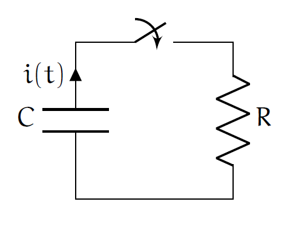

# 事前初期値と事後初期値とは

初期値は微分方程式を解くのに必要な値である一方で， 不連続な関数を相手にする場合には，この概念を少し修正する必要がある．

それは物理的には時刻 $0$ に対して， 無限小だけ異なる二つの時刻であり， 事前初期値と事後初期値とよばれる．

## 定義

今回は定義を先に述べておこう．

初期時刻 $t=0$ に対して無限に近い時刻での $f(t)$ の次の値 $f(-0),f(+0)$ をそれぞれ事前初期値と事後初期値とよぶ．

\begin{equation} f(\pm0) := \lim_{\varepsilon\to\pm0}f(\varepsilon) \end{equation}

事前初期値を第一種初期値，事後初期値を第二種初期値ともいう．

## 背景

微分方程式を立式する際に事前初期値と事後初期値に注意しなければならない． それは次のとおり．

### 違い

まずこれら初期値には次の重要な違いがある．

- 事前初期値と事後初期値は一般に等しいとは限らない．
- 我々は事前初期値を知り得る．もしくは事前初期値の仮定は妥当である．
- 我々は事後初期値を知り得ない．未来のことだから．
- 普通，微分方程式は未来のことを予言しようとするわけで，初期値への遡り方は未来から過去へ向かう向きである．よって必要な初期値は事後初期値である．

### 懸念事項

以上の違いから次のことが懸念される．

- 微分方程式で求めた未知関数 $f(t)$ の積分定数を決定するためには，初期時刻 ($0$ とする) での初期値を参照しなければならない．
- 事前初期値であれば，いつでも仮定することに大きな飛躍はないが， 事前初期値と事後初期値が食い違っていれば，参照すべき初期値として採用できない． $f(t)$ の定義域で保証されているのは少なくとも $t>0$ であって，$t< 0$ は普通は未定義だからである．

### 何を未知関数とするか？

そこで次の条件を満たした時間発展の方程式を立式しなければならないことがわかる．

- 事前初期値と事後初期値が等しくなるように未知関数 $f(t)$ を選択して，微分方程式または積分方程式を立式する．

以上の話題について具体例を交えて述べたい．

## 例

### RC 回路

例えば次のRC回路があったとする． コンデンサには電荷量 $q_0(>0)$ が蓄えられており，スイッチを入れた時点を $t=0$ とし， この系は放電が開始される．

#### 連続関数を選択した場合

未知関数として電荷量 $q(t)$ を選択したとして，微分方程式を立式すると次のようになる．

\begin{equation} R \frac{d}{dt}q(t) + \frac{1}{C}q(t) = 0 \end{equation}

これは簡単に求積できて，積分定数を $K_q$ として次のように求められる． 但し $\tau := RC$ で時定数である．

\begin{equation} q(t) = K_q e^{-\frac{t}{\tau}} ~~ (t\geq 0) \end{equation}

ここで初期時刻で $q(0)=q_0$ であったから，$K_q=q_0$ と求められる． そして $t< 0$ に関してはスイッチを閉じていなかったので，放電が起こらず， 電荷量は $q_0$ で一定のはずである． つまり未知関数として求めた電荷量は次の関数になっている．

\begin{equation} q(t) = \begin{cases} q_0 e^{-\frac{t}{\tau}} & (t\geq 0), \\ q_0 & (t < 0) \end{cases} \end{equation}

ここで重要な点は次が一致していたわけだ．

\begin{equation} q(+0) = q(-0) = q(0) \end{equation}

つまり未知関数は連続関数であったわけだ． ここで求められた電荷量 $q(t)$ は初期時刻で微分不可能であるという特徴を持っている．

#### 不連続関数を選択した場合

さてそれでは次は未知関数として回路を流れる電流[1](#fn-2556-intensity) $i(t)$ を選択したとしよう． ここで電流と電荷量とは次の関係と仮定する．

\begin{equation} i(t) = \begin{cases} -\frac{d}{dt}q(t) & (t>0), \\ \frac{d}{dt}\mathrm{const.} = 0 & (t<0) \end{cases} \end{equation}

これはスイッチを入れる前は回路は閉路[2](#fn-2556-joke)になっていないから電流は流れていないが， スイッチを閉じた後は電流が流れるから，従って事前初期値と事後初期値が食い違い， また初期時刻では微分不能であるということを表している． つまり次が成立してしまっている．

\begin{equation} i(-0) = 0 \neq i(+0) = -\lim_{t\to+0} \frac{d}{dt}q(t) = \frac{q_0}{\tau} > 0 \end{equation}

このような関係にあるが，両辺を $t$ で積分して $q$ について解くと次のようになる．

$$ \int_{+0}^t i(t) du = -\int_{+0}^t du \frac{d}{du}q(u) = - \int_{q(+0)}^{q(t)} dq $$

故に次を得る．

$$ q(t) = q(+0) - \int_{+0}^t i(u) du $$

ここで積分は広義積分としている．というのも初期時刻では微分不可能であったからだ．

\begin{equation} \int_{+0}^t i(u)du := \lim_{\varepsilon\to+0} \int_{\varepsilon}^t i(u)du \end{equation}

こうして求めた関係式を電荷量で立式した微分方程式に代入して， 電流に関する方程式とすれば次の積分方程式となる．

\begin{equation} Ri(t) + \frac{1}{C}\int_{+0}^t i(u)du = \frac{q(+0)}{C} \end{equation}

これは (敢えて無限小量の概念を持ち出して述べれば)， スイッチを入れた直後にはまだ電流は流れておらず， その充電電圧量は右辺である $q(+0)/C$ で，その総量が時間の経過によって自らのコンデンサの電圧が降下し，その分が抵抗電圧として放電されるという時刻 $t$ での様子を左辺が表している．

構成した積分方程式を満たす解は次のようにすぐ見つけられる．

\begin{equation} i(t) = K_ie^{-\frac{t}{\tau}} \end{equation}

これを代入すると積分定数 $K_i$ として次のように求められる．

\begin{equation} K_i = \frac{q(+0)}{\tau} = i(+0) \end{equation}

## コメント

以上の議論は電荷量を既に求めていたから演繹できたことである． ではもし電流から先に求めようとした場合にはどうなるだろうか．

その場合には事後初期値 $i(+0)$ がわからないため， 事前初期値 $i(-0)$ で(たとえ妥当性がなかったとしても)積分定数を求めざるを得ない． すると積分定数 $K_i$ は $K_i=i(-0)=0$ となる．つまり電流が流れないことになる．

これはおかしい．

何故おかしいかというと，今の初期値は $t< 0$ の場合についてのものであって， $t>0$ の場合の初期値として扱おうとしたためである． $t< 0$ であれば，電流は流れていないので正しい．しかしそれは意味がない．

このように事前初期値と事後初期値が一致する場合の未知関数について， 時間発展の方程式を立式しなければならない．

## 参考

- [基礎ラプラス変換](https://amzn.to/3kRmYak)

* * *

2. 因みに電流を表す文字に $i$ や $I$ を用いるのは，intensity of electricity，からきている． [↩](#fnref-2556-intensity)

4. 回路は開路，なんちゃって． [↩](#fnref-2556-joke)
