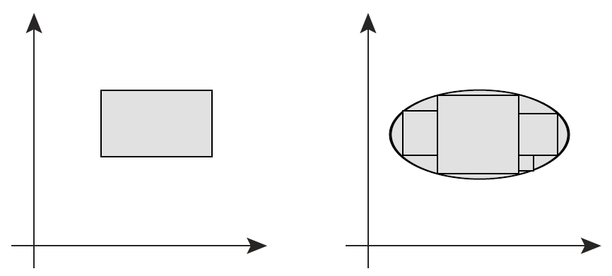
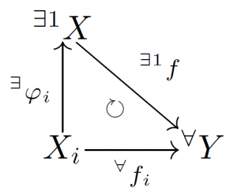
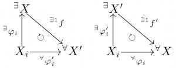
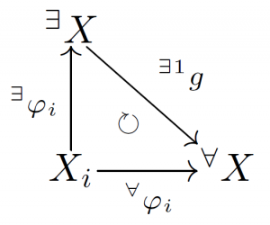
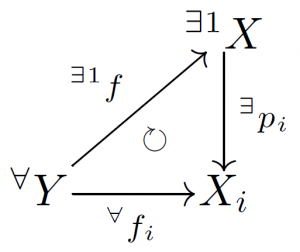
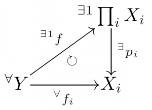

# 積位相

直積と直和は圏というより高い立場から見るとこれらは双対な関係になっている． ここでは圏について踏み込まないが，その端緒を直積集合および直和集合に対する位相空間の構成を通して垣間見ることにする．

[The Math Relish Journal Volume 1S](https://mathrelish.booth.pm/items/1123647/)

## 着想と背景

### 素朴な予想

考えることは二つ (以上) の位相空間 $(S_1,\mathfrak{O}_1),(S_2,\mathfrak{O}_2)(,\cdots)$ があって，台となっている集合 $S_1,S_2$ の直積集合 $S_1\times S_2(\times \cdots)$ と直和集合 $S_1\sqcup S_2(\sqcup \cdots)$ に対して，元の位相空間を用いて自然にそれらの位相空間を構成することである．

はじめに直積集合 $S_1\times S_2 = \{ (x_1,x_2) ~|~ x_1\in S_1,~ x_2\in S_2 \}$ についてみる．(いつものことながら？) 綻びが表れて問題になるのは集合 $S_1,S_2$ が有限集合でない時であるが，一先ず有限集合だとして，直積集合 $S_1\times S_2$ の開集合を次のように定める．

$$ \bigcup_{j\in\mathcal{J}} U^j_1 \times U^j_2 ~~ ((\forall j)~U^j_1\in\mathfrak{O}_1,~U^j_2\in\mathfrak{O}_2) $$

ここで単なる開集合の直積ではないことに注意する．例えば $\mathbb{R}\times\mathbb{R}$ の場合，開区間の直積**だけ**が直積空間での開集合だとすると，下図の左に示すような矩形の開集合しか許されない．(別にそれでもよいが) 理論が広汎であるために下図の右に示すような矩形でない領域も開集合にしたい．そのような領域は (直感的に言って) 無限個の矩形の合併集合に分解できるから上記のような定義を採用すべきことと了解できることだろう．

さて上記の予備的考察を踏まえて，一般の直積集合 $\prod_{i\in\mathcal{I}}S_i$ に対する開集合を次のように定めることが well-defined であると予想できる．

$$ \bigcup_{j\in\mathcal{J}}\prod_{i\in\mathcal{I}}U^j_i ~~ ((\forall i,j)~U^j_i\in\mathfrak{O}_i) $$

### 箱位相と積位相

ところが先に与えた定義は常に位相の定義を満たすとは限らない (満たすときは**箱位相**という)．いつでも位相になってくれるためには，次の条件を更に課す必要がある．

- 有限個の $i$ を除いて $U_i=S_i$ である．

これと同値な命題は次の通りである．

- 位相空間 $\{(S_i,\mathfrak{O}_i)\}_{i\in\mathcal{I}}$ があって，射影 $p_i:\prod_{i\in\mathcal{I}}S_i \ni (x_1,\cdots,x_n) \mapsto x_i \in S_i$ が連続であるような，直積集合 $\prod_{i\in\mathcal{I}}S_i$ の位相のうち，最も粗い位相が，$\prod_{i\in\mathcal{I}}S_i$ の位相である．

これら何れかの条件が付加された位相を**積位相**という． たった今追加した条件が何故必要なのか (分かる人には分かるけど)，一見して分かり難い． この溝は直積と直和を一段高いところから見直すことで埋められることを以下で見る．

## 定義

### 直和集合に対する位相空間

まず $\{S_i\}_{i\in\mathcal{I}}$ の直和集合とは次のように定義された．

$$ \bigsqcup_{i\in\mathcal{I}} S_i := \bigcup_{i\in\mathcal{I}} { (x,i) ~|~ x\in S_i } = \bigcup_{i\in\mathcal{I}} S_i \times {i} $$

この集合に対して位相を次のように定める．直和集合 $\bigsqcup_{i\mathcal{I}} S_i$ の開集合 $U$ とは，

$$ g_i : S_i \ni x \mapsto (x,i) \in \bigsqcup_{i\in\mathcal{I}} S_i $$

なる全単射写像に対して原像 $g^{-1}(U)$ が開集合であるときをいう． このことを踏まえて直和集合の位相空間を次のように定義する．

連続写像 $f_i:X_i\rightarrow Y$ と $\varphi_i:X_i\rightarrow X$ があって，

なる可換図式について $X$ を $\{X_i\}_{i\in\mathcal{I}}$ の直和とよび，$X=\bigsqcup_{i\in\mathcal{I}} X_i$ とかく．

上記の定義で $X$ は一意に存在することを述べているが，その証明は次の通りである．

直和の可換図式に示す $X$ は一意に存在する．

$(X,\{\varphi_i\}_i)$ と $(X^{\prime},\{\varphi_i^{\prime}\}_i)$ があったとする． このとき $X,X^{\prime}$ は同相であることを示し，一意性を証明する．

このためにまず直和を与える可換図式の $Y$ の任意性を用いて，$X,Y$ としてそれぞれ $X,X^{\prime}$ と選んだ場合と，$X^{\prime},X$ と選んだ二通りを考える．

するとこれらの図式が可換であることから，次が従う．

\begin{eqnarray} f\circ\varphi_i &=& \varphi_i^{\prime} \\ f^{\prime}\circ\varphi_i^{\prime} &=& \varphi_i \end{eqnarray}

よって $\varphi_i^{\prime}$ を消去して次を得る．

$$ f^{\prime}\circ f \circ \varphi_i = \varphi_i $$

さて直和を与える可換図式の $Y$ として $X$ を選ぶこともできる．

このとき一意に存在する $g$ とは恒等写像を於いて他にない．

$$ id_X \circ \varphi_i = \varphi_i $$

更に直和を与える可換図式の $f$ は一意に存在するから，$f^{\prime}\circ f \circ \varphi_i = \varphi_i$ と合わせて次を得る．

\begin{eqnarray} f^{\prime}\circ f &=& id_X \\ f\circ f^{\prime} &=& id_X \end{eqnarray}

故に $f$ は逆が存在して同相写像であることがわかった． $f:X\rightarrow X^{\prime}$ だった訳だから，$X,X^{\prime}$ は同相であることが示された．■

### 直積集合に対する位相空間

直積集合を台とする位相空間は，先の直和集合に関する定義と対になるような定義を次のように与えることができる．

連続写像 $f_i:Y\rightarrow X_i$ と $p_i:X\rightarrow X_i$ があって，

なる可換図式について $X$ を $\{X_i\}_{i\in\mathcal{I}}$ の直積とよび，$X=\prod_{i\in\mathcal{I}} X_i$ とかく．

ここでの $X$ の一意性の証明は先の直和集合の場合と同様であるため省略する． 以上にして直和および直積集合を台とする位相空間の定義をより抽象的に行うことができた．

## コメント

今，初めの話題に戻ろう． 即ち抽象的に定義した直積が，積位相と関連が深いという話題に戻ろう． 直積を表す次の次の図式が在ったとしよう．

この図式に於いてある写像 $p_i:\prod_i X_i\rightarrow X$ としては， 次が単純で自然な選択であると言えるだろう．

$$ p_i : (x_1, \cdots, x_n) \mapsto x_i $$

つまり射影である．ではこのとき一意に存在する $f:Y\rightarrow \prod_{i\in\mathcal{I}} X_i$ は何を意味するだろうか．

$$ f^{-1}\left( \bigcup_{j\in\mathcal{J}}\prod_{i\in\mathcal{I}} U_i^j \right) = \bigcup_{j\in\mathcal{J}} f^{-1}\left( \prod_{i\in\mathcal{I}} U_i^j \right) = \bigcup_{j\in\mathcal{J}}\prod_{i\in\mathcal{I}} f^{-1}(U_i^j) $$

これが開集合であれば，$f$ は連続写像とわかる．

ところが最右辺を見れば，集合 $\mathcal{I}$ は有限集合でないので，位相かどうか非自明である． そこでいつでも位相になるような条件として，余り恣意的でない条件を自然に課したい． 今，それを安直に考えれば，$U_i=X_i$ としておけば，$f^{-1}(U_i)$ は全体集合となるので位相になっていることが保証できるとわかる．

## 例

上記の定義の中で，位相空間を線型空間，連続写像を線型写像，直和 (積) 集合を台とする位相空間を線型空間としての直和 (積) 空間 $\bigoplus_i(,\bigotimes_i)X_i$ となる． このように異なる数学の概念が図式を通して等価な構造を持っていることがわかるということが，圏を考える意義深い点となっている．

## 参考

- [圏論の歩き方](https://amzn.to/2u3PXjn)
- [圏論の基礎](https://amzn.to/2lZFm4o)
- [圏論 原著第2版](https://amzn.to/2u49K1X)
- [ベーシック圏論 普遍性からの速習コース](https://amzn.to/2J4bEEp)
- [圏論による論理学―高階論理とトポス](https://amzn.to/2u2ONoi)
- [層・圏・トポス―現代的集合像を求めて](https://amzn.to/2J4oqCS)

