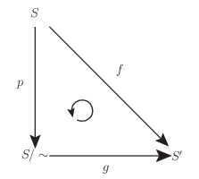

# 商位相

商位相と商空間は位相空間やその先にある微分可能多様体の様々な具体例を構成するのに有用である．[コンパクト性](https://mathrelish.com/mathematics/compact)とも密接に関係しており，基礎的で重要な概念の一つである．

ただ商位相の話題までくると説明の中にでてくる言葉が専門用語ばかりになりがちである． 別称がここにきてたくさんあるというところも，学習する上では地味に厄介になっている． そればかりかこれまでの基本的な事柄が寄り集まりだすので，それらに親しんでいないと追えなくなってしまう．

[The Math Relish Journal Volume 1S](https://mathrelish.booth.pm/items/1123647/)

## 着想と背景

### 商集合，同値類，代表元

商集合に位相を入れたのが商空間で，その位相を商位相という． そのような定義なのだが，ここでそもそも商集合について触れておこう．

商集合とは与えられた集合 $S$ に対して同値関係 $\sim$ が定義できるとき， 集合 $S$ の各元を同値関係 $\sim$ で同一視して得られる集合のことをいう． そして商集合は $S/\sim$ と書かれる． もう少し具体例を通して商集合の定義を以下に説明する．

例えば整数集合に対して次の同値関係が定義できる．

$$ x\sim y \Leftrightarrow x + y \in 2\mathbb{Z} $$

すると $0$ は $2$ や $4$ などの偶数と同値である．

$$ 0\sim 2,~ 0\sim 4,~ \cdots $$

一方で $1$ や $3$ などの奇数とは同値でない．代わりに，$1$ や $3$ などは奇数と同値である．

$$ 1\sim 3,~ 1\sim 5,~ \cdots $$

このように集合 $S$ について同値関係 $\sim$ を考えたとき，同値な元の集まりを一般に同値類といって次のように書く．

$$ [x] := \{ y\in S ~|~ x\sim y \} $$

また各同値類からそれぞれ一つの元を選択するとき，それら元を代表元という．

今の場合には整数集合から次の二つの同値類が得られたことになる．

$$ \begin{eqnarray} [0] &=& \{0,\pm2,\pm4,\cdots\} = 2\mathbb{Z} \\ [1] &=& \{0,\pm1,\pm3,\cdots\} = 2\mathbb{Z} + 1 \end{eqnarray} $$

そして代表元とは $0,1$ や $42,23$ のことをいう． 今回の例は偶数と奇数という同値類であったとわかる．

同値類を考えるとき，明らかに次が成り立つ．

$$ \mathbb{Z} = [0]\sqcup [1] $$

元の集合が同値関係によって直和に分割できるのである．

もし交わりがあると，その元を介して同値でない元どうしが同値となって矛盾をきたしてしまうから，一般に同値関係による今の分割は必ず直和になる．

このように $S = \sqcup_{i\in\mathcal{I}}[x_i]$ という交わりのない互いに素な同値類を元に持つ集合が商集合 $S/\sim$ である．

$$ S/\sim := \{[x_i]\}_{i\in\mathcal{I}} $$

即ち上で考えた例は次のようにかける．

$$ \mathbb{Z}/\sim = \{[0],[1]\} $$

### 商集合による例の生成

偶数和による同値関係は合同式による同値関係の特別な場合である． 合同式は法という周期性を持っているが，これによって無限個の要素を持った集合を有限個の要素を持った集合に関連付けることができる．少し飛躍するが，このことはコンパクトな例を生成するために，商集合の構成が手っ取り早いことを伝えている．

今は離散的な集合に対してのものだったが，これを連続的な集合に対しても行ってみる．

実数集合および定数 $L$ に対して次の同値関係を考える．

$$ x\sim y \Leftrightarrow (\exists n\in\mathbb{Z}) (x - y = nL) $$

これが確かに同値関係であることは合同式の場合と全く同様に示せる．

今，この同値関係によって商集合 $\mathbb{R}/\sim$ を考える． すると実数直線を想像すると，$\mathbb{R}/\sim$ の各元は $L$ の整数倍だけ離れた点と同値だとわかる．これは周長 $L$ の円 $S^1$ を思い起こさせる． 注意しなければならないことは原点から一定の距離にある $x^2+y^2=r^2$ で表されるような真円そのものを意味しないことである．真円たらしめる曲がり具合を記述するには今の商集合は力不足である．

何かを比較するには双方が同等の能力というべきか構造をそもそも持っている必要がある． 商集合を位相空間へと位相構造を付与して，位相空間としての円との比較を試みれば，ようやく少しは円らしくなる．

## 定義

改めて商集合の定義を行ってから，商位相や商空間への定義へと進むことにする． 用語がとても多いからである．

### 商集合

集合 $S$ について同値関係 $\sim$ を考えたとき，同値な元の集まりを一般に同値類といって次のように書く．

$$ [x] := \{ y\in S ~|~ x\sim y \} $$

また各同値類からそれぞれ一つの元を選択するとき，それら元を代表元という．

分割という言葉も実のところは用語であり，次に定義しておく．

集合 $S$ の部分集合族 $\mathfrak{D}$ が次の三条件を満たすとき，部分集合族 $\mathfrak{D}$ を集合 $S$ の分割または直和分割という．

$$ \begin{gather} \bigcup_{A\in\mathfrak{D}}A = X \\\\ (\forall A\in\mathfrak{D})(A\neq\emptyset) \\\\ (\forall A,B\in\mathfrak{D})(A\neq B\Rightarrow A\cap B = \emptyset) \end{gather} $$

分割といったらいつでも直和な分割のことだということに注意する．

以上の「同値類」と「分割」の概念を合わせることで「商集合」が定義される．

集合 $S$ に対する同値関係 $\sim$ を考えるとき，$\sim$ の同値類全体からなる集合を商集合といって $S/\sim$ とかく．

$$ S/\sim := \{[x_i]\}_{i\in\mathcal{I}} $$

集合 $S$ から商集合 $S/\sim$ を作ることを，集合 $S$ の同値関係 $\sim$ による分類または類別という．

しばしば数学では「分類」という言葉が表れるが，それは上記で定義した意味で用いられている．

### 商写像

集合 $S$ に同値関係 $\sim$ が与えられていたとする． このとき次の写像 $p:S\rightarrow S/\sim$ を自然な写像または標準的写像という．

$$ p: x\mapsto [x] $$

「自然な」とか「標準的」という修飾は $f:x\mapsto y$ とあったとき，$y=f(x)$ が $x$ 由来のものだったら「自然だ」「標準的だ」という意味が込められている程度で，あまり気にしてはいけない．

しばしば自然な写像をそのまま商写像とよぶので勘違いしてしまうところであるが， 自然な写像は次に定義する商写像の特別な例の一つである．

二つの位相空間 $(S,\mathfrak{O}),(S^{\prime},\mathfrak{O}^{\prime})$ とその間の写像 $f:S\rightarrow S^{\prime}$ が与えられていたとする． このとき次の二つの条件を満たすならば写像 $f$ を商写像という．

1\. 写像 $f$ は全射である． 2. $(\forall U)(U\in\mathfrak{O}^{\prime} \Leftrightarrow f^{-1}(U)\in\mathfrak{O})$

商写像は別名が多い．箇条書きで挙げると次のとおり．

- 自然な全射
- 標準全射

### 商位相，商空間

位相空間 $(S,\mathfrak{O})$ と集合 $S^{\prime}$ があって，全射 $f:S\rightarrow S^{\prime}$ が与えられているとする．このとき次で定義する $S^{\prime}$ の部分集合族 $\mathfrak{O}^{\prime}(f)$ を $f$ による商位相といい，位相空間 $(S^{\prime},\mathfrak{O}^{\prime}(f))$ を商位相空間もしくは単に商空間という．

$$ \mathfrak{O}^{\prime}(f) := \{ U\subset S^{\prime} ~|~ f^{-1}(U) \in \mathfrak{O} \} $$

上記の定義は一般的なもので同値関係の概念を基礎としてはいないが，関連は次のように定義される．

位相空間 $S$ 上の同値関係 $\sim$ に対して，自然な写像 $p:S\rightarrow S/\sim$ を考える．

このとき商集合 $S/\sim$ の開集合 $U$ とは，($S/\sim$ の部分集合である) $p^{-1}(U)$ が $S$ の開集合であることをいう．即ち，$U$ は商位相の開集合のことである．またこのときの自然な写像は商写像であり，特に等化写像という．

そして商位相が入った商集合 $(S/\sim, \mathfrak{O}^{\prime}(p))$ を同値関係 $\sim$ による $S$ の商位相空間 (商空間) もしくは等化空間ともいう．

等化写像にも次の別名がある．

- 自然な射影
- 標準射影

等化写像を単に射影ということはよくあるので注意する．以下でも多用する． 射影というのは商写像の例として自然な写像をとることを意図している． この場合には $S = \sqcup_i [x_i]$ が $S$ の分類を与えており， その各分類への写像を表していることから射影と称している． なお自然な写像が全射であることは $S = \sqcup_i[x_i]$ から明らかである．

## コメント

### 用語の整理

数学の基本的な概念には様々な捉え方があるが故に，別称が多いのが辛いところである． 今までのすべての用語について整理しておくと次の表のとおりである．

| 名称 | 別称 | 備考 |
| :-- | :-- | :-- |
| 同値類 | 類 |  |
| 代表元 | 代表 |  |
| 分割 | 直和分割 | 必ず直和な分割で排他的 |
| 商集合 | \- |  |
| 分類 | 類別 |  |
| 自然な写像 | 標準的写像 |  |
| 商写像 | 自然な全射，標準全射 | 一般的な商写像 |
| 等化写像 | 自然な射影，標準射影，射影，等化写像 | 同値関係による商写像に限った場合 |
| 商位相 | 等化位相 | 同値関係による商位相の場合に限って等化位相 |
| 商空間 | 商位相空間，等化空間 | 同値関係による商空間の場合に限って等化空間 |

### 射影 $p : S\ni x \rightarrow {[}x{]} \in S/\sim$ が連続写像であること

商位相，商空間の定義から，射影 $p$ は連続写像になっていることに注意する．

即ち位相空間 $X,Y$ の間の写像 $f:X\rightarrow Y$ が連続写像であるとは， 開集合 $\forall U\subset Y$ に対して，逆像 $f^{-1}(U)$ が$X$ の開集合となることだった．

ここで $X,Y,f$ を $S,S/\sim,p$ と読み替えれば，商空間への射影 $p$ は連続写像に他ならないことがわかる．つまり by definition である．

上記に述べた連続写像という性質は次の定義を導く．

位相空間 $X,Y,Z$ に対して，商写像 $p:X\rightarrow Y$ と写像 $f:Y\rightarrow Z$ を考える． このとき合成写像 $f\circ p$ が連続写像であるならば，$f$ もまた連続写像である．

前提より合成写像 $f\circ p:X\rightarrow Z$ は連続写像であるから，$Z$ の任意の開集合 $U$ に対して，$(f\circ p)^{-1}(U) = p^{-1}(f^{-1}(U))$ は $X$ の開集合である．

また $p$ が連続写像であるという前提を踏まえると，$f^{-1}(U)$ は $Y$ の開集合だとわかる． 故に $U$ は開集合だったのだから，連続写像の定義より $f$ もまた連続写像である．■

### 全単射な射影の制限が同相写像であること

射影 $p$ は連続写像ではあるが，一般に同相写像ではない．

例えば周期 $L$ で実数を同一視するとき，$p:\mathbb{R}\rightarrow \mathbb{R}/\sim$ は射影の例だが，定義域が $L$ よりも大きい元について $p$ で写すことを考えると単射でないことがすぐにわかる．このとき単射でないので，逆写像[1](#fn-852-gyakuzo)が存在しない．よって明らかに同相写像ではない．

しかし，定義域を $S$ から単射になるように開集合 $S_0$ に制限して，値域を像 $p|_{S_0}(S_0)$ として全射にするとき，$p|_{S_0}:S_0\rightarrow p|_{S_0}(S_0)$ は同相写像にできる．何故ならば，制限 $p|_{S_0}:S_0\rightarrow p|_{S_0}(S_0)$ は連続写像であり，また全単射だから逆写像が存在し，そして $p|_{S_0}(S_0)$ もまた開集合だから，その逆写像も連続写像となるからである．

上記の設定によって同相写像が構成されると，抽象的な商空間が他の具象的な幾何的対象と同相な関係を持つことになる．

### 商位相が位相であること

定義で商位相とよんだ $\mathfrak{O}(p)$ が位相であることは次のように示せる．

位相空間 $(S,\mathfrak{O})$ に対して，射影 $p:S\ni x \rightarrow [x] \in S/\sim$ の商位相は位相である． 即ち次の $\mathfrak{U}$ は開集合族である．

$$ \mathfrak{U} := \{ U \in 2^{S/\sim} ~|~ p^{-1}(U) \in \mathfrak{O} \} $$

$\mathfrak{U}$ の同値類の各元をラベルする添字集合を $\mathcal{I}$ とするとき，まず次が成立する．

$$ p^{-1}\left(\bigcup_{i\in\mathcal{I}}A_i\right) = \bigcup_{i\in\mathcal{I}}p^{-1}(A_i) $$

よって各 $i$ に関して $p^{-1}(A_i)\in\mathfrak{O}$ なので，その和集合もまた開集合である． 故に $\cup_iA_i\in \mathfrak{U}$ である．

次に $A,B\in\mathfrak{U}$ ならば $A\cap B\in\mathfrak{U}$ であることを言いたい． もし $\mathfrak{U}$ が単に部分集合全体ということであれば，すべての部分集合を含む訳だから， $A\cap B\in\mathfrak{U}$ は自明である． しかしそうでなく，$p^{-1}(U) \in \mathfrak{O}$ かどうか示さなければならない． つまり示すべきことは $p^{-1}(A\cap B) \in \mathfrak{O}$ である． このために次の等式が成立することに着目する．

$$ p^{-1}(A\cap B) = p^{-1}(A)\cap p^{-1}(B) $$

するとこの右辺は開集合の交わりなので，従って全体としても再び開集合である． よって $p^{-1}(A\cap B) \in \mathfrak{O}$ なので，$A\cap B\in \mathfrak{U}$ であることがいえた．■

### 商空間と写像の分解

#### 同値類に纏わる well-defined，ill-defined

同値類を扱う際には well-defined であることがとかく意識される． 同値類に対する写像をその代表元を用いて定義しようとする場面がよくあるからである． 例えば次の写像 $f:S/\sim \rightarrow A(\subset S)$ があったとしよう．

$$ f : [x] \mapsto x $$

$[x]$ は $x$ を代表元とする同値類なのだから，他の代表元 $x^{\prime}$ について $[x]=[x^{\prime}]$ でありえる． するとそのままでは写像の一意性が破れてしまうことが危ぶまれる．

$$ [x] = [x^{\prime}] \Rightarrow f(x) \neq f(x^{\prime}) $$

従って例えば値域 $A$ に何らかの工夫なり前提が必要だと推測される． このように典型的に生じ得ることがわかっている無矛盾性の問題に関して， well-defined であるか否かが論証の中でしばしば問われることになる．

#### 写像の分解

商空間と他の空間との位相的な関係を論ずるのに有用な定理がある． それは次の定理である．

集合 $S$ に於ける同値関係 $\sim$ と写像 $f:S\rightarrow S^{\prime}$ が与えられ，次が成り立っているとする．

$$ (\forall x,y\in S)(x\sim y\Rightarrow f(x) = f(y)) $$

そして自然な写像 $p:S\rightarrow S/\sim$ を考える．

このとき次を満たす写像 $g:S/\sim\rightarrow S^{\prime}$ が存在する．

$$ f = g\circ p ~~ (g([x]): = f(x)) $$

これは写像 $f$ の分解を与えている．そして $g$ を $f$ によって引き起こされる写像という．

同値関係と同値類の関係から次が成り立つ．

$$ x\sim y\Leftrightarrow [x] = [y] $$

よって前提から，$[x] = [y]\Rightarrow f(x) = f(y)$ である． したがって $g([x]): = f(x)$ なる定義は well-defined である． そして任意の $x\in S$ について次が成り立つ．

$$ (g\circ p)(x) = g(p(x)) = g([x]) = f(x) $$

故に $f = g\circ p$ である．■

上記の定理について次の二つのことがいえる．

1. $f$ を全射に取ると，$g$ もまた全射である．
2. 定理の逆が成り立ったとすると，$g$ は単射である． 何故ならば，逆が成立することより，$f(x) = f(y)\Rightarrow [x] = [y]$ であるから， 任意の $[x],[y]\in S/\sim$ に対して，$g([x]) = g([y])\Rightarrow [x] = [y]$ であるが，これは $g$ が単射であることに他ならないからである．

## 例

### 商空間 $\mathbb{R}/\sim$ と円 $S^1$ が同相であること

実数集合に対して次の同値関係を考える．

$$ x\sim y \Leftrightarrow (\exists n\in\mathbb{Z}) (x - y = nL) $$

このとき商空間 $\mathbb{R}/\sim$ と円 $S^1$ は同相な関係にある．

$$ \mathbb{R}/\sim \cong S^1 := \{(\cos(2\pi x/L), \sin(2\pi x/L))\in\mathbb{R}^2 ~|~ x\in [0,L) \} $$

それは次のとおり．但し最後にコンパクトの概念が必要になる．

次の写像 $f:\mathbb{R}\rightarrow S^1$ を考える．

$$ f: x\mapsto (\cos(2\pi x/L), \sin(2\pi x/L)) $$

すると $\cos,\sin$ は連続関数なので $f$ は連続写像である．

このことと射影 $p:\mathbb{R}\rightarrow \mathbb{R}/\sim$ を考えるとき， 次を満たす $f$ によって引き起こされる全単射な写像 $g:\mathbb{R}/\sim\rightarrow S^1$ が存在する．

$$ f = g\circ p $$

よって $g$ は連続写像でもある．

二つの集合が同相であることを示すには，「[コンパクト](https://mathrelish.com/mathematics/compact)」性に関する次の二つの定理が必要である．

1. 任意のコンパクト集合は連続写像によってコンパクト集合に写される．
2. コンパクト空間からハウスドルフ空間への全単射な連続写像は位相同型写像となる．

今，これを認めると，商空間 $\mathbb{R}/\sim$ はコンパクト空間である． 何故ならばコンパクトな閉区間 $[0,L]$ の連続写像 $p$ による像が商空間 $\mathbb{R}/\sim$ だからである．

加えて $g$ は連続写像で，円はハウスドルフ空間であるから同相写像である．

故に商空間 $\mathbb{R}/\sim$ と円 $S^1$ は同相な関係にある．

## 参考

- [はじめての集合と位相](https://amzn.to/2sTBx3T)
- [集合・位相入門](https://amzn.to/2sU95yL)

* * *

2. 定義に表れた $p^{-1}(U)$ は逆写像ではなく逆像の意味であることに注意すること． [↩](#fnref-852-gyakuzo)
