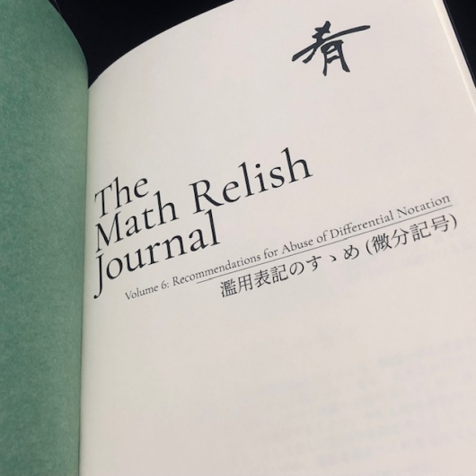

# 濫用表記のすゝめ (微分記号)

微分記号に焦点を当ててそれぞれの用法や長所短所を整理することを目的に， 一冊の本としてまとめました．それが『濫用表記のすゝめ (微分記号)』です． ※ 2022/11/20 開催の[第7回技術書同人誌博覧会 (技書博7)](https://gishohaku.dev/) の新刊告知です！

[濫用表記のすゝめ (微分記号)](https://gishohaku.dev/gishohaku7/books/YtPCJyhmTWV4915xxhy4)

[技書博７出店参加レポート in 浅草](https://mathrelish.com/original-goods/gishohaku7)

## 仕様

ペーパーバック，A5，238 ページ

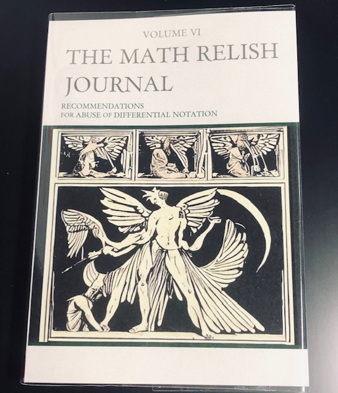

## 背景

改めて微分というものを考えると，利用局面は余りにも広汎で言葉では言い尽くせません． 微分は実に様々なところで，そして様々な背景を持った利用者によって， 今もなお新たな領域で顔を出していることでしょう．

それ故に実に様々な微分記号が考案されてきました． ある一つの数式がそれぞれの分野領域でしばしば異なった表記を取っているあまり， それら分野の初学者同士で不幸にも会話がギクシャクすることも珍しいことではありません．

本書はそのような状況を微分記号について，少しでも状況を改善しようとする試みでもあります．

## 内容

$$ \frac{dy}{dx} $$

このお馴染みの数式を見て，$dx$ は何だろう？ と，疑問に思ったことがあるかもしれません．

極限操作と無限小に関する謎めいた説明を聞いたり， 微分方程式での変数分離による形式的な計算をしたり， かと思えば，全微分を形式的でなく， 幾何的に確かな意味を持った説明を聞いたりしたかもしれません．

そのどれもが，なんとなく相互に矛盾が「ある」ような「ない」ような説明の印象を持ちつつ， 気付けば難解な偏微分方程式を解いていることでしょう．

ふと，次のような疑問を抱いて，基礎が揺らぐ音が聞こえるかもしれません． また様々な言説を聞くことでしょう．

- $dx/dy = 1/(dy/dx)$ や $dy/dt=(dy/dx)(dx/dt)$ だけど，分数じゃない？
- $dx$ は無限小量だから実数ではない（？）という．それでは全微分は何なのか？
- 複素数 $z$ を定めると，その共役複素数 $\bar{z}$ が定まる．では $f(z,\bar{z})$ とは何なのか？
- $\nabla$ はベクトル？
- ラグランジュの運動方程式が，独立ではない $q$ と $\dot{q}$ のそれぞれで偏微分されている？
- 熱力学の計算で現れる偏微分が分数計算のようにできることもあれば，そうでないときもある．やはり微分を分数として考えてはならないということなのか？
- $d^2x=0$ であるのは外微分の性質 $d^2=0$ だから？
- $d^2y/dx^2$ の $d^2y$ って何？
- 積分記号 $\int$ は $S$ を縦に伸ばしたことに由来する？
- $\int f(x)dx$ の $dx$ は何？
- Wolfram|Alpha の不定積分の計算は間違っている？

などなど．

ああ，なんとも耳の痛い話かもしれません．実際，これらは時と場合では正しい文章にもなるため，頭を抱えた記憶がある方も少なくないと思います．また既に誰かが通っている道だから安心して感覚で計算してはいまいか，と悩むこともあったかもしれません．

そこで濫用表記という大人の知恵をうまく使いこなすために，こういった事例を本書では集めました．

## なか見！

| 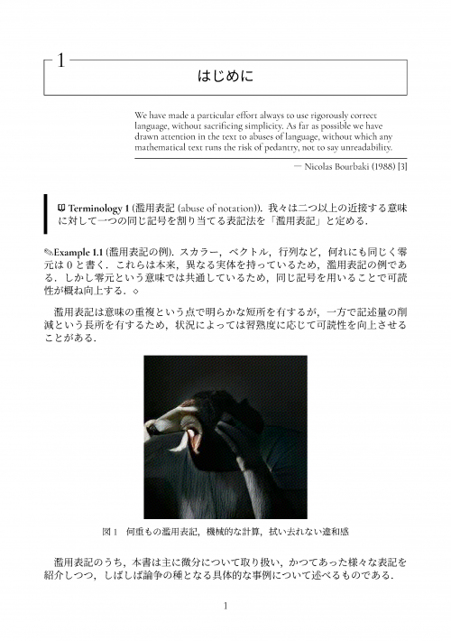 | 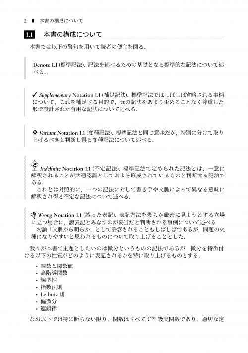 |
| --- | --- |

| 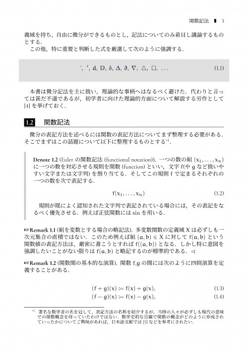 | 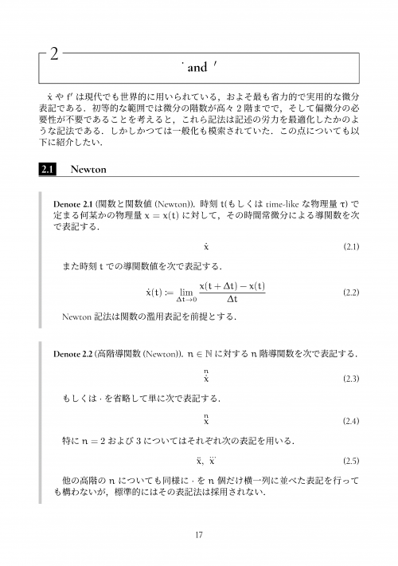 |
| --- | --- |

| 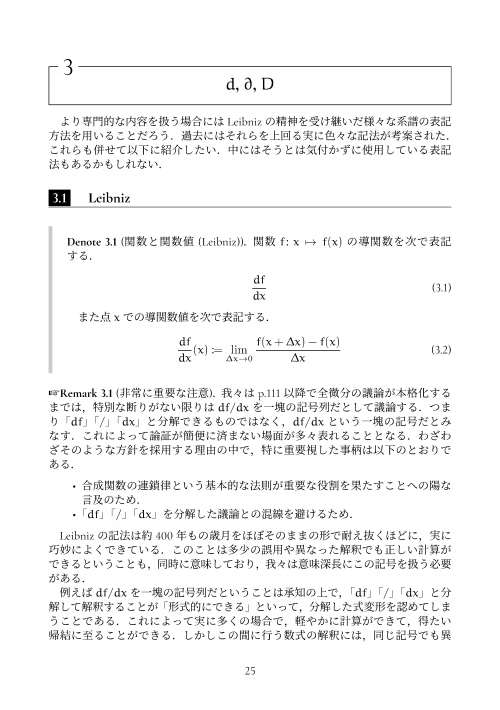 | 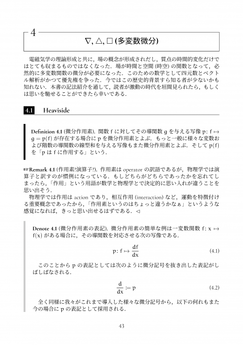 |
| --- | --- |

| 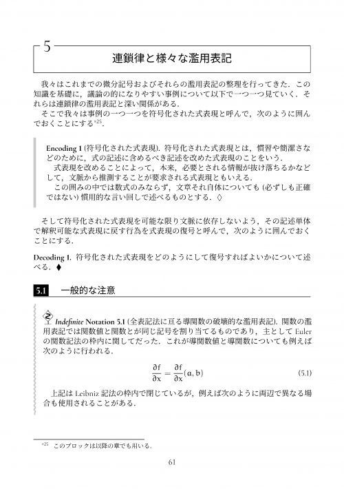 | 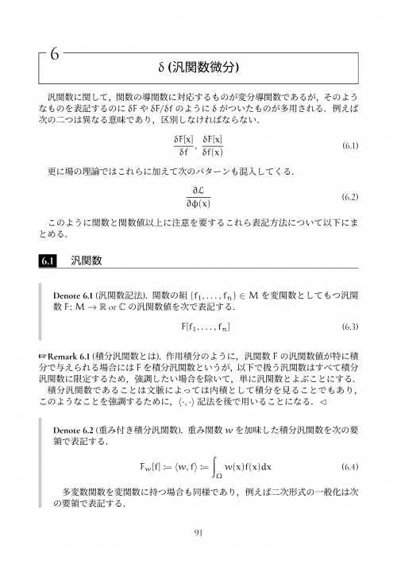 |
| --- | --- |

| 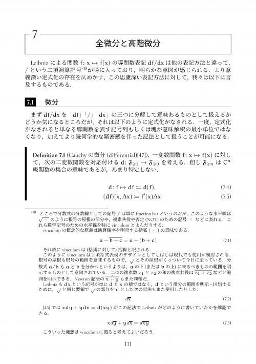 | 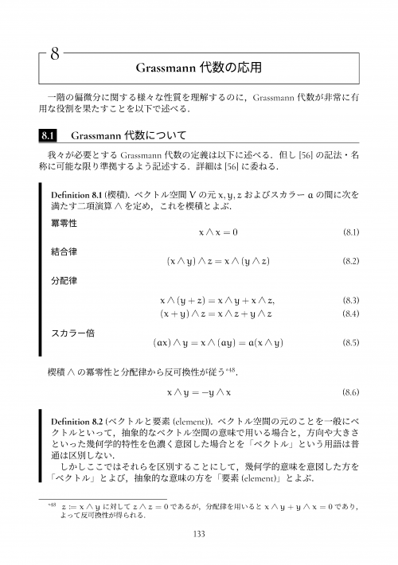 |
| --- | --- |

| 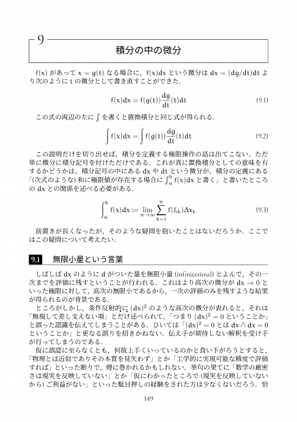 | 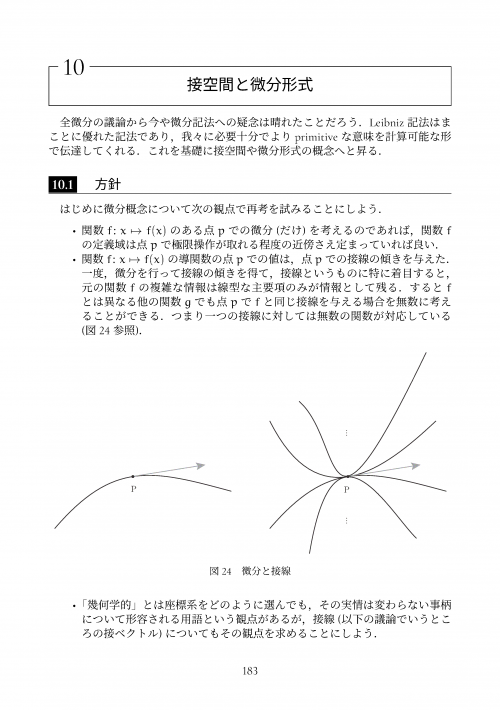 |
| --- | --- |

## 寄り道

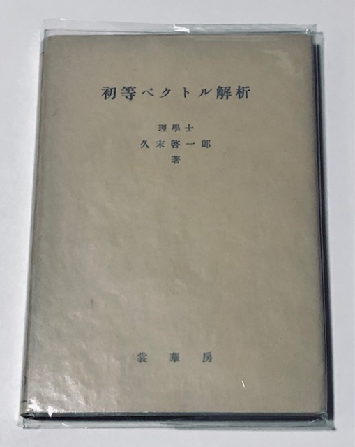

この他，「ベクトルの除法」とかいう寄り道もしました． このとき，

> しかし，もっとも特徴的な違いは，現在の教科書などで扱われていない“ベクトルの除法”について述べられていることです．

という解説が気になって，入手した一冊を本書でも参考にさせていただきました．

[久末啓一郎 著『初等ベクトル解析』](https://shokabo.co.jp/oldbooks/1932hisasue-vector.htm)

## 最後に

以上，偉そうなことを書いてますが，間違っていたら本当すみません・・・． ご指摘などいただき，作業時間を確保してアップデートしていけたら幸いです．

[濫用表記のすゝめ (微分記号)](https://mathrelish.booth.pm/items/4287485)
