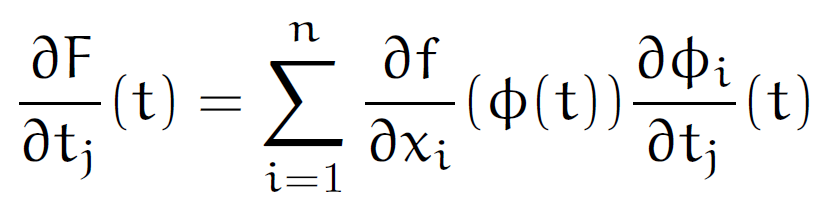

# 微分積分学 - オススメの参考書 (高校数学との接続を意識して)

微分積分学は高校数学か大学受験のために必死になって学ぶ科目でもあり， そして現代科学を理解する上で基礎中の基礎になっているものである．

それ故に微分積分学の参考書となると古今東西含めて星の数ほどあるので， 自分にあっているものが必ずあるといっても過言ではないだろう．

以下では高校数学との接続を意識しているが， それでも星の数ほどあるテキストのうちの一部の紹介に過ぎない． 是非，以下を参考に色々なテキスト・参考書を探す旅に出てほしい． きっとあなたにあった一冊 (いや何冊も！) 巡り合うことだろう！

## 微分積分講義 [改訂版] (三町勝久)

本書は数ある微分積分学のテキストの中でも，高校数学の延長線上として多変数関数を全面に押し出した稀有な一冊だ．普通は一変数の微積分から多変数へと拡張を迫るものだが，本書は一変数は特別な場合として捉えて，始めから多変数を扱っている．

加えて「高校数学の延長線上として」というところが重要で，これを著者は数IV方式とよんでいる． つまり高校数学は数III (または C) までだが，いざ大学数学を始めると「数IIIとは何だったのか」というような一種の断絶を感じてしまうのが定番であり，そういったことが生じないような配慮を意図した命名である．

そしてこのように数IVと謳う以上，「なんちゃって数IV」は許されないと著者は考え，根気強く工学部が使う言葉遣いを整理して，どこで数学の意義が失われてしまうのかを検証してできた一冊だ．

これは並大抵のことではできないし，実際，本書を読んでみると，実に様々な工夫が凝らされていることがわかる．

数学を道具として使う立場の人々が陥りやすい問題であるとか，話題になりやすいトピックを適切に選んでいるのだ．それでいて位相空間論の必要性や集合論の基本的考えなど，より抽象的な数学を学ぶための興味が湧くような記述となっている．特殊関数も一応は超幾何級数まで紹介しており，また演習問題に表れる定積分計算は思わずニヤリとするようなものを選んでいる．

敢えて言わないが補遺もまた素晴らしい．実に配慮深い． どうか多変数関数ということで「難しそう」という先入観を持たず，手にとってほしい．

- [微分積分講義 [改訂版]](https://amzn.to/34njslj)
- [正誤表](https://www.nippyo.co.jp/shop/book/7069.html#errataDetail)

### 数IV方式について

数IV方式という概念自体は高校数学のカリキュラムの変遷を背景にしており， 下記の書籍『[数学プレイ・マップ](https://amzn.to/36zYjFi)』でもこの用語が表れており， 少なくとも８０年代からある概念とわかる．

[](https://www.amazon.co.jp/%E6%96%B0%E7%89%88-%E6%95%B0%E5%AD%A6%E3%83%97%E3%83%AC%E3%82%A4%E3%83%BB%E3%83%9E%E3%83%83%E3%83%97-%E3%81%A1%E3%81%8F%E3%81%BE%E5%AD%A6%E8%8A%B8%E6%96%87%E5%BA%AB-%E6%A3%AE-%E6%AF%85/dp/4480099980?__mk_ja_JP=%E3%82%AB%E3%82%BF%E3%82%AB%E3%83%8A&crid=1DY6KERVSXH5C&keywords=%E6%95%B0%E5%AD%A6+%E3%83%97%E3%83%AC%E3%82%A4%E3%83%9E%E3%83%83%E3%83%97&qid=1647793667&sprefix=%E6%95%B0%E5%AD%A6%E3%83%97%E3%83%AC%E3%82%A4%E3%83%9E%E3%83%83%E3%83%97%2Caps%2C302&sr=8-1&linkCode=li3&tag=alexandritefi-22&linkId=86bd28857f16185efa8fac6608fbd27e&language=ja_JP&ref_=as_li_ss_il)

そもそもかつては「代数」「解析」「幾何」などと分野を明示的に述べるものであって， 数学IIとか数学Bなどと，必修か選択かというような括りの濃さが出るものではなかった． これはコアオプション方式と呼ばれ，誰しもが数学に親しめるよう配慮されたもので， [寺田文行](https://ja.wikipedia.org/wiki/%E5%AF%BA%E7%94%B0%E6%96%87%E8%A1%8C)氏が提唱したとされている．

[embed]https://www.youtube.com/watch?v=-e6MPHKckuc[/embed]

一方ではかつてを知る人が今の呼び名になったことで， わかりくくなったとぼやいているのを耳にした人がいるかも知れない． 高校数学は時代の社会的要請に合わせるのが建前というものだが， カリキュラムは度々変更されている．

特に [New Math](https://en.wikipedia.org/wiki/New_Math) の煽りを受けて 1970 年代に史上最高難易度となり， 現場は混乱することとなって，これを反省して更なるカリキュラム変更が行われたという．

2010 年代はこの [New Math](https://en.wikipedia.org/wiki/New_Math) 世代の教授陣が退官(退職)する時期でもあり， 彼らからその思い出話を聞いた人もいるかも知れない． (個人的には目を輝かせながらも気まずそうな顔が忘れられない)

このような背景も加味すると「数学IV」というものもまた違って見えてくるだろうし， それを前提に『[数学プレイ・マップ](https://amzn.to/36zYjFi)』などは読む必要がある．

[New Math](https://en.wikipedia.org/wiki/New_Math) は率直に言って失敗したのだが， だからこそ高校数学から大学数学との溝は決して浅いものではなく， 数学IVをどうするかというのはなかなか難しい問題だといえよう．

[embed]https://www.youtube.com/watch?v=lvEcFJANVQo[/embed]

一つの理由としてはもちろん内容自体の抽象性や難しさはあるが， 限られた時間での試験との相性が悪いというものも多分にあるのであろう． そして「実用性」との接点が次第に霞んでくるのも大きい．

ここでいう「実用性」とは個人が取り組みうる小規模な問題解決である． 高度な議論であればあるほど，問題規模は大規模であり， またエネルギースケールは高エネルギーとなる．

例えば何の後ろ盾もない人が大規模な統計調査を仮に実行できたとして， その結論をどれだけ活かせるだろか． その彼が変化させうる実世界の変数は非常に限られていて多くは無力である．

精密科学を支える高級な数学についても同様だ． それら数学を会得して，解析できるようになったとしても， 解析対象である系を準備できるだろうか．

そう，苦労して得られた高度な知識は， 力なき個人にとってはただ想像するしかできないのである． これは彼らが欲する「実用性」とは異なろう．

国家資格や独占業務のような後ろ盾を得るのに必要というような社会的な価値があれば， 話は変わってくるかもしれないが，多くは実技と関連して， 科学が得意とする理想化とはしばしば相容れない．

数学IVに相当するカリキュラムが再び高校数学に戻ってくることは， そういった意味でも難しいだろう．

- [新版 数学プレイ・マップ (ちくま学芸文庫)](https://amzn.to/36zYjFi)
- [寺田文行先生を偲んで](https://www.digital-knowledge.co.jp/blog/archives/2640/)
- [高等学校数学カリキュラムはどこまで骨抜きにされたか : 旧カリ数学の側から見た新旧の内容の比較](https://eprints.lib.hokudai.ac.jp/dspace/handle/2115/29754)
- [日本の数学教育の変遷](https://spark6251.hatenablog.com/entry/2015/07/02/200606)
- [新しい数学 (岩波新書 青版 585)](https://amzn.to/3N6lt79)
- [What Happened to ‘New Math’?](https://medium.com/age-of-awareness/what-happened-to-new-math-eeb8522fc695)

## 多変数の微分積分 (シリーズ理科系の数学入門)

[](https://www.amazon.co.jp/%E5%A4%9A%E5%A4%89%E6%95%B0%E3%81%AE%E5%BE%AE%E5%88%86%E7%A9%8D%E5%88%86-%E3%82%B7%E3%83%AA%E3%83%BC%E3%82%BA%E7%90%86%E7%A7%91%E7%B3%BB%E3%81%AE%E6%95%B0%E5%AD%A6%E5%85%A5%E9%96%80-%E5%8E%9F%E5%B2%A1-%E5%96%9C%E9%87%8D/dp/4535604142?__mk_ja_JP=%E3%82%AB%E3%82%BF%E3%82%AB%E3%83%8A&crid=2UD0CRGXGEYTW&keywords=%E5%A4%9A%E5%A4%89%E6%95%B0%E3%81%AE%E5%BE%AE%E5%88%86%E7%A9%8D%E5%88%86+%E6%97%A5%E6%9C%AC%E8%A9%95%E8%AB%96%E7%A4%BE&qid=1651732756&sprefix=%E5%A4%9A%E5%A4%89%E6%95%B0%E3%81%AE%E5%BE%AE%E5%88%86%E7%A9%8D%E5%88%86+%E6%97%A5%E6%9C%AC%E8%A9%95%E8%AB%96%E7%A4%BE%E3%81%8B%2Caps%2C157&sr=8-1&linkCode=li3&tag=alexandritefi-22&linkId=a656faab2bc2816e633695372f5c66ee&language=ja_JP&ref_=as_li_ss_il)

微積分学で高校と大学の決定的な違いは (勿論幾つかあるけれどもその一つに) 多変数関数を扱うかどうかという観点がある．先に紹介した『[微分積分講義 [改訂版]](https://amzn.to/34njslj)』もまたこの点に重きを置いて書かれた一冊であるが，その他にも微分形式なるものが新たに大学数学では登場してくる．

物理で「場」なるものの数学的な定式化を図ろうとすると，「流れ」というものの局所的・大域的な性質を記述することに次第に注意が向けられていくのだが，それによって，ガウスの発散定理やストークスの定理だとか，グリーンの定理のような形で，多変数の微分積分学を用いた記述と出会うことになる．

それらは高校数学の微積分の積み上げのような形で，理解できるとは思うのだが， ベクトル解析のように新たに学ぶ知識で，それらを記述していくとき， 何やらもっと統一的に書けそうな雰囲気がしてくるものである．

どうやらそれは微分形式というらしい．

といって，聞き慣れぬ多様体の本を開いたりする前に，本書を手にとって見ると良いだろう． 物理学の例も多分にあり，これらを学んでおられる方にもオススメである．

さて本書の微分形式の取り扱いは $dx$ や $df$ を「記号」として導入すると割り切っているので，これが微分法で表れる同一の記号とどのような関係があるのかは明言されていない．

その点で不満は残るものの，線型空間の構造を見出して $1$-形式を定めた後， この時点で $d$ なるものの満たすべき代数的性質 (導分としての性質) を提示し， それから線型空間上では存在しない「積」を新たに導入するために，面積積分の座標変換不変性に着目して外積なる積を定めている．結果として $d$ なるものが冪零であるような性質が得られることになる．

というような流れは，後で抽象論を学ぶ時に役立つのかなとは思うところである．

- [多変数の微分積分 (シリーズ理科系の数学入門)](https://amzn.to/3P0UMlt)

本書は Amazon で購入しても良いかもしれないが，版元からの購入を推奨する． というのも本書は絶版になっており，2022 年 5 月現在は中古本しかないからである． しかし版元である日本評論社では「デジタル複製版」なるものを展開しており， [当該サイト](https://www.nippyo.co.jp/shop/book/7488.html)から直販で購入すれば，定価で購入できるのである． 「デジタル複製版」とはいうものの，普通の本と変わりなく廉価版のような安っぽさは感じられないので，その点も心配しないで良い．

このように送料はかかるものの、オリジナルのブックカバーも付いてきたりする．

- [多変数の微分積分［デジタル複製版］](https://www.nippyo.co.jp/shop/book/7488.html)

ところで著者である原岡喜重氏は本書の他にもたくさんの本 (主に解析) を書いており， 本書を気に入った方は別の書籍も探してみるとよいだろう． 『[解析学基礎](https://amzn.to/3OU4uWN)』なんかは氏の集大成のような本で，こちらもオススメしたい．

@Paul_Painleve 氏の的確な書評を参考にされたし．

[embed]https://twitter.com/Paul_Painleve/status/1460107690378620928[/embed]

- [解析学基礎](https://amzn.to/3OU4uWN)

## 新装版　微分形式とその応用　―曲線・曲面から解析力学まで

[](https://www.amazon.co.jp/%E6%96%B0%E8%A3%85%E7%89%88-%E5%BE%AE%E5%88%86%E5%BD%A2%E5%BC%8F%E3%81%A8%E3%81%9D%E3%81%AE%E5%BF%9C%E7%94%A8-%E2%80%95%E6%9B%B2%E7%B7%9A%E3%83%BB%E6%9B%B2%E9%9D%A2%E3%81%8B%E3%82%89%E8%A7%A3%E6%9E%90%E5%8A%9B%E5%AD%A6%E3%81%BE%E3%81%A7%EF%BC%8D-%E6%A0%97%E7%94%B0-%E7%A8%94/dp/4768705235?__mk_ja_JP=%E3%82%AB%E3%82%BF%E3%82%AB%E3%83%8A&crid=32POR0H8S2R8K&keywords=%E5%BE%AE%E5%88%86%E5%BD%A2%E5%BC%8F%E3%81%A8%E3%81%9D%E3%81%AE%E5%BF%9C%E7%94%A8&qid=1654089313&sprefix=%E5%BE%AE%E5%88%86%E5%BD%A2%E5%BC%8F%E3%81%A8%E3%81%9D%E3%81%AE%E5%BF%9C%E7%94%A8%2Caps%2C185&sr=8-1&linkCode=li3&tag=alexandritefi-22&linkId=64dcf847641935b1ff0580d0f9513f2b&language=ja_JP&ref_=as_li_ss_il)

多変数の微積分を扱うか否かは高校数学と大学数学の顕著な違いの一つである． 多変数を扱うということは多次元空間上のスカラーやベクトルなどを扱うことを意味する． これらは古く伝統的なベクトル解析を道具に多くの理工学系の学部生が講義を受けることだろう．

応用上，興味ある対象を記述するのにベクトル解析はよくできているのだが， 理解が進むとより現代的な「微分形式」なるものに興味が湧き出すのが定番である．

実際，高級なテキストでは微分形式を基礎に置くものが少なくない． ただ微分形式というものを単なる計算規則として定義を羅列して導入を図っているテキスト (数学書を除く，物理や工学書) もあって，ストークスの定理やポアンカレの補題などの強力な statement に説明を押し付けている感が否めないのも珍しくない． 一方で数学書となると，微分形式に辿り着くまでに結構な抽象的な基礎が要求されて，多くの理工学生にとっては息切れするのが普通である．

そのような中，本書は微分形式をちょうどよい塩梅で順を追って理解ができる貴重な一冊なのだ．

微分形式は勿論のこと，局所座標系のアイデアにリーマン空間，ファイバー， フレネ・セレの公式に代表されるような動座標系 (動構標) の解析，そして等質空間にリー群と， 微分形式を取り巻く重要な構造を平易でありながらも essence を外さないように解説している．

微分形式がまだカルタンの手にあった頃のみずみずしさを感じられる一冊であり， 現代的な数学書に挑戦する前に，まず本書で全体像を掴んでほしい． 高校数学で学んだ微積分がここまで洗練されるのかと感動するはずだ．

長らく品切れで高騰していたが，新装版が出た． この機会に，是非，手にとってほしい．

- [新装版　微分形式とその応用　―曲線・曲面から解析力学まで](https://amzn.to/38GpS1o)

## 定本 解析概論 (高木貞治)

読み継がれる定番．あのムツゴロウさんが読破したという逸話は有名． (かつてはこの類いの逸話のためにあるような本としても有名だった) まぁこう言っては何だが国民的一冊だ．

初版は昭和13年，1938年だ． [Wiki](https://ja.wikipedia.org/wiki/1930%E5%B9%B4%E4%BB%A3%E3%81%AE%E6%97%A5%E6%9C%AC)とか見るといやぁ歴史を感じる．感じる． (西欧の数学の歴史は更に分厚いことを考えると，まだまだなのだが)

演習問題は現代のマイルドな数学書と違って，鬼畜な問題もそのへんの草のように配置されていて，趣深い．

象徴的な一冊なので持っておくと数学全般のやる気が湧いてくることだろう． (定本化によって定本前になかった誤植については，[公式サイト](https://www.iwanami.co.jp/book/b265489.html)で早く正誤表が公開されることを願う)

- [定本 解析概論](https://amzn.to/3GcwxLi)
- [『増訂解析概論』高木 貞治 著の現代仮名遣い版](https://linesegment.web.fc2.com/books/mathematics/zouteikaisekigairon/index.html)
- [高木貞治先生自筆ノート](https://iiif.dl.itc.u-tokyo.ac.jp/repo/s/takagi/page/home)
- [高木貞治博士記念室](https://www.city.motosu.lg.jp/0000000884.html)
- [ムツゴロウの青春記 (文春文庫)](https://amzn.to/3s5iwKf)

## 解析教程 (Ernst Hairer / Gerhard Wanner)

|  |  |  |
| --- | --- | --- |

微分積分学となると [Cauchy の解析教程](https://amzn.to/3Bdu0zO) (1821年) から数えても， 2022年現在で実に200年も年月が経過しており， 何度も改良が加えられてきた基礎学問である．

微積分学という整備され尽くしたかのような (決してそうではないが) カリキュラムでは，学習効率だけを重んじるような，ともすると無味乾燥な印象を受けかねない． とにかく覚えること理解することが，いや，覚えておきたいこと理解しておきたいこと，というべきか，そういった事柄があまりに多い現代では，微積分学で道草食っている暇はないのだろう．

ところが [Hairer](http://www.unige.ch/~hairer/) と [Wanner](https://www.unige.ch/~wanner/) による本書の解析教程は寄り道をたくさんして，旧き人々が傍にいて共に学んでいるような，実に気持ちが高揚する中で微積分学に触れることができるよう，よく構成が設計されている．

[Ernst Hairer](https://en.wikipedia.org/wiki/Ernst_Hairer)

[Gerhard Wanner](https://en.wikipedia.org/wiki/Gerhard_Wanner)

現代で習うか自ら見い出すであろう数々の微積分計算のテクニックについても，著名な数学者たちがどのように開拓していったのか，活き活きと紹介してくれる．

というのも本書は微積分学の歴史の流れを尊重した文章構成になっており，日本語版の上巻はあまり厳密性の議論は行わないよう配慮されている．そこで慣れ親しんでから，下巻で現代的な定義への接続を図っている． 下巻に至っても図が豊富で，定理の反例についても事細かに述べようとする配慮がなされている． この他，小さなことではあるが，比較的早い段階で複素数についても言及しているのも個人的には好印象である．

本書は微積分学の歴史的な側面を交えて学べるテキストであり， 副読本としてかなり楽しめると思う． 何より本書もまた高校数学からの自然な接続ができる貴重な一冊と思う． 後，数学史好きとしては参考文献が非常にありがたい．

- [Analysis by Its History (Undergraduate Texts in Mathematics) (English Edition)](https://amzn.to/3rvq5uK)
- [原著のサポートページ](http://www.unige.ch/~hairer/books.html)
- [解析教程・上 新装版](https://amzn.to/35tIOON)
- [解析教程・下 新装版](https://amzn.to/3G6PQWo)
- [訳者によるサポートページ](http://kanielabo.org/mybook/analysis/index.htm)
- [訳者による正誤表](http://kanielabo.org/mybook/analysis/err_cor.htm)
- [コーシー 解析教程 〈数学くらしくす〉](https://amzn.to/3Bdu0zO)

## 微分積分学入門 (一松信)

|  |  |  |  |
| --- | --- | --- | --- |

(第四課を除いて) 計算機との関連に言及した珍しい微分積分学のテキスト． といってもガチガチに計算機の話はしていないので，オライリーにありそうな過渡な期待はしない方が良い． あくまでも微分積分学としてのテキストの体裁は保っている．

本書も[微分積分講義 [改訂版]](https://amzn.to/34njslj)で言うところの「数IV方式」な思想をもっている． 早めに大学数学を知りたい高校生や，工学部学生がより高度な数学を学ぶための下地として読むのに適していると言えるだろう．

- [新装版 微分積分学入門 第一課](https://amzn.to/3gc4ocR)
- [微分積分学入門第二課](https://amzn.to/3g6udLt)
- [微分積分学入門第三課](https://amzn.to/3Hg47RR)
- [微分積分学入門第四課](https://amzn.to/3rb3kfq)

## 微分方程式通論 (矢野健太郎)

微分方程式は微分積分学の一部だが，それ自体で様々なテキストがあるので，「微分方程式」というテーマでいろいろと紹介したいところだが，一冊だけでも紹介したいと思い，私自身がかつてお世話になった本書を紹介する．

[矢野健太郎](https://ja.wikipedia.org/wiki/%E7%9F%A2%E9%87%8E%E5%81%A5%E5%A4%AA%E9%83%8E_\(%E6%95%B0%E5%AD%A6%E8%80%85\))

著者はヤノケンこと矢野健太郎氏で「解法のテクニック」でかつての大学受験生にとっては有名人だったし，そこで彼の名を知った者も多いことだろう．矢野氏は受験参考書だけでなく大学数学のテキストや一般向けの啓蒙書など様々な書籍を世に送り出した．現代のポジションでたとえると加藤文元氏だろうか．氏のチャート式シリーズは非常に素晴らしい企画の一つである．

|  |  |  |
| --- | --- | --- |

おっと，閑話休題．本書『[微分方程式通論](https://amzn.to/34jCxEO)』は微分方程式を作るというところから始まって，一通りの微分方程式の解法であるとか，応用上，基礎となる微分方程式を概ねほぼ扱っている．微分演算を恰も代数のように扱う演算子法や級数解法についても書かれており，微分方程式の学習を開始した際に知るであろう，どこか心許ない僅かな道具立てをより補充・充実してくれることと思う．

### モノグラフ (科学新興新社)

矢野健太郎繋がりということで，モノグラフの「[微分方程式](https://amzn.to/3urFU7N)」も挙げておこう． 値段が非常に手頃なこともありオススメしたい．

「[微分](https://amzn.to/3grgdw0)」「[積分](https://amzn.to/3Hvf4zm)」の巻も高校数学を手早く振り返るという点でも，コンパクトであり役立つことと思う．

|  |  |  |
| --- | --- | --- |

- [微分方程式通論](https://amzn.to/34jCxEO)
- [微分方程式 (モノグラフ 20)](https://amzn.to/3urFU7N)
- [微分 (モノグラフ 18)](https://amzn.to/3grgdw0)
- [積分 (モノグラフ 19)](https://amzn.to/3Hvf4zm)

ちなみにモノグラフの[微分](https://amzn.to/3grgdw0)と[積分](https://amzn.to/3Hvf4zm)を合わせた，もう少し通論的なモノグラフとして[微積分](https://amzn.to/3HBE4VI)がある． 一変数多項式に限っており，微分と積分の基本的な意味について集中できる．

著者の[味八木徹](https://100nenshi.musashi.jp/Gallery/Photo/14dea18e-7fd4-46b2-bf49-d587b1741efd)氏は「解析概論」の点字訳にも取り組んでおり，広く貢献している．

- [微積分 (モノグラフ 16)](https://amzn.to/3HBE4VI)
- [点訳 解析概論 改訂第三版](http://www.ntut-braille-net.org/finished_list/finished-014.php)

## Counterexamples in Analysis (Dover Books on Mathematics)

解析学に関する反例集である．辞書的に使うとよい． 有名な例も勿論収録されており，納得の一冊である． 一例として6章の反例23を紹介する．

$$ f(x) := \begin{cases} e^{-1/x^2} & (x\neq 0), \\ 0 & (x=0) \end{cases} $$

さぁ，これを $x=0$ の周りで冪級数展開 (Taylor 展開) してみてみよう． 面白いことが起こるはずだ．

- [Counterexamples in Analysis (Dover Books on Mathematics)](https://amzn.to/3AKdRBv)

* * *

## 関連書籍

積分計算に的を絞った書籍は以下で紹介している．

[積分計算 - オススメの参考書・問題集](https://mathrelish.com/calculation/recommended-books-in-integral-calculus)

* * *

最後に宣伝で恐縮でありますが， Math Relish 物販部もご利用いただけたらと思います．

[Math Relish 物販部](https://mathrelish.booth.pm/)
