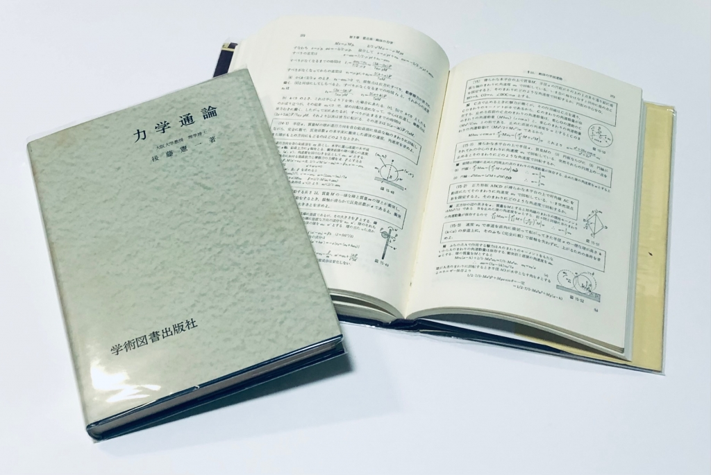
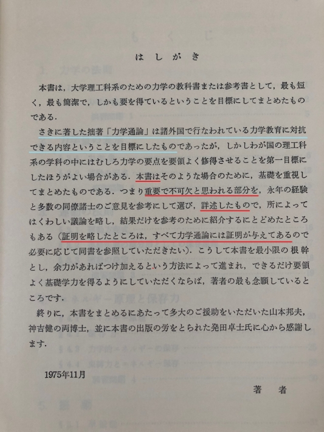
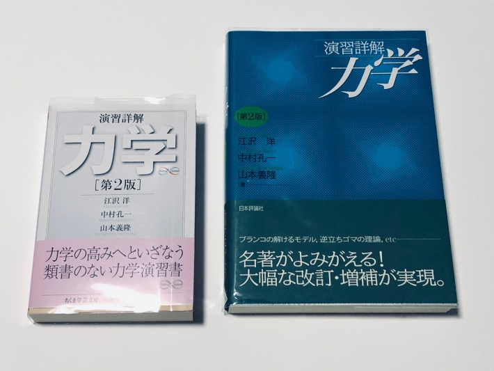

# 古典力学 - オススメの参考書 (上級者向けを意識して)

物理学の入口，それは古典力学．

書店に出向けば古典力学 (以下，しばしば単に力学) のテキストが必ずあるはずだ． 何よりも一つの体系立った最も古い物理学なので，一口にテキストといっても微分積分学のテキストのように，星の数ほどある．

[微分積分学 – オススメの参考書 (高校数学との接続を意識して)](https://mathrelish.com/mathematics/recommended-books-in-calculus)

その中でも以下では上級者向に的を絞って紹介したい． というのも，入門者・初級者向のテキストは現代において「積極的に出版・宣伝される対象」として優遇されており，「わざわざ紹介する」というのが正に無駄骨を折る行為に等しいからである． 一方で上級者向は絶滅の危機といっても過言ではない．

ここでは絶版本も惜しげなく紹介する． 図書館に行けばあるはずだ．閉架にもなかったら正に絶滅しているということだ． そういう年代に入ってきている．と思う．

ただいきなり上級者向のテキストを通読するのもまた危険だろう． 焦ってはいけない．焦るものでもない． 理解を深めればこういう話が見えてくるのか，くらいに気楽に身構えれば良い．

## どう学ぶか

書籍紹介の前に力学をどう学ぶかについて，ほんの少しだけコメントしたい． まず物理学科という学科に所属しているならば，指定されたテキストや参考書を参考に， 講義をこなせばいい．それだけ．

なに？[ゴールドスタイン](https://amzn.to/37SrTar)が指定された？ 良かったじゃないか，妙なものが指定されなくてさ． もう，ほんと，それだけ．

### 良き理解者と腕力

なになに，[ゴールドスタイン](https://amzn.to/37SrTar)はきつい？ では[マリオン](https://amzn.to/3ycC83V)はどうだろう？

| [](https://www.amazon.co.jp/%E5%8A%9B%E5%AD%A6%E3%80%881%E3%80%89-1972%E5%B9%B4-%E7%8F%BE%E4%BB%A3%E5%9F%BA%E7%A4%8E%E7%89%A9%E7%90%86%E5%AD%A6%E9%81%B8%E6%9B%B8-%E3%82%B8%E3%82%A7%E3%83%AA%E3%83%BC%E3%83%BBB-%E3%83%9E%E3%83%AA%E3%82%AA%E3%83%B3/dp/B000J9ZXXQ?qid=1651515122&refinements=p_27%3A%E3%82%B8%E3%82%A7%E3%83%AA%E3%83%BC%E3%83%BBB.%E3%83%9E%E3%83%AA%E3%82%AA%E3%83%B3&s=books&sr=1-1&text=%E3%82%B8%E3%82%A7%E3%83%AA%E3%83%BC%E3%83%BBB.%E3%83%9E%E3%83%AA%E3%82%AA%E3%83%B3&linkCode=li3&tag=alexandritefi-22&linkId=be0e2fa435d01e1a746a1336658fbe3b&language=ja_JP&ref_=as_li_ss_il) | [](https://www.amazon.co.jp/%E5%8A%9B%E5%AD%A6%E3%80%882%E3%80%89-1973%E5%B9%B4-%E7%8F%BE%E4%BB%A3%E5%9F%BA%E7%A4%8E%E7%89%A9%E7%90%86%E5%AD%A6%E9%81%B8%E6%9B%B8-%E3%82%B8%E3%82%A7%E3%83%AA%E3%83%BC%E3%83%BBB-%E3%83%9E%E3%83%AA%E3%82%AA%E3%83%B3/dp/B000J9VOBG?qid=1651515122&refinements=p_27%3A%E3%82%B8%E3%82%A7%E3%83%AA%E3%83%BC%E3%83%BBB.%E3%83%9E%E3%83%AA%E3%82%AA%E3%83%B3&s=books&sr=1-2&text=%E3%82%B8%E3%82%A7%E3%83%AA%E3%83%BC%E3%83%BBB.%E3%83%9E%E3%83%AA%E3%82%AA%E3%83%B3&linkCode=li3&tag=alexandritefi-22&linkId=737b94d5320220fe4d9f179257d94d92&language=ja_JP&ref_=as_li_ss_il) |
| --- | --- |

そんな会話が懐かしいし貴重だと，今はよく感じる． それに以下で紹介する本なんて「あ～，ハイハイ．知ってますよ．もう聞き飽きました．」という状態でもあった．

何より，物理の話ができる同期や先輩・後輩，そして教授・准教授・助教・講師やら (心のゆとりを辛うじて残している) ポスドクらとの議論を大切にすると良いと振り返って思う．そして自分なりのノートを作っていければなお良い．

なおノート作りの際に下記がお役に立てたなら幸い．

[数式がある文書作成に役立つ資料まとめ](https://mathrelish.com/mathematics/summary-of-materials-useful-for-creating-documents-with-mathematical-expressions)

さて，とはいえ当人としては「そうはいってもさぁ．．あれやこれやで．．」というのはよくわかるところ． しかしこの環境は大学を出てしまうと，そうは得られないということだけはハッキリしている． もう誰もが力や運動量がどうとか，気にする余裕がなくなるのだ．．

では物理学科ではない場合はどうだろうか．

解析力学という言葉自体，もっといえば「ラグランジアン」や「ハミルトニアン」という言葉自体が何やらよくわからないもの，という印象だろう．まさか，それらが一般論を扱うものであることを知らずに学部四年間を終えてしまうことも決して珍しいことではない．いろいろ考えては見たものの，学部一年で学ぶであろう教養物理以降は，以下に紹介する本であがくしかないだろう．

やはり早めに詳しい知り合いを探すのが先決に思う． あとはひたすら問題を解いて腕力を鍛えるしかないと思う．

## 初学者向け

とはいえ，一応，初学者向けも紹介したい．

### 力学の考え方

[](https://www.amazon.co.jp/%E5%8A%9B%E5%AD%A6%E3%81%AE%E8%80%83%E3%81%88%E6%96%B9-%E7%89%A9%E7%90%86%E3%81%AE%E8%80%83%E3%81%88%E6%96%B9-1-%E7%A0%82%E5%B7%9D-%E9%87%8D%E4%BF%A1/dp/4000078917?__mk_ja_JP=%E3%82%AB%E3%82%BF%E3%82%AB%E3%83%8A&crid=1JE9DZA9P4DQH&keywords=%E5%8A%9B%E5%AD%A6%E3%81%AE%E8%80%83%E3%81%88%E6%96%B9+%28%E7%89%A9%E7%90%86%E3%81%AE%E8%80%83%E3%81%88%E6%96%B91%29&qid=1651475865&sprefix=%E3%82%B4%E3%83%BC%E3%83%AB%E3%83%89%E3%82%B9%E3%82%BF%E3%82%A4%E3%83%B3+%E5%8F%A4%E5%85%B8%E5%8A%9B%E5%AD%A6%2Caps%2C599&sr=8-1&linkCode=li3&tag=alexandritefi-22&linkId=829ae566c64e6b33d2cf3d54d6144959&language=ja_JP&ref_=as_li_ss_il)

砂川氏は本書に限らず，様々な難易度および分野のテキストを執筆しており教え方に安定感がある． ずっと以前には[高校物理の参考書](https://www.fukkan.com/fk/VoteDetail?no=47003)も執筆しており，今ではプレミアものにもなってしまっている．

『力学の考え方』(含め本シリーズ) は初学者向けなのだが，決して低俗なものではなく， 物理学者の観点から一段高い視点から物事を無理なく説明してくれている． 中高生でも十分に取り組めることと思う．

受験数学ならぬ受験物理というものに染まってしまう前に， たとえ中高生が少し背伸びして，本書を読んだとして何を言っているのかわからなくとも， 物理とは何をしたいのか，何を疑問に思うのか，というような読み方でも一向に構わないと私は思う．

なお本書は大きな B5 版で見やすく，カバーデザインも落ち着いていて， 本シリーズは非常に良い仕上がりにもなっている．

- [力学の考え方 (物理の考え方 1)](https://amzn.to/37VG0eQ)
- [精講物理 (復刊リクエスト)](https://www.fukkan.com/fk/VoteDetail?no=47003)

### 力学のききどころ

[](https://www.amazon.co.jp/%E5%8A%9B%E5%AD%A6%E3%81%AE%E3%81%8D%E3%81%8D%E3%81%A9%E3%81%93%E3%82%8D-%E7%89%A9%E7%90%86%E8%AC%9B%E7%BE%A9%E3%81%AE%E3%81%8D%E3%81%8D%E3%81%A9%E3%81%93%E3%82%8D-1-%E5%92%8C%E7%94%B0-%E7%B4%94%E5%A4%AB/dp/4000079417?keywords=%E5%8A%9B%E5%AD%A6%E3%81%AE%E3%81%8D%E3%81%8D%E3%81%A9%E3%81%93%E3%82%8D&qid=1651476923&sprefix=%E5%8A%9B%E5%AD%A6%E3%81%AE%E3%81%8D%E3%81%8D%2Caps%2C200&sr=8-1&linkCode=li3&tag=alexandritefi-22&linkId=b4e3bbff36e3b6fdf8586637dd899afc&language=ja_JP&ref_=as_li_ss_il)

同じ岩波書店からは似たようなコンセプトで和田氏が出している「物理講義のききどころ」シリーズがある． こちらは「物理の考え方」シリーズとは違ってテクニカルな面に力点が置かれている．

本格的に力学を学ぶ段になって，それなりに普段の講義で出されるような課題なりに取り組めるようになってきた頃に読むと良いような本である． 見開きで一つのトピックが完結しているので読みやすい配慮がなされており， 自分の理解をこのように細かく再構成するにも役立つだろう．

- [力学のききどころ (物理講義のききどころ (1))](https://amzn.to/3P1C4Ku)

因みに高校物理バージョンもある．参考にされたし．．

[](https://www.amazon.co.jp/%E5%8A%9B%E5%AD%A6%E3%81%A8%E3%82%A8%E3%83%8D%E3%83%AB%E3%82%AE%E3%83%BC-%E9%AB%98%E6%A0%A1%E7%89%A9%E7%90%86%E3%81%AE%E3%81%8D%E3%81%8D%E3%81%A9%E3%81%93%E3%82%8D-1-%E5%92%8C%E7%94%B0-%E7%B4%94%E5%A4%AB/dp/4000069284?keywords=%E5%8A%9B%E5%AD%A6%E3%81%AE%E3%81%8D%E3%81%8D%E3%81%A9%E3%81%93%E3%82%8D&qid=1651476923&sprefix=%E5%8A%9B%E5%AD%A6%E3%81%AE%E3%81%8D%E3%81%8D%2Caps%2C200&sr=8-6&linkCode=li3&tag=alexandritefi-22&linkId=0daca3a1d71ef5c8beae9819e7597616&language=ja_JP&ref_=as_li_ss_il)

- [力学とエネルギー (高校物理のききどころ 1)](https://amzn.to/376n38V)

### ケプラー・天空の旋律(メロディ)―60小節の力学素描

[](https://www.amazon.co.jp/%E3%82%B1%E3%83%97%E3%83%A9%E3%83%BC%E3%83%BB%E5%A4%A9%E7%A9%BA%E3%81%AE%E6%97%8B%E5%BE%8B-%E3%83%A1%E3%83%AD%E3%83%87%E3%82%A3-%E2%80%9560%E5%B0%8F%E7%AF%80%E3%81%AE%E5%8A%9B%E5%AD%A6%E7%B4%A0%E6%8F%8F-%E5%90%89%E7%94%B0-%E6%AD%A6/dp/4320033469?__mk_ja_JP=%E3%82%AB%E3%82%BF%E3%82%AB%E3%83%8A&crid=122ENKJE05P2X&keywords=%E3%82%B1%E3%83%97%E3%83%A9%E3%83%BC%E3%83%BB%E5%A4%A9%E7%A9%BA%E3%81%AE%E6%97%8B%E5%BE%8B&qid=1651477607&sprefix=%E3%82%B1%E3%83%97%E3%83%A9%E3%83%BC+%E5%A4%A9%E7%A9%BA%E3%81%AE%E6%97%8B%E5%BE%8B%2Caps%2C172&sr=8-1&linkCode=li3&tag=alexandritefi-22&linkId=721cdad8f19a7689577c4b7c039b44f7&language=ja_JP&ref_=as_li_ss_il)

吉田武氏の著作は著者の哲学というか情熱が色濃く出ており，好き嫌いが分かれるかもしれない． 本書も『[力学のききどころ](\(https://amzn.to/3P1C4Ku\))』と同じようなコンセプトで，見開きで一つのトピックがまとめられている．

違いは妙な濃さである．

読者に計算をガリガリさせたい，見逃しを徹底的に排除したい，そんなような意気込みが伝わってくる一冊． 本文で使い分けている漢字一つ一つ見ていても，現代人が失ったこだわりを感じ取ることができるだろう．

本書は起爆剤のような一冊になっており，高校物理から大学物理へと，計算の程度を一新させたいと思っている人には特にオススメしたい一冊である．

- [ケプラー・天空の旋律(メロディ)―60小節の力学素描](https://amzn.to/3vz1CqB)

### よくわかる力学

江沢氏による力学のテキスト．砂川氏も本書を初学者向けに推薦されたそうだ． 本書はなんと言っても高校物理からの接続を強く意識している． 接続というより，高校と大学の壁をぶっ壊そうという気概で書かれた一冊．

解析力学まで行くことはない初等的な力学を扱っているが，物理の題材一つについて複数の説明を試みたり，これを扱うための数学に深く立ち入って議論している．当然，振り子は近似で終わらせない． グリーン関数のような道具立ても，この時点で接することができる．

物理的直観を養うことが目的となっており，くどいくらい説明してくれている． 一冊の本から十分に熱意を感じさせてくれる物理好きな初学者にはオススメの一冊だ．

- [よくわかる力学](https://amzn.to/3LED6tR)
- [よくわかる力学 (復刊ドットコム)](https://www.fukkan.com/fk/VoteDetail?no=2533)

#### 『力学―高校生・大学生のために』として復刊！！

本書，絶版かなと今の今 (2022/05/04/01:50 現在) まで思っていたのですが， 日本評論社から名前を『力学―高校生・大学生のために』と変えて， 改訂版として復刊していたようです！

そもそも『[よくわかる力学](https://amzn.to/3LED6tR)』は『[初等力学](https://amzn.to/3FiWWbx)』を底本に江沢氏が大幅加筆してできた本なので， また更に加筆した（？）ということだろうか． ということは既にお持ちの方でも，読み比べる楽しみがあるかも． ポケコンとか流石にどうなったのだろう．．

- [力学―高校生・大学生のために](https://amzn.to/3LFFgJr)

## 力学 (増訂第3版) ランダウ=リフシッツ理論物理学教程

[](https://www.amazon.co.jp/%E5%8A%9B%E5%AD%A6-%E5%A2%97%E8%A8%82%E7%AC%AC3%E7%89%88-%E3%83%A9%E3%83%B3%E3%83%80%E3%82%A6-%E3%83%AA%E3%83%95%E3%82%B7%E3%83%83%E3%83%84%E7%90%86%E8%AB%96%E7%89%A9%E7%90%86%E5%AD%A6%E6%95%99%E7%A8%8B-%E3%82%A8%E3%83%AA%E3%83%BB%E3%83%A9%E3%83%B3%E3%83%80%E3%82%A6/dp/4489011601?keywords=%E3%83%A9%E3%83%B3%E3%83%80%E3%82%A6+%E5%8A%9B%E5%AD%A6&qid=1649581202&s=books&sprefix=rannda%2Cstripbooks%2C330&sr=1-1&linkCode=li3&tag=alexandritefi-22&linkId=0f481937ed5a644921d208a19c21e59b&language=ja_JP&ref_=as_li_ss_il)

最早，語るまでもない．

東京図書が本書と[バコテン](https://amzn.to/3v6kE6j) を未だに出版しているのは， 最後の良心かもしれない．奇跡すら感じる．

それほど内容は変わらないが小教程から始めてもよいだろう．Kompaneyets という選択肢もある．

注意としてはいきなり読まないことだ．

まずは運動学としての計算に親しみ， Newton の運動の法則に基づいて質点の様々な運動方程式を解いた後， Kepler の法則を十分に味わい， 更に質点の運動方程式の議論を剛体に拡張して，やはり様々な問題を解くことだ． 問題集としては[詳解力学演習](https://amzn.to/3jr9OCp)がよい．

Landau を読むのはそれからでも全く遅くない．

- [力学 (増訂第3版) ランダウ=リフシッツ理論物理学教程](https://amzn.to/3usOTFr)
- [力学・場の理論―ランダウ=リフシッツ物理学小教程 (ちくま学芸文庫)](https://amzn.to/3E10y1q)
- [力学 (カンパニエーツ理論物理学講義)](https://amzn.to/3xx2SvV)
- [演習理論物理学 力学](https://amzn.to/3s7qq6N)

なお「運動学」という用語が聞き慣れない方は次を参照されたし．

[運動学とは](https://mathrelish.com/physics/kinematics)

## 解析力学と変分原理

|  |  |
| --- | --- |

Einstein と親交が厚かった Lanczos による力学のテキスト． 訳書は絶版になって久しい．日刊工業新聞社出版という理論物理関連には，あまりにマイナーすぎる出版社が出しているのが絶版速度に拍車をかけたのかもしれない．

解析力学を学ぶ者にとっては教育的で参考になるところが多い． Lagrangian とはなにか，そういう素朴な疑問を持たざるを得ないカリキュラムになっていることが多いが，本書はそのような点についても配慮がなされているように思う．

- [解析力学と変分原理](https://amzn.to/3uoU5Kq)
- [解析力学と変分原理 (復刊ドットコム)](https://www.fukkan.com/fk/VoteDetail?no=5152)
- [The Variational Principles of Mechanics (Dover Books on Physics)](https://amzn.to/36ZXqXz)

晩年の Lanczos 本人による半生を振り返る動画は必見．

[embed]https://www.youtube.com/watch?v=PO6xtSxB5Vg[/embed]

## 後藤憲一

### 詳解力学演習

B1 の前期に延々と，それこそ延々と，これだけはやっていた．今では良い思い出． 計算に慣れ親しんでくると，力学的世界観がちゃんと見えてくる．

ただ悲しいかな，生活にまみれて時が経って，もう目が曇ってしまっている．凡人の嘆き． だからこそ自信を持って言える．演習書をこなす時間や仲間との議論は非常に貴重なのだ． 忘れることなかれ！

- [詳解力学演習](https://amzn.to/3jr9OCp)

### 力学通論

通論とあるが濃い．こってりだ．

[詳解力学演習](https://amzn.to/3jr9OCp)のまえがきで挙げられている複数の参考テキストのうち，後藤憲一氏本人が著者となっているのが，**唯一この一冊** である．

つまり[詳解力学演習](https://amzn.to/3jr9OCp)の対になるテキストとしての性格がある．本書の特徴の一つとして剛体の運動を理論的にいろいろと言及しているのだが，このようなテキストは現代ではかなり貴重な部類ではないだろうか．

そうでなくとも本書は後藤憲一氏が著した力学のテキストの中でも決定版であり，所有されている方は大切にされると良い．

- [力学通論](https://amzn.to/3jpgW1X)
- [力学通論 (復刊ドットコム)](https://www.fukkan.com/fk/VoteDetail?no=28662)

### 力学

本書ははしがきでも述べているように， 『[力学通論](https://amzn.to/3jpgW1X)』の中でも重要不可欠と思われる事項を詳述したもので， ちょうど姉妹本のような立ち位置になっている．

正直な所，重複する部分は多々あるので，わざわざ入手する必要はないかもしれない． 『[力学通論](https://amzn.to/3jpgW1X)』で扱っているトピックを単に省いてできたような面は否めない． 逆にはしがきから，通論の密度というか，執筆への意気込みを感じ取れる．

取捨選択したとはいえ，本書『[力学](https://amzn.to/3saFjpa)』の程度でも， これだけの内容量を扱ったものは昨今ではなかなか見つからないのではないだろうか．

- [力学](https://amzn.to/3saFjpa)

### 力学要説―現代科学とのかかわりも含めて―

後藤憲一氏のテキストは科学愛に溢れてる． 歴史的な話題も織り交ぜながら，密度濃く具体例と計算方法を毎回提示しながら導いてくれる．

内容としては『[力学通論](https://amzn.to/3jpgW1X)』や『[力学](https://amzn.to/3saFjpa)』を足して二で割って，そこから新たな事柄も幾つか加筆したような一冊になっている．また前著で扱った内容を演習問題で片付けていたりしている．そういう意味で要説なのかもしれない．

ただ要説とあるが，決して簡単な意味で「要説」といっていない． 高度なことでも要点を絞って解説している． 本書で扱う深さは「Dirac 括弧を扱っている」といえば， それだけで本書の性格が伝わるだろう．

高度な話題でも紙面所狭しとガンガン切り込んでいく． 有り難い一冊だ．

- [力学要説―現代科学とのかかわりも含めて―](https://amzn.to/3xcQLUx)

## 山本義隆

### 演習詳解 力学 [第2版] (ちくま学芸文庫)

本書を通読するまで力学を延々と続けるというのは現実的ではない． 他にやるべきことがあるはずだ． 逆に言えば余裕がなくなったとも言えるし，習得する量も激増したとも言える．

つまりこの本はどういう本かというと， なが～～～～～く，物理に親しんでいる人が今自分がどれだけ登ってきたのか確認したり， もしくはもっと最先端の物理などを延々と追いかけてきた人が， ふとしたきっかけで「あ，力学，懐かしいなぁ」と実家に帰るような気持ちで読むような本である．

例えば問題 3-13 を見ると，剛体の回転運動の定番問題である円柱が階段から転がり落ちる問題をひねったなぁとか，勝手な感想を即座に抱くものだが，ひねり方が「あああ，めんどくせぇ．でもそこまで飛躍していない，もうちょっと手を伸ばせば，もしかしたら・・」みたいな感覚を抱かせてくれる．そんな問題ばかりだ．

普通のカリキュラムでは質点の力学のあと， ほんの少しだけ質点系を扱うかもしれないが，早々に剛体へ移行することだろう． それ故に，5 章の質点系という題材自体，面食らう人も多いかもしれない． 何かしら古典力学の範疇で良いモデルが作れそうな場合に， 質点・糸・バネなどを組み合わせた質点系としての力学モデルをたてることがあるが， その類の演習書は少ないので，本書は参考になろう．

この辺りも含めた全体的な本書の勝手な印象だが， 1970年代まで続いた東西の宇宙開発競争がなんとなぁく，垣間見える． (根拠なき，個人の感想です)

なお今回流通が復活した文庫版は (あくまで個人の感想だが) 読みにくくて仕方ない． しかし携帯性と価格の安さは圧倒的な利点である． まぁぶっちゃけそんなのどうでも良くて，本書のような玄人志向の一冊が買えるというのが素晴らしい． 特に 3 章の「非線形振動」と 7 章の「重力の起こす運動」をテーマに扱った演習書自体がほぼないので，その点でも本書は有益である． この他，ソリを「橇」と漢字で併記したりしており， そういうのを見つけるのがちょっとした息抜きになるかもしれない．

あと書名に「詳解」とあるが，確かに詳しいけれども，手取り足取りではない． 要求される前提知識は決して低くない．

日本語で読めるあまりにも稀有な一冊．オススメしたい．

- [演習詳解 力学 [第2版] (ちくま学芸文庫)](https://amzn.to/3retZHS)

## (もっと) 楽しめる物理問題

|  |  |
| --- | --- |

|  | [](https://www.amazon.co.jp/%E3%82%82%E3%81%A3%E3%81%A8%E6%A5%BD%E3%81%97%E3%82%81%E3%82%8B-%E7%89%A9%E7%90%86%E5%95%8F%E9%A1%8C200%E9%81%B8-%E5%8A%9B%E3%81%A8%E9%81%8B%E5%8B%95%E3%81%AE100%E5%95%8F-Ken-Riley/dp/4254131305?keywords=%E3%82%82%E3%81%A3%E3%81%A8%E6%A5%BD%E3%81%97%E3%82%81%E3%82%8B%E7%89%A9%E7%90%86%E5%95%8F%E9%A1%8C&qid=1651479214&sprefix=%E3%82%82%E3%81%A3%E3%81%A8%E6%A5%BD%E3%81%97%E3%82%81%E3%82%8B%2Caps%2C200&sr=8-1&linkCode=li3&tag=alexandritefi-22&linkId=ec4f434e95a08b6a3c4d2c2d3834dc0f&language=ja_JP&ref_=as_li_ss_il) | [](https://www.amazon.co.jp/%E3%82%82%E3%81%A3%E3%81%A8%E6%A5%BD%E3%81%97%E3%82%81%E3%82%8B-%E7%89%A9%E7%90%86%E5%95%8F%E9%A1%8C200%E9%81%B8-%E7%86%B1%E3%83%BB%E5%85%89%E3%83%BB%E9%9B%BB%E7%A3%81%E6%B0%97%E3%81%AE100%E5%95%8F-Ken-Riley/dp/4254131313?keywords=%E3%82%82%E3%81%A3%E3%81%A8%E6%A5%BD%E3%81%97%E3%82%81%E3%82%8B%E7%89%A9%E7%90%86%E5%95%8F%E9%A1%8C&qid=1651479214&sprefix=%E3%82%82%E3%81%A3%E3%81%A8%E6%A5%BD%E3%81%97%E3%82%81%E3%82%8B%2Caps%2C200&sr=8-2&linkCode=li3&tag=alexandritefi-22&linkId=efb1c009d53ae2c60e4d6ea6c35ce84d&language=ja_JP&ref_=as_li_ss_il) |
| --- | --- | --- |

楽しめる物理問題シリーズは力学に限った演習書ではないが，隠れた名著と思い，紹介したい．

訳書はポップな書影で猫をかぶっているが，原題は Puzzling Physics Problems であって， 「楽しめる」というのは決してカジュアルな意味ではない．

原著は「考える人」やら「悩ましそうな貴婦人 (←作品名わかりませんでした．．) 」が書影になっており，「う～～～ん」と考えて「あ！そうか！簡単じゃん！！（思いつくのは簡単じゃない）」などと問題の醍醐味を味わうような，早く言えば数学や計算でガリガリ攻めるのではなく，物理的な発想で解きほぐしていく難問集である．

そういう意味では山本氏の[演習詳解力学](https://amzn.to/3retZHS)とは対極にあるような演習書である． 物理の問題を解いているようで，皮肉にも物理の心が失われているような気がしたら， 本書を解いてみるのも手だろう．何事もバランスだ．オススメしたい．

- [200 Puzzling Physics Problems: With Hints And Solutions](https://amzn.to/3vAYw5w)
- [楽しめる物理問題200選: (新装版)](https://amzn.to/3s4Dudf)
    
- [200 More Puzzling Physics Problems: With Hints and Solutions](https://amzn.to/3MO2UUt)
    
- [もっと楽しめる 物理問題200選: 力と運動の100問 (PartI)](https://amzn.to/3w1gqxj)
- [もっと楽しめる 物理問題200選: 熱・光・電磁気の100問 (PartII)](https://amzn.to/3kssF0q)

## 力学―新しい視点にたって

[](https://www.amazon.co.jp/%E5%8A%9B%E5%AD%A6%E2%80%95%E6%96%B0%E3%81%97%E3%81%84%E8%A6%96%E7%82%B9%E3%81%AB%E3%81%9F%E3%81%A3%E3%81%A6-V-D-%E3%83%90%E3%83%BC%E3%82%B8%E3%83%A3%E3%83%BC/dp/4563021318?__mk_ja_JP=%E3%82%AB%E3%82%BF%E3%82%AB%E3%83%8A&crid=275IQ9Y91E2NX&keywords=%E5%8A%9B%E5%AD%A6+%E5%9F%B9%E9%A2%A8%E9%A4%A8+%E6%96%B0%E3%81%97%E3%81%84%E8%A6%96%E7%82%B9%E3%81%AB%E3%81%9F%E3%81%A3%E3%81%A6&qid=1651479601&sprefix=%E5%8A%9B%E5%AD%A6+%E5%9F%B9%E9%A2%A8%E9%A4%A8+%2Caps%2C148&sr=8-1&linkCode=li3&tag=alexandritefi-22&linkId=d3f900d8b51538f15e23d5aaef73f17e&language=ja_JP&ref_=as_li_ss_il)

[Landau](https://amzn.to/3usOTFr) を読み始め頃にそれとなく併読していた記憶がある一冊． まだラグランジアンに不慣れな頃に，本書を読んで式変形や使い方を学んだりした． 運動座標系への取り扱いも本格化するので，その副読本としても役立ったような記憶がある．

そこまでしっかり読みこなしていないものの，剛体の記述が詳しかったり， 宇宙を強く意識した文章構成になっていて，不思議と宇宙開発が身近に感じられるようになり， 読むのが楽しかった．そういう本があってもよいだろうと思ったものだ．

こう思うのも日本の宇宙開発は様々な背景により， 「はやぶさ」など成功プロジェクトはあるものの， それは極々一部であり，貧弱と言わざるを得ないからだろう．

それ故にアメリカのテキストを見ていると，憧れのようなものも感じてしまうかもしれない． 力学のテキスト一つで国力の違いが感じ取れてしまうものである．

- [力学―新しい視点にたって](https://amzn.to/38DIT46)

* * *

## 関連書籍

力学を学んでいく上では物理数学との関連も意識することは重要である． 広範な物理数学の習得を意識した書籍は以下で紹介している．

[物理数学 – オススメの参考書](https://mathrelish.com/physics/recommended-books-in-physical-mathematics)

* * *

最後に宣伝で恐縮でありますが， Math Relish 物販部もご利用いただけたらと思います．

[Math Relish 物販部](https://mathrelish.booth.pm/)
