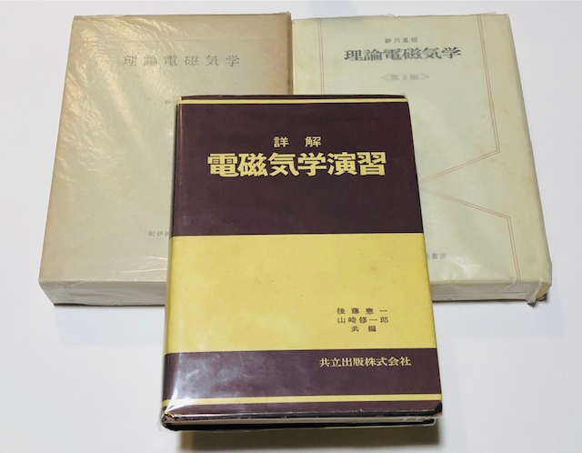
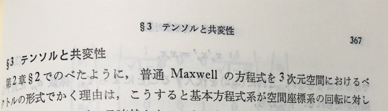
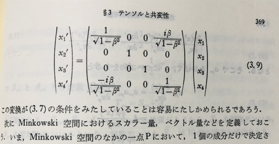
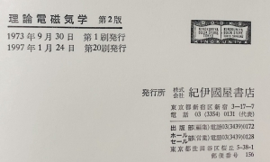

# 電磁気学 - オススメの参考書 (場の概念と相互作用)

電磁気学は理論物理学の様々な概念のテンプレートともいうべき理論で， この理論構造をよく噛み砕いて自分のものにできればできるほど， より高度な理論を理解したり構築する力を養う近道になっている．

## 電磁気学の難しさ

それ故か力学と比べて電磁気学は難しい．

### 数学的な側面

まず第一に使用する数学の道具がより高度になる． 勾配・回転・発散という操作に始まり， 単純な常微分方程式から多変数関数の偏微分方程式になったり， それら方程式の解析のために種々の特殊関数が必要になったり， グリーン関数や複素解析，ラプラス変換にテンソル解析と， 力学と比べて難易度が急上昇する．

### 実験的・工学的な側面

力学と違って目に見えないのも辛い．テスターやオシロスコープ・スペクトラムアナライザなどで見えるかもしれないが，力学と比較すると抽象度は高い．自前ではよほど頑張らないと実験できないというのも辛いところだ．シミュレータで我慢するしかない．何より水でたとえるにも限度がある．

電気電子工学を修める場合には，これらを背景に電気・電子・デジタルなどの回路理論や半導体工学・制御工学など，もうそれはそれは多岐に渡る様々な応用を習得しなければならない．

### 物理概念的な側面

また肝心なことだが，物理学それ自身「場」なる概念にも慣れ親しむ必要がある． 「力」というものがどうして伝わるのか，「空間」とはなんであるのか， Newton に始まる力学的世界観で手にした世界の認知が，より詳細化されていく様を追体験できるのだ．

歴史的に見ても電磁気学の成立は面白い． 電気と磁気の統一で光の理解に至るという美しい帰結，そこに至るまでの様々な人間ドラマ． またそこから始まるといってもいいような相対論と量子論の起こり． 工学的にも様々な産業の礎であり，情報産業への下地にも繋がった． (残念ながら日本は八木・宇田アンテナの件一つとってもそうだが，ろくな話を聞かない)

以下に紹介する電磁気学を扱った書籍以外にも良書はたくさんある． 時間があれば，追加していきたい． なお下記の座談会禄も面白いかもしれない．

- [電磁気学の教科書について (1974年6月8日)](https://www.jstage.jst.go.jp/article/butsuri1946/29/12/29_KJ00002741125/_article/-char/ja/)

## 後藤憲一

### 詳解電磁気学演習

[](https://www.amazon.co.jp/%E8%A9%B3%E8%A7%A3%E9%9B%BB%E7%A3%81%E6%B0%97%E5%AD%A6%E6%BC%94%E7%BF%92-%E5%BE%8C%E8%97%A4-%E6%86%B2%E4%B8%80/dp/4320030222?__mk_ja_JP=%E3%82%AB%E3%82%BF%E3%82%AB%E3%83%8A&crid=25G7PC8W6RSBA&keywords=%E8%A9%B3%E8%A7%A3%E6%BC%94%E7%BF%92+%E9%9B%BB%E7%A3%81%E6%B0%97%E5%AD%A6&qid=1659533606&sprefix=%E8%A9%B3%E8%A7%A3%E6%BC%94%E7%BF%92+%E9%9B%BB%E7%A3%81%E6%B0%97%E5%AD%A6%2Caps%2C383&sr=8-1&linkCode=li3&tag=alexandritefi-22&linkId=6947552ad6cec932270450cb243ef180&language=ja_JP&ref_=as_li_ss_il)

はい，まず第一にこれです．買ってください． 安定のゴトケンである．

力学でもだいぶお世話になったが，電磁気学でも同じくらいお世話になった．

[古典力学 – オススメの参考書 (上級者向けを意識して)](https://mathrelish.com/physics/recommended-books-in-classical-mechanics)

演習書に対して，いわゆる教科書は，何かしら指定されているか， もしくは講義担当者が自前で作成していることだろう． 第二のテキストを検討する前に，まずは辞書的な演習書だ． ・・・と考えると，この一冊一択となるのだ．

勿論，余裕があれば全部やってしまえば良いとは思うが，なにぶん，電磁気現象は日常生活とは縁遠いので，理解に親しんでいる講義の進行とともに出題される課題か何かをやるついでに取り組んだ方が良い．

理論物理で原理的側面に興味がある場合には本書の 10 章と 11 章のみでよいかもしれないが， 全体を通して計算テクニックがいろいろあり，後々，役立つものもある． そもそも理論物理に特化した演習書なんてない (？) ので，あるだけありがたいかな．

- [詳解電磁気学演習](https://amzn.to/3oSCgjm)

### 人と思想 115 ファラデーとマクスウェル

[](https://www.amazon.co.jp/%E3%83%95%E3%82%A1%E3%83%A9%E3%83%87%E3%83%BC%E3%81%A8%E3%83%9E%E3%82%AF%E3%82%B9%E3%82%A6%E3%82%A7%E3%83%AB-Century-Books%E2%80%95%E4%BA%BA%E3%81%A8%E6%80%9D%E6%83%B3-%E5%BE%8C%E8%97%A4-%E6%86%B2%E4%B8%80/dp/4389421158?__mk_ja_JP=%E3%82%AB%E3%82%BF%E3%82%AB%E3%83%8A&crid=2PMNMXKE6LB3X&keywords=%E3%83%95%E3%82%A1%E3%83%A9%E3%83%87%E3%83%BC%E3%81%A8%E3%83%9E%E3%82%AF%E3%82%B9%E3%82%A6%E3%82%A7%E3%83%AB&qid=1659536773&sprefix=%E3%83%95%E3%82%A1%E3%83%A9%E3%83%87%E3%83%BC%E3%81%A8%E3%83%9E%E3%82%AF%E3%82%B9%E3%82%A6%E3%82%A7%E3%83%AB%2Caps%2C158&sr=8-2&linkCode=li3&tag=alexandritefi-22&linkId=2f3aca0bb8aa63af6fecd76ad38cad94&language=ja_JP&ref_=as_li_ss_il)

後藤憲一繋がりで上記の[伝記](https://amzn.to/3P0YslQ)もオススメしたい．

- [人と思想 115 ファラデーとマクスウェル](https://amzn.to/3P0YslQ)

### プラズマ物理学

後藤憲一氏といえば，詳解演習．その圧倒的な物量で物理学・工学の基礎を支えてきた． と言っても過言ではない．

その氏がプラズマ物理学について単著で出していることはご存知だろうか． あまり知られていないのではないだろうか．

本書が出たのは 1967 年で，1970 年にハンス・アルヴェーンがプラズマ物理学でノーベル賞を受賞している． 第 5 章では彼の名を本書で確認することもできる．

[微The Nobel Prize in Physics 1970](https://www.nobelprize.org/prizes/physics/1970/summary/)

あまり知られていない理由の一つとしては， プラズマ物理学がかなり高度な物理学のため，ユーザが少ないことだろう． 電磁流体力学としての解析など，ハードルは高い．

この他にも詳解演習の実績からその中身を期待してしまうが， 講義調で詳解演習にあったような要点の整理だとかがなく， とっつきづらさがあるのも一つの理由だろう．

それというのもこれが素の後藤憲一であり， 暗に期待する部分は編集担当の力量ではないか，という指摘もある． つまり詳解演習チームの共立出版編集担当は凄すぎワロタなのか．

何だがネガティブに述べたが，本書が良書であることは間違いない (と思う)．

- [プラズマ物理学](https://amzn.to/3zH7Hlo)
- [裳華房 編集子の“私の本棚” 第36回　「詳解」シリーズで知られる著者の手になるテキスト](https://www.shokabo.co.jp/column/mylibrary201604.html)
- [書評：後藤憲一著 プラズマ物理学](https://www.jstage.jst.go.jp/article/oubutsu1932/37/2/37_2_199/_article/-char/ja)

## マクスウェル・場と粒子の舞踏―60小節の電磁気学素描

[](https://www.amazon.co.jp/%E3%83%9E%E3%82%AF%E3%82%B9%E3%82%A6%E3%82%A7%E3%83%AB%E3%83%BB%E5%A0%B4%E3%81%A8%E7%B2%92%E5%AD%90%E3%81%AE%E8%88%9E%E8%B8%8F%E2%80%9560%E5%B0%8F%E7%AF%80%E3%81%AE%E9%9B%BB%E7%A3%81%E6%B0%97%E5%AD%A6%E7%B4%A0%E6%8F%8F-%E5%90%89%E7%94%B0-%E6%AD%A6/dp/4320034007?keywords=%E3%83%9E%E3%82%AF%E3%82%B9%E3%82%A6%E3%82%A7%E3%83%AB+%E5%A0%B4%E3%81%A8%E7%B2%92%E5%AD%90%E3%81%AE%E8%88%9E%E8%B8%8F&qid=1659533595&sprefix=%E3%83%9E%E3%82%AF%E3%82%B9%E3%82%A6%E3%82%A7%E3%83%AB%E3%83%BB%2Caps%2C177&sr=8-1&linkCode=li3&tag=alexandritefi-22&linkId=1d6207f60ebe66dbaa9eb67898fb2747&language=ja_JP&ref_=as_li_ss_il)

[ケプラー・天空の旋律(メロディ)―60小節の力学素描](https://mathrelish.com/physics/recommended-books-in-classical-mechanics#toc_id_2_3)の続編で吉田武氏の熱意が，これでもかと書影含めて表れている． 効率重視でとにかく前に進みたい場合には，本書を強くオススメしたい．

後で余裕ができた場合に，いろいろと調べようとした際に必要となる用語や話題が，本書には太字で記載されているので，ただ流し読みしているだけでも，何を調べればよいか見当がつくのも利点の一つである．

なんと言っても，ストイックにも例外なく見開き２ページでまとめているので， 無駄なことを書くまいとする強い意思が伝わってくる一冊である．

- [マクスウェル・場と粒子の舞踏―60小節の電磁気学素描](https://amzn.to/3d2DMN7)

## 電磁気学―新しい視点にたって

| [](https://www.amazon.co.jp/%E9%9B%BB%E7%A3%81%E6%B0%97%E5%AD%A6%E2%80%95%E6%96%B0%E3%81%97%E3%81%84%E8%A6%96%E7%82%B9%E3%81%AB%E3%81%9F%E3%81%A3%E3%81%A6%E3%80%881%E3%80%89-V-D-%E3%83%90%E3%83%BC%E3%82%AC%E3%83%BC/dp/4563022020?__mk_ja_JP=%E3%82%AB%E3%82%BF%E3%82%AB%E3%83%8A&crid=3TO38AE9BSODV&keywords=%E6%96%B0%E3%81%97%E3%81%84%E8%A6%96%E7%82%B9+%E9%9B%BB%E7%A3%81%E6%B0%97%E5%AD%A6&qid=1659713276&s=books&sprefix=%E6%96%B0%E3%81%97%E3%81%84%E8%A6%96%E7%82%B9+%E9%9B%BB%E7%A3%81%E6%B0%97%E5%AD%A6%2Cstripbooks%2C151&sr=1-1&linkCode=li3&tag=alexandritefi-22&linkId=31439f5a03c38bc9c7f2a0894551e1eb&language=ja_JP&ref_=as_li_ss_il) | [](https://www.amazon.co.jp/%E9%9B%BB%E7%A3%81%E6%B0%97%E5%AD%A6%E2%80%95%E6%96%B0%E3%81%97%E3%81%84%E8%A6%96%E7%82%B9%E3%81%AB%E3%81%9F%E3%81%A3%E3%81%A6%E3%80%882%E3%80%89-V-D-%E3%83%90%E3%83%BC%E3%82%AC%E3%83%BC/dp/4563022039?__mk_ja_JP=%E3%82%AB%E3%82%BF%E3%82%AB%E3%83%8A&crid=3TO38AE9BSODV&keywords=%E6%96%B0%E3%81%97%E3%81%84%E8%A6%96%E7%82%B9+%E9%9B%BB%E7%A3%81%E6%B0%97%E5%AD%A6&qid=1659713276&s=books&sprefix=%E6%96%B0%E3%81%97%E3%81%84%E8%A6%96%E7%82%B9+%E9%9B%BB%E7%A3%81%E6%B0%97%E5%AD%A6%2Cstripbooks%2C151&sr=1-2&linkCode=li3&tag=alexandritefi-22&linkId=dc06970ad506262aec8d31310a1839d8&language=ja_JP&ref_=as_li_ss_il) |
| --- | --- |

『[力学―新しい視点にたって](https://amzn.to/38DIT46)』の姉妹本で， 本書の問題解答は下巻にある．

理論物理学的観点で電磁気学を延々と扱っていると， 実験的話題や数値計算といった事柄が縁遠くなっていく．

本書は中程度の難易度ではあるが，例示される題材は興味を誘うものばかりで飽きない． また数学的な面で見ても面白い例を挙げてくれる． 例えば塩化ナトリウムのイオン結晶のエネルギーを評価することで， 次の無限級数が表れることを教えてくれる．

$$ 1 - \frac{1}{2} + \frac{1}{3} - \frac{1}{4} + \cdots $$

これは $\ln 2$ に収束するが， こういった級数が好きな方にとってはそれだけで楽しいのではないだろうか．

- [電磁気学―新しい視点にたって〈1〉](https://amzn.to/3zZ5aVa)
- [電磁気学―新しい視点にたって〈2〉](https://amzn.to/3PWchmV)

## 砂川重信

### 初学者向け

砂川重信氏は理論電磁気学を筆頭に幅広い学習段階の読者層に向けて， いくつかの書籍を著している．

最も初学者向けなのが『[電磁気学の考え方](https://amzn.to/3Sn4oZr)』である． 学部一年の前期でゼミをもしするとしたら，本書を薦めたい．

- [電磁気学の考え方 (物理の考え方 2)](https://amzn.to/3Sn4oZr)

次が『[電磁気学―初めて学ぶ人のために](https://amzn.to/3dcoXaZ)』である． もしくは『[電磁気学の考え方](https://amzn.to/3Sn4oZr)』と併読してもよいだろう． また本書が他の砂川氏の著作物と被るところがあり，後でそれらを読むときに少しは楽になるかもしれない．

- [電磁気学―初めて学ぶ人のために](https://amzn.to/3dcoXaZ)

そしてやや難易度が上がるのが『電磁気学 (物理テキストシリーズ 4)』である． 『[理論電磁気学](https://amzn.to/3ORfm6x)』ほどではないが，限られた紙数で内容を深く扱おうとしている．

- [電磁気学 (物理テキストシリーズ 4)](https://amzn.to/3QgWGhm)

ところで『[理論電磁気学](https://amzn.to/3ORfm6x)』の練習問題には解答が付属していない． しかし，『[電磁気学 (物理テキストシリーズ 4)](https://amzn.to/3QgWGhm)』の[同演習書](https://amzn.to/3zZ56Vm)にはほぼ似たようなものがあるので，こちらを参考にしてみるというのも手である．

[](https://www.amazon.co.jp/%E9%9B%BB%E7%A3%81%E6%B0%97%E5%AD%A6%E6%BC%94%E7%BF%92-%E7%89%A9%E7%90%86%E3%83%86%E3%82%AD%E3%82%B9%E3%83%88%E3%82%B7%E3%83%AA%E3%83%BC%E3%82%BA-5-%E7%A0%82%E5%B7%9D-%E9%87%8D%E4%BF%A1/dp/4000077457?__mk_ja_JP=%E3%82%AB%E3%82%BF%E3%82%AB%E3%83%8A&crid=6BV0AJW4WERN&keywords=%E7%A0%82%E5%B7%9D%E9%87%8D%E4%BF%A1&qid=1659702452&sprefix=%E7%A0%82%E5%B7%9D%E9%87%8D%E4%BF%A1%2Caps%2C173&sr=8-5&linkCode=li3&tag=alexandritefi-22&linkId=1ce7aa387f6edbe948f18d2f6a221fb8&language=ja_JP&ref_=as_li_ss_il)

- [電磁気学演習 (物理テキストシリーズ 5)](https://amzn.to/3zZ56Vm)

### 理論電磁気学

日本が誇る電磁気学の名著中の一冊． この一冊の印象が強烈過ぎて，「理論電磁気学＝砂川重信」という等式が成立している方も少なくないかも．本書は砂川氏が家族のために命懸けで著されたという経緯もあり，その密度は今もなお色褪せない．

本書は初版・第 2 版・第 3 版と三種類ある． 違いは以下のとおりで，初版が最も充実している．

| § | 初版 | 第 2 版 | 第 3 版 |
| :-- | :-- | :-- | :-- |
| 6.5 磁気回路 | o | o | x |
| 10.6 応用例：磁気流体力学 | o | x | x |
| 11.5 電磁波の放射の反作用と共変性 | x | o | o |
| 12.3 変分原理と保存則 | o | x | x |

偶然かもしれないが，磁気流体力学 (MHD) は何かと不遇で，幻の『流体力学 後編(今井功)』の最終章も MHD であったとされている．

物理学者はしばしば厳密性を欠いた計算を平気で行うというが， では何を重視しているのかと言われると，一つには「式の形」を特に注視しているように個人的には思う．

「この係数はなぜ $4/3$ なのか」とか，「なぜどの成分も平等に表れないのか」などである． なるべく少数の仮定から式を作るということに心血を注ぐので，式の作り方に不定性を排除したいと思う中，少しの違いは決定的な違いとして見えるのだ．現象論的な式や近似式も「本質は何なのか」と式の形を探るのが主な目的で，一見，ラフに見える計算にも明確な意図が暗にあるように個人的には思う．

本書は原理的側面を基礎に置くスタイルのテキストで，Maxwell の方程式から始まるタイプのテキストである． また本書のタイトルが「理論」電磁気学ということからもわかるように，理論物理学的な観点が随所に見られる．

少なくとも初学者が手に取る本ではない．第 4 章の静電場などは，いわゆる Maxwell の方程式から「始まらない」タイプのテキストが最初に持ってくるような章だが，近似や特殊な例を扱わずに一般的にアプローチしている． このため「静電場の多重極展開」での Legendre の多項式の使用のように，全く難易度は異なる．しかしながら，そのアプローチは理論物理学では基本的なので，何も今回の電磁気学に限らず，似たような式が表れればどんどん流用していくことになる．上手く伝わるかわからないが，この点が「理論」物理 (の一つの側面) なのかなと私は思っている．

電磁気学の理論物理学的な側面は実に豊富にあるので，本書を通して，様々な考え方やテクニックを学べることと思う．そうでなくともハンドブックまたは辞書的な一冊としてもオススメである．理論物理というものに興味が湧き出した方が，どんな (いわば) 教科書的なテクニックがあるのか，参考にするとよいだろう．特に第 12 章の電磁場と変分原理の議論は計算が詳細に示されており，物資と場およびそれらの相互作用を Lagrangian のレベルで理解するのにうってつけだろう．なお初版にしかない「12.3 変分原理と保存則」では場の理論の初歩のところで扱う Noether の定理について記載されており「残しておいても良かったのでは」と思うところである．

- [理論電磁気学](https://amzn.to/3ORfm6x)
- [砂川重信さんを偲んで](https://www.jstage.jst.go.jp/article/butsuri1946/54/2/54_KJ00002752251/_pdf/-char/ja)

#### テルソンの怪

本書には致命的な誤植が入り込んでしまっている． 第 3 版を見てみよう．そう，「テルソン」である．

[embed]https://twitter.com/r_koganezawa/status/1514278136120475648[/embed]

一方で第 2 版を見てみよう．「テンソル」になっているのが確認できる．初版も同様である． つまり第 3 版で「テルソン」になった可能性が非常に高いのだ．

いつの日か，直される日が来るのだろうか．． (ちなみにポテンシァルは初版からポテンシァル．こういうのは時代を感じさせるだけで間違いではない)

## Jackson

|  |  | [](https://www.amazon.co.jp/%E3%82%B8%E3%83%A3%E3%82%AF%E3%82%BD%E3%83%B3%E9%9B%BB%E7%A3%81%E6%B0%97%E5%AD%A6%E3%80%88%E4%B8%8B%E3%80%89-%E7%89%A9%E7%90%86%E5%AD%A6%E5%8F%A2%E6%9B%B8-J-D-%E3%82%B8%E3%83%A3%E3%82%AF%E3%82%BD%E3%83%B3/dp/4842703083?pd_rd_w=TrBpy&content-id=amzn1.sym.918446e7-72f4-48c7-a672-af3b6ace2b19&pf_rd_p=918446e7-72f4-48c7-a672-af3b6ace2b19&pf_rd_r=JQ9G143YGSN4NJDKVWKA&pd_rd_wg=qqhAz&pd_rd_r=acae2335-a689-47a0-b79d-9dc04da130bf&pd_rd_i=4842703083&psc=1&linkCode=li3&tag=alexandritefi-22&linkId=ff4d1a8324f0e19f282a882ecf6cc490&language=ja_JP&ref_=as_li_ss_il) |
| --- | --- | --- |

「電磁気学の良いテキストはなんですか？」と教授に聞いたところ， 「[これ](https://amzn.to/3SoLphb)かな」と手渡されたのが本書であった．

パラパラ～とめくるとデルタ関数がクーロンの法則の次にいきなり表れて， そのまま当たり前のようにグリーン関数で方程式を解いているではないか (それはそう)． でまぁ，次に境界条件を設定して，解析をしていく．

それまで理解を整理してパッケージにするというか，なんというか， なんとか頑張って頭に入れていたものが， その苦労もどこ吹く風で，テキストは目の前でサーッと流れていくのだ．

で，なんとなくわかるという高揚感と， 自分の苦労と比較して難なく進めていることに落胆するやらで， 複雑な気持ちになったものだった．

本書は MHD についても章を割いて，しっかり言及している． このような網羅性は洋書であるとか，Wikipedia[en] もそうだが， 日本と違って手を抜いていない．執念みたいなものが欧米勢にはある気がする．

しかも版を重ねるごとにどんどん分厚くなっていく． これは難しいからとか，関連が薄いからとか，その手の考えではなく， より完全を期した，というスタンスをどうしても感じてしまう．

冒頭で落胆した気持ちを持っていたものの， そのままめくると，Feynman 図が出てくる． 「え？」となるわけである．

紙数がどうのこうの，読者層のレベルを考えてどうのこうの， そんなことは全く眼中にはなく，ガンガン前に進んでいくのだ．

教授から薦めてもらったが，結局，私は少ししか読むことができなかった． 今ならもうちょっとは読むことができるだろう．きっと．

- [Classical Electrodynamics](https://amzn.to/3SoLphb)
- [ジャクソン電磁気学〈上〉(物理学叢書 90)](https://amzn.to/3zZtSox)
- [ジャクソン電磁気学〈下〉(物理学叢書)](https://amzn.to/3JyQ3Vx)

## 太田浩一

### 電磁気学の基礎 I & II

|  |  |
| --- | --- |

本書は教科書というよりは豪華な副読本だろう． 初心者・中級者がこの本に取り組むのは無茶というもの． 超特急で電磁気学の理論的発展の解説を，物理学史を詰め込みながら書かれている．

随所で物理屋らしい計算を行っており，ふんふん，と気にせず進まないと轟沈する． また私自身，科学史の専門家でもなんでもないので，書かれていることを見ても， 出典となる文献が示されていない記述に関しては，とりあえず信じるしかない．

そういうところは不安ではあるものの， 「へぇ，この時代で既にそこまで別働隊は進んでいたのかぁ」 と，歴史が繋がっていく感覚は読んでいて楽しい． というより，そういう前知識がないとこの楽しみ方ができないので， 本書はいわば「周回プレイ」のような本と私は思っている．

有名所を除いて，いまいち誰が何をやったのか，その時代を生きていないとわからないことがある． 例えば砂川重信氏はどんな業績を上げたのか，とか，いわゆる重鎮たちの場合でも，恥ずかしながら回答に窮することもあるのではないだろうか．今でこそ [SPIRES](https://inspirehep.net/) や [arXiv](https://arxiv.org/) といったシステムに頼ることができるが，それ以前となるとなかなかきつい．

なお本書は物理的に精査が必要な議論の部分も紙面の都合か， 割とざっくりと記述されているところもあり，「大丈夫かなぁ？」と疑問に思うところはある． ただ一方で計算技法的な面は紙面を割いて書かれているように見えるので， 参考になるところは多いのではないかと思う．

電磁気学の基礎について，改めて周回プレイしてみてはいかがだろうか．

- [電磁気学の基礎 I](https://amzn.to/3zUvboJ)
- [電磁気学の基礎 II](https://amzn.to/3vC0KB7)

### マクスウェル理論の基礎―相対論と電磁気学

[](https://www.amazon.co.jp/%E3%83%9E%E3%82%AF%E3%82%B9%E3%82%A6%E3%82%A7%E3%83%AB%E7%90%86%E8%AB%96%E3%81%AE%E5%9F%BA%E7%A4%8E%E2%80%95%E7%9B%B8%E5%AF%BE%E8%AB%96%E3%81%A8%E9%9B%BB%E7%A3%81%E6%B0%97%E5%AD%A6-%E5%A4%AA%E7%94%B0-%E6%B5%A9%E4%B8%80/dp/4130626043?__mk_ja_JP=%E3%82%AB%E3%82%BF%E3%82%AB%E3%83%8A&crid=2NO6LA5S72K5C&keywords=%E5%A4%AA%E7%94%B0+%E9%9B%BB%E7%A3%81%E6%B0%97&qid=1659537063&sprefix=%E5%A4%AA%E7%94%B0+%E9%9B%BB%E7%A3%81%E6%B0%97%2Caps%2C192&sr=8-4&linkCode=li3&tag=alexandritefi-22&linkId=55456c62c00cabb2a1f6661f748da189&language=ja_JP&ref_=as_li_ss_il)

> 本書を書くに際して「原論文を見ない限り書かない」ことに徹した．

という宣言が本書の「はじめに」の中にある． こうしてできた本書の巻末には 499 の参考文献が挙げられており， 著者の真摯な仕事ぶりが窺える．

一番古い文献は 1687 年で Newton のプリンキピアである． そこから少し時が過ぎて，d'Alembert や Lagrange らの 1700 年代後半の文献が引用されている． ちなみにラ・フランスではないが，文献リストではラグランジュも de la Grande とか，ルジャンドルも le Gendre となっており，カタカナ表記に慣れているとハッとさせられる．

本書は一貫してベクトル解析で書かれているので， 電磁気学に限った高度なベクトル解析のテキストとして見れなくもない．

さて電磁気学は理論物理学のテンプレート的側面があると本記事の冒頭で述べたが， その一例として DBI 作用を挙げることができる．

$$ S_{\mathrm{DBI}} := -T_p \int d^{p+1}\sigma \sqrt{-\det(G_{\alpha\beta} + B_{\alpha\beta} + 2\pi\alpha^{\prime}qF_{\alpha\beta})} $$

この作用は弦理論に於ける D-brane 上のゲージ場に関する作用なのだが， 詳細はさておき，初めて自分がこの作用を目にしたときは， 弦理論のことしか頭になかったので，world-volume の基本的な作用を拡張したくらいの認識だったが， [Born](https://en.wikipedia.org/wiki/Max_Born) と [Inferd](https://en.wikipedia.org/wiki/Leopold_Infeld) という古参の名前がついているのが気になり， いろいろ調べるのだが，まず普通の電磁気のテキストにはない． それらテキストではすべてが線形化されており，誰一人として非線形性を疑ったことがないかのような流れ，いや，疑問にすら思わないような，違うかな，そこつっこむ？みたいな暗黙の了解があるわけで，書かれていないのだ．

しかし [Jackson](https://amzn.to/3BGWeFp) や[一部のテキスト](https://amzn.to/3oWle3U)には辛うじて言及がある．なるほどなるほど，理論物理っぽくなってきた．とかなんとか私は一人盛り上がるのだ．当時はもっと身近に同志がいるので，次の日にでも話ができるのだが，今は難しい．それはそれとして，本書をあたってみると「6.7 ボルン-インフェルトの非線形理論」という節があるではないか．他の本では事の顛末か註釈程度だったが，本書では式を明示して，議論してくれている．

ありがたい！

正に「原論文を見ない限り書かない」というスタンスが貫かれているわけだ．

私はそれから米谷さんの講義の中で Dirac が晩年，弦理論と思しきものに到達していたのではないだろうかということを聞いて，妙に興奮したものだった．

勿論，Dirac string のことではない．ただ彼の最晩年には高次元の場の理論の試みは知られており，Dirac が否定的に Ramond と議論したと伝え聞く．この辺りの事情がどうなっているのか，私が不勉強なだけだが，だからこそ個人的な欲求としては，1970 年代にほぼ完成した標準模型の流れにない別働隊の歴史を更に知りたいと思っている．はい，余談でした．

さて，[この興味深い一冊](https://amzn.to/3d39mKq)は絶版になっており，高騰してしまっている． やはり大学出版系は絶版が早い．

しかしどうやらオンデマンド版があるらしく， ひょっとしたら定価で入手できるかもしれない． こちらを検討してみてもよいだろう．

- [マクスウェル理論の基礎―相対論と電磁気学](https://amzn.to/3d39mKq)
- [オンデマンド版](https://www.ajup-net.com/bd/isbn978-4-13-009105-3.html)
- [量子の海、ディラックの深淵――天才物理学者の華々しき業績と寡黙なる生涯](https://amzn.to/3BH9Y2E)
- [The Strangest Man](https://www.math.columbia.edu/~woit/wordpress/?p=1904)
- [ボルン-インフェルトの非線形理論について](http://www.tegakinet.jp/index.files/20180519b.pdf)
- [相対性理論講義 入門から弦の相対論的古典力学まで](https://amzn.to/3IYyEr0)

### マクスウェルの渦・アインシュタインの時計―現代物理学の源流

これはこれは行き着くところまで来たか．というのが第一印象 (好印象)． カラーの第一章を読んでいて，そう思ったものだ． 第二章以降はこれまでの氏の著作物と被る内容はあるけれども，もうどうでもよくなってくる．

本書は Maxwell で一応の完成を見た電磁気学が，相対論を内蔵しており，それが Einstein の思索そしてゲージ場の理論へとどう繋がっていくか，そういうことが歴史的変遷を重厚に追っている．ローレンツの電子論やポアンカレの相対論など，話ではかすかに聞いたが，どんなものかは知らないというような話題について言及している． ところで過去の著名な物理学者らのテキストや論文集の翻訳本はあるにはあるが，入手難易度は高い． 本書も広い意味ではその範疇に入る．そういう意味でも貴重な一冊になっている．

- [マクスウェルの渦・アインシュタインの時計―現代物理学の源流](https://amzn.to/3zRzC3A)

## 高橋康

### 量子電磁力学を学ぶための電磁気学入門 (ＫＳ物理専門書)

[](https://www.amazon.co.jp/%E9%87%8F%E5%AD%90%E9%9B%BB%E7%A3%81%E5%8A%9B%E5%AD%A6%E3%82%92%E5%AD%A6%E3%81%B6%E3%81%9F%E3%82%81%E3%81%AE%E9%9B%BB%E7%A3%81%E6%B0%97%E5%AD%A6%E5%85%A5%E9%96%80-%EF%BC%AB%EF%BC%B3%E7%89%A9%E7%90%86%E5%B0%82%E9%96%80%E6%9B%B8-%E9%AB%98%E6%A9%8B%E5%BA%B7-ebook/dp/B09ZB7JC1V?keywords=%E9%87%8F%E5%AD%90%E9%9B%BB%E7%A3%81%E5%8A%9B%E5%AD%A6%E3%82%92%E5%AD%A6%E3%81%B6%E3%81%9F%E3%82%81%E3%81%AE%E9%9B%BB%E7%A3%81%E6%B0%97%E5%AD%A6%E5%85%A5%E9%96%80&qid=1659533615&sprefix=%E9%87%8F%E5%AD%90%E9%9B%BB%E7%A3%81%E5%8A%9B%E5%AD%A6%2Caps%2C176&sr=8-1&linkCode=li3&tag=alexandritefi-22&linkId=6aaecfa573151569f21ac77706447bac&language=ja_JP&ref_=as_li_ss_il)

場の量子論を学ばれた方でも，そうでなくとも高橋康氏をご存じの方はおそらくたくさんおられると思うが，2000 年代後半を境に氏の著作物が徐々に姿を消していって久しかったが，約 15 年ぶりに過去のいくつかの名著が復刊することとなった．本書はその一冊である．どちらかと言えば，プレミアがついていた方ではないだろうか． 氏の著作物の大部分が講談社から出版されており，この一連の復刊企画には感謝感謝である．

量子電磁力学 (QED) とはゲージ場の量子論の雛形であり，場の量子論の優等生だ． 本書はその理論を学ぶために古典論としての電磁気学をどう捉えればよいのかを案内してくれる一冊になっている．

より高度な理論を知って，再び戻ってくると，何が本質だったのかと疑問に思う日がやってくる． もういちいち数学の道具的側面で視界を遮られることもなくなり， 改めて見通すと何が見えてくるのか気になって仕方なくなるといえばいいだろうか．

本書では各節が「一通りの理解」と「省察(本書では蛇足)」をワンセットで概ね構成されている． 「一通りの理解」の部分は QED を念頭に理論物理学的な視点でまとめられている． このことは本書のタイトルにも正になっているが， 古典電磁気学をそのように言及した和書はかなり珍しい．

本書の隠れたもう一つのテーマは (量子論ゆえ) 観測なのではないかなと読んでいて思うが， 時間とエネルギーの不確定性関係という誤謬のように古い部分もある．

高橋先生が自問自答するように，我々も一つ一つあれは何だったのか， あのときの疑問はそういえば，とかなんとか， 振り返るきっかけを本書は与えてくれているように思う．

- [量子電磁力学を学ぶための電磁気学入門 (ＫＳ物理専門書)](https://amzn.to/3BBFBL6)

### 物理数学ノート 新装合本版 (KS物理専門書)

『[量子電磁力学を学ぶための電磁気学入門](https://amzn.to/3BBFBL6)』を読んでいるとわかることだが， たびたび「ここは物理数学ノートを見てね」という趣旨のコメントが散見されるのである．

さてこの物理数学ノートであるが，これも長らく絶版になっていた． かくいう私も記憶がだいぶ曖昧になっていて，お世話になった記憶はあるものの， 似たような[粗削りの本](https://amzn.to/3OTfBxL)もあり，これとごっちゃになっていた． 当時の書影がどれも色違いなだけで (ホイミスライムと[しびれくらげ](https://dic.pixiv.net/a/%E3%81%97%E3%81%B3%E3%82%8C%E3%81%8F%E3%82%89%E3%81%92)のようなもの)， 「あれ？これじゃないんだけどなぁ，どこいった？」 と，よく研究室で右往左往していた． (物理数学ノートはいつもだ誰かが借りていて，なかなかありつけなかった．私も「ある種の切れない学生」の一人だった．)

しかし新装復刊した『[物理数学ノート](https://amzn.to/3cSAI5Y)』は違う． 専用の書影であり，色違いではない． しかも当時は物理数学ノートは二巻本だったのだが， 驚くべきことに新装復刊版は合本なのだ！ (すご・・)

基本，分冊する方針が採用されるのが和書なので，合本というのが，信じられない． 一読者としては大変ありがたいことこの上ないが，出版社の企業努力は相当だろう． 本書は (はしがきを信じるならば) そもそも一つの原稿があったわけではなく， 最初の『物理数学ノート』が好評だったため (?)，『物理数学ノートII』ができたのだ． (『物理数学ノートI』ではないのだ！) そう，ドラゴンクエストがヒットしたから，ドラゴンクエストIIが企画されたようなものだ． それ故に，いわば『[物理数学ノート](https://amzn.to/3cSAI5Y)』は「[ドラゴンクエストI・II](https://ja.wikipedia.org/wiki/%E3%83%89%E3%83%A9%E3%82%B4%E3%83%B3%E3%82%AF%E3%82%A8%E3%82%B9%E3%83%88I%E3%83%BBII)」なのだ．

肝心の中身だが，理論物理に特化した物理数学になっている．つまり類書がない (?)． そういうと一部の読者向けというイメージを抱かれるかもしれないが， 扱っている題材は電磁気学と量子力学が中心であること， そして回転および角運動量に関する議論が豊富であることが特徴的で， 類書が乏しいことも手伝って，ストライクゾーンは広いのでは，と思っている． 何より，学生の質問がベースになっているので， 理解に穴があきがちなところを重点的にフォローしているはず． 必携の書だ．オススメしたい．

- [物理数学ノート 新装合本版 (KS物理専門書)](https://amzn.to/3cSAI5Y)
- [S先生の電磁気学](https://amzn.to/3ORfm6x)
- [T先生の電磁気学](https://amzn.to/3A4OFXy)
- [マンガドラゴンクエストへの道 (ドラクエコミックス)](https://amzn.to/3vKAdS6)

* * *

## 関連書籍

電磁気学は力学以上に物理数学と関連する． 広範な物理数学の習得を意識した書籍は以下で紹介している．

[物理数学 – オススメの参考書](https://mathrelish.com/physics/recommended-books-in-physical-mathematics)

* * *

最後に宣伝で恐縮でありますが， Math Relish 物販部もご利用いただけたらと思います．

[Math Relish 物販部](https://mathrelish.booth.pm/)
