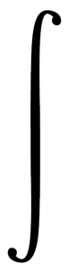
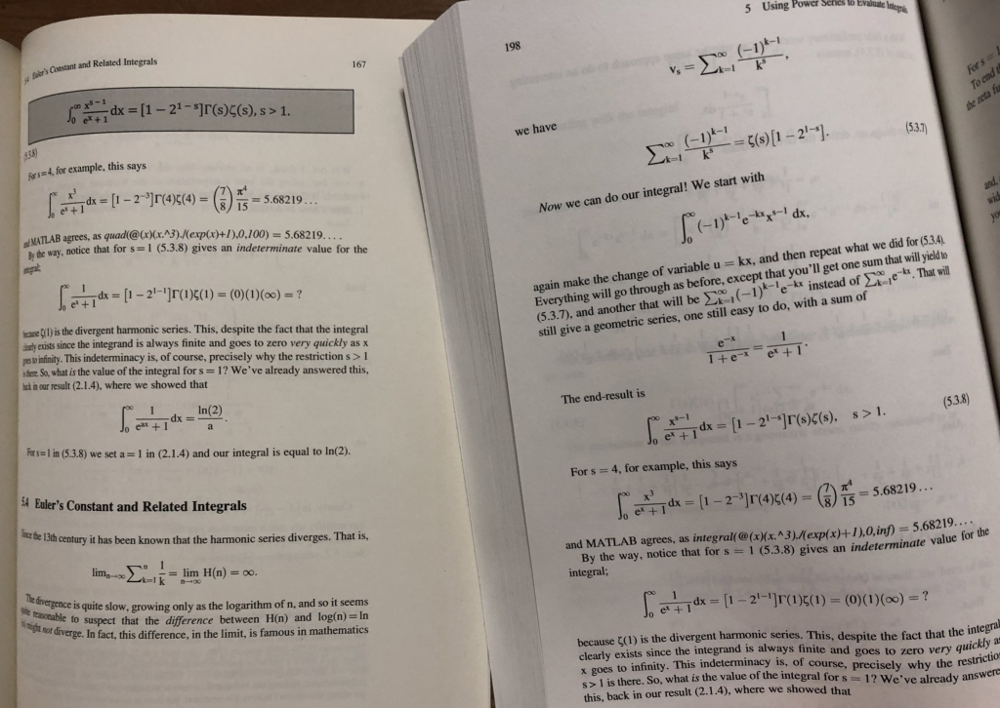

# 積分計算 - オススメの参考書・問題集

積分計算は面白い．いろいろな創意工夫ができるからだ． 単に面白いだけでなく，微分方程式として記述されたシステムの挙動を解析するのに必須であったりする． 微分と積分の両輪が非常に重要ではあるが，ここではどちらかといえば積分に重きを置いた文献を紹介したい．

## Inside Interesting Integrals (Undergraduate Lecture Notes in Physics)

[](https://www.amazon.co.jp/gp/product/3030437876/ref=as_li_tl?ie=UTF8&camp=247&creative=1211&creativeASIN=3030437876&linkCode=as2&tag=alexandritefi-22&linkId=d6871b3394c03708ac0e209c55c5112e)

不定積分できなくても定積分できる場合が多く，また積分を応用する場合には定積分の計算になることが普通である．そこでいろいろなテクニックを編み出していくことになるのだが，そういった諸々や歴史的な小話を一冊の本にまとめたのが本書である．より高度な計算を行う際にはもっと多くのテクニックを知る必要があるが，本書でまとめられている範囲だけでも，まずは知っておいて損はないだろう．しばしば高度なテクニックの基礎になるからである．

- [Inside Interesting Integrals (Undergraduate Lecture Notes in Physics)](https://amzn.to/3hLlBv1)

個人的な感想だが本書は三章から面白くなっていく．それまでの章の内容はなんとなく復習っぽい感じがして，もう一味欲しいかな，という印象を受けた．これら一章・二章の内容は以下に要約しておいたので参考になれば幸いである．

### 第一章 Introduction

- [定積分 No.1](https://mathrelish.com/calculation/definite-integral-1): 偶関数・奇関数
- [定積分 No.2](https://mathrelish.com/calculation/definite-integral-2): 積分領域の分割
- [定積分 No.3](https://mathrelish.com/calculation/definite-integral-3): Giulio の方法
- [定積分 No.4](https://mathrelish.com/calculation/definite-integral-4): コーシーの主値積分
- [定積分 No.5](https://mathrelish.com/calculation/definite-integral-5): 部分分数分解，Dalzell 積分，円周率
- [定積分 No.6](https://mathrelish.com/calculation/definite-integral-6): 小数部分，スターリングの漸近公式

### 第二章 'Easy' Integrals

- [定積分 No.7](https://mathrelish.com/calculation/definite-integral-7): 置換積分
- [定積分 No.8](https://mathrelish.com/calculation/definite-integral-8): 部分積分
- [定積分 No.9](https://mathrelish.com/calculation/definite-integral-9): [定積分 No.2](https://mathrelish.com/calculation/definite-integral-2) の拡張
- [定積分 No.10](https://mathrelish.com/calculation/definite-integral-10): 指数置換
- [定積分 No.11](https://mathrelish.com/calculation/definite-integral-11): 対数微分
- [定積分 No.12](https://mathrelish.com/calculation/definite-integral-12): 指数置換，双曲線関数
- [定積分 No.13](https://mathrelish.com/calculation/definite-integral-13): フリッピング (King’s Property)
- [定積分 No.14](https://mathrelish.com/calculation/definite-integral-14): フリッピング，一次式の消去
- [定積分 No.15](https://mathrelish.com/calculation/definite-integral-15): フリッピング，Weierstrass 置換 (半角正接置換)
- [定積分 No.16](https://mathrelish.com/calculation/definite-integral-16): フリッピング，Serre の積分
- [定積分 No.17](https://mathrelish.com/calculation/definite-integral-17): 部分分数分解，留数計算の片鱗
- [定積分 No.18](https://mathrelish.com/calculation/definite-integral-18): フリッピング，偶関数・奇関数，置換積分
- [定積分 No.19](https://mathrelish.com/calculation/definite-integral-19): 積分漸化式
- [定積分 No.20](https://mathrelish.com/calculation/definite-integral-20): Gauss 積分，Hermite 多項式の直交性
- [定積分 No.21](https://mathrelish.com/calculation/definite-integral-21): Euler の対数正弦積分
- [定積分 No.22](https://mathrelish.com/calculation/definite-integral-22): Euler の対数正弦積分の応用，$\mathrm{sinc}$ 関数
- [定積分 No.23](https://mathrelish.com/calculation/definite-integral-23): Euler の対数正弦積分の応用，多項式の処理
- [定積分 No.24](https://mathrelish.com/calculation/definite-integral-24): Catalan 定数
- [定積分 No.25](https://mathrelish.com/calculation/definite-integral-25): [定積分 No.24](https://mathrelish.com/calculation/definite-integral-24) からの類似
- [定積分 No.26](https://mathrelish.com/calculation/definite-integral-26): 基本に忠実に！

### 初版と第二版の顕著な違い

第二版は初版の約二倍の分量となっており充実している．


一方で第二版 (下写真右) は初版 (下写真左) と違って影の囲みが **ない**．



### 参考

| [](https://www.amazon.co.jp/gp/product/0353079235/ref=as_li_tl?ie=UTF8&camp=247&creative=1211&creativeASIN=0353079235&linkCode=as2&tag=alexandritefi-22&linkId=dab4700877b8f7d4dade4fde72a7dd85) | [](https://www.amazon.co.jp/gp/product/9354210783/ref=as_li_tl?ie=UTF8&camp=247&creative=1211&creativeASIN=9354210783&linkCode=as2&tag=alexandritefi-22&linkId=b760ab7c04655f26dcf7105c0c324f4d) |
| --- | --- |

本書の底本と思しき本が以下である．

- [A Treatise On The Integral Calculus; With Applications, Examples And Problems; Volume 1](https://amzn.to/3lksnIX)
- [A Treatise On The Integral Calculus; With Applications, Examples And Problems; Volume 2](https://amzn.to/3kd3rE5)

出版年月日が 1921-22 とかなりの年代物で相当な量である． 2021 年現在で言えば百年前である． 現代でも通用することを考えると，やっぱり数学は凄いなと思うものです． 古いこともあり以下のアーカイブからも閲覧できるので参考にされたし！

- [A treatise on the integral calculus; with applications, examples and problems (Volume 1)](https://archive.org/details/treatiseonintegr01edwauoft/)
- [A treatise on the integral calculus; with applications, examples and problems (Volume 2)](https://archive.org/details/treatiseonintegr02edwauoft/)

## Irresistible Integrals: Symbolics, Analysis And Experiments In The Evaluation Of Integrals

[](https://www.amazon.co.jp/gp/product/0521796369/ref=as_li_tl?ie=UTF8&camp=247&creative=1211&creativeASIN=0521796369&linkCode=as2&tag=alexandritefi-22&linkId=00b540d5f3bce3cffa0d157d46338a15)

[定積分 No.6](https://mathrelish.com/calculation/definite-integral-6) の参考文献でも紹介した本であるが，[Inside Interesting Integrals (Undergraduate Lecture Notes in Physics)](https://amzn.to/3hLlBv1) (以下 III) は MATLAB を推奨しているのに対して，本書は Mathematica を推奨している．

本書は [III](https://amzn.to/3hLlBv1) の前書きにもあるように，式の導出がかなりスキップされている．そういうわけでこの一冊を仕上げれば力はつくと思うが，時間のない方には辛いところ．そういうこともあってか，[III](https://amzn.to/3hLlBv1) では導出を完全にフォローしていることを利点に挙げている．

一方の本書は導出があまり無いが故に，問題例が [III](https://amzn.to/3hLlBv1) よりもやや豊富で，参考文献リストもちゃんとついている．そういう利点もある．飽き足らなくなったら手を出すとよいだろう．なにせタイトルが「魅力的な積分」なのだから．

内容としては間違いなく本書までで，学部で相手にする定積分はほとんど解きほぐせることと思う．

- [Irresistible Integrals: Symbolics, Analysis And Experiments In The Evaluation Of Integrals](https://amzn.to/2X7qabn)

## (Almost) Impossible Integrals, Sums, and Series (Problem Books in Mathematics)

### 情熱を形に！

[](https://www.amazon.co.jp/gp/product/B07YM2W66F/ref=as_li_tl?ie=UTF8&camp=247&creative=1211&creativeASIN=B07YM2W66F&linkCode=as2&tag=alexandritefi-22&linkId=4dd6f2fd6d21de8cf870847580333e39)

本書は「定積分」と「総和・級数」の二つについて，それぞれ 60 題，合わせて 120 題を厳選した問題集である． まず問題文が羅列されており，次にヒントが羅列されており，そして最後に導出付きの答えが羅列されている．

はっきり言って，マニア向けである． ここでテンションが上がって読みたいと思ったら，ぜひ手にとって間違いない一冊である． (物足りない方もおられるとは思いますが・・)

多重対数関数の演習書としても希少価値が高いので，それで入手しても間違いないだろう．

前書きにもあるように著者はプロの数学者ではないそうだが，代わりに燃えたぎる情熱と粘り強い努力で本書を完成させたとあり，気迫が感じられる一冊に仕上がっている．

- [(Almost) Impossible Integrals, Sums, and Series (Problem Books in Mathematics)](https://amzn.to/3z4gaNd)
- [著者の YouTube チャンネル](https://www.youtube.com/channel/UCSs84OREtf1QCpfS7jGHIZw)

### Problem Books in Mathematics シリーズ

[](https://www.amazon.co.jp/gp/product/B00D3I3TK4/ref=as_li_tl?ie=UTF8&camp=247&creative=1211&creativeASIN=B00D3I3TK4&linkCode=as2&tag=alexandritefi-22&linkId=97642ea69a29f83e6c082ad529a123a8)

ちなみに本書は問題集シリーズ ([Problem Books in Mathematics](https://link.springer.com/bookseries/714)) の一冊であり，他の本も面白いものが多い． 例えば [Limits, Series, and Fractional Part Integrals: Problems in Mathematical Analysis](https://amzn.to/2XjArBy) とか．

- [Problem Books in Mathematics](https://link.springer.com/bookseries/714)
- [Limits, Series, and Fractional Part Integrals: Problems in Mathematical Analysis (Problem Books in Mathematics)](https://amzn.to/2XjArBy)

## A Garden of Integrals (Dolciani Mathematical Expositions)

[](https://www.amazon.co.jp/gp/product/088385337X/ref=as_li_tl?ie=UTF8&camp=247&creative=1211&creativeASIN=088385337X&linkCode=as2&tag=alexandritefi-22&linkId=720d352391359b607170d911b464baaa)

積分と一口に言っても，見かけ上は同じ記号でも，意味するところは異なるものが多数ある． 本書はそれら積分として以下のものについてちゃんと記号を分けて，個別に解説している稀有な一冊である．

- Cauchy 積分
- Riemann 積分
- Riemann--Stieltjes 積分
- Lebesgue 積分
- Lebesgue--Stieltjes 積分
- Henstock--Kurzweil 積分
- Wiener 積分
- Feynman 積分

しばしば物理などで Lebesgue 積分が Riemann 積分の対比のような形で紹介されて，Fourier 解析での「なんか怪しげな議論」が正当化されて，めでたしめでたし，という話がなされる．

そこで恰も終わったような感じがするのだが，Henstock--Kurzweil 積分というものがあり，この積分を知る上でも本書は入門書として適しているのではないかと思うところである．入門書といっても要求される基礎知識が高いので，上記の何れかの積分を履修中で脂が乗っているときに読むのがベストだろう．

Henstock--Kurzweil 積分自体のテキストとしては次を挙げよう．オススメだ． 翻訳本も 2022/1/31 に出版される．物凄く良い時代だ．

| [](https://www.amazon.co.jp/gp/product/3319953206/ref=as_li_tl?ie=UTF8&camp=247&creative=1211&creativeASIN=3319953206&linkCode=as2&tag=alexandritefi-22&linkId=29ec114506fdd2ff504213209b750b7b) | [](https://www.amazon.co.jp/gp/product/4621306987/ref=as_li_tl?ie=UTF8&camp=247&creative=1211&creativeASIN=4621306987&linkCode=as2&tag=alexandritefi-22&linkId=10d79864ba392b779f6850430f871529) |
| --- | --- |

最後の Wiener 積分と Feynman 積分については，それまでの話と平行線上にあるような話なので，それらはある意味，附録として見てもいいんではないかなと思う．

- [A Garden of Integrals (Dolciani Mathematical Expositions)](https://amzn.to/39423gA)
- [arXiv:0802.0895 | Review of "Garden of integrals"](https://arxiv.org/abs/0802.0895)
- [フーリエ解析の講義でルベーグ積分はどうするか](https://researchmap.jp/blogs/blog_entries/view/81393/49fd54090fd21b93570565adcf7e46fe?frame_id=406408)
- [ルベーグ積分, フーリエ級数, ラプラス変換](https://www.jstage.jst.go.jp/article/sicejl1962/7/10/7_10_712/_article/-char/ja/)
- [The Kurzweil-Henstock Integral for Undergraduates: A Promenade Along the Marvelous Theory of Integration (Compact Textbooks in Mathematics)](https://amzn.to/3KgwG3v)
- [クルツワイル-ヘンストック積分入門: 積分論へのやさしい統一的アプローチ](https://amzn.to/3qtDqTY)

## 微積分名作ギャラリー - ニュートンからルベーグまで

[](https://www.amazon.co.jp/gp/product/4535784485/ref=as_li_tl?ie=UTF8&camp=247&creative=1211&creativeASIN=4535784485&linkCode=as2&tag=alexandritefi-22&linkId=7519c6ebbe4dd1f94d7e21284ad3590f)

本書は [Garden of Integrals](https://amzn.to/39423gA) が積分の定式化に焦点を当てて類別したのと対照的に人物に焦点を当てて類別した一冊である．

我々は既に出来上がったものを学ぶことが多い． 現代の知識から当時を振り返っても，完成度の低い議論を強いられることや，紆余曲折を経ているところも多分にあって時間がかかるからである．

しかしそれらがある日突然できるわけでもなく，その紆余曲折を知りたくなるものである． つまりは当時の人々が何に問題意識を持っていたか，その葛藤を知りたくなるものである．

微積分の探求は関数の探求でもあり，次第に当初想定していたよりも病的な関数がどんどん表れてくる． これら関数の基礎付けを当時の第一線がどのように対峙していったのか，本書は通俗的な解説にとどまらず数学的な議論をなるべく平易に解説している．

実に自然な翻訳で読むこともでき，その意味でもオススメの一冊である．

- [微積分名作ギャラリー - ニュートンからルベーグまで](微積分名作ギャラリー―ニュートンからルベーグまで)

## 明解演習微分積分 (明解演習シリーズ)

[](https://www.amazon.co.jp/%E6%98%8E%E8%A7%A3%E6%BC%94%E7%BF%92%E5%BE%AE%E5%88%86%E7%A9%8D%E5%88%86-%E6%98%8E%E8%A7%A3%E6%BC%94%E7%BF%92%E3%82%B7%E3%83%AA%E3%83%BC%E3%82%BA-%E5%B0%8F%E5%AF%BA-%E5%B9%B3%E6%B2%BB/dp/4320013328?keywords=%E6%98%8E%E8%A7%A3%E6%BC%94%E7%BF%92+%E5%BE%AE%E5%88%86%E7%A9%8D%E5%88%86&qid=1658977834&sprefix=%E6%98%8E%E8%A7%A3%E6%BC%94%E7%BF%92%2Caps%2C181&sr=8-1&linkCode=li3&tag=alexandritefi-22&linkId=335a26b6653d4e42d2e99503af59ce1d&language=ja_JP&ref_=as_li_ss_il)

本書は共立出版の小寺平治氏による明解演習シリーズの一つで， (2020 年代でいうところの) この本とよく似たコンセプトである 大学数学チャート式よりもずっと以前 (30～40年弱前？) からあった本である．

表紙絵に古臭さを感じるかもしれないが， 本書が出た 1980 年代と言えば， まだ時代劇がお茶の間で主戦力を誇っていた時代である． あの頃はそういうものがもっと身近だった． それに挿絵がまだ少子化ではない時代をなんとなく感じさせてくれる． ああ，脱線してしまった．どうでもいい話を続けそうなので，この話はここで止めよう．

本書は高校数学を学ぶ際に，受験参考書でひたすら問題演習を行い， 実例に慣れ親しんで理解を深めるという，サイクルを回した方にとっては， とてもありがたい一冊だと思う 背伸びしたい中高校生が読んでも，違和感はないと思う．

分量が重すぎず，重要どころは一通り触れており， 扱っている問題はその後に学ぶであろう， 物理や各種工学などで出くわす具体的な解析計算を意識している．

いつの間にか，存在性や収束性の議論を忘れて， ただひたすらに機械的に計算してしまいがちだが， そんなときには本書に立ち返るとよいだろう． きっと要点を整理できるはずだ．

- [明解演習微分積分 (明解演習シリーズ)](https://amzn.to/3vp1tWh)
- [正誤表 (関連情報タブ)](https://www.kyoritsu-pub.co.jp/book/b10011409.html)

ちなみに明解演習シリーズは，本書の他には線形代数と確率統計しかなく， また何れも小寺平治氏が著者を務めており統一性がある． 本書が肌にあった方はまとめ買いしても損はないだろう． 唯一の欠点は線形代数と確率統計には正誤表が (多分) ないところかも．

| [](https://www.amazon.co.jp/%E6%98%8E%E8%A7%A3%E6%BC%94%E7%BF%92-%E7%B7%9A%E5%BD%A2%E4%BB%A3%E6%95%B0-%E6%98%8E%E8%A7%A3%E6%BC%94%E7%BF%92%E3%82%B7%E3%83%AA%E3%83%BC%E3%82%BA-%E5%B0%8F%E5%AF%BA-%E5%B9%B3%E6%B2%BB/dp/4320010787?&linkCode=li3&tag=alexandritefi-22&linkId=a06cb30297658850b482f306150669b5&language=ja_JP&ref_=as_li_ss_il) | [](https://www.amazon.co.jp/%E6%98%8E%E8%A7%A3%E6%BC%94%E7%BF%92-%E6%95%B0%E7%90%86%E7%B5%B1%E8%A8%88-%E6%98%8E%E8%A7%A3%E6%BC%94%E7%BF%92%E3%82%B7%E3%83%AA%E3%83%BC%E3%82%BA-%E5%B0%8F%E5%AF%BA-%E5%B9%B3%E6%B2%BB/dp/4320013816?&linkCode=li3&tag=alexandritefi-22&linkId=6aa8954bc8ac7440de2b55c57b0c3f17&language=ja_JP&ref_=as_li_ss_il) |
| --- | --- |

- [明解演習 線形代数 (明解演習シリーズ)](https://amzn.to/3BlBcfe)
- [明解演習 数理統計 (明解演習シリーズ)](https://amzn.to/3cQ2LD1)

## 詳解微積分演習I・II

| [](https://www.amazon.co.jp/gp/product/4320010280/ref=as_li_tl?ie=UTF8&camp=247&creative=1211&creativeASIN=4320010280&linkCode=as2&tag=alexandritefi-22&linkId=50e157ce971a40fdef31a9ca9b57ce94) | [](https://www.amazon.co.jp/gp/product/4320010299/ref=as_li_tl?ie=UTF8&camp=247&creative=1211&creativeASIN=4320010299&linkCode=as2&tag=alexandritefi-22&linkId=6745e952d636cd54fa49014584fef580) |
| --- | --- |

お馴染みの共立出版の詳解演習シリーズからチョイス． 今はソフトカバーだが，個人的にはハードカバーの無機質な方が好きだった． 手元にあるハードカバー版は大事に使おうと思う．

さて積分の問題集として見たら分量としては十分な量である． 正直なところ，自分は全部はやってない．辞書的に使っている．

本書のスタイルはこれまで紹介してきた書籍と違って，それはもう無味乾燥である． 積分計算マシーンを養成するが如き記述で，詳解演習シリーズの良さでもあるのだが，本書を通して計算にトリップして欲しいなと思う．

ところでそう遠くない老後に脳トレと称して百マス計算のようなことをやらされたり薦められたりするくらいなら，黙って本書を延々とやって一日を過ごしたいなと思う．いや，そんなことのたまっていても，嫌でもできなくなってしまうのだろうか．仕方がないことかもしれない．むしろその方が幸せなのだろうか．．．

- [詳解微積分演習 I (大学課程数学演習シリーズ 2)](https://amzn.to/3k6UY5b)
- [詳解微積分演習 II (大学課程数学演習シリーズ 3)](https://amzn.to/3tB6MQl)

## Integration Bee

MIT では毎年積分計算コンテストが開催されている． 1981 年から始まっており，2021 年現在で 40 周年となる伝統的な行事である．

[Integration Bee](https://en.wikipedia.org/wiki/Integration_Bee)

MIT 以外でもアメリカのいくつかの主要な大学のみならず，他国でも同様の趣旨の大会が開催されている． フィリピン，オーストラリア，インドなどであるが，日本では 2021 年現在の今のところはない．

こちらは Berkeley での 2020 年の決勝の様子．

[embed]https://www.youtube.com/watch?v=Tt3xuD8mCXg[/embed]

5分あたりの場のノリがおもろい．

$$ \int_1^2 \left[\left(e^{1-\frac{1}{(x-1)^2}}+1\right)+\left(1+\frac{1}{\sqrt{1-\ln (x-1)}}\right)\right]dx $$

これを「$3$」と一瞬で解いていて，鮮やかだ． カッコで括ってあるのが誘導になっており，そこまで鬼畜ではないのが伺える．よいことだ． なお解説は以下にある．

[How can we evaluate this integral from the 2020 UC Berkeley Integration Bee?](https://math.stackexchange.com/questions/3630192/how-can-we-evaluate-this-integral-from-the-2020-uc-berkeley-integration-bee)

## Rubi (Rule-based Integrator) と Wolfram Function Repository

[Rubi (Rule-based Integrator)](https://rulebasedintegration.org/)

積分計算では時に Mathematica の力を借りることもあろう． しかし Mathematica も万能ではない． ある程度，自分で簡約して，Mathematica に渡すにしても限界が来るかもしれない．

そんなときには Rubi でルールベースを強化してみよう． もしかしたら解けるようになるかもしれない．

[インストール方法](https://rulebasedintegration.org/downloadRubi.html)は至って容易で次のとおりだ．

```
PacletInstall["https://rulebasedintegration.org/Rubi-4.16.1.0.paclet"]
Get["Rubi`"]
```

一度，インストールされれば，次回以降は適宜必要な際にもう一度 `Get` すればよい．

Mathematica 自体も進化をし続けていることが以下の公式ブログで述べられている．

[New Methods for Computing Algebraic Integrals](https://blog.wolfram.com/2021/08/18/new-methods-for-computing-algebraic-integrals/)

Wolfram Function Repository にある `IntegrateAlgebraic` で解けない不定積分も解けるようになるかもしれない．

[IntegrateAlgebraic](https://resources.wolframcloud.com/FunctionRepository/resources/IntegrateAlgebraic/)

Wolfram Function Repository には他にもいろいろなこれまで自分で実装していたような関数が登録されており，たいへん重宝するリソースになっている．例えば非整数階微積分も以下に登録されている．

- [FractionalIntegrate (Wolfram Function Repository)](https://resources.wolframcloud.com/FunctionRepository/resources/FractionalIntegrate/)
- [ResourceFunction (Wolfram Function Repository)](https://resources.wolframcloud.com/FunctionRepository/resources/FractionalD/)

Fox H 関数も[バージョン 12.3](https://writings.stephenwolfram.com/2021/05/launching-version-12-3-of-wolfram-language-mathematica/) で遂に実装されたこともあり，この辺りの計算が一般的に取り扱えるようになってくれると嬉しいと思うところである．非常に個人的な願望だが．．

- [FoxH (Wolfram Language & System Documentation Center)](https://reference.wolfram.com/language/ref/FoxH.html)

* * *

## 関連書籍

微積分学で特に高校数学との接続を意識した書籍は以下で紹介している．

[微分積分学 – オススメの参考書 (高校数学との接続を意識して)](https://mathrelish.com/mathematics/recommended-books-in-calculus)

* * *

最後に宣伝で恐縮でありますが， Math Relish 物販部もご利用いただけたらと思います．

[Math Relish 物販部](https://mathrelish.booth.pm/)
