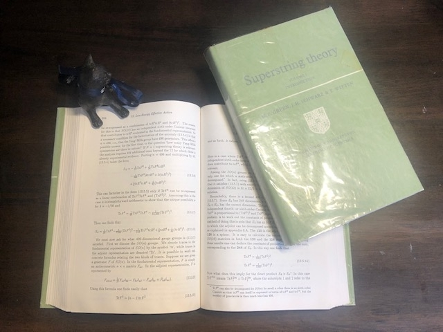
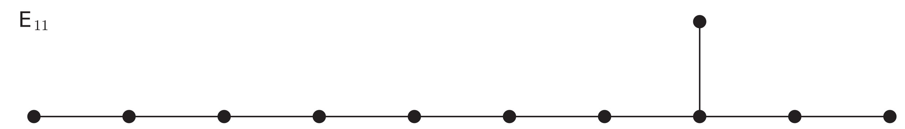
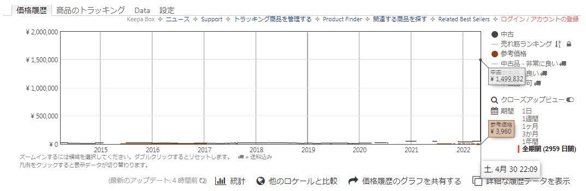
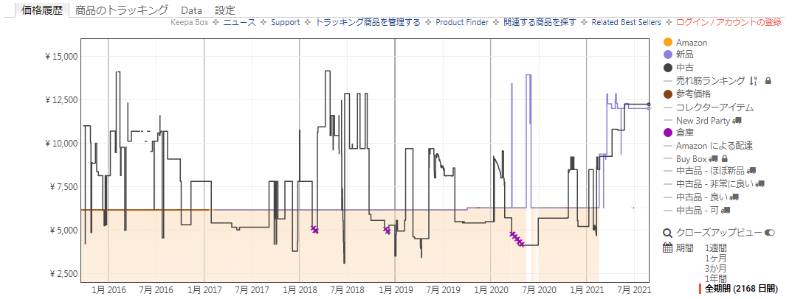

# 弦理論 - オススメの参考書 (定番・ミニマム・独習書・啓蒙書)

弦理論というと万物理論 (ToE: Theory of Everything) としてよく紹介されることが多い． Planck スケールの物理として盛んに議論されているが， 未だ我々の自然界を記述する理論かどうかの検証や接点は見い出せずにいる． かといってこの理論が出来損ないというわけでなく， 直ちに捨て去るには余りにも惜しい理論である．

また弦理論は ToE 候補としての側面もあって， GeV, TeV スケールの (beyond) 標準模型やその先にあると期待する大統一理論や， 超対称性そして超重力理論を知っていることが望ましく， 一方で一般相対性理論も下地として必要なところがある．

必然，弦理論まで登ろうとすると難しいのだが， 幸いにも教科書がかなりたくさんあって， ある程度のレベル (M2 くらい?) までは弦理論を理解することは難しくない．

そこで以下では弦理論の基礎的な段階を学べるいろいろな参考書を紹介したい． ほんと改めて見直すとたくさんあって，紹介しきれないのが正直なところである． 徐々に増やしていきたい．

なお弦理論自体の概論や魅力については杉本さんの[これ](http://www2.yukawa.kyoto-u.ac.jp/~shigeki.sugimoto/YITP50.pdf)を読むとよい． すべての物理学者たちに向けた Witten の[有り難い投稿](https://physicstoday.scitation.org/doi/10.1063/PT.3.2980)を読むのもよいだろう．

[embed]https://www.youtube.com/watch?v=5m4PgjlswfQ[/embed]

## 定番

現在，本稿の時点で 2021 年であり，D-brane 発見以降の成果をまとめたテキストの決定版が望まれている．しかし今ある分だけでも相当な量である．そこでひとまずはそれらの定番テキストを紹介したい．

### GSW

|  |  |
| --- | --- |

弦理論のテキストといえば本書をまず第一に挙げたい．

弦理論はかつて鳴かず飛ばずの理論だったが， Green と Schwarz は根気強く計算を続けて，超対称性の概念に至り， アノマリーフリーな超弦理論を構成してくれた．

重力だけではダメで，特定のゲージ群，それも巨大なゲージ群も同時に必要であることが， この議論でわかり，ToE としての立ち位置が確立していく契機になっている． この話は余りにも神々しくて，後世のテキストでも外せない話題の一つになっている．

本書の 13 章までで超弦理論の構成が完了して， この付近から最後の章まで Witten が主に書いたであろう幾何的な章が増えて， 超弦理論の有り余る可能性を如何にして， 低次のエネルギースケールに落としていこうかという議論が展開される． 余剰次元とは理論の破綻を意味するのではなく，これこそが正解だと言わんばかりに．

論文をまとめてテキストにする分野初期のテキストにありがちだが， 行間を埋めるのが非常に大変である． この手の話題は Landau のテキストがよく引き合いに出されるが可愛い方である．

#### 関連テキスト (中原，Nash)

第二巻の後半の幾何学的な議論は[中原の第二巻](https://amzn.to/3go6ua9)を読んでおくと， それなりに見通し立てて読めるようになるので，おそらく皆お世話になったのではないだろうか． 有り難いことに今日では[中原のテキスト](https://amzn.to/3j5s0Cc)は日本語に訳されており， 気軽に読めるようにもなっており可読者層が広くなっている．

|  |  |  |
| --- | --- | --- |

GSW は時空の超対称性を扱う GS 形式のテキストとして重宝された． 今では様々なテキストがあるので，この有り難みは薄れてはいるが， それでもご本人たちの議論は一読の価値はある． 何か捻りの効いた議論でもなく淡々とした議論で，D-brane との関連も勿論ないのだが， 附録は役に立つのかなと思う．

- [Superstring Theory: 25th Anniversary Edition (Cambridge Monographs on Mathematical Physics) Volume 1](https://amzn.to/3j4Zpg8)
- [Superstring Theory: 25th Anniversary Edition (Cambridge Monographs on Mathematical Physics) Volume 2](https://amzn.to/3gndyUi)
- [理論物理学のための幾何学とトポロジーI [原著第2版]](https://amzn.to/3sHAp1J)
- [理論物理学のための幾何学とトポロジーII [原著第2版]](https://amzn.to/3go6ua9)
- [Geometry, Topology and Physics, Second Edition (Graduate Student Series in Physics)](https://amzn.to/3j5s0Cc)

なお中原トポの原著は[第三版](https://amzn.to/3j6a9Ld)があるっぽく，topological quantum computing にも触れているそうだが，書影が初版 (1989) であり，謎である．未定稿なのかもしれない．

中原とは別に過去には Nash の翻訳本もかつては定番として読めたが残念ながら絶版である． 物理学のカリキュラムの構造も手伝ってか，幾何学系物理数学の書籍は消えやすい．早めの入手が重要だ．

|  |  |
| --- | --- |

- [物理学者のためのトポロジーと幾何学 (ADVANCED PHYSICS LIBRARY)](https://amzn.to/2VSPzoW)
- [Topology and Geometry for Physicists (Dover Books on Mathematics)](https://amzn.to/3CsxG00)

#### 関連テキスト (Polyakov)

GSW と同じくらい古いテキストとして，[Landau スクール](https://www.itp.ac.ru/en/)の Polyakov([[1]](https://en.wikipedia.org/wiki/Alexander_Markovich_Polyakov),[[2]](https://www.itp.ac.ru/en/persons/polyakov-aleksandr-markovich/)) による[テキスト](https://amzn.to/2Wma3Go)がある． [Polyakov 作用](https://en.wikipedia.org/wiki/Polyakov_action)でご存知のことと思うが，興味があれば読んでみるとよいだろう．

- [Gauge Fields and Strings (Contemporary Concepts in Physics)](https://amzn.to/2Wma3Go)

#### 関連テキスト (Peskin)

他に Peskin も [TASI レクチャー](https://en.wikipedia.org/wiki/Theoretical_Advanced_Study_Institute)として[テキスト](https://www.slac.stanford.edu/cgi-bin/getdoc/slac-pub-4251.pdf)を書いている．

- [Introduction to String and Superstring Theory II](https://www.slac.stanford.edu/cgi-bin/getdoc/slac-pub-4251.pdf)

### Kaku

|  |  |  |
| --- | --- | --- |

弦の場の理論 (SFT: String Field Theory) の創始者の一人である [Kaku](https://mkaku.org/) は弦理論のテキストを何冊か書いている．Kaku というと一般啓蒙書も数多く著しており，認知度も高いのではないだろうか． 彼の初期の啓蒙書は割と真面目(?)に書いているのだが，最近は自由奔放にエンタメよりのものを書いている感がある．その辺りで好き嫌いが分かれるところだろう． そんな最近の彼しか知らないと，彼が実は第一級の研究者であることを見逃してしまうだろう．

幸いにも彼の弦理論のテキストは専門家によって訳されており， 安心して身近に触れることができる．

[初版](https://amzn.to/3gqd93r)と[第二版](https://amzn.to/3D2ufy9)とで扱っている内容に差異があるので，できれば両方を揃えた方がいい． 差分は次のとおり．

- [初版](https://amzn.to/3gqd93r)は「幾何学的弦の場の理論」なる章と「Atiyah--Singerの指数定理の簡単な証明」なる節と，そして用語集があるが，M 理論の第四部がない(1989 年のためまだなかった)．
- [第二版](https://amzn.to/3D2ufy9)は先に挙げた章・節・用語集がないが，M 理論の第四部がある(時に 2000 年だった)．

削られた「幾何学的弦の場の理論」なる章は top-down で対称性から作用を書き下すことで，曖昧な直感にのみ支えられた古典論から登らずに構成を図る試みの章である．この試みでは弦の統一群 (USG: Unified String Group) なるものを定義して，これの表現を議論し既約分解を整理する．これによって Chern--Simons 作用が USG の変換に対して不変な作用として出てくる．天下りに Chern--Simons 作用という表面項がある，というような説明で済まされることも珍しくないが，その (一つの) 根拠のようなものを物理的な動機から議論している貴重な章である．

さてそういった話とは別に本書は全体として (個人的には) GSW や Polchinski を補うような印象を持つ一冊で，行間を埋める労力はかなり削減されている．数式やその物理的背景や戦略・意図も丁寧に書いてくれている．ディスカバリーチャンネルのようなエンタメにパラメータを振ると，この手の専門的な話をソフトに回避しようという本・解説が現在も跡を絶たないが，ちゃんとテキストを書くという仕事をしており，「締めるところは締めて，緩めるところは緩める」ことができている素晴らしい一冊である．

ただエンタメ方向の Kaku 氏の発言は年を追うごとに，深刻な誤解を招きかねないものが目立ちだしている傾向があると言わざるを得ない (と思います)．とりわけ，2023/5 時点の新著『[Quantum Supremacy: How the Quantum Computer Revolution Will Change Everything](https://amzn.to/43xxLNu)』については，科学的誠実さが失われているようにみえる (と思います)．実際，**the worst book about quantum computing** と評されるほど専門家からの厳しい[レビュー](https://scottaaronson.blog/?p=7321)がある．ただこれと同じ程度の本は何も Kaku に限らず，和書であったりビジネス向けの Web 記事でもあり，そういう意味では Kaku はメディアの人になってしまったのかもしれない．

[Book Review: “Quantum Supremacy” by Michio Kaku (tl;dr DO NOT BUY)](https://scottaaronson.blog/?p=7321)

ところで弦理論は初期の頃から日本人研究者も貢献している分野である． 故吉川圭二氏もその一人である． 彼は Kaku とともに光錐の弦の場の理論を構築した． そのようなこともあり，本書は弦の場の理論について書かれた貴重なテキストである． 吉川氏も弦の場の理論を解説した[小さい本](https://amzn.to/3B7IQGN)を書いている． もう絶版で入手が難しいが・・・．

以上に紹介した二冊の他にも，より高度な共形場理論の話題や様々な非摂動的定式化についてまとめた[テキスト](https://amzn.to/3ml9wiW)も Kaku は書いている．こちらは行間を埋めるのは苦労するだろう．弦理論はかなり巨大になってしまい，あれこれと語ろうとすると，どうしても記念碑的な式や主要な結果をまとめがちになる．一度やった後では「ああ，そうそう，そうだったね」な感想になるが，初見ではただキツイだけだろう．原論文に当たる必要がある．もしくは波長が合う指導教員か同僚とかに出会えたらサクサク進む．ま，何でもそういうものだろう．

- [超弦理論 (シュプリンガー現代物理学シリーズ)](https://amzn.to/3gqd93r)
- [超弦理論とM理論](https://amzn.to/3D2ufy9)
- [Strings, Conformal Fields, and M-Theory (Graduate Texts in Contemporary Physics)](https://amzn.to/3ml9wiW)
- [弦の量子論―超弦理論への道](https://amzn.to/3B7IQGN)

### Polchinski

|  |  |  |  |
| --- | --- | --- | --- |

(原著の) 書影が無茶苦茶カッコいい本．

弦理論というとまずはボゾン弦の古典論から初めて，これを量子化して，振幅計算して， などと弦を主体にあれやこれやと見ていくのだが， 点粒子と違って大きさ方向の境界条件を気にする必要がある．

ポアンカレ対称性に矛盾しないように考えると， 自由端境界であるノイマン境界条件を選択することになる．

一方で固定端境界であるディリクレ境界条件を捨てるのだが， 実はよくよく調べると弦がくっついている境界領域も物理的なオブジェクトとして意味があり， D-brane とよぶようになる．

これで D-brane は勿論のこと開弦 (open string) をもっと一般的に扱えるようになる． それだけでなくより一般的な T-duality や D-brane の様々なダイナミクスなど， 弦理論が弦だけでないということがわかるようになった．

まぁこれは弦理論の歴史の中で Revolution であり， Polchinski はその中心人物の一人だった． そんな彼が書いたテキストが本書であり，当時は閉塞感をぶち破るように， こぞって新しい息吹を感じるように本書を手にとった．

第一巻はボゾン弦と D-brane を扱い多重ループの振幅計算 (の概要) まで行って， SFT のさわりを紹介する． 後半になるほど行間を埋めるための計算量が跳ね上がっていくので， 原論文にあたることが多くなるだろう． ただ概要が書いてあるだけというのもあり，読んでわかるようになると成長を感じるところである．

第二巻は標準的な五種の超弦を扱い，アノマリーの奇跡を見る． ゲージ対称性を手で課すことなく，表れ出るのは興奮するところである． そして超弦について D-brane のダイナミクスを扱い， M 理論やブラックホールの量子力学への応用・四次元物理の構成・各種の双対性などを扱う． 第一巻と違って第二巻は論文の種になるような話が当時は多かったが， 現在は一つ一つが分野として成熟しているところがある．

「内部対称性」「内部空間」としていた取ってつけたようなモノが，超弦理論を考えると必然，D-brane が存在することになり，それら D-brane 上にはゲージ理論が実現し，そして D-brane が一度動けば弦の張力が増すというような幾何学的で力学的な渾然一体としたオブジェクトの動きの一側面が Higgs 機構というような，これまでともするとツギハギに見えた場の量子論の概念たちが次々に統合されていく．もしこれらが都合の良い解釈や数学的虚構であったならば，あまりにできすぎた理論に見えてならない．世界が在ることの断片でも捉えているのではないかと興奮してくる．

- [String Theory, Vol. 1 (Cambridge Monographs on Mathematical Physics)](https://amzn.to/2W8He0G)
- [String Theory: Volume 2, Superstring Theory and Beyond (English Edition)](https://amzn.to/3kb1irb)
- [arXiv:0812.4408v1: A solution manual for Polchinski's "String Theory"](https://arxiv.org/abs/0812.4408v1)

Polchinski は伊藤(克)さんら東工大グループによる翻訳本が出ている． 原著よりも安く買えて日本語で読める，そんな利点があったのだが，ほぼ絶版になっている． シュプリンガー・ジャパンが撤退することで，「あ～短命だったなぁ」とか思っていたが，丸善出版が引き継がれると聞いて，「スゲ～，これで安泰だ」とか思っていたが，そんなわけなかった．Polchinski ですら生き残るのは厳しい．昨今，ネットでタダで良質な文献を得たり，ともすると惜しげもなくタダで専門知識を教えることもあるが，それ故に経済的な存在価値が物凄く低い．この辺り見直すべき時期に来ているんじゃないかなとか，個人の感想としてはよく考えることがある．はは，考えすぎかな．

- [ストリング理論 第1巻 (World Physics Selection)](https://amzn.to/2XWptlI)
- [ストリング理論 第2巻 (World Physics Selection)](https://amzn.to/38aUnIO)

### BBS

いつもあまり多くを語らない同僚から「表紙，カッコよくね？」と同意を求められた一冊． 確かにカッコいい(自分は Polchinski の方が好きだけど)．あと，この本は重い．

Polchinski や GSW などと比較すると， 牙が抜けたかのように，かなり難易度が低く抑えられている． 演習問題の多くが恐ろしく簡単で，参考にならないほどである．

まだ弦理論て何だろうとか，ちょっとかじってみたいとか， そういう段階でみんなで 8 章までわちゃわちゃゼミするにはうってつけかもしれない． 9 章以降は弦理論に志向がある人々でやるというのもいいだろう． 特に Becker 姉妹が研究対象としていた flux compactification の分野の教科書は本書が初めてではないだろうか．

全く本質的な話ではないが，多様体でレンズ空間の例を知った時に「へぇ，レンズ空間ていうんだ．ふ～ん．」くらいの感想だったが，それが $S^3$ に H-flux を入れて T-dual をとると「お前，ここで待っとたんや・・」とか変な感情が込み上げてきたものだった．

- [String Theory and M-Theory: A Modern Introduction](https://amzn.to/3B669Rj)

## ミニマム

弦理論をよりコンパクトに学びたい場合に有用な書籍を紹介したい．

### Lüst & Theisen

弦理論のミニマムとして本書は価値が高い．(高かった？流石に古いかもしれない) 現在の弦理論は大変巨大になっており，最新の研究に手を付けるために， 一々，全部をやっている時間がないかもしれない． 場の量子論と標準模型に時間を費やすだけでも，相当な時間を食うはずである． かといって適当に済ますこともあまり望ましいものでなく， ミニマムというものが必要になるものだ．

本書は弦理論が ToE としての可能性を持っていることについて， その主題を述べるための必要な構成をなるべく少なく駆け抜けて述べてくれる． D-brane 以前の弦理論を労力少なく学ぶ上では重宝するはずである．

- [Lectures on String Theory (Lecture Notes in Physics (346))](https://amzn.to/3D9tt27)

### Johnson

D-brane に関するミニマムのような一冊．

個人的には ALE 空間の模型を考える際によく読み返した記憶がかすかに残っている． せっかくなので[これ](https://amzn.to/3B3nOcf)も読んで計算が楽しかった思い出がある． 結局，その方面での検討は失敗であったが，D-brane にはどういう側面があるのかより理解を深められたことは収穫だった．

Johnson は様々な D-brane の基本的なセットアップ例が載っているので，そういう意味では役に立ったかなと思う．具体的な動機が多くなってくる頃には，何かを計算するための基本的な雛形として，何があるだろうかと見返すのに役に立つかもしれない．それならわざわざ買わずに[下書き](https://arxiv.org/abs/hep-th/0007170)で十分かもしれないが．．

あと，charge の分類の関連で (位相的) K 理論の話が一瞬出てくるが，ちょっと何言っているのかわからないだろう．急に数学の道具を使う場合はもうちょっと配慮した書き方が望ましいのではと思う例である． そんなところで悩まず[これ](http://www2.yukawa.kyoto-u.ac.jp/~shigeki.sugimoto/K-theory.pdf)を読めばよい．

- [D-Branes (Cambridge Monographs on Mathematical Physics)](https://amzn.to/3glWmOQ)
- [D-Brane Primer](https://arxiv.org/abs/hep-th/0007170)
- [正20面体と5次方程式 改訂新版 (シュプリンガー数学クラシックス)](https://amzn.to/3B3nOcf)
- [D-brane と K 理論（入門）](http://www2.yukawa.kyoto-u.ac.jp/~shigeki.sugimoto/K-theory.pdf)

### 太田

扱っているトピックは M 理論の理解を目的としていて，絞った内容になっているが，その分，かなり計算を詳しく書いていてくれる．四章と五章は必見であろう．文献案内も親切で日本人的な優しさを感じる．

残念ながら Amazon の相場は不安定で高騰してしまっている． 必要な方は[出版社](https://www.maruzen-publishing.co.jp/item/?book_no=294150)に問い合わせるのがいいだろう．

また著者はもう阪大・近大ともに退官されており，おそらく日本にはおらず，サポートページも[本人のページ](http://www.eonet.ne.jp/~ohtany/publications.html)に行く必要がある．

- [超弦理論・ブレイン・M理論 (現代理論物理学シリーズ 1)](https://amzn.to/3DvGymH)

### Szabo

D-brane の発見にまつわる話を最短で理解することを意図したような一冊． もし講義をするなら手軽なサイズに収まっており，可能と思われるような感じがする章構成・分量である． お値段にしてはちょっと物足りないなぁというのが正直なところなので，[arXiv](https://arxiv.org/abs/hep-th/0207142v1) ので様子見をされてもいいだろう．

- [An Introduction to String Theory and D-brane Dynamics: With Problems and Solutions (2nd Edition)](https://amzn.to/2WfHY3D)
- [arXiv:hep-th/0207142v1: BUSSTEPP Lectures on String Theory](https://arxiv.org/abs/hep-th/0207142v1)

これも [3rd Edition](https://amzn.to/2Wo1IC1) が存在するらしいが不明である． 版元の[情報](https://www.worldscientific.com/worldscibooks/10.1142/q0006)はあるので近い内に発売されることだろう．

## 独習用

弦理論の分野は広さ・深さともに巨大なため，普通は専門家と一緒に学ぶ必要があるが，そうできない場合には教育的配慮のある優れた独習用のテキストが必要であろう．以下はその例である．

### Zwiebach

|  |  |  |
| --- | --- | --- |

[Zwiebach](https://physics.mit.edu/faculty/barton-zwiebach/) が MIT で弦理論を学びたいと思っている学部生のために教えた[一年間のコース](https://ocw.mit.edu/courses/physics/8-251-string-theory-for-undergraduates-spring-2007/index.htm)から生まれたテキスト．

> Professor Zwiebach designed and taught a new course in the MIT undergraduate curriculum: String Theory for Undergraduates [8.251], first offered in the 2002 Spring term. This course gives a serious introduction to string theory, geared at the level of juniors and seniors. Based on the lectures from this course, Zwiebach wrote an undergraduate textbook, A First Course in String Theory, published by Cambridge University Press.

かなり噛み砕いて書かれており，これで弦理論ができると錯覚してしまうほどである． つまり良書であることは間違いないが，このレベルの親切さを弦理論に期待すると死ぬ． そんな本である．

どこからでも読むことができるような雰囲気があり， それだけ前提知識を必要とせずに注意深く作られている． GSW や Polchinski を読むために，必要な基礎的な計算をやってくれるので， 事前に読んでおけば，大変役に立つことだろう． ただ Lüst らの本と違って，少々大部になっているため， すべて読み通すのは大変かもしれない． しかし AdS/CFT 対応の話題まで触れられており，より現代に近い導入書になっている．

- [A First Course in String Theory (English Edition)](https://amzn.to/3moiige)

本書は翻訳本もでている．訳者は様々な専門書を訳されている樺沢宇紀氏で[ココ](https://adx50150.wixsite.com/kabasawa-yakusho)にその一覧がある． ザッとネットの海を調べた限りでは，彼の翻訳スタイルは好き嫌いが分かれるようである． 私個人としては用語を日本語の意味に寄せるような努力が伺えて好印象なのだが，まぁ日本語ユーザなのだから好き好きであろう．

この日本語への置き換えというのは最近はあまり心を砕くことがなくなってきたように思う． 特に研究者はその傾向が強いように思う． 例えば conformal を「共形」と書いたり喋っていたら，「はぁ，コンフォーマルだよ，そこは」みたいな空気を会話や書籍の中でかつて感じたことがないわけではない．しかし，なんかこう，和製英語っぽい地雷を知らずに踏んでいるような，そんな怖さがある．一方で学術的に暗にコンセンサス (早速使っちゃった・・) の取れていない訳語を連発するのは危険な行為である．下手に訳すと「あ～何も知らないのか？」みたいな風になりかねない．なのでコンフォーマルとか，カタカナ表記しておくのが無難だ．

一応中身を見て初版を買った身だが，本書を見ていて「フォルミオン」という訳語があって，「ムムムッ，だ，大丈夫かこの本は？？？」と率直に思った．でもこれは決して浅い人がやったようには見えなかった．寧ろよく心を砕いているように思えてならなかった． 実際，のちに知ることになったが訳者が[ココ](https://adx50150.wixsite.com/kabasawa-yakusho/14)でも述べているように，これは痛恨のミス．血の気が引く思いだったろうと私は勝手に想像し思う．日常生活を行う中で，Zwiebach を全部訳すというのは至難の業であり，相当なプレッシャーもあったように思う．それを (おそらく) 一人でやってのけたのだ．これは大変だったと思う．ほんとに．

- [初級講座弦理論 基礎編](https://amzn.to/38chWkv)
- [初級講座弦理論 発展編](https://amzn.to/3jfnu3T)

ところで訳本を吟味するようになったのは大学生協で[とある本](https://amzn.to/38bjLhN)を見たときからだった．もう忘れた人もいるかも知れないが，『[アインシュタイン その生涯と宇宙](https://amzn.to/38bjLhN)』という本を書店で立ち読みしたときは衝撃を受けたものだった．「はぁ～～，ついにこのレベルの時代が来たのか」と．なお，事の詳細は[ココ](https://gigazine.net/news/20110730_randomhouse/)から読める．生協では誤訳版はレアだから買うべき，みたいなポップがあって笑ったものだった．

### Blumenhagen

|  |  |
| --- | --- |

GSW, Kaku, Polchinski, BBS という定番は最初の一冊としてまず間違いないが， 計算をサボらずに仔細に追っていくとゴマカシがわかってくる． このゴマカシを徹底的に排除したのが[本書](https://amzn.to/2W8HCwa)である．

著者である [Blumenhagen](https://wwwth.mpp.mpg.de/members/blumenha/) は様々な四次元物理の模型を探求しており，それが故に具体的な計算を数多く，それこそ大量にこなしている．とてもじゃないが，これまで挙げてきたテキストでそんなことはやっていられないので，どうしても非常に細かいことについては計算を端折る解説が避けられず，「ん？」と思うところが出てきてしまう．本書はそういったところを拭い去るようなところに特色があり，ダントツで大変オススメしたい一冊である．

本書でも言及しているが CFT を特に切り出した[一冊](https://amzn.to/3D8Z0Bm)も書いている． しばしば D-brane の発見がある日突然に発見できたような物語があるが，数学的な側面ではいろいろと下地が揃っていたという背景も本書を読んでいると気付くことになる．物理学のテキストを読んでいて，論理の飛躍のようなある種のギャップを感じたら，それは定義が欠けていることが多い気がする(個人の感想)．「それは数学者の仕事でしょ」と開き直ることもできるが，単に定義に該当する物理的な受け止め方が構築できていない，ということの証かもしれない．ちょっと抽象的な話になってしまったが，D-brane もそんなようなところがある．考えすぎかな・・？いや，その，なんかゴメンナサイ．

あとは，Mathematica をお持ちであれば，[cohomCalg](https://github.com/BenjaminJurke/cohomCalg/releases) を使って Landscape (の一部) を気の済むまで探索してみるのもいいかもしれない．

- [Basic Concepts of String Theory (Theoretical and Mathematical Physics)](https://amzn.to/2W8HCwa)
- [Introduction to Conformal Field Theory: With Applications to String Theory (Lecture Notes in Physics, 779)](https://amzn.to/3D8Z0Bm)
- [Heterotic Target Space Dualities with cohomCalg: An analysis using line bundle cohomology and cohomCalg++ Koszul](https://amzn.to/3j77mBI)
- [arXiv:1010.3717 Cohomology of Line Bundles: Applications](https://arxiv.org/abs/1010.3717v1)
- [arXiv:hep-th/9701162: Vector Bundles And F Theory](https://arxiv.org/abs/hep-th/9701162)

### Kiritsis

Princeton の Nutshell シリーズは有名かもしれない． 本書は Blumenhagen と同様に計算の細かいところをフォローしてくれているという特徴がある． AdS/CFT 対応を Bulk/Boundary 対応とより正確な言い回しで章タイトルにしていることも好感が持てる． (AdS/CFT 対応って何だろという方は今村さんの[コレ](http://www.genshikaku.jp/backnumber/52sp1PDF/imamura.pdf)をオススメする)

この他，附録が充実していて，初学者でもとっかかりを掴めるのも良い特徴の一つである． 仮にわからなくとも，(自分の理解度合に応じて) どこから調べていけば良いかかなりのヒントになる． 原論文に当たりまくるよりも効率的ではある．何かしらの研究機関に属していない状況で独学するなら余計に大変である．まぁあくまでも趣味の延長になってしまうかもしれないが，弦理論はとても面白いのでそれでもいいんじゃないかなとか軽く考えている．他意はない．

- [String Theory in a Nutshell: Second Edition (English Edition)](https://amzn.to/3sDPEbS)
- [AdS/CFT 基本的な考え方とその応用](http://www.genshikaku.jp/backnumber/52sp1PDF/imamura.pdf)

### Introduction to Strings and Branes

本書は標準的なテキストでは紹介が漏れる基礎的な事項や話題について， 触れているところにまず特徴がある． 例えば最初の章の定番の点粒子の解説で Penrose のツイスターによるアプローチも述べている．

また後発のテキストの強みとして，(notation 含めて) よく整った議論をしている． 個人的な印象だが BBS よりもかなり丁寧に式を追っている． (BRST やゴースト非存在定理をサボらずに解説を試みているのは好印象である)

任意次元の Clifford 代数 (Dirac 代数) の表現論も詳細に述べており， これは助かる方は多いのではないだろうか． 和書では[太田さん](https://amzn.to/3DvGymH)のか[コレ](https://amzn.to/2Wut4qV)か久後さんの[資料](http://www2.yukawa.kyoto-u.ac.jp/~taichiro.kugo/mytxt/gamma.pdf)に頼るしかないかもしれない． 今は違うかもしれない．

CFT についても深堀りすると，弦理論の話からだんだん離れてしまいがちだが，弦理論という物理について本書は重要で必要な点を重点的に解説してくれている．

弦理論をやっているとどこか([例えばココ](https://en.wikipedia.org/wiki/M-theory))で必ず [SUGRA](https://en.wikipedia.org/wiki/Supergravity) について計算を追う時が来るが，これもまた本書では弦理論に必要な部分について丁寧に扱っており，すごい．てかこの 13 章が分厚い．M 理論や F 理論は勿論だが，その上の $14$ 次元上の G 理論を扱う時に苦労は報われることだろう．

本書の特徴は入念にボトムアップで上の階層に上がっていくスタイルになっていて，D-brane の導入が SUGRA を扱う 13 章の次の 14 章からになっている．ここまで登るのは結構キツイぞ．と思う．行間を埋める方がもっとキツイので，如何にこのようなテキストが有り難いかよくわかるものである．

弦理論で扱う Lie 代数は重心の状態に加えて振動モードの無限個の状態に応じて，無限次元であり，Kac--Moody 代数なるものが中心的な役割を演じるが，本書では更に Lorentzian なクラスも扱っている．これによって例外群 $E_8$ は $E_{11}$ まで拡大される．

この議論は更に一般化されて $E_n$ 系列が得られる． この辺りは多分に著者の研究対象が色濃く出ている面であり， E-theory なるものとして 17 章で語られるのだが，それが本書で最大ページ数を占め， 人生というか執念を感じてしまう一冊である． ここまでくると本書のカバーデザインも著者のこだわりを強く感じる．

とまぁ，いちいち言い出すとキリがないが，定番とされたテキストや論文の行間を埋めるために行ってきた数々の計算が述べられており，本書を手にしっかりめのゼミをしたい場合には有用なテキストと思う．オススメだ．

- [Introduction to Strings and Branes](https://amzn.to/3Dt1c6V)
- [超重力理論入門](https://amzn.to/2Wut4qV)
- [arXiv:hep-th/9411188v1: E_{10} for beginners](https://arxiv.org/abs/hep-th/9411188v1)
- [arXiv:hep-th/0104081v2: E_11 and M Theory](https://arxiv.org/abs/hep-th/0104081v2)
- [arXiv:1610.09277: The birth of the universe in a new G-Theory approach](https://arxiv.org/abs/1610.09277)

### String Theory and Particle Physics: An Introduction to String Phenomenology

弦理論が扱うエネルギーレベルは宇宙開闢以前までスケールする． 上へ上へ，と向かうと数学的構造は驚きに満ちまた巨大になっていって， その数理構造自体を研究対象としてどのような可能性があるかとか， そういう議論をすることが興味深い話で楽しくもある．

さてそうはいったものの，標準模型 (SM) まで接続しようと下に行こうとすると， 道がたくさんあり，一つの道を特定することが困難になっている．

SM の自然な延長として (様々な) 大統一理論 (GUT) があり，SM では説明がつかない，もしくは宇宙論的に説明をつけたい事柄を GUT の段階でいろいろと説明することができる．それ故に GUT はおそらくかなり正解に近いし，reality を感じれる．というわけで GUT に接続するシナリオはしばしば検討される．これはそれだけ弦理論には巨大な対称性を自らが有していることの表れでもある．

単に内部空間といってあれこれ抽象的に手で課すことなく，制限された形，それも物理的なオブジェクトの配位とに応じて具象的に弦理論では言明する余地がある．

その方法は余剰次元の形状であったり，brane 上の捕捉であったり，関連してバルクを捻じ曲げたりと，いろいろな可能性がある．本書は，これらを如何にして準備すれば，下位のエネルギースケールの理論に接続できるかを検討するための入門的なテキストである．

弦理論と一口に言っても，それはもうやることがたくさんあるので，層の厚さが重要なことが理解されよう．なかなかに理解されぬことであるが．．．

- [String Theory and Particle Physics: An Introduction to String Phenomenology](https://amzn.to/2Y0VyIW)
- [Quarks and Leptons From Orbifolded Superstring (Lecture Notes in Physics)](https://amzn.to/2Y1gvn4)

### String Theory Wiki

弦理論のテキストはたくさんあるのだが，それ以上にネット上で手に入れられる文献も相当数ある． これをまとめているのが[ココ](https://stringwiki.org/wiki/String_Theory_Wiki)である． とりあえず分野を探っていくにはとても実用的な wiki になっている． 独学では何が良い文献なのか不明なことも多いと思われるので強くオススメしたい．

- [String Theory Wiki](https://stringwiki.org/wiki/String_Theory_Wiki)

## CFT

弦理論の数学的な下地として大きなウェイトを占めているのが CFT である． そのオススメのテキストを以下に紹介する．

### The Big Yellow Book / The CFT Book

弦の軌跡は世界面と呼ばれ，その上には二次元の場の理論として，共形場理論が成り立つことになる．これが物凄く豊富な内容を含んでおり，そしてガリガリ計算できる面白さがある． 本書の分厚さは丁寧さの表れであり，CFT にハマったら必携の書である． 買って損はない．と言い切れる一冊である．

ただ一方で，それ故に本書は個人用でありゼミのテキストには余り向かないだろう． ゼミテキスト用としては定番のこの[講義録](https://arxiv.org/abs/hep-th/9108028)が挙げられる．

- [Conformal Field Theory (Graduate Texts in Contemporary Physics)](https://amzn.to/2XLNWKp)
- [arXiv:hep-th/9108028: Applied Conformal Field Theory](https://arxiv.org/abs/hep-th/9108028)

### 山田：共形場理論入門 (数理物理シリーズ)

山田さんが書かれた一冊．とてもわかりやすい． CFT への難易度を一気に落としてくれる．

もし Polchinski の二章の CFT があなたにとって初めての CFT の場合はおそらくわからないだろう． 導入として説明しているつもりだと思うが，かなり密度の濃い記述で，時に怪しい議論もあって，ここで時間を食うのは得策ではない．doubling trick とか後で使うものもあるが，このような細かいところよりも Virasoro 代数やカレント代数を formal に理解しておいた方が個人的にはいいんじゃないかなとか思うところ．まぁ人それぞれです．

本書を一冊やっておけば，Polchinski の第二巻の advanced な CFT の話しもあまり臆せずに読めるようになるのではないかと思う．また同時に摂動論的な計算の多くを理解できるようになるので，弦理論の理解も早くなるだろう．

余談だがこの数理物理シリーズ，良書ばかり． 全巻買っておけばよかったが，時既に遅し．

特に本書は 2022 年 4 月 30 日に約 150 万円まで高騰してしまった．

- [山田：共形場理論入門 (数理物理シリーズ)](https://amzn.to/3msycpM)

### 江口，菅原：共形場理論

共形場理論の和書は比較的早くに絶版になりやすく，早めに入手する必要がある． 本書もそういう一冊．息の長い定番になってくれるかなと期待したのも束の間，おそらく発売から４年半～５年で絶版になったっぽい．保ったほうだろう． 以下は keepa による Amazon の価格推移．中古価格の推移がえげつない． ほんと，専門書を買うのは大変だ．

- [江口，菅原：共形場理論](https://amzn.to/3gtJOVW)

## 啓蒙書

### 弦理論 (MaRu‐WaKaRiサイエンティフィックシリーズ) | String Theory Demystified

|  |  |
| --- | --- |

最初，書店で見かけた時にまた新しい弦理論の本が出たのかなぁと思い，中身を見ると「ナニコレ」という衝撃を受けたが，どこかで見た記憶があり，[Demystified](https://amzn.to/3DdrNVo) を MaRu‐WaKaRi と訳した一連の翻訳本と気付いた． 日本語版は装丁が原著と比べて落ち着いているので，ギャップを感じざるを得なかった．ぜひ，書影からそのギャップを感じて欲しい．

演習問題には知識を問うものもあり，そこからもわかるようにこれは啓蒙書の域を出ないが， それでも計算が簡単なところを抜き出していて，弦理論を「さわれる」という点では存在価値のある一冊である．

- [弦理論 (MaRu‐WaKaRiサイエンティフィックシリーズ)](https://amzn.to/2Wo99d1)
- [String Theory Demystified](https://amzn.to/3DdrNVo)

### 岩波講座 物理の世界 素粒子と時空〈5〉素粒子の超弦理論

|  |  |
| --- | --- |

江口さんが ALE 空間について，そして今村さんがゲージ/重力対応について書いている点， これらが本書の特徴なのだが，「岩波講座　物理の世界（全85冊）」というシリーズの一冊としては， 突出して難易度の高い一冊に仕上がっている．

お！噛み砕いて書いてあるんかな？？

とか期待してページを開くと，「編集は仕事したのか？」と疑いたくなるほどの投げっぷり． 中身自体は至って真面目に書いていて，読んでいると初学者への配慮は感じられるのですが， もちょっと歩み寄ってもええんちゃう．と思う本． この業界の初学者とは何かを知るには良いだろう．

- [岩波講座 物理の世界 素粒子と時空〈5〉素粒子の超弦理論](https://amzn.to/3D7gJt2)
- [岩波講座 物理の世界　素粒子と時空 5　素粒子の超弦理論 (岩波オンデマンドブックス)](https://amzn.to/3B4m2Yb)

### 竹内薫

|  |  |  |
| --- | --- | --- |

サイエンスライターである竹内薫による弦理論の一連の解説本．

ところで私は以前に「ひも理論」は西で「弦理論」は東だ，という言説を聞いたことがあるが，真実は定かではない．少なくとも一般受けするのは柔らかい「ひも理論」の方であろう．それが理由かはわからないが，一連の著作物もそのように一貫している．

どの著作物も理論の美味しいところをピックアップしつつ，その周辺のこれまた美味しそうなところを紹介するというような調子で，終始楽しそうな雰囲気で書いてくれている．ちょっと違った角度でみた話もあったりして，かじった方でも飽きさせない工夫がなされている．

ざっくり数式の意味や慣れない物理の話を知るには重宝することだろう．

こういう本もしくは著者は珍しい．いくらでももっとフワッと書けるのだが，あまりにフワッとしすぎた本も世の中にはたくさんある．そして専門の話ほどそうなりやすい．しかし著者は科学者の歴史的な経緯・業績も尊重しつつ，何とかして誤魔化さずに意図を説明しようとしている印象を受ける．有り難いことだ．

- [ゼロから学ぶ超ひも理論](https://amzn.to/3ytYY3A)
- [超ひも理論とはなにか : 究極の理論が描く物質・重力・宇宙 (ブルーバックス)](https://amzn.to/2WHuVbE)
- [次元の秘密―自然単位系からDブレーンまで](https://amzn.to/3mPd1yq)

### マンガ超ひも理論 我々は4次元の膜に住んでいる (講談社SOPHIA BOOKS)

割と「ちゃんと」ぶっ飛んでいる本だと思う． そういう意味でも実態に近く，ソフトな読者に寄せていない点で， マンガとしてはかなり評価したい．

> なんと、「キミがヒモからできている」「宇宙もヒモからできている」！！！最新・究極の物理学「超ひも理論」がマンガで簡単にわかる。この1冊でアインシュタインを超え、ノーベル賞に一歩近づける！！

この煽り．素晴らしいじゃないか．ヒモダ様ｗ 弦理論のマンガ本は数あれど，この一冊だけは未だに異彩を放っている．

- [マンガ超ひも理論 我々は4次元の膜に住んでいる (講談社SOPHIA BOOKS)](https://amzn.to/3D5KSc8)

* * *

最後に宣伝で恐縮でありますが， Math Relish 物販部もご利用いただけたらと思います．

[Math Relish 物販部](https://mathrelish.booth.pm/)
